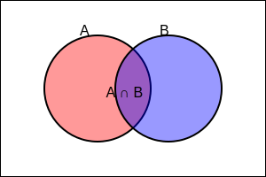
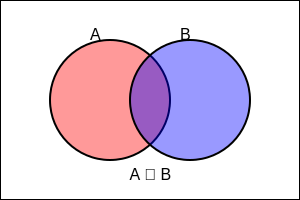
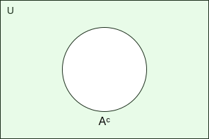

# Dalla Logica alla Rappresentazione Grafica: Insiemi e Linguistica

## Introduzione

Nella logica proposizionale abbiamo studiato operatori come:

* **AND**
* **OR**
* **NOT**

Abbiamo visto come funzionano attraverso le **tavole della verità**.

Ora facciamo un passo avanti su due fronti paralleli:

1. Le operazioni logiche possono essere **rappresentate graficamente** utilizzando gli insiemi.
2. Le stesse strutture logiche compaiono nel **linguaggio naturale**, attraverso relazioni semantiche tra le parole.

Questo passaggio ci permette di **vedere la logica**, non solo calcolarla — e di riconoscerla anche nel modo in cui organizziamo il significato delle parole.

---

## 1. Dalla Proposizione all'Insieme

Una proposizione logica può essere interpretata come un insieme.

### Esempio

Consideriamo l'universo U = insieme di tutti gli studenti di una classe.

Definiamo:

* A = studenti che praticano sport
* B = studenti che suonano uno strumento musicale

Qui A e B non sono più frasi, ma **insiemi di elementi**.

> [!NOTE]
> Il passaggio dalla **proposizione** all'**insieme** è il primo ponte tra logica formale e matematica discreta. Ogni predicato logico definisce un sottoinsieme dell'universo.

---

## 2. Corrispondenza tra Logica e Insiemi

Le operazioni logiche hanno un equivalente negli insiemi.

| Logica  | Insiemi | Significato                       |
| ------- | ------- | --------------------------------- |
| A AND B | A ∩ B   | Elementi che stanno in entrambi   |
| A OR B  | A ∪ B   | Elementi che stanno in almeno uno |
| NOT A   | Aᶜ      | Elementi che non stanno in A      |

---

### 2.1 AND → Intersezione (∩)

**Logica:**
A AND B è vera solo se entrambe sono vere.

**Insiemi:**
A ∩ B contiene gli elementi comuni.

#### Metafora

Immaginiamo due cerchi che si sovrappongono.

La parte centrale è come una zona condivisa:
chi sta lì appartiene sia ad A sia a B.

Esempio:
Studenti che praticano sport **e** suonano uno strumento.



---

### 2.2 OR → Unione (∪)

**Logica:**
A OR B è vera se almeno una è vera.

**Insiemi:**
A ∪ B contiene tutti gli elementi di A e di B.

#### Metafora

Se A è un cerchio rosso e B è un cerchio blu,
l'unione è tutta l'area coperta dai due cerchi.

Non importa se un elemento sta in uno solo o in entrambi:
fa comunque parte dell'unione.



---

### 2.3 NOT → Complementare

**Logica:**
NOT A è vera quando A è falsa.

**Insiemi:**
Il complemento di A è l'insieme di tutti gli elementi dell'universo che non appartengono ad A.

Notazioni equivalenti per indicare il complemento di A:

- Aᶜ
- Ā
- U − A
- C(A) (meno usata, ma possibile)

Formalmente:

```
Aᶜ = { x ∈ U | x ∉ A }
```

Significa: l'insieme di tutti gli elementi x appartenenti all'universo U che non appartengono ad A.

#### Metafora

Se l'universo è l'intera classe,
e A è l'insieme degli studenti che praticano sport,

il complemento di A (Aᶜ, Ā, U − A) è l'insieme degli studenti che **non** praticano sport.



---

## 3. I Diagrammi di Venn

Per rappresentare graficamente gli insiemi si usano i **diagrammi di Venn**.

Sono rappresentazioni in cui:

* L'insieme universo è un rettangolo.
* Gli insiemi sono cerchi all'interno del rettangolo.
* Le sovrapposizioni mostrano le intersezioni.

### 3.1 Due insiemi

Con due insiemi possiamo rappresentare:

* A
* B
* A ∩ B
* A ∪ B
* Aᶜ
* Bᶜ

La zona centrale dei due cerchi rappresenta l'intersezione.


### 3.2 Tre insiemi

Con tre insiemi il diagramma diventa più complesso:

* Ogni coppia ha una zona comune.
* Esiste una zona centrale comune a tutti e tre.

Questa rappresentazione è utile per visualizzare espressioni logiche come:

`(A AND B) OR C`



---

## 4. Il Rapporto di Inclusione (Sottoinsieme)

Finora abbiamo visto insiemi che si intersecano parzialmente. Esiste però una relazione ancora più forte: l'**inclusione**.

> [!IMPORTANT]
> **A ⊆ B** (si legge "A è sottoinsieme di B" o "A è incluso in B") significa che **ogni elemento di A è anche un elemento di B**.
>
> In logica: se un elemento appartiene ad A, allora appartiene certamente anche a B.

### Definizione formale

```
A ⊆ B  ⟺  ∀x, x ∈ A → x ∈ B
```

### Tipi di inclusione

| Simbolo | Significato            | Esempio                    |
| ------- | ---------------------- | -------------------------- |
| A ⊆ B   | Sottoinsieme (o uguale) | {1,2} ⊆ {1,2,3}           |
| A ⊂ B   | Sottoinsieme proprio   | {1,2} ⊂ {1,2,3} (A ≠ B)  |
| A = B   | Uguaglianza            | A ⊆ B e B ⊆ A             |

### Esempio

Sia:

```
U = tutti gli animali
A = gatti
B = felini
C = mammiferi
```

Allora:

```
A ⊂ B ⊂ C
```

I gatti sono un sottoinsieme dei felini, che sono un sottoinsieme dei mammiferi.

Nel diagramma di Venn, il cerchio di A sta **completamente dentro** il cerchio di B, che sta completamente dentro C.

> [!TIP]
> Il rapporto di inclusione tra insiemi corrisponde alla relazione logica di **implicazione**: A ⊆ B equivale a dire "se x è in A, allora x è in B", ovvero A → B.

---

## 5. Esempio Completo (Logica + Insiemi)

Sia:

```
U = {1, 2, 3, 4, 5, 6}
A = {1, 2, 3}
B = {3, 4, 5}
```

Allora:

* A ∩ B = {3}
* A ∪ B = {1, 2, 3, 4, 5}
* Aᶜ = {4, 5, 6}

Nel diagramma di Venn:

* Il numero 3 sta nella zona centrale.
* Il numero 6 sta fuori da entrambi i cerchi.


---

## 6. La Linguistica Entra in Scena

> [!NOTE]
> Le stesse strutture che abbiamo usato per descrivere insiemi e logica si ritrovano nel **lessico** delle lingue naturali. La semantica lessicale studia le relazioni di significato tra le parole, e molte di queste relazioni hanno una **struttura insiemistica**.

---

### 6.1 Antonimia → Complementare / NOT

L'**antonimo** di una parola è la parola di significato opposto.

| Parola  | Antonimo  |
| ------- | --------- |
| caldo   | freddo    |
| vero    | falso     |
| grande  | piccolo   |
| presente | assente  |

**Connessione con la logica:**

Se A = "ciò che è caldo", allora "freddo" corrisponde a Aᶜ (il complementare).

> [!IMPORTANT]
> **Attenzione:** non tutti gli antonimi sono complementari perfetti. Nella logica classica, NOT A copre tutto ciò che non è A. Nella lingua, invece, esistono **gradi intermedi** (tiepido non è né caldo né freddo). Questo è uno dei limiti del passaggio dalla logica formale al linguaggio naturale.

**Tipi di antonimi:**

| Tipo | Descrizione | Esempio |
|------|-------------|---------|
| Antonimi complementari | Non ammettono gradi. O uno o l'altro. | vivo / morto |
| Antonimi graduali | Ammettono una scala intermedia | caldo / freddo (con tiepido) |
| Antonimi conversi | Relazione inversa tra due entità | comprare / vendere |

---

### 6.2 Iperonimia → Insieme più grande (Soprainsieme)

Un **iperonimo** è una parola il cui significato **include** quello di un'altra parola.

In termini insiemistici: se B è l'iperonimo di A, allora **A ⊆ B**.

**Esempi:**

| Iperonimo (B)  | Include (A) |
| -------------- | ----------- |
| animale        | gatto, cane, aquila |
| frutto         | mela, pera, banana  |
| veicolo        | auto, bici, treno   |
| colore         | rosso, blu, verde   |

> [!IMPORTANT]
> **Iperonimo = termine più generale.**
> Se A è "mela" e B è "frutto", allora ogni mela è un frutto: **A ⊂ B**.
>
> Il diagramma di Venn mostra il cerchio "mela" **completamente contenuto** nel cerchio "frutto".

**Connessione con la logica:**

```
x è una mela → x è un frutto
```

Questo è esattamente l'implicazione logica A → B, ovvero l'inclusione A ⊆ B.

---

### 6.3 Iponimia → Sottoinsieme

Un **iponimo** è una parola il cui significato è **incluso** in quello di un'altra parola. È la relazione inversa rispetto all'iperonimia.

Se B è l'iperonimo di A, allora A è l'**iponimo** di B.

**Esempi:**

| Iponimo (A)  | Iperonimo (B) |
| ------------ | ------------- |
| gatto        | animale        |
| mela         | frutto         |
| Toyota Yaris | automobile     |
| calcio       | sport          |

> [!NOTE]
> La relazione **iperonimo / iponimo** è simmetrica per definizione:
> se "frutto" è iperonimo di "mela", allora "mela" è iponimo di "frutto".
> Non si tratta di opposizione, ma di **gerarchia di inclusione**.

---

### 6.4 La Gerarchia Lessicale come Albero di Insiemi

Le relazioni di iperonimia e iponimia costruiscono una **gerarchia** che si può rappresentare come un albero (o come diagrammi di Venn annidati):

```
                    essere vivente
                   /              \
             animale             pianta
            /       \
        mammifero   rettile
        /     \
     felino   canide
     /    \
  gatto  leone
```

> [!TIP]
> Questo albero è anche la struttura di base delle **ontologie informatiche** (come WordNet) e dei **knowledge graph** usati nell'intelligenza artificiale. La logica degli insiemi è il fondamento di queste strutture.

**In termini insiemistici:**

```
{gatto} ⊂ {felino} ⊂ {mammifero} ⊂ {animale} ⊂ {essere vivente}
```

Ogni insieme è completamente contenuto nel successivo.

---

## 7. Tavola di Corrispondenza Generale

Ecco la sintesi completa dei parallelismi tra i tre domini:

| Logica     | Insiemi       | Linguistica             |
| ---------- | ------------- | ----------------------- |
| NOT A      | Aᶜ (complementare) | Antonimia          |
| A → B      | A ⊆ B (inclusione) | Iponimia / Iperonimia |
| A AND B    | A ∩ B         | Co-occorrenza / Entrambi i tratti |
| A OR B     | A ∪ B         | Disgiunzione semantica  |
| A ↔ B      | A = B         | Sinonimia (senso identico) |

> [!IMPORTANT]
> Questa corrispondenza non è solo un esercizio didattico. È il fondamento di:
> - **Elaborazione del linguaggio naturale (NLP)**
> - **Motori di ricerca semantica**
> - **Ontologie e knowledge graph**
> - **Sistemi di question answering (come i modelli AI)**

---

## 8. Perché Questo Passaggio è Importante?

La logica lavora con valori di verità (vero/falso).
Gli insiemi lavorano con appartenenza (∈ / ∉).
La linguistica lavora con il **significato** e le sue relazioni.

Il collegamento è profondo:

* Vero ↔ appartiene all'insieme ↔ il termine si applica
* Falso ↔ non appartiene all'insieme ↔ il termine non si applica
* Implicazione ↔ inclusione ↔ iponimia

> [!NOTE]
> La logica può essere tradotta in linguaggio insiemistico, e il linguaggio insiemistico rispecchia le strutture del lessico delle lingue naturali. Questi tre sistemi descrivono la stessa realtà da prospettive diverse.

Questo sarà fondamentale quando parleremo di:

* Sottoinsiemi e gerarchie
* Insieme vuoto
* Insiemi numerici
* Strutture matematiche più avanzate
* Semantica formale e linguistica computazionale

---

## 9. Sintesi Concettuale

```
Logica          →  Valori di verità (V/F)
Insiemi         →  Appartenenza (∈ / ∉)
Inclusione      →  Rapporto parte-tutto (⊆)
Diagrammi Venn  →  Visualizzazione della logica
Antonimia       →  Complementare logico (NOT)
Iperonimia      →  Soprainsieme (B ⊇ A)
Iponimia        →  Sottoinsieme (A ⊆ B)
```

La rappresentazione grafica non è solo un disegno,
ma uno strumento per comprendere strutture astratte —
strutture che ritroviamo tanto nella matematica quanto nel linguaggio.

---

> [!TIP]
> **Per approfondire:**
> - Semantica lessicale: Lyons, *Semantics* (1977)
> - Ontologie computazionali: WordNet (Princeton)
> - Logica e linguaggio: van Benthem, *Language in Action* (1995)
