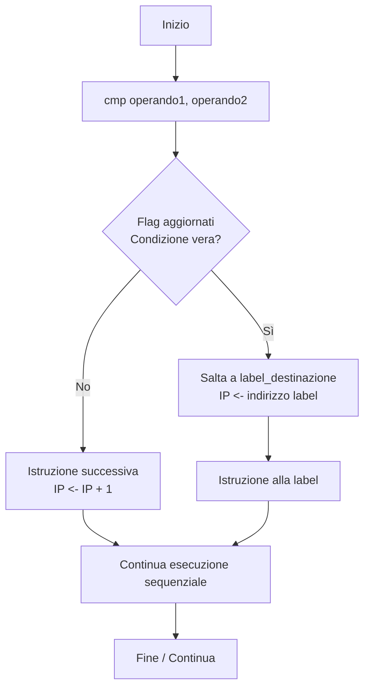
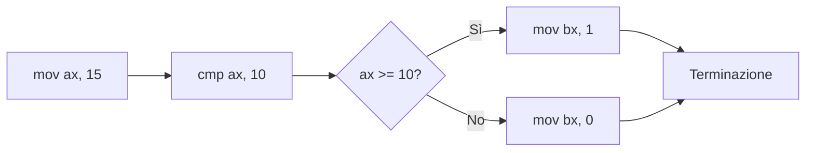

# Assembly x86 — Istruzioni Fondamentali e Controllo del Flusso

**Versione:** 1.0  
**Ambito:** Architettura x86, programmazione a basso livello  
**Destinatari:** Studenti di informatica, ingegneria del software, programmatori sistemi

---

## Indice

- [1. Introduzione](#1-introduzione)
- [2. Istruzioni di Trasferimento Dati](#2-istruzioni-di-trasferimento-dati)
  - [2.1 `mov` — Copia di Valori](#21-mov--copia-di-valori)
- [3. Istruzioni Aritmetiche](#3-istruzioni-aritmetiche)
  - [3.1 `add` — Addizione](#31-add--addizione)
  - [3.2 `sub` — Sottrazione](#32-sub--sottrazione)
  - [3.3 `mul` — Moltiplicazione](#33-mul--moltiplicazione)
  - [3.4 `div` — Divisione](#34-div--divisione)
- [4. Istruzioni di Confronto](#4-istruzioni-di-confronto)
  - [4.1 `cmp` — Confronto](#41-cmp--confronto)
- [5. Chiamate di Sistema](#5-chiamate-di-sistema)
  - [5.1 `int` — Interrupt Software](#51-int--interrupt-software)
- [6. Label e Controllo del Flusso](#6-label-e-controllo-del-flusso)
  - [6.1 Label](#61-label)
  - [6.2 `jmp` — Salto Incondizionato](#62-jmp--salto-incondizionato)
  - [6.3 Salti Condizionati](#63-salti-condizionati)
  - [6.4 Flusso di Controllo: Schema Generale](#64-flusso-di-controllo-schema-generale)
  - [6.5 Esempi Applicativi](#65-esempi-applicativi)
- [7. Tabella Riepilogativa delle Istruzioni](#7-tabella-riepilogativa-delle-istruzioni)
- [Glossario dei Termini Tecnici](#glossario-dei-termini-tecnici)

---

## 1. Introduzione

Il linguaggio Assembly x86 è una rappresentazione simbolica del linguaggio macchina per processori della famiglia Intel x86. A differenza dei linguaggi ad alto livello, non dispone di costrutti come cicli `for`, condizionali `if`, o funzioni di stampa integrate: ogni operazione viene espressa tramite istruzioni elementari che operano direttamente su **registri**, **memoria** e **flag** della CPU.

> **Nota tecnica:** Un *registro* è una locazione di memoria interna al processore, di dimensione fissa (8, 16 o 32 bit in x86), con latenza di accesso trascurabile rispetto alla RAM. I registri principali a 16 bit sono: `AX`, `BX`, `CX`, `DX`, e le loro suddivisioni a 8 bit (`AH`/`AL`, `BH`/`BL`, ecc.).

La comprensione di queste istruzioni è fondamentale per analisi di sicurezza, ottimizzazione di codice critico, sviluppo di sistemi embedded e studio dell'architettura dei calcolatori.

---

## 2. Istruzioni di Trasferimento Dati

### 2.1 `mov` — Copia di Valori

**Categoria:** Binaria (richiede operando sorgente e destinazione)

#### Sintassi

```assembly
mov destinazione, sorgente
```

#### Semantica

L'istruzione `mov` copia il valore dell'operando sorgente nell'operando destinazione. La sorgente rimane invariata. Non è ammesso il trasferimento diretto da locazione di memoria a locazione di memoria: è necessario un registro intermedio.

> **Attenzione:** `mov` non aggiorna i flag della CPU. Non può essere utilizzata come base per salti condizionati.

#### Esempi

```assembly
mov ax, 5       ; AX <- 5 (valore immediato)
mov bl, al      ; BL <- valore corrente di AL (copia registro-registro)
mov ax, [1234h] ; AX <- valore a indirizzo di memoria 1234h
```

---

## 3. Istruzioni Aritmetiche

### 3.1 `add` — Addizione

**Categoria:** Binaria

#### Sintassi

```assembly
add destinazione, sorgente
```

#### Semantica

```
destinazione <- destinazione + sorgente
```

L'operazione modifica la destinazione e aggiorna i **flag di stato** della CPU: Zero Flag (ZF), Sign Flag (SF), Overflow Flag (OF) e Carry Flag (CF).

> **Nota tecnica:** Il *flag* è un bit del registro di stato (`FLAGS`/`EFLAGS`) che segnala condizioni risultanti da un'operazione aritmetica o logica. I salti condizionati leggono questi bit per determinare il percorso di esecuzione.

#### Esempio

```assembly
mov ax, 3
add ax, 2   ; AX = 5; ZF=0, SF=0, CF=0
```

---

### 3.2 `sub` — Sottrazione

**Categoria:** Binaria

#### Sintassi

```assembly
sub destinazione, sorgente
```

#### Semantica

```
destinazione <- destinazione - sorgente
```

Aggiorna i flag di stato in modo analogo ad `add`. Se il risultato è zero, ZF viene posto a 1.

#### Esempio

```assembly
mov ax, 10
sub ax, 3   ; AX = 7; ZF=0
```

---

### 3.3 `mul` — Moltiplicazione Senza Segno

**Categoria:** Unaria (opera implicitamente sul registro `AX`)

#### Sintassi

```assembly
mul sorgente
```

#### Semantica

Esegue la moltiplicazione senza segno tra `AX` e l'operando sorgente. Poiché il prodotto di due valori a 16 bit può richiedere fino a 32 bit, il risultato viene distribuito su due registri:

| Parte del risultato | Registro |
|---|---|
| 16 bit meno significativi (parte bassa) | `AX` |
| 16 bit più significativi (parte alta) | `DX` |

> **Attenzione:** Se si utilizza `mul` con operandi a 8 bit, il risultato a 16 bit viene memorizzato interamente in `AX`. Con operandi a 32 bit (in modalità protetta), il risultato a 64 bit viene distribuito in `EAX` (basso) e `EDX` (alto).

#### Esempio

```assembly
mov ax, 1000
mov bx, 20
mul bx      ; DX:AX = 20000 -> AX = 20000, DX = 0 (nessun overflow)
```

---

### 3.4 `div` — Divisione Senza Segno

**Categoria:** Unaria (opera implicitamente sul dividendo `DX:AX`)

#### Sintassi

```assembly
div sorgente
```

#### Semantica

Divide il valore a 32 bit formato dalla coppia `DX:AX` per l'operando sorgente (a 16 bit). I risultati sono:

| Valore | Registro |
|---|---|
| Quoziente | `AX` |
| Resto | `DX` |

> **Attenzione:** Prima di eseguire `div` con un dividendo a 16 bit, è necessario azzerare esplicitamente `DX` (`mov dx, 0`) per evitare risultati errati o eccezioni di divisione (`Divide Error`, interrupt `INT 0`).

#### Esempio

```assembly
mov ax, 20
mov dx, 0   ; azzeramento obbligatorio della parte alta
mov bx, 3
div bx      ; AX = 6 (quoziente), DX = 2 (resto)
```

---

## 4. Istruzioni di Confronto

### 4.1 `cmp` — Confronto

**Categoria:** Binaria

#### Sintassi

```assembly
cmp destinazione, sorgente
```

#### Semantica

`cmp` esegue internamente una sottrazione (`destinazione - sorgente`) esclusivamente allo scopo di aggiornare i flag, **senza modificare né la destinazione né la sorgente**. Il risultato numerico viene scartato.

L'istruzione è tipicamente seguita da un'istruzione di salto condizionato che legge i flag appena aggiornati.

#### Esempio

```assembly
mov ax, 5
cmp ax, 3   ; esegue 5 - 3 = 2; ZF=0, SF=0 -> ax > 3
            ; ax rimane invariato (= 5)
```

---

## 5. Chiamate di Sistema

### 5.1 `int` — Interrupt Software

**Categoria:** Unaria (numero di vettore d'interruzione)

#### Sintassi

```assembly
int numero
```

#### Semantica

`int` genera un **interrupt software**, ovvero una richiesta controllata di trasferimento dell'esecuzione verso una routine del sistema operativo o del BIOS. Il processore:

1. Salva il contenuto del registro `FLAGS` e dell'indirizzo di ritorno nello stack.
2. Consulta la **Interrupt Vector Table (IVT)** per ottenere l'indirizzo della routine associata al numero specificato.
3. Esegue la routine di servizio.
4. Ripristina il contesto e riprende l'esecuzione dopo l'istruzione `int`.

> **Nota tecnica:** La *Interrupt Vector Table (IVT)* è una struttura dati in memoria (all'indirizzo fisico `0x0000:0x0000` in modalità reale) contenente i puntatori alle routine di gestione degli interrupt. Ogni vettore occupa 4 byte (segmento + offset).

I servizi più comuni in ambiente DOS/BIOS sono attivati tramite `INT 21h` (DOS) e `INT 10h` (BIOS video).

#### Esempi

```assembly
; Stampa il carattere 'A' tramite servizio DOS
mov dl, 'A'
mov ah, 02h
int 21h         ; chiamata al servizio 02h di INT 21h

; Terminazione del programma
mov ax, 4Ch
int 21h         ; restituzione del controllo al sistema operativo
```

---

## 6. Label e Controllo del Flusso

### 6.1 Label

Una **label** (etichetta) è un identificatore simbolico associato a un indirizzo di memoria nel codice sorgente Assembly. Il suo scopo è fornire un nome leggibile a una posizione del programma, utilizzabile come destinazione di istruzioni di salto.

#### Sintassi

```assembly
nome_label:
    ; istruzioni
```

Il nome della label è seguito da due punti (`:`) e può contenere lettere, cifre e il carattere underscore. Le label non generano codice macchina: vengono risolte dall'assemblatore in indirizzi numerici al momento dell'assemblaggio.

#### Esempio

```assembly
inizio:
    mov cx, 5       ; utilizzo di una label come punto di riferimento
```

---

### 6.2 `jmp` — Salto Incondizionato

**Categoria:** Unaria

#### Sintassi

```assembly
jmp destinazione
```

#### Semantica

Trasferisce incondizionatamente il controllo all'indirizzo specificato (label o indirizzo numerico), modificando il registro `IP` (Instruction Pointer). Non verifica alcun flag.

#### Esempio

```assembly
    jmp fine        ; salta direttamente alla label "fine"
    mov ax, 99      ; questa istruzione non viene mai eseguita

fine:
    mov ax, 4Ch
    int 21h
```

> **Attenzione:** L'uso non controllato di `jmp` può rendere il flusso del programma difficile da seguire e manutenere. In contesti strutturati, preferire costrutti equivalenti basati su salti condizionati.

---

### 6.3 Salti Condizionati

I salti condizionati verificano lo stato dei flag della CPU (aggiornati da istruzioni come `cmp`, `sub`, `add`) e trasferiscono il controllo alla destinazione specificata solo se la condizione è soddisfatta. In caso contrario, l'esecuzione prosegue con l'istruzione successiva.

#### Tabella dei Salti Condizionati Principali

| Istruzione | Significato | Condizione sui Flag | Uso tipico dopo `cmp a, b` |
|---|---|---|---|
| `je` / `jz` | Jump if Equal / Zero | ZF = 1 | `a == b` |
| `jne` / `jnz` | Jump if Not Equal / Not Zero | ZF = 0 | `a != b` |
| `jg` / `jnle` | Jump if Greater (con segno) | ZF=0 e SF=OF | `a > b` |
| `jge` / `jnl` | Jump if Greater or Equal (con segno) | SF = OF | `a >= b` |
| `jl` / `jnge` | Jump if Less (con segno) | SF != OF | `a < b` |
| `jle` / `jng` | Jump if Less or Equal (con segno) | ZF=1 o SF!=OF | `a <= b` |
| `ja` | Jump if Above (senza segno) | CF=0 e ZF=0 | `a > b` (unsigned) |
| `jb` / `jc` | Jump if Below (senza segno) | CF = 1 | `a < b` (unsigned) |

> **Nota tecnica:** Le istruzioni `jg`, `jge`, `jl`, `jle` operano su valori con segno (*signed*), interpretando il bit più significativo come bit di segno. Le istruzioni `ja`, `jb` operano su valori senza segno (*unsigned*). La distinzione è critica quando si confrontano valori che possono assumere il bit di segno.

#### Sintassi Generale

```assembly
cmp operando1, operando2
j<condizione> label_destinazione
```

#### Esempio — Struttura if/else

```assembly
    mov ax, 10
    mov bx, 7
    cmp ax, bx          ; confronto: 10 - 7, aggiorna flag
    jg  maggiore        ; se ax > bx, salta a "maggiore"
    ; --- ramo else ---
    mov cx, 0           ; ax <= bx: cx = 0
    jmp fine_if
maggiore:
    ; --- ramo then ---
    mov cx, 1           ; ax > bx: cx = 1
fine_if:
    ; esecuzione continua qui
```

---

### 6.4 Flusso di Controllo: Schema Generale

Il diagramma seguente illustra il meccanismo di un salto condizionato preceduto da un confronto.



---

### 6.5 Esempi Applicativi

#### Esempio 1 — Ciclo con contatore (equivalente a `for`)

Il seguente frammento esegue un ciclo decrescente da 3 a 1, stampando ogni valore come carattere ASCII.

```assembly
    mov cx, 3           ; contatore: CX = 3

ciclo:
    cmp cx, 0           ; confronto: CX vs 0
    je  fine_ciclo      ; se CX == 0, esci dal ciclo

    mov dl, cl          ; DL <- valore corrente del contatore
    add dl, 30h         ; conversione in cifra ASCII ('1' = 31h, '2' = 32h, ...)
    mov ah, 02h
    int 21h             ; stampa il carattere

    dec cx              ; CX <- CX - 1
    jmp ciclo           ; ripete dall'inizio del ciclo

fine_ciclo:
    mov ax, 4Ch
    int 21h             ; terminazione programma
```

> **Nota tecnica:** `dec` è un'istruzione unaria equivalente a `sub operando, 1`, ma più compatta. Aggiorna i flag (incluso ZF), ad eccezione del Carry Flag.

#### Esempio 2 — Confronto e selezione

```assembly
    mov ax, 15
    cmp ax, 10

    jge etichetta_ge    ; se ax >= 10, salta
    ; ax < 10
    mov bx, 0
    jmp fine

etichetta_ge:
    ; ax >= 10
    mov bx, 1

fine:
    ; BX contiene 0 se ax < 10, 1 altrimenti
    mov ax, 4Ch
    int 21h
```

#### Flusso dell'Esempio 2



---

## 7. Tabella Riepilogativa delle Istruzioni

| Istruzione | Categoria | Operazione | Registri/Flag Modificati |
|---|---|---|---|
| `mov` | Trasferimento | `dest <- src` | `dest` |
| `add` | Aritmetica | `dest <- dest + src` | `dest`, ZF, SF, OF, CF |
| `sub` | Aritmetica | `dest <- dest - src` | `dest`, ZF, SF, OF, CF |
| `mul` | Aritmetica | `AX * src -> DX:AX` | `AX` (bassa), `DX` (alta) |
| `div` | Aritmetica | `DX:AX / src -> AX, DX` | `AX` (quoziente), `DX` (resto) |
| `cmp` | Confronto | `dest - src -> flag` (risultato scartato) | ZF, SF, OF, CF |
| `int` | Sistema | Trasferimento a routine OS/BIOS | Dipendente dal servizio |
| `jmp` | Controllo flusso | `IP <- indirizzo destinazione` (incondizionato) | `IP` |
| `je` / `jz` | Controllo flusso | Salta se ZF = 1 | `IP` (condizionale) |
| `jne` / `jnz` | Controllo flusso | Salta se ZF = 0 | `IP` (condizionale) |
| `jg` | Controllo flusso | Salta se ZF=0 e SF=OF (signed) | `IP` (condizionale) |
| `jl` | Controllo flusso | Salta se SF != OF (signed) | `IP` (condizionale) |
| `jge` | Controllo flusso | Salta se SF = OF (signed) | `IP` (condizionale) |
| `jle` | Controllo flusso | Salta se ZF=1 o SF!=OF (signed) | `IP` (condizionale) |

---

## Glossario dei Termini Tecnici

**Assemblatore (Assembler)**
Programma che traduce il codice sorgente scritto in linguaggio Assembly in codice macchina binario eseguibile dal processore. Risolve le label in indirizzi numerici e codifica ogni istruzione nel corrispondente opcode.

**Carry Flag (CF)**
Flag di stato della CPU che viene posto a 1 quando un'operazione aritmetica genera un riporto oltre la dimensione del registro (overflow non con segno). Utilizzato dai salti condizionati `ja`, `jb`, `jc`.

**Flag di Stato (Status Flags)**
Bit del registro `FLAGS` (o `EFLAGS` in modalità protetta a 32 bit) che codificano condizioni risultanti da operazioni aritmetiche e logiche. I principali sono: Zero Flag (ZF), Sign Flag (SF), Overflow Flag (OF), Carry Flag (CF).

**Instruction Pointer (IP / EIP)**
Registro del processore che contiene l'indirizzo di memoria dell'istruzione correntemente in esecuzione (o della successiva da eseguire). Viene modificato da istruzioni di salto e chiamate a subroutine.

**Interrupt Software**
Meccanismo che permette a un programma in esecuzione di richiedere servizi al sistema operativo o al BIOS tramite l'istruzione `int`. Provoca una transizione controllata del controllo verso una routine predefinita, con salvataggio e ripristino del contesto di esecuzione.

**Interrupt Vector Table (IVT)**
Struttura dati residente ai primi 1024 byte della memoria fisica (in modalità reale x86) contenente i puntatori (vettori) alle routine di gestione degli interrupt. Ogni voce occupa 4 byte: 2 per il segmento e 2 per l'offset dell'handler.

**Label (Etichetta)**
Identificatore simbolico che il programmatore associa a un indirizzo nel codice sorgente Assembly. Le label vengono risolte dall'assemblatore in indirizzi numerici assoluti o relativi al momento della compilazione. Non producono codice macchina.

**Operando**
Dato su cui opera un'istruzione Assembly. Può essere un valore immediato (costante), un registro o un indirizzo di memoria.

**Overflow Flag (OF)**
Flag di stato posto a 1 quando un'operazione aritmetica su interi con segno produce un risultato non rappresentabile nella dimensione del registro (overflow con segno). Distingue situazioni di eccesso nel dominio dei numeri relativi.

**Registro**
Locazione di memoria interna al processore, di capacità limitata e fissa (8, 16 o 32 bit in x86), ad accesso estremamente rapido. I registri generali principali dell'architettura x86 a 16 bit sono `AX`, `BX`, `CX`, `DX` e relative suddivisioni (`AH`/`AL`, ecc.).

**Salto Condizionato**
Istruzione Assembly che trasferisce il controllo a un indirizzo specificato solo se una determinata condizione sui flag della CPU è verificata. In caso contrario, l'esecuzione prosegue sequenzialmente. Esempi: `je`, `jne`, `jg`, `jl`.

**Salto Incondizionato**
Istruzione Assembly (`jmp`) che trasferisce sempre il controllo a un indirizzo specificato, indipendentemente dallo stato dei flag. Equivale a un `goto` nei linguaggi ad alto livello.

**Sign Flag (SF)**
Flag di stato posto a 1 quando il risultato di un'operazione aritmetica è negativo (ovvero quando il bit più significativo del risultato è 1, interpretato come bit di segno in complemento a due).

**Stack**
Struttura dati LIFO (Last In, First Out) gestita in memoria dal processore tramite il registro `SP` (Stack Pointer). Utilizzata per salvare indirizzi di ritorno, parametri di funzione e lo stato dei registri durante le chiamate a subroutine e gli interrupt.

**Zero Flag (ZF)**
Flag di stato posto a 1 quando il risultato di un'operazione aritmetica o logica è zero. Fondamentale per i salti condizionati `je` (jump if equal) e `jz` (jump if zero), che verificano esattamente questo bit.
