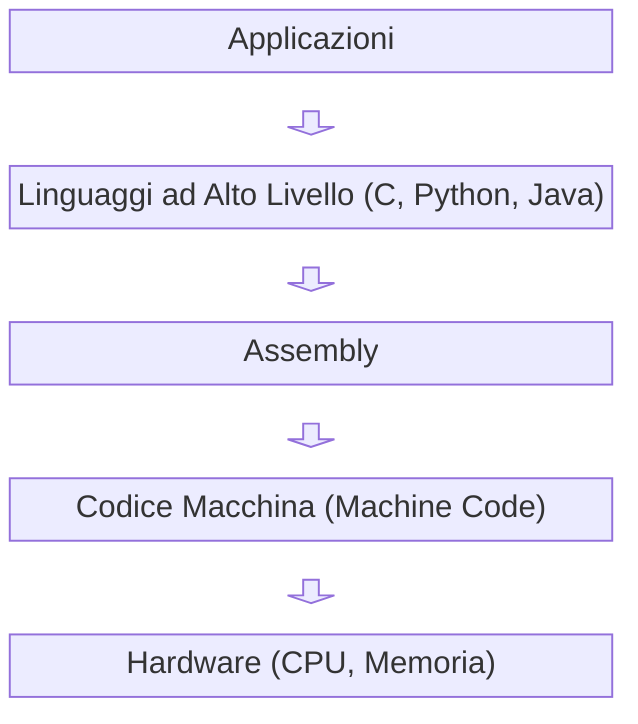

# Assembly Overview

## Cos'è Assembly

L’Assembly è un linguaggio di programmazione a basso livello (*low-level*) che fornisce una rappresentazione simbolica delle istruzioni in linguaggio macchina (*machine code*). Ogni istruzione in Assembly corrisponde molto da vicino—spesso uno a uno—alle operazioni eseguite direttamente dalla CPU.

A differenza dei linguaggi ad alto livello (*high-level languages*), l’Assembly non astrae l’hardware sottostante. Espone invece dettagli architetturali come registri (*registers*), indirizzi di memoria (*memory addresses*) e set di istruzioni (*instruction sets*), permettendo di scrivere codice altamente ottimizzato e specifico per l’hardware.

In sostanza, l’Assembly si colloca appena sopra le istruzioni binarie, offrendo mnemonici leggibili dall’uomo ma mantenendo il pieno controllo sull’esecuzione.

---

## Contesto Storico

I linguaggi Assembly sono nati nei primi anni dell’informatica come alternativa pratica alla programmazione diretta in codice binario (*machine code*). Negli anni ’40 e ’50, i primi computer richiedevano l’inserimento manuale delle istruzioni in forma binaria o esadecimale.

L’introduzione dell’Assembly ha semplificato questo processo sostituendo gli opcode numerici con mnemonici simbolici (ad esempio `MOV`, `ADD`, `JMP`). Questo ha migliorato significativamente la produttività mantenendo un controllo preciso sull’hardware.

Con l’evoluzione di linguaggi ad alto livello come C e Fortran, l’uso dell’Assembly è diminuito nello sviluppo generale, ma è rimasto fondamentale nella programmazione di sistema (*systems programming*), nei sistemi embedded (*embedded systems*) e nelle applicazioni critiche per le prestazioni.

---

## Collegamento con la Matematica e i Linguaggi

L’Assembly è profondamente legato alla logica matematica e ai sistemi formali. Alla base della computazione vi è l’esecuzione di operazioni deterministiche su dati—concetti radicati nella matematica discreta.

Dal punto di vista matematico:

* L’Assembly riflette le **macchine a stati finiti** (*finite state machines*), dove ogni istruzione rappresenta una transizione di stato.
* Opera su **aritmetica binaria**, direttamente collegata all’algebra booleana (*Boolean algebra*) e alla logica digitale.

Nel contesto più ampio dei linguaggi di programmazione:

* I linguaggi ad alto livello (Python, Java) privilegiano astrazione e produttività.
* L’Assembly offre un livello minimo di astrazione, esponendo direttamente il modello computazionale.
* Compilatori (*compilers*) e interpreti (*interpreters*) fungono da ponte, traducendo costrutti ad alto livello in Assembly o codice macchina.

L’Assembly rappresenta quindi un livello intermedio fondamentale tra il ragionamento umano e l’esecuzione della macchina.

---

## Posizionamento nello Stack Tecnico

L’Assembly può essere visto come parte di uno stack computazionale che collega software e hardware.

### Interpretazione

* **Hardware**: componenti fisici che eseguono segnali elettrici.
* **Codice Macchina**: istruzioni binarie direttamente comprese dalla CPU.
* **Assembly**: rappresentazione leggibile del codice macchina.
* **Linguaggi ad Alto Livello**: linguaggi astratti indipendenti dall’hardware.
* **Applicazioni**: software utilizzato dall’utente finale.

L’Assembly svolge un ruolo chiave come livello di traduzione:

* È spesso il target dei compilatori per linguaggi come C.
* Permette un controllo fine su prestazioni e memoria.
* È utilizzato in debugging, reverse engineering e sistemi embedded.

---

## Conclusione

L’Assembly occupa una posizione unica nell’informatica: è vicino all’hardware ma ancora accessibile al ragionamento umano. Anche se raramente utilizzato per lo sviluppo di applicazioni su larga scala, resta fondamentale per comprendere come il software interagisce realmente con la macchina.

Studiare l’Assembly permette di acquisire una comprensione profonda di prestazioni, gestione della memoria e principi fondamentali della computazione, rendendolo uno strumento concettuale essenziale anche nei contesti moderni.
