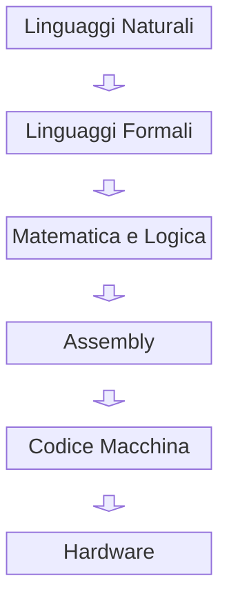

# Assembly and Logic

## Introduzione

Esiste una connessione diretta tra linguaggi umani (*natural languages*), linguaggi formali (*formal languages*), matematica e Assembly. Questa connessione non è solo concettuale, ma strutturale: tutti questi sistemi condividono regole di sintassi (*syntax*), semantica (*semantics*) e trasformazione.

L’Assembly rappresenta uno dei punti più concreti di questa relazione, dove la logica matematica diventa esecuzione reale su hardware.

---

## Linguaggi Parlati e Linguaggi Formali

I linguaggi parlati (italiano, inglese, ecc.) sono sistemi complessi e ambigui, progettati per la comunicazione umana. Hanno:

* Sintassi flessibile
* Semantica spesso dipendente dal contesto
* Ridondanza e ambiguità

I linguaggi formali, invece, sono progettati per eliminare ambiguità:

* Sintassi rigorosa (*formal grammar*)
* Semantica definita in modo preciso
* Regole deterministiche

L’Assembly è un linguaggio formale:

* Ogni istruzione ha un significato univoco
* Non esiste ambiguità interpretativa
* La sintassi è strettamente vincolata all’architettura

---

## Matematica come Linguaggio

La matematica può essere vista come il linguaggio formale per eccellenza.

Caratteristiche:

* Basata su simboli e regole formali
* Totalmente non ambigua
* Costruita su logica deduttiva

Concetti fondamentali:

* Insiemi (*sets*)
* Funzioni (*functions*)
* Relazioni (*relations*)

Questi elementi sono alla base anche della computazione:

* I dati sono insiemi
* Le operazioni sono funzioni
* I programmi definiscono trasformazioni

---

## Insiemi e Computazione

Nel contesto computazionale:

* La memoria può essere vista come un insieme di stati
* I registri (*registers*) contengono elementi di un insieme (valori)
* Le istruzioni trasformano questi insiemi

Un programma Assembly può essere interpretato come:

> una sequenza di trasformazioni su insiemi di stati

Questo collega direttamente Assembly alla teoria degli insiemi.

---

## Logica Booleana

La logica booleana è il ponte fondamentale tra matematica e hardware.

Elementi base:

* Valori: `0` e `1`
* Operazioni: AND, OR, NOT

Queste operazioni sono implementate fisicamente nei circuiti digitali (*digital circuits*).

In Assembly, la logica booleana appare in modo esplicito:

```asm
AND R1, R2
OR  R1, R3
NOT R1
```

Ogni istruzione corrisponde a un’operazione logica su bit.

---

## Assembly come Linguaggio Logico

L’Assembly può essere visto come una forma operativa della logica:

* Le istruzioni sono operazioni elementari
* Il flusso di controllo (*control flow*) rappresenta decisioni logiche
* I salti (*jumps*) implementano condizioni

Esempio concettuale:

```asm
CMP R1, R2
JE  equal
```

Questo equivale a:

> se R1 == R2 allora vai a "equal"

Ovvero una struttura logica condizionale.

---

## Sintassi e Semantica in Assembly

Come ogni linguaggio formale, Assembly è definito da:

### Sintassi (Syntax)

Regole su come scrivere istruzioni:

* Formato delle istruzioni (`MOV R1, R2`)
* Uso di registri e operandi
* Etichette (*labels*)

### Semantica (Semantics)

Significato delle istruzioni:

* `MOV` copia dati
* `ADD` esegue somma
* `JMP` altera il flusso

A differenza dei linguaggi naturali:

* La semantica è fissa
* Non esistono interpretazioni multiple

---

## Dalla Logica al Linguaggio Macchina

Possiamo vedere una catena concettuale:



---

## Interpretazione

* I linguaggi naturali esprimono idee
* I linguaggi formali le rendono precise
* La matematica le rende verificabili
* L’Assembly le rende eseguibili
* Il codice macchina le rende fisiche
* L’hardware le realizza

---

## Conclusione

Sì, esiste una connessione profonda tra linguaggi, matematica, logica booleana e Assembly.

L’Assembly non è solo un linguaggio di programmazione, ma un punto di convergenza:

* tra astrazione e implementazione
* tra teoria e pratica
* tra logica e fisica

Comprenderlo significa comprendere come un’idea—espressa in un linguaggio—possa trasformarsi in un’azione concreta eseguita da una macchina.
