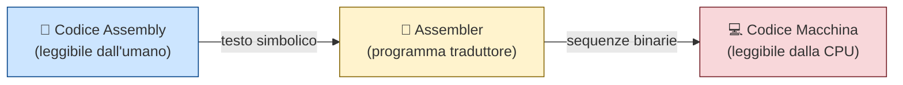
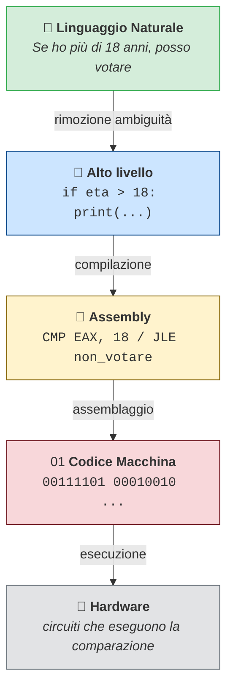
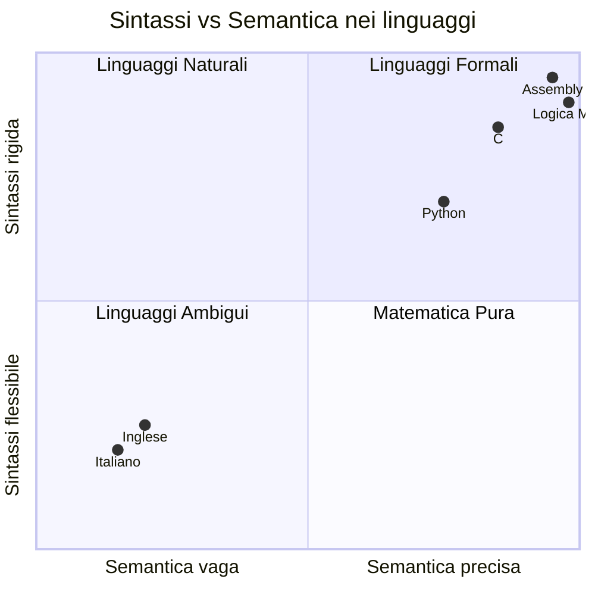
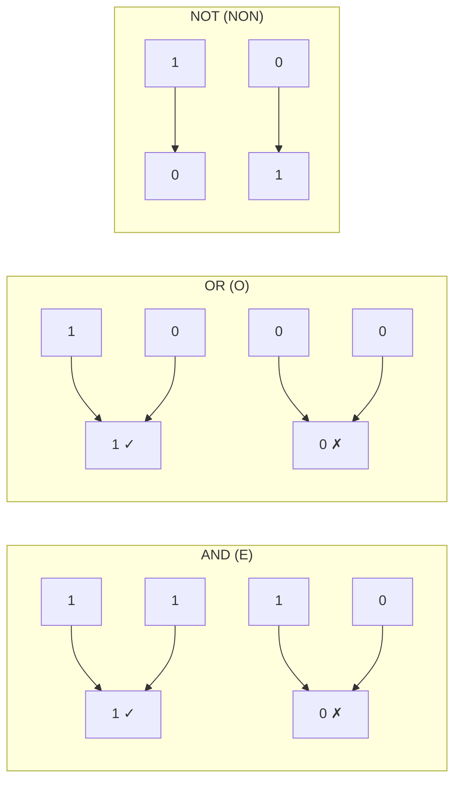
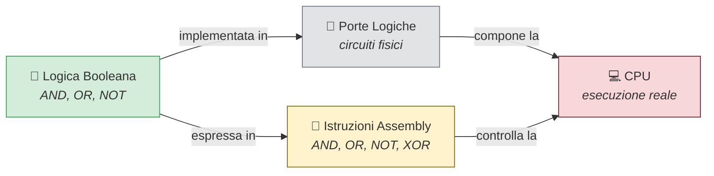
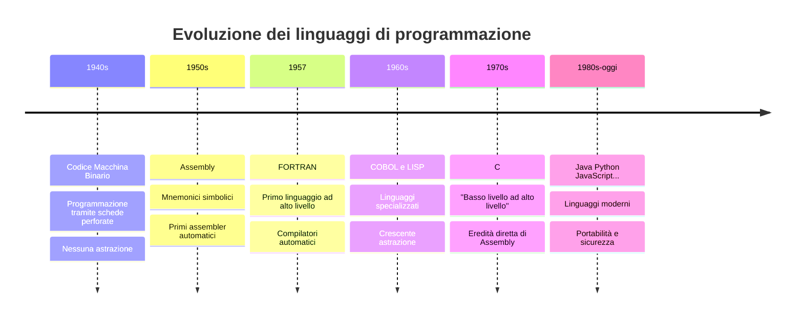
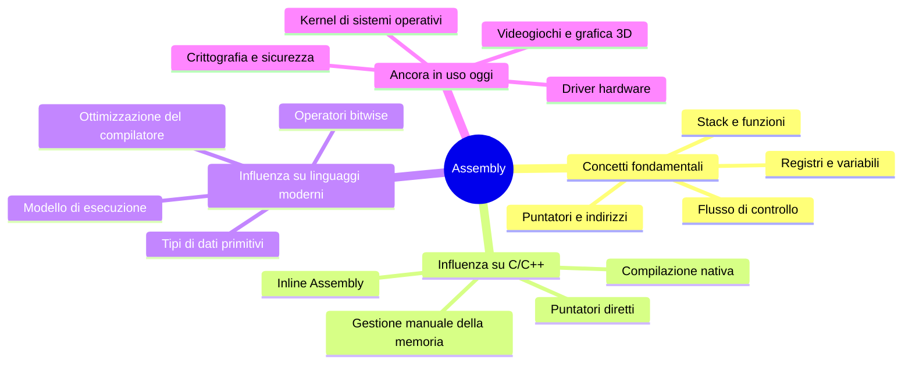
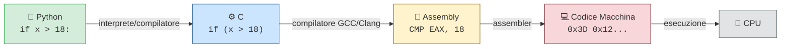
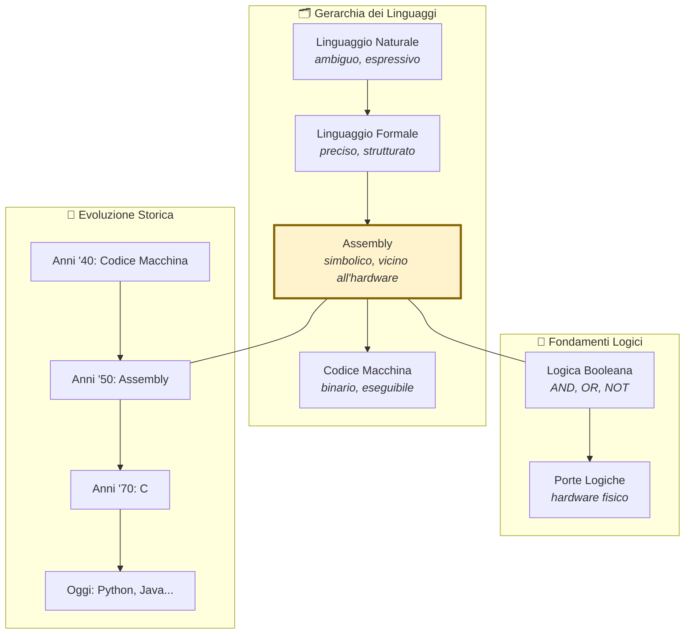

# Assembly e Linguaggi di Programmazione
### Una visione ad alto livello per chi inizia

---

## Indice

1. [Cosa sono i linguaggi di programmazione?](#1-cosa-sono-i-linguaggi-di-programmazione)
2. [La gerarchia dei linguaggi](#2-la-gerarchia-dei-linguaggi)
3. [Cosa è l'Assembly?](#3-cosa-è-lassembly)
4. [Dal linguaggio naturale alla macchina](#4-dal-linguaggio-naturale-alla-macchina)
5. [Assembly e logica formale](#5-assembly-e-logica-formale)
6. [Logica Booleana: il ponte verso l'hardware](#6-logica-booleana-il-ponte-verso-lhardware)
7. [Il ruolo storico dell'Assembly](#7-il-ruolo-storico-dellassembly)
8. [Come l'Assembly ha influenzato i linguaggi moderni](#8-come-lassembly-ha-influenzato-i-linguaggi-moderni)
9. [Schema riassuntivo](#9-schema-riassuntivo)
10. [Conclusione](#10-conclusione)

---

## 1. Cosa sono i linguaggi di programmazione?

Prima di capire cos'è l'Assembly, è utile chiedersi: *perché esistono i linguaggi di programmazione?*

I computer capiscono solo **sequenze di 0 e 1** — il cosiddetto *codice macchina*. Un essere umano che voglia comunicare istruzioni a un computer ha bisogno di un intermediario: un **linguaggio di programmazione**.

Un linguaggio di programmazione è, in sostanza, un sistema di comunicazione tra l'intelligenza umana e l'hardware. Come ogni sistema di comunicazione, è fatto di:

- **Sintassi** (*syntax*): le regole su come scrivere le istruzioni
- **Semantica** (*semantics*): il significato di quelle istruzioni

> **Analogia:** Pensate a una ricetta di cucina. La ricetta ha una sintassi (elenco ingredienti, poi procedimento, poi tempi) e una semantica (ogni azione produce un effetto fisico reale). Un programma è la stessa cosa: una serie di istruzioni con un significato preciso.

---

## 2. La gerarchia dei linguaggi

I linguaggi di programmazione non sono tutti uguali. Si distinguono per quanto siano **vicini al linguaggio umano** (alto livello) o **vicini al linguaggio della macchina** (basso livello).

```mermaid
graph TD
    A["🗣️ Linguaggio Naturale<br/><i>italiano, inglese...</i>"]
    B["📐 Linguaggi ad Alto Livello<br/><i>Python, Java, C#...</i>"]
    C["⚙️ Linguaggi a Medio Livello<br/><i>C, C++</i>"]
    D["🔩 Assembly<br/><i>linguaggio simbolico della macchina</i>"]
    E["💻 Codice Macchina<br/><i>sequenze di 0 e 1</i>"]
    F["🔌 Hardware<br/><i>transistor, circuiti</i>"]

    A -->|"astrazione crescente ⬆"| B
    B --> C
    C --> D
    D --> E
    E --> F

    style A fill:#d4edda,stroke:#28a745
    style B fill:#cce5ff,stroke:#004085
    style C fill:#cce5ff,stroke:#004085
    style D fill:#fff3cd,stroke:#856404
    style E fill:#f8d7da,stroke:#721c24
    F fill:#e2e3e5,stroke:#6c757d
```

Più si scende nella gerarchia, più le istruzioni sono **potenti ma difficili da leggere per un umano**. Più si sale, più il codice **somiglia al linguaggio naturale**, ma perde contatto diretto con l'hardware.

L'Assembly occupa una posizione cruciale: è il linguaggio più vicino all'hardware che un essere umano può ancora leggere e scrivere in modo ragionevole.

---

## 3. Cosa è l'Assembly?

L'**Assembly** (o linguaggio assemblativo) è un linguaggio di programmazione a basso livello in cui ogni istruzione corrisponde, quasi sempre in modo diretto, a una singola operazione eseguita dal processore.

A differenza del codice macchina (fatto di soli numeri binari), l'Assembly usa **parole simboliche** leggibili dall'uomo, chiamate *mnemonici*:

| Codice macchina | Assembly | Significato |
|:---:|:---:|:---|
| `10110000 01100001` | `MOV AL, 97` | Sposta il valore 97 nel registro AL |
| `00000011 11000011` | `ADD EAX, EBX` | Somma EBX a EAX |
| `11101011 00001010` | `JMP fine` | Salta all'etichetta "fine" |

> **Nota:** Il mnemonico `MOV` viene da *move* (sposta), `ADD` da *add* (somma), `JMP` da *jump* (salta). Questa scelta non è casuale: i progettisti dell'Assembly volevano rendere il codice *minimamente* leggibile.

### Come funziona la traduzione?

Un programma chiamato **assembler** traduce il codice Assembly in codice macchina. È il primo esempio storico di "compilazione".



---

## 4. Dal linguaggio naturale alla macchina

C'è una catena di trasformazioni che va dal pensiero umano all'esecuzione fisica. Ogni passaggio traduce il messaggio in una forma più precisa e meno ambigua.

### Un esempio concreto

Immaginiamo di voler esprimere un'idea semplice: *"Se ho più di 18 anni, posso votare."*

Vediamo come questa stessa idea si esprime a livelli diversi:

**Linguaggio naturale (italiano):**
```
Se la mia età è maggiore di 18, allora posso votare.
```

**Pseudocodice (linguaggio ad alto livello):**
```python
if eta > 18:
    print("Puoi votare")
```

**Assembly (basso livello):**
```asm
CMP EAX, 18      ; confronta EAX (età) con 18
JLE non_votare   ; se minore o uguale, salta a "non_votare"
; ... codice per "puoi votare"
non_votare:
; ... codice per "non puoi votare"
```

**Codice macchina (binario):**
```
00111101 00010010 00000000 00000000 00000000
01111110 00001000
...
```



Ogni passaggio **elimina ambiguità** e **aggiunge precisione**, fino a ottenere istruzioni che l'hardware può eseguire senza alcuna interpretazione.

---

## 5. Assembly e logica formale

L'Assembly non è solo un linguaggio tecnico: è anche un **linguaggio logico**. Ogni programma Assembly descrive una sequenza di trasformazioni su dati, esattamente come la logica matematica descrive trasformazioni su proposizioni.

### Sintassi e Semantica: un confronto



I linguaggi naturali sono **flessibili e ambigui**: la stessa frase può voler dire cose diverse a seconda del contesto. L'Assembly è l'opposto: ogni istruzione ha **un solo significato possibile**, determinato dall'architettura del processore.

### Il flusso di controllo come logica

In logica, esistono strutture fondamentali: *se... allora*, *ripeti finché*, *scegli tra*. L'Assembly implementa queste strutture in modo esplicito:

| Struttura logica | In linguaggio naturale | In Assembly |
|:---|:---|:---|
| Condizione | "Se A è vero, fai X" | `CMP`, `JE`, `JNE` |
| Ciclo | "Ripeti X fino a quando Y" | `LOOP`, `JMP` con confronto |
| Sequenza | "Prima A, poi B, poi C" | istruzioni in ordine |

> **Esempio:** L'istruzione `JE equal` (Jump if Equal) non è altro che la realizzazione fisica di "**se** i valori sono uguali, **allora** salta". La logica condizionale più elementare diventa un'operazione concreta sul processore.

---

## 6. Logica Booleana: il ponte verso l'hardware

Alla base di tutto c'è la **logica booleana**, inventata dal matematico George Boole nel 1847, decenni prima dei computer. La sua intuizione fu che il ragionamento logico poteva essere ridotto a operazioni su soli due valori: **vero** e **falso**, o equivalentemente **1** e **0**.

### Le operazioni fondamentali



Queste tre operazioni sono abbastanza potenti da costruire qualsiasi calcolo possibile. Nei circuiti digitali, sono implementate fisicamente tramite componenti chiamati **porte logiche** (*logic gates*).

In Assembly, la logica booleana è direttamente accessibile:

```asm
AND R1, R2    ; R1 = R1 AND R2 (bit per bit)
OR  R1, R3    ; R1 = R1 OR R3
NOT R1        ; R1 = NOT R1 (inverte tutti i bit)
XOR R1, R1    ; trucco classico: mette R1 a zero
```



La logica booleana è il punto in cui **la matematica astratta diventa fisica reale**.

---

## 7. Il ruolo storico dell'Assembly

Per capire davvero l'Assembly, bisogna conoscere il contesto in cui è nato.

### Le origini: il codice macchina puro

Nei primissimi computer degli anni '40 (ENIAC, UNIVAC, ecc.), i programmatori scrivevano direttamente in **codice macchina binario**, inserendo i programmi tramite schede perforate o interruttori fisici. Era un lavoro lentissimo, erroratissimo e privo di qualsiasi astrazione.



### Perché l'Assembly fu rivoluzionario

L'introduzione dell'Assembly, a metà degli anni '50, fu una svolta epocale per tre ragioni:

1. **Leggibilità:** `ADD EAX, EBX` è incomparabilmente più chiaro di `00000011 11000011`.
2. **Produttività:** I programmatori potevano scrivere e correggere codice molto più velocemente.
3. **Astrazione:** Per la prima volta, il programmatore poteva *pensare* al problema senza gestire ogni bit manualmente.

> **Analogia:** Immaginate di dover costruire una casa usando direttamente gli atomi. Poi qualcuno inventa i mattoni. L'Assembly è l'invenzione del mattone: non elimina la complessità di fondo, ma la rende gestibile.

---

## 8. Come l'Assembly ha influenzato i linguaggi moderni

L'Assembly non è "morto": vive nei linguaggi moderni attraverso concetti, strutture e paradigmi che ha introdotto o consolidato.

### Eredità concettuale



### Il C: figlio diretto dell'Assembly

Il linguaggio C, creato da Dennis Ritchie negli anni '70, fu progettato esplicitamente come un "Assembly leggibile". Molte costruzioni di C mappano quasi direttamente su istruzioni Assembly:

| Concetto | In C | In Assembly |
|:---|:---|:---|
| Variabile intera | `int x = 5;` | `MOV EAX, 5` |
| Condizione | `if (x > 0)` | `CMP EAX, 0 / JLE ...` |
| Ciclo | `for (int i=0; i<10; i++)` | `MOV ECX, 0 / CMP/JGE/INC` |
| Operazione bit | `x & 0xFF` | `AND EAX, 0xFF` |

Questa relazione non è casuale: il compilatore C, quando genera il codice eseguibile, **produce Assembly** come passaggio intermedio.

### La catena di compilazione moderna



Ogni volta che eseguite un programma Python o Java, da qualche parte nella catena c'è dell'Assembly — generato automaticamente dal compilatore, invisibile ma presente.

### Dove si usa ancora oggi

L'Assembly non è un reperto museale. Viene ancora usato in contesti dove le prestazioni e il controllo diretto sull'hardware sono critici:

- **Kernel dei sistemi operativi** (Linux, Windows): le primissime istruzioni eseguite all'avvio di un computer sono scritte in Assembly
- **Driver hardware**: la comunicazione a basso livello con periferiche
- **Crittografia**: algoritmi ottimizzati al massimo per la velocità
- **Videogiochi e grafica 3D**: shader e ottimizzazioni per GPU
- **Sistemi embedded**: microcontroller con risorse limitate (automobili, elettrodomestici, dispositivi medici)

---

## 9. Schema riassuntivo

### I concetti chiave in sintesi



### Cosa ricordare

| Domanda | Risposta |
|:---|:---|
| Cos'è l'Assembly? | Un linguaggio simbolico a basso livello, un passo sopra il codice macchina |
| A cosa serve? | A dare istruzioni dirette alla CPU, con il minimo di astrazione |
| Perché è importante? | Fu il primo linguaggio leggibile dall'uomo e gettò le basi di tutti i successivi |
| È ancora usato? | Sì, in kernel, driver, crittografia e sistemi embedded |
| Qual è il suo legame con la logica? | Ogni istruzione è un'operazione logica; implementa direttamente la logica booleana |
| Qual è il suo legame con i linguaggi moderni? | Tutti i linguaggi compilati generano Assembly come passaggio intermedio |

---

## 10. Conclusione

L'Assembly non è solo un vecchio linguaggio di programmazione. È il **punto di incontro** tra tre mondi:

- Il mondo dell'**astrazione umana** — linguaggio, logica, matematica
- Il mondo della **computazione** — algoritmi, strutture dati, flusso di controllo
- Il mondo della **fisica** — transistor, circuiti, segnali elettrici

Capire l'Assembly significa capire come un'idea — espressa in un linguaggio naturale — possa trasformarsi, passo dopo passo, in un'azione concreta eseguita da un processore a miliardi di operazioni al secondo.

I linguaggi moderni che usate ogni giorno — Python, JavaScript, Java, C# — sono costruiti sulle spalle dell'Assembly. Le loro astrazioni (variabili, funzioni, cicli, condizioni) nascono tutte da operazioni che, a basso livello, l'Assembly implementa in modo esplicito.

> **Messaggio finale:** Imparare i concetti dell'Assembly, anche senza scrivere una sola riga di codice Assembly, vi rende programmatori più consapevoli. Vi insegna a capire cosa succede *davvero* quando il vostro codice gira.

---

*Documento generato per uso didattico — Lezione introduttiva su Assembly e linguaggi di programmazione*
