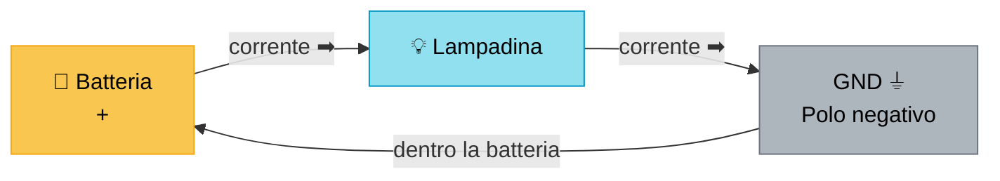
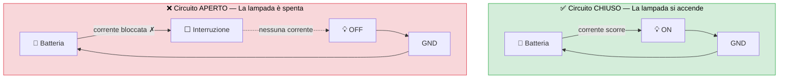
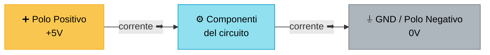
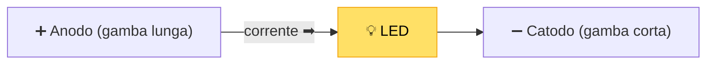
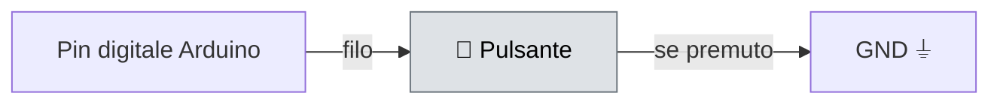
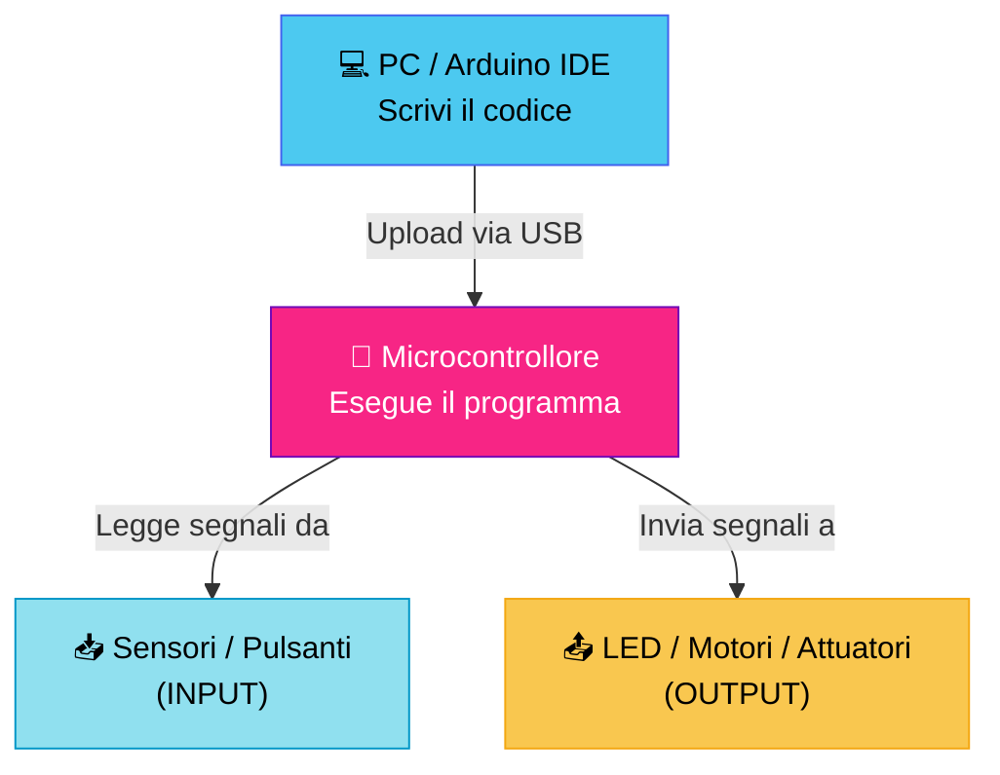
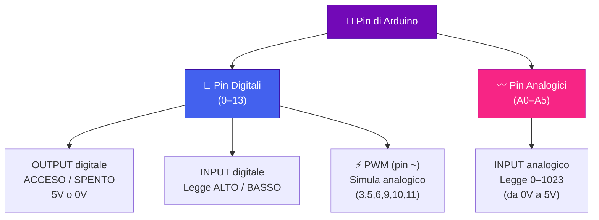
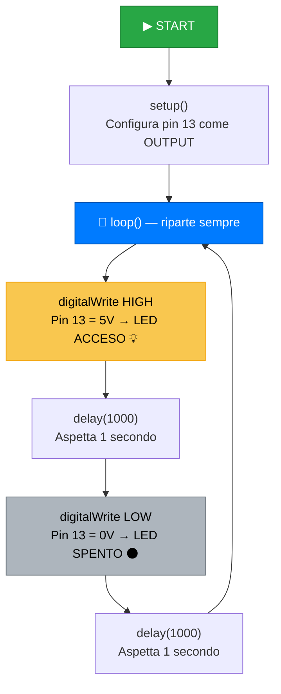
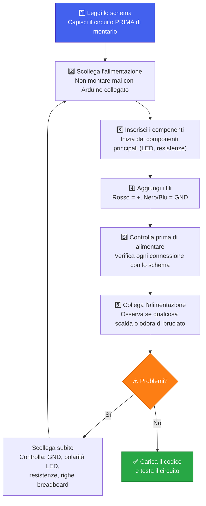

# ⚡ Introduzione all'Elettronica e ad Arduino

> **Documento per studenti principianti** — Leggi tutto prima di toccare il kit!

Questo documento ti accompagna passo dopo passo nella comprensione dei concetti fondamentali di elettronica. Non serve nessuna conoscenza precedente: partiamo da zero.

---

## Indice

1. [Introduzione ai circuiti elettrici](#1-introduzione-ai-circuiti-elettrici)
2. [Componenti elettronici di base](#2-componenti-elettronici-di-base)
3. [Introduzione ad Arduino](#3-introduzione-ad-arduino)
4. [Preparazione agli esercizi](#4-preparazione-agli-esercizi)

---

## 1. Introduzione ai circuiti elettrici

### 1.1 Cos'è un circuito elettrico?

Immagina l'acqua che scorre in un tubo: parte da un serbatoio, percorre il tubo e ritorna al serbatoio. L'acqua si muove perché c'è una **differenza di pressione** tra un'estremità e l'altra.

L'elettricità funziona in modo simile:

| Acqua | Elettricità |
|---|---|
| Acqua che scorre | Corrente elettrica (A) |
| Pressione dell'acqua | Tensione / Voltaggio (V) |
| Resistenza del tubo (diametro, lunghezza) | Resistenza elettrica (Ω) |
| Pompa che spinge l'acqua | Batteria / Alimentatore |

Un **circuito elettrico** è un percorso chiuso attraverso cui gli elettroni (le particelle cariche) possono scorrere continuamente.



> [!NOTE]
> Un circuito è come un anello: la corrente deve poter compiere un percorso **completo**. Se il percorso è interrotto in qualsiasi punto, nulla funzionerà.

---

### 1.2 Corrente, tensione e resistenza

#### ⚡ Corrente elettrica (Ampere — A)

La **corrente** è la quantità di elettroni che scorre attraverso un filo in un secondo. Più elettroni scorrono, più alta è la corrente.

> **Analogia:** È come la portata dell'acqua — quanti litri al secondo passano attraverso un tubo.

#### 🔋 Tensione / Voltaggio (Volt — V)

La **tensione** è la "spinta" che muove gli elettroni nel circuito. Senza tensione, gli elettroni non si muovono.

> **Analogia:** È come la pressione dell'acqua. Una pompa ad alta pressione spinge più acqua; una batteria ad alto voltaggio spinge più corrente.

Esempi di tensione comuni:
- Batteria stilo (AA): **1,5 V**
- Batteria a 9V: **9 V**
- Arduino (alimentazione pin): **5 V**
- Rete elettrica domestica: **230 V** ⚠️

#### 🔩 Resistenza (Ohm — Ω)

La **resistenza** è l'opposizione al flusso di corrente. Ogni materiale ha una certa resistenza: i metalli la hanno bassa (conducono bene), la gomma la ha altissima (isola).

> **Analogia:** È come il diametro di un tubo. Un tubo stretto (alta resistenza) lascia passare poca acqua; un tubo largo (bassa resistenza) ne lascia passare molta.

#### 📐 La Legge di Ohm

Questi tre concetti sono legati da una legge semplice e fondamentale:

$$V = I \times R$$

| Simbolo | Grandezza | Unità |
|---|---|---|
| V | Tensione | Volt (V) |
| I | Corrente | Ampere (A) |
| R | Resistenza | Ohm (Ω) |

> **Esempio pratico:** Se hai una tensione di 5V e una resistenza di 1000Ω (1kΩ), la corrente che scorre è:
> `I = V / R = 5 / 1000 = 0,005 A = 5 mA`

---

### 1.3 Circuito aperto e circuito chiuso



| Stato | Descrizione | Risultato |
|---|---|---|
| **Circuito chiuso** | Il percorso è continuo e completo | La corrente scorre → la lampadina si accende |
| **Circuito aperto** | C'è un'interruzione nel percorso | Nessuna corrente → la lampadina è spenta |

Un **interruttore** (o pulsante) non fa altro che aprire e chiudere fisicamente il circuito.

---

### 1.4 Perché una lampadina o un LED si accendono?

Quando la corrente elettrica scorre attraverso un materiale che oppone **resistenza**, l'energia elettrica si trasforma in calore (e luce).

- In una **lampadina tradizionale**: il filamento di tungsteno ha alta resistenza, si scalda moltissimo e diventa incandescente → emette luce.
- In un **LED** (Light Emitting Diode): gli elettroni, attraversando il materiale semiconduttore, perdono energia che viene emessa direttamente come **fotoni di luce**, senza calore eccessivo. Per questo i LED sono efficienti!

> [!TIP]
> I LED consumano molto meno energia delle lampadine tradizionali e durano molto di più. Per questo motivo vengono usati ovunque in elettronica.

<!-- PLACEHOLDER IMMAGINE: schema confronto lampadina tradizionale vs LED -->
> 📷 *[Immagine da aggiungere: confronto tra lampadina tradizionale e LED]*

---

### 1.5 Il ruolo della batteria / alimentazione

La batteria (o l'alimentatore) è il motore del circuito. Ha due poli:

- **Polo positivo (+)**: dove la corrente "esce" verso il circuito
- **Polo negativo (−) / GND**: dove la corrente "ritorna"

> [!IMPORTANT]
> La corrente scorre **sempre** dal polo positivo attraverso il circuito verso il polo negativo (GND). Questo percorso deve essere sempre chiuso e completo.



---

### 1.6 Cosa significa GND e perché è fondamentale

**GND** sta per *Ground* (terra, in inglese). È il punto di riferimento a **0 Volt** del circuito.

> **Analogia:** Pensa al livello del mare. La tensione è come l'altitudine: ha senso solo se la misuri rispetto a un punto di riferimento. Il GND è quel punto di riferimento — "il livello del mare" del tuo circuito.

Regole fondamentali del GND:

1. **Ogni componente deve essere connesso al GND** (direttamente o indirettamente) per funzionare.
2. In un circuito con più alimentazioni (es. Arduino + batteria esterna), tutti i GND devono essere **collegati tra loro** (*common ground*).
3. Il GND non è "pericoloso" — è semplicemente il riferimento da cui si misurano tutte le tensioni.

> [!WARNING]
> Dimenticare di collegare il GND è uno degli errori più comuni! Se un componente non funziona, il primo controllo da fare è verificare la connessione al GND.

---

## 2. Componenti elettronici di base

### 2.1 LED (Light Emitting Diode)

Il **LED** è un componente che emette luce quando la corrente lo attraversa nella direzione corretta.



Caratteristiche fondamentali:

| Proprietà | Valore tipico |
|---|---|
| Tensione di lavoro (Vf) | 1,8 – 3,3 V (dipende dal colore) |
| Corrente massima | ~20 mA |
| Polarità | Sì (funziona solo in una direzione) |

> [!CAUTION]
> Il LED **deve sempre** avere una **resistenza in serie** per limitare la corrente. Senza resistenza, la corrente diventa eccessiva e il LED si brucia in pochi secondi!

Come riconoscere il verso corretto:
- **Gamba lunga** = Anodo = polo positivo (+)
- **Gamba corta** = Catodo = polo negativo (−)
- All'interno del LED, il **triangolino più grande** è il catodo

<!-- PLACEHOLDER IMMAGINE: foto/schema LED con indicazione anodo e catodo -->
> 📷 *[Immagine da aggiungere: LED con etichette anodo/catodo e simbolo circuitale]*

---

### 2.2 Resistenze

La **resistenza** è un componente che limita il flusso di corrente. È fondamentale per proteggere i LED e altri componenti.

Il valore si legge tramite le **bande colorate** stampate sul corpo:

<!-- PLACEHOLDER IMMAGINE: schema lettura codice colori resistenze -->
> 📷 *[Immagine da aggiungere: tabella codice colori resistenze]*

| Colore | Cifra | Moltiplicatore |
|---|---|---|
| Nero | 0 | ×1 |
| Marrone | 1 | ×10 |
| Rosso | 2 | ×100 |
| Arancione | 3 | ×1.000 |
| Giallo | 4 | ×10.000 |
| Verde | 5 | ×100.000 |
| Blu | 6 | ×1.000.000 |
| Viola | 7 | — |
| Grigio | 8 | — |
| Bianco | 9 | — |
| Oro | — | ×0,1 (±5%) |
| Argento | — | ×0,01 (±10%) |

> **Esempio:** Bande Marrone–Nero–Rosso–Oro → `1` `0` `×100` `±5%` = **1.000 Ω = 1 kΩ**

> [!NOTE]
> Le resistenze **non hanno polarità**: puoi collegarle in entrambe le direzioni senza problemi.

**Come calcolare la resistenza per un LED:**

$$R = \frac{V_{alimentazione} - V_{LED}}{I_{LED}}$$

Esempio con Arduino (5V) e LED rosso (Vf ≈ 2V, I = 10mA):

$$R = \frac{5 - 2}{0{,}010} = \frac{3}{0{,}010} = 300\ \Omega$$

Si usa la resistenza standard più vicina: **330 Ω**.

---

### 2.3 Pulsanti (Push Button)

Un **pulsante** è un interruttore momentaneo: chiude il circuito solo mentre viene premuto.



> [!NOTE]
> I pulsanti per breadboard hanno 4 pin, ma internamente sono solo 2 contatti. I pin di ogni lato corto sono già collegati tra loro.

<!-- PLACEHOLDER IMMAGINE: schema pinout pulsante 4 pin per breadboard -->
> 📷 *[Immagine da aggiungere: schema pulsante con indicazione dei pin collegati]*

---

### 2.4 Breadboard

La **breadboard** è una piastra per fare prototipi senza saldature. Permette di inserire e rimuovere i componenti liberamente.

```
  +  +  +  +  +  +  +  +  +  +   ← Fila "+" (alimentazione, collegata in orizzontale)
  -  -  -  -  -  -  -  -  -  -   ← Fila "-" / GND (collegata in orizzontale)

  a  b  c  d  e     f  g  h  i  j
1 o  o  o  o  o     o  o  o  o  o  ← Riga 1 (a-e collegate, f-j collegate)
2 o  o  o  o  o     o  o  o  o  o  ← Riga 2 (separata dalla riga 1)
3 o  o  o  o  o     o  o  o  o  o
...
```

Regole fondamentali della breadboard:

- Le **colonne verticali** (a-e e f-j) sono collegate **orizzontalmente** riga per riga.
- Il **canale centrale** separa le due metà: i componenti a cavallo del canale non sono collegati.
- Le **file laterali** (+/−) sono collegate **verticalmente** per tutta la lunghezza: usale per alimentazione e GND.

<!-- PLACEHOLDER IMMAGINE: foto breadboard con schema delle connessioni interne -->
> 📷 *[Immagine da aggiungere: breadboard con connessioni interne evidenziate]*

> [!TIP]
> Usa sempre il **rosso** per i fili di alimentazione (+) e il **nero** o **blu** per il GND (−). È una convenzione universale che evita molti errori.

---

### 2.5 Fili / Jumper

I **fili jumper** collegano i componenti sulla breadboard e con Arduino. Esistono tre tipi:

| Tipo | Connettori | Uso tipico |
|---|---|---|
| **M–M** (Maschio–Maschio) | Pin su entrambi i lati | Breadboard ↔ Breadboard |
| **M–F** (Maschio–Femmina) | Pin + foro | Arduino ↔ Breadboard |
| **F–F** (Femmina–Femmina) | Fori su entrambi i lati | Sensori con header pin |

> [!TIP]
> Tieni i fili più corti possibile. Un circuito ordinato è più facile da controllare e da correggere.

---

### 2.6 Alimentazione

In un circuito con Arduino, l'alimentazione può arrivare da:

1. **USB** (collegato al PC): fornisce 5V, fino a ~500mA. Ottimo per prototipi leggeri.
2. **Jack DC** (barrel connector): accetta 7–12V, regolati internamente a 5V e 3,3V.
3. **Pin Vin**: tensione esterna non regolata (7–12V) che passa dal regolatore interno.
4. **Pin 5V / 3.3V**: tensioni già regolate, usabili per alimentare sensori e componenti.

> [!WARNING]
> Non alimentare mai componenti direttamente dalla tensione di rete (230V). È **pericoloso** e può essere **letale**. In laboratorio si usano sempre tensioni sicure (3,3V o 5V).

---

## 3. Introduzione ad Arduino

### 3.1 Cos'è Arduino?

**Arduino** è una piattaforma open-source per la prototipazione elettronica, composta da:

- Una **scheda hardware** (microcontrollore + circuiti di supporto)
- Un **software** (Arduino IDE) per scrivere e caricare i programmi

Il suo punto di forza è la semplicità: permette di controllare componenti fisici (LED, motori, sensori) scrivendo poche righe di codice in C++.

> [!NOTE]
> Arduino non è un computer come un PC: non ha schermo, tastiera o sistema operativo. Esegue **un solo programma alla volta**, in modo continuativo.

<!-- PLACEHOLDER IMMAGINE: foto scheda Arduino UNO con etichette dei componenti principali -->
> 📷 *[Immagine da aggiungere: Arduino UNO con etichette (microcontrollore, pin digitali, pin analogici, alimentazione, USB)]*

---

### 3.2 Come funziona una scheda Arduino

Il cuore di Arduino è il **microcontrollore** (ATmega328P nell'UNO): un piccolo computer integrato in un singolo chip.



La struttura di un programma Arduino è sempre:

```cpp
void setup() {
  // Eseguito UNA SOLA VOLTA all'avvio
  // → Configura i pin, inizializza le librerie
}

void loop() {
  // Eseguito IN CONTINUAZIONE (all'infinito)
  // → Leggi sensori, scrivi output, attendi...
}
```

---

### 3.3 Pin digitali e analogici

La scheda Arduino UNO ha due tipi di pin:



---

### 3.4 Differenza tra segnali digitali e analogici

Questa è una distinzione fondamentale in elettronica:

#### Segnale Digitale

Un segnale digitale ha solo **due stati possibili**:

| Stato | Tensione (Arduino 5V) | Significato logico |
|---|---|---|
| **ALTO** (HIGH) | 5V | 1 / VERO / ACCESO |
| **BASSO** (LOW) | 0V | 0 / FALSO / SPENTO |

> **Analogia:** Come un interruttore della luce: può essere solo ON o OFF, nessuna via di mezzo.

```
Tensione
 5V ┤ ▀▀▀▀▀      ▀▀▀▀▀
    │      ▀▀▀▀▀
 0V ┤                        → Tempo
```

#### Segnale Analogico

Un segnale analogico può assumere **qualsiasi valore** in un intervallo continuo.

> **Analogia:** Come una manopola del volume: può andare da 0 a 100 passando per tutti i valori intermedi.

```
Tensione
 5V ┤          ╭─╮
    │     ╭────╯  ╰───╮
 0V ┤╭────╯            ╰───  → Tempo
```

#### PWM — Il trucco di Arduino per "simulare" l'analogico

I pin digitali contrassegnati con `~` (pin 3, 5, 6, 9, 10, 11 su Arduino UNO) supportano il **PWM** (Pulse Width Modulation).

Il PWM accende e spegne il pin molto velocemente: cambiando quanto tempo rimane acceso rispetto a spento (*duty cycle*), si simula una tensione intermedia.

```
100% duty cycle → sempre ON  → 5V  (LED al massimo)
 50% duty cycle → metà ON    → 2.5V (LED a metà luminosità)
  0% duty cycle → sempre OFF → 0V  (LED spento)

100%: ▀▀▀▀▀▀▀▀▀▀▀▀▀▀▀▀▀▀▀▀
 50%: ▀▀▀▀▀     ▀▀▀▀▀     
 25%: ▀▀▀       ▀▀▀       
```

---

### 3.5 Input e Output

In Arduino, ogni pin può essere configurato come **ingresso (INPUT)** o **uscita (OUTPUT)**.

| Modalità | Funzione | Esempio |
|---|---|---|
| **OUTPUT** | Arduino **invia** un segnale al mondo esterno | Accendere un LED |
| **INPUT** | Arduino **legge** un segnale dal mondo esterno | Leggere un pulsante |
| **INPUT_PULLUP** | Come INPUT, con resistenza interna di pull-up | Pulsante senza resistenza esterna |

Si configura nel `setup()` con:

```cpp
pinMode(13, OUTPUT);      // Il pin 13 sarà un'uscita
pinMode(2, INPUT);        // Il pin 2 sarà un ingresso
pinMode(7, INPUT_PULLUP); // Il pin 7 sarà un ingresso con pull-up interno
```

---

### 3.6 Esempio pratico: LED lampeggiante (Blink)

Questo è il classico "Ciao Mondo" di Arduino.

**Schema del circuito:**

```
Arduino Pin 13 ──── [330Ω] ──── LED (+) ──── LED (−) ──── GND
```

<!-- PLACEHOLDER IMMAGINE: schema Fritzing del circuito Blink -->
> 📷 *[Immagine da aggiungere: schema Fritzing LED con resistenza su Arduino UNO]*

**Codice:**

```cpp
// LED lampeggiante — Blink

const int LED_PIN = 13;  // Il LED è collegato al pin 13

void setup() {
  pinMode(LED_PIN, OUTPUT);  // Configura il pin come uscita
}

void loop() {
  digitalWrite(LED_PIN, HIGH);  // Accende il LED (5V)
  delay(1000);                   // Aspetta 1 secondo (1000ms)
  digitalWrite(LED_PIN, LOW);   // Spegne il LED (0V)
  delay(1000);                   // Aspetta 1 secondo
}
```

**Cosa fa il codice, passo per passo:**



---

## 4. Preparazione agli esercizi

### 4.1 Come leggere uno schema elettrico

Uno **schema elettrico** (o *schematico*) usa simboli standardizzati per rappresentare i componenti.

Simboli fondamentali:

| Componente | Simbolo | Note |
|---|---|---|
| Filo collegato | `—` o `┼` (con punto) | Il punto indica connessione |
| Fili incrociati non collegati | `╋` (senza punto) | Senza punto = non connessi |
| Resistenza | `—[R]—` o `—/\/\/—` | |
| LED | `—[▷\|]—` | Il triangolo punta nella direzione della corrente |
| Pulsante (NO) | `— / —` | Normally Open: aperto a riposo |
| Alimentazione (+) | `VCC` o `+5V` | |
| GND | `⏚` o `GND` | |

**Schema Fritzing vs Schema elettrico:**

- Lo **schema Fritzing** (breadboard view) mostra i componenti fisici come appaiono realmente. È intuitivo per i principianti.
- Lo **schema elettrico** (schematic) usa simboli standard ed è universale tra ingegneri e tecnici.

<!-- PLACEHOLDER IMMAGINE: confronto schema Fritzing vs schema elettrico per lo stesso circuito -->
> 📷 *[Immagine da aggiungere: stesso circuito rappresentato in Fritzing e in schema elettrico]*

> [!TIP]
> Impara a leggere entrambi i tipi di schema. I tutorial usano spesso il Fritzing, ma la documentazione professionale usa sempre gli schematici.

---

### 4.2 Errori comuni degli studenti

Ecco gli errori più frequenti, raccolti dall'esperienza:

#### ❌ Errore 1 — Dimenticare il GND

**Sintomo:** Il componente non funziona nonostante sia collegato all'alimentazione.

**Soluzione:** Verifica sempre che ogni componente abbia un percorso verso il GND.

---

#### ❌ Errore 2 — LED senza resistenza

**Sintomo:** Il LED si accende brevemente poi smette di funzionare (si è bruciato).

> [!CAUTION]
> Non collegare mai un LED direttamente tra un pin di Arduino e il GND senza una resistenza in serie. La corrente sarà troppo alta e il LED si danneggerà immediatamente.

**Soluzione:** Usa sempre una resistenza da **220Ω a 470Ω** in serie con il LED.

---

#### ❌ Errore 3 — LED inserito al contrario

**Sintomo:** Il LED non si accende anche con il circuito corretto.

**Soluzione:** Ruota il LED di 180°. Ricorda: gamba lunga = positivo (+) = anodo.

---

#### ❌ Errore 4 — Fili su righe sbagliate della breadboard

**Sintomo:** Il circuito non funziona anche se sembra corretto.

**Soluzione:** Controlla che i fili siano nelle stesse righe (non nelle stesse colonne) dei componenti che devono collegare.

<!-- PLACEHOLDER IMMAGINE: esempio di errore comune su breadboard -->
> 📷 *[Immagine da aggiungere: esempio di collegamento errato sulla breadboard]*

---

#### ❌ Errore 5 — Caricare il programma con il circuito sbagliato

**Sintomo:** Il pin 0 o 1 non funziona come previsto.

> [!WARNING]
> I **pin 0 e 1** di Arduino UNO sono usati per la comunicazione seriale (USB). Non collegarli mai a componenti durante il caricamento del codice, potrebbero interferire.

**Soluzione:** Usa i pin da **2 a 13** per i componenti nei tuoi esperimenti.

---

#### ❌ Errore 6 — Confondere INPUT e OUTPUT nel codice

**Sintomo:** Il pin non risponde come previsto.

**Soluzione:** Prima di usare un pin, verifica di averlo configurato correttamente nel `setup()` con `pinMode()`.

---

### 4.3 Consigli pratici per montare correttamente un circuito

Segui questa procedura ogni volta:



**Lista di controllo rapida (checklist):**

- [ ] Ho letto e capito lo schema elettrico?
- [ ] I LED hanno tutti una resistenza in serie?
- [ ] Ho collegato il GND di Arduino alla breadboard?
- [ ] I LED sono inseriti nel verso giusto (gamba lunga al +)?
- [ ] I fili sono nelle righe corrette della breadboard?
- [ ] Ho evitato i pin 0 e 1 per i componenti?
- [ ] Ho caricato il codice corretto?

> [!TIP]
> Se qualcosa non funziona, non scoraggiarti. L'elettronica richiede pazienza e metodo. Scollega tutto, ricomincia dal GND e verifica ogni connessione una per una. Il 90% dei problemi ha una soluzione semplice.

---

## Glossario Rapido

| Termine | Significato |
|---|---|
| **Ampere (A)** | Unità di misura della corrente elettrica |
| **Anodo** | Terminale positivo del LED (gamba lunga) |
| **Breadboard** | Piastra per prototipi senza saldatura |
| **Catodo** | Terminale negativo del LED (gamba corta) |
| **Circuito** | Percorso chiuso attraverso cui scorre la corrente |
| **Corrente** | Flusso di elettroni in un conduttore |
| **Digitale** | Segnale con solo due stati: HIGH o LOW |
| **GND** | Ground — punto di riferimento a 0V del circuito |
| **IDE** | Integrated Development Environment — software per scrivere codice |
| **LED** | Light Emitting Diode — diodo che emette luce |
| **Microcontrollore** | Chip che esegue il programma in Arduino |
| **Ohm (Ω)** | Unità di misura della resistenza elettrica |
| **OUTPUT** | Pin configurato come uscita — Arduino invia un segnale |
| **INPUT** | Pin configurato come ingresso — Arduino legge un segnale |
| **PWM** | Pulse Width Modulation — tecnica per simulare segnali analogici |
| **Resistenza** | Componente che limita il flusso di corrente |
| **Tensione / Voltaggio** | "Spinta" che muove gli elettroni, misurata in Volt (V) |
| **Volt (V)** | Unità di misura della tensione elettrica |

---

*Documento creato per studenti principianti — versione 1.0*

> 📌 **Prossimo passo:** Completa il documento aggiungendo le immagini nei placeholder indicati, quindi passa agli esercizi pratici!
