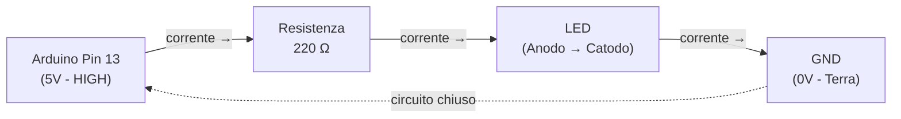

# Fondamenti di Arduino ed Elettronica di Base

> **Obiettivo:** Comprendere i concetti essenziali di Arduino — dalla struttura hardware alla programmazione di base — attraverso esempi pratici e immediati.

---

## Indice

1. [Cos'è Arduino?](#1-cosè-arduino)
2. [La Breadboard e i Componenti Principali](#2-la-breadboard-e-i-componenti-principali)
3. [Logica del Circuito Elettrico](#3-logica-del-circuito-elettrico)
4. [Programmazione: lo Sketch](#4-programmazione-lo-sketch)
5. [Esempio Interattivo: Input da Bottone](#5-esempio-interattivo-input-da-bottone)
6. [Buone Pratiche e Precauzioni](#6-buone-pratiche-e-precauzioni)

---

## 1. Cos'è Arduino?

Arduino è una **piattaforma di prototipazione elettronica open-source**, composta da una scheda hardware programmabile e da un ambiente di sviluppo software (IDE). Il suo punto di forza risiede nell'accessibilità: permette sia a principianti che a professionisti di realizzare prototipi interattivi senza richiedere conoscenze avanzate di elettronica o informatica.

Il funzionamento si basa su un ciclo fondamentale:

```
Ingresso (Input) → Elaborazione → Uscita (Output)
```

**Esempi concreti:**
- Un sensore di luce (ingresso) → il microcontrollore elabora il valore → si accende un LED (uscita)
- La pressione di un pulsante (ingresso) → viene attivato un motore (uscita)

### Anatomia della Scheda Arduino

| Componente | Funzione |
|---|---|
| **Microcontrollore** (es. ATmega328P) | Il "cervello" della scheda: esegue il codice istruzione per istruzione |
| **Pin Digitali** (D0–D13) | Gestiscono segnali binari: `HIGH` (5V) o `LOW` (0V) |
| **Pin Analogici** (A0–A5) | Leggono valori continui da 0 a 1023 (es. sensori di temperatura, potenziometri) |
| **Porta USB** | Consente il caricamento del programma dal computer e l'alimentazione della scheda |
| **Pin di alimentazione** (5V, 3.3V, GND) | Forniscono tensione ai componenti esterni collegati |

> **Nota tecnica:** La distinzione tra segnali digitali e analogici è fondamentale. I segnali digitali rappresentano stati discreti (0 o 1), mentre quelli analogici rappresentano grandezze continue. Arduino converte i segnali analogici in valori digitali tramite un **ADC** (Analog-to-Digital Converter) a 10 bit, ottenendo una risoluzione di 2¹⁰ = 1024 livelli distinti.

---

## 2. La Breadboard e i Componenti Principali

La **breadboard** (o "piastra di prototipazione") è uno strumento che consente di assemblare circuiti elettronici in modo temporaneo, **senza ricorrere alla saldatura**. I componenti vengono inseriti nei fori e collegati internamente tramite strisce conduttrici.

### Struttura interna della Breadboard

```
    [+] [-]  ← Rotaie di alimentazione (corrono verticalmente)
    ═══════
    a b c d e   f g h i j
1   · · · · ·   · · · · ·   ← Ogni riga è connessa orizzontalmente
2   · · · · ·   · · · · ·
3   · · · · ·   · · · · ·
    (gap centrale: separa le due metà)
```

Le colonne ai lati (`+` e `-`) sono chiamate **rotaie di alimentazione** e vengono usate per distribuire la tensione positiva (VCC) e il riferimento di massa (GND) a tutto il circuito.

### Componenti Fondamentali

#### 🔴 LED — *Light Emitting Diode*

Il LED è un **diodo che emette luce** quando attraversato da corrente nella direzione corretta. Come tutti i diodi, è un componente **polarizzato**: funziona solo se collegato nel verso giusto.

| Terminale | Identificazione | Collegamento |
|---|---|---|
| **Anodo** (+) | Gambo più lungo | Verso la tensione positiva |
| **Catodo** (−) | Gambo più corto | Verso GND |

> ⚠️ **Invertire la polarità non danneggia il LED**, ma semplicemente non si accende. Tuttavia, applicare una tensione eccessiva senza resistenza di protezione lo brucia in modo permanente.

#### ⬛ Resistenza

La resistenza è un componente **passivo** che si oppone al flusso di corrente elettrica, dissipando energia sotto forma di calore. È indispensabile per proteggere il LED: senza di essa, il LED assorbirebbe corrente illimitata e si danneggerebbe istantaneamente.

Il valore della resistenza si calcola applicando la **Legge di Ohm**:

$$R = \frac{V}{I}$$

dove:
- $R$ = resistenza in Ohm (Ω)
- $V$ = tensione ai capi del componente in Volt (V)  
- $I$ = corrente che scorre nel componente in Ampere (A)

**Esempio pratico:** Per un LED rosso standard (caduta di tensione $V_{LED} \approx 2{,}0\ \text{V}$, corrente nominale $I = 20\ \text{mA}$), collegato a un pin da 5V:

$$R = \frac{5{,}0 - 2{,}0}{0{,}020} = \frac{3{,}0}{0{,}020} = 150\ \Omega$$

In commercio si usa tipicamente una resistenza da **220 Ω** (valore standard più vicino), che garantisce un margine di sicurezza adeguato.

#### 🔘 Pulsante — *Pushbutton*

Il pulsante è un **interruttore momentaneo**: chiude il circuito (permette il passaggio di corrente) solo finché viene tenuto premuto. Arduino lo interpreta come un ingresso digitale (`HIGH` se premuto, `LOW` se rilasciato, o viceversa a seconda del collegamento).

#### 🔌 Cavi Jumper

I cavi jumper sono i connettori che collegano fisicamente Arduino alla breadboard e i vari componenti tra loro. Esistono in tre varianti: maschio-maschio, maschio-femmina e femmina-femmina, a seconda dei connettori da collegare.

---

## 3. Logica del Circuito Elettrico

Un circuito elettrico deve essere **chiuso** per permettere il flusso di corrente. La corrente scorre sempre dal potenziale più alto (tensione positiva, es. Pin 13 a 5V) verso il potenziale più basso (massa o **GND**, a 0V).

### Schema del circuito LED + Resistenza



### Collegamento fisico sulla breadboard

```
Arduino Pin 13 ──── [Resistenza 220Ω] ──── [LED: + → -] ──── Arduino GND
```

> **Concetto chiave:** La corrente non si "consuma" nel circuito — la stessa quantità che entra dal pin positivo deve uscire dal GND. Ciò che cambia è la **tensione**: ogni componente "assorbe" una parte della tensione totale (caduta di tensione).

---

## 4. Programmazione: lo Sketch

Il programma scritto per Arduino si chiama **Sketch** (dall'IDE Arduino). È scritto in un linguaggio basato su **C/C++**, semplificato da una serie di funzioni predefinite che astraggono le operazioni hardware di basso livello.

Ogni Sketch deve obbligatoriamente contenere due funzioni:

| Funzione | Esecuzione | Scopo |
|---|---|---|
| `setup()` | **Una volta sola** all'avvio | Configurazione iniziale dei pin e delle periferiche |
| `loop()` | **Ripetuta all'infinito** | Logica principale del programma |

### Funzioni Essenziali

```cpp
pinMode(pin, modalità);      // Configura un pin come INPUT o OUTPUT
digitalWrite(pin, valore);   // Imposta un pin digitale a HIGH (5V) o LOW (0V)
digitalRead(pin);            // Legge lo stato di un pin digitale (restituisce HIGH o LOW)
delay(millisecondi);         // Sospende l'esecuzione per il tempo specificato
```

### Esempio 1 — LED Lampeggiante (Blink)

Il "Blink" è il programma introduttivo per eccellenza nell'ecosistema Arduino, equivalente al "Hello, World!" della programmazione tradizionale.

```cpp
/*
 * Blink — Esempio base di output digitale
 * Fa lampeggiare il LED integrato ogni secondo.
 */

void setup() {
  // Dichiara il Pin 13 come uscita digitale
  // Il Pin 13 è collegato anche al LED integrato sulla maggior parte delle schede Arduino
  pinMode(13, OUTPUT);
}

void loop() {
  digitalWrite(13, HIGH);  // Porta il Pin 13 a 5V → LED acceso
  delay(1000);             // Attende 1000 ms (1 secondo)
  
  digitalWrite(13, LOW);   // Porta il Pin 13 a 0V → LED spento
  delay(1000);             // Attende 1000 ms (1 secondo)
  
  // Il loop ricomincia: il LED lampeggia con periodo T = 2 secondi
}
```

**Analisi del comportamento:**
- Frequenza di lampeggio: $f = \frac{1}{T} = \frac{1}{2} = 0{,}5\ \text{Hz}$
- Duty cycle: 50% (il LED è acceso per metà del tempo)

---

## 5. Esempio Interattivo: Input da Bottone

Questo esempio introduce il concetto di **lettura di un ingresso digitale** e la struttura condizionale `if/else`, che costituisce la base della logica di controllo.

### Modello logico

Formalmente, un pulsante è una **funzione booleana** $f: \{0,1\} \to \{0,1\}$ che mappa lo stato fisico (premuto/rilasciato) in un valore binario (HIGH/LOW):

$$f(x) = \begin{cases} 1 & \text{se il pulsante è premuto} \\ 0 & \text{se il pulsante è rilasciato} \end{cases}$$

### Codice

```cpp
/*
 * Button → LED
 * Accende il LED (Pin 13) quando il pulsante (Pin 2) è premuto.
 * Collegamento: Pin 2 → Pulsante → GND (con resistenza pull-up interna)
 */

void setup() {
  pinMode(13, OUTPUT);           // LED: uscita
  pinMode(2, INPUT_PULLUP);      // Pulsante: ingresso con resistenza pull-up interna
                                 // Con INPUT_PULLUP: rilasciato = HIGH, premuto = LOW
}

void loop() {
  int statoBottone = digitalRead(2);  // Legge il valore del Pin 2

  if (statoBottone == LOW) {          // LOW = pulsante premuto (logica invertita con pull-up)
    digitalWrite(13, HIGH);           // Accende il LED
  } else {                            // HIGH = pulsante rilasciato
    digitalWrite(13, LOW);            // Spegne il LED
  }
}
```

> **Nota su `INPUT_PULLUP`:** Quando un pulsante è collegato a GND e il pin è configurato come `INPUT_PULLUP`, Arduino attiva internamente una resistenza di pull-up (~20–50 kΩ). Questo porta il pin a HIGH quando il pulsante è aperto, e a LOW quando è premuto (chiude il circuito verso GND). Questo schema è preferibile all'uso di resistenze esterne perché semplifica il cablaggio.

### Schema di collegamento

```
Arduino Pin 2 ──── [Un terminale del pulsante]
                   [Altro terminale del pulsante] ──── GND
```

---

## 6. Buone Pratiche e Precauzioni

### ✅ Checklist prima di alimentare il circuito

- [ ] Verificare la **polarità del LED** (gambo lungo verso il positivo)
- [ ] Controllare che ogni LED abbia la propria **resistenza di protezione** in serie
- [ ] Assicurarsi che i cavi jumper siano inseriti **saldamente** nei fori della breadboard
- [ ] Non collegare mai 5V direttamente a GND senza un carico intermedio (**cortocircuito!**)
- [ ] Verificare che i pin siano configurati correttamente come `INPUT` o `OUTPUT` nello `setup()`

### ⚠️ Errori Comuni da Evitare

| Errore | Conseguenza | Soluzione |
|---|---|---|
| LED senza resistenza | Il LED si brucia irreversibilmente | Aggiungere sempre una resistenza (min. 100 Ω) |
| Polarità del LED invertita | Il LED non si accende | Invertire i terminali |
| Cortocircuito 5V → GND | Danneggiamento del pin o della scheda | Verificare sempre il circuito prima di alimentarlo |
| Pin configurato come `INPUT` ma usato come `OUTPUT` | Comportamento imprevedibile | Controllare `pinMode()` nel `setup()` |

### 📚 Riferimenti e Risorse

- [Documentazione ufficiale Arduino](https://docs.arduino.cc/) — riferimento completo per funzioni e schede
- [Arduino Language Reference](https://www.arduino.cc/reference/en/) — dizionario completo delle funzioni disponibili
- [Tinkercad Circuits](https://www.tinkercad.com/) — simulatore online gratuito per testare i circuiti senza hardware fisico


