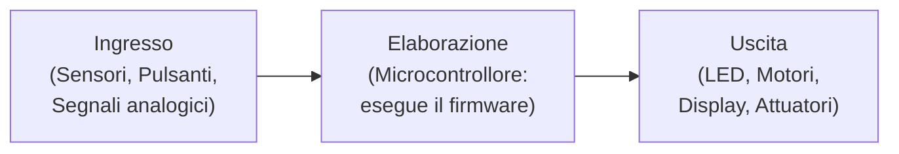
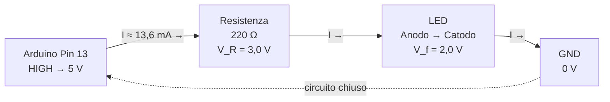
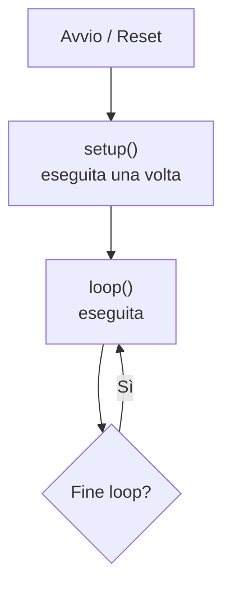
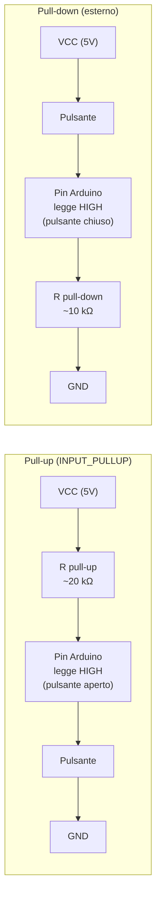
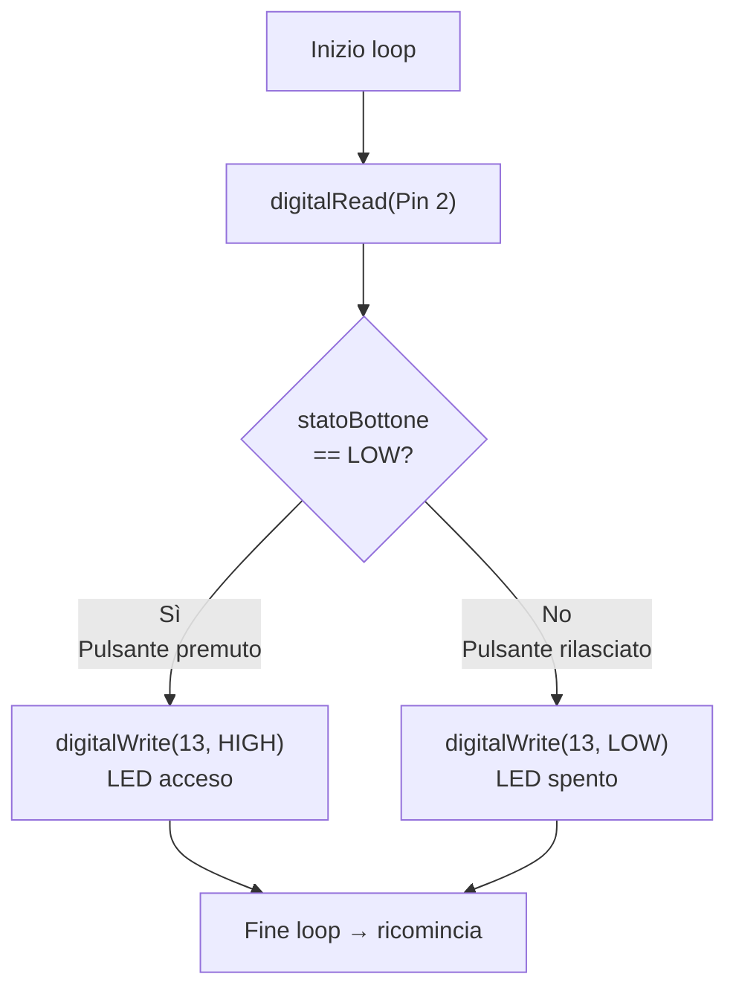

# Fondamenti di Arduino ed Elettronica di Base

**Versione:** 1.0  
**Ambito:** Sistemi embedded, prototipazione elettronica, programmazione microcontrollori  
**Destinatari:** Studenti di ingegneria elettronica/informatica, tecnici di sistemi embedded, programmatori di sistemi

---

## Indice

- [1. Introduzione ad Arduino](#1-introduzione-ad-arduino)
  - [1.1 Architettura della Piattaforma](#11-architettura-della-piattaforma)
  - [1.2 Anatomia della Scheda Arduino UNO](#12-anatomia-della-scheda-arduino-uno)
- [2. La Breadboard e i Componenti Principali](#2-la-breadboard-e-i-componenti-principali)
  - [2.1 Struttura Interna della Breadboard](#21-struttura-interna-della-breadboard)
  - [2.2 Componenti Fondamentali](#22-componenti-fondamentali)
- [3. Logica del Circuito Elettrico](#3-logica-del-circuito-elettrico)
  - [3.1 Legge di Ohm e Dimensionamento della Resistenza](#31-legge-di-ohm-e-dimensionamento-della-resistenza)
  - [3.2 Schema Circuitale LED + Resistenza](#32-schema-circuitale-led--resistenza)
- [4. Programmazione: lo Sketch](#4-programmazione-lo-sketch)
  - [4.1 Struttura Obbligatoria](#41-struttura-obbligatoria)
  - [4.2 Funzioni Essenziali dell'API Arduino](#42-funzioni-essenziali-dellapi-arduino)
  - [4.3 Esempio: LED Lampeggiante (Blink)](#43-esempio-led-lampeggiante-blink)
- [5. Lettura di Ingressi Digitali: Input da Pulsante](#5-lettura-di-ingressi-digitali-input-da-pulsante)
  - [5.1 Resistenza di Pull-up e Pull-down](#51-resistenza-di-pull-up-e-pull-down)
  - [5.2 Codice e Schema di Collegamento](#52-codice-e-schema-di-collegamento)
- [6. Buone Pratiche e Precauzioni](#6-buone-pratiche-e-precauzioni)
  - [6.1 Checklist Pre-alimentazione](#61-checklist-pre-alimentazione)
  - [6.2 Errori Comuni e Relative Soluzioni](#62-errori-comuni-e-relative-soluzioni)
- [Glossario dei Termini Tecnici](#glossario-dei-termini-tecnici)
- [Riferimenti e Risorse](#riferimenti-e-risorse)

---

## 1. Introduzione ad Arduino

### 1.1 Architettura della Piattaforma

Arduino è una **piattaforma di prototipazione elettronica open-source** composta da due elementi inscindibili: una scheda hardware basata su microcontrollore e un ambiente di sviluppo integrato (IDE) che semplifica la scrittura e il caricamento del firmware.

Il modello computazionale di Arduino segue il paradigma **IPO** (Input – Processing – Output):


```mermaid
flowchart LR
    A["Ingresso\n(Sensori, Pulsanti,\nSegnali analogici)"] --> B["Elaborazione\n(Microcontrollore:\nesegue il firmware)"]
    B --> C["Uscita\n(LED, Motori,\nDisplay, Attuatori)"]
```

**Esempi di applicazione del modello IPO:**

| Ingresso | Elaborazione | Uscita |
|---|---|---|
| Sensore di luminosità (valore analogico) | Soglia di attivazione nel firmware | Accensione LED |
| Pressione di un pulsante (valore digitale) | Logica condizionale `if/else` | Attivazione motore |
| Segnale da sensore di temperatura | Conversione ADC + calcolo | Trasmissione dati seriale |

### 1.2 Anatomia della Scheda Arduino UNO

La scheda Arduino UNO (basata sul microcontrollore ATmega328P) è il modello di riferimento della piattaforma. Di seguito la descrizione funzionale dei suoi componenti principali.

| Componente | Funzione |
|---|---|
| **Microcontrollore** (ATmega328P) | Unità di elaborazione centrale: esegue il firmware istruzione per istruzione a 16 MHz |
| **Pin Digitali** (D0–D13) | Gestiscono segnali binari: `HIGH` (5 V) o `LOW` (0 V); alcuni supportano PWM (~) |
| **Pin Analogici** (A0–A5) | Leggono tensioni continue nell'intervallo 0–5 V, convertite in valori interi 0–1023 tramite ADC |
| **Porta USB** | Permette il caricamento del firmware dal computer e l'alimentazione della scheda (5 V) |
| **Pin di Alimentazione** (5V, 3.3V, GND) | Forniscono tensione di riferimento ai componenti esterni collegati |
| **Connettore di alimentazione** (barrel jack) | Alimentazione esterna tramite alimentatore 7–12 V DC |
| **LED integrato** (Pin 13) | LED smd sull'header della scheda, utile per test rapidi senza componenti esterni |

> **Nota tecnica:** L'ADC (*Analog-to-Digital Converter*) integrato nell'ATmega328P ha una risoluzione di 10 bit, producendo 2¹⁰ = 1024 livelli distinti nell'intervallo 0–5 V. La tensione corrispondente a ciascun livello è pertanto $\Delta V = \frac{5{,}0}{1023} \approx 4{,}89\ \text{mV}$.

> **Nota tecnica:** I pin contrassegnati con il simbolo `~` (D3, D5, D6, D9, D10, D11) supportano la modulazione **PWM** (*Pulse Width Modulation*): generano un segnale digitale a frequenza fissa (circa 490–980 Hz) con duty cycle variabile, simulando un'uscita analogica. Utilizzati per controllare la luminosità dei LED o la velocità dei motori.

---

## 2. La Breadboard e i Componenti Principali

### 2.1 Struttura Interna della Breadboard

La **breadboard** (piastra di prototipazione) consente di assemblare circuiti elettronici in modo temporaneo e reversibile, senza ricorrere alla saldatura. I componenti vengono inseriti nei fori e collegati internamente tramite strisce metalliche conduttive.

```
    [+][-]                    [+][-]
    ─────                     ─────   ← Rotaie di alimentazione
       a  b  c  d  e     f  g  h  i  j
  1    ·  ·  ·  ·  ·     ·  ·  ·  ·  ·   ← Ogni riga è connessa
  2    ·  ·  ·  ·  ·     ·  ·  ·  ·  ·      orizzontalmente
  3    ·  ·  ·  ·  ·     ·  ·  ·  ·  ·      (colonne a–e e f–j
  4    ·  ·  ·  ·  ·     ·  ·  ·  ·  ·       sono separate dal
  5    ·  ·  ·  ·  ·     ·  ·  ·  ·  ·       canale centrale)
```

Le due colonne laterali (`+` e `−`) costituiscono le **rotaie di alimentazione**: percorrono la breadboard verticalmente e vengono utilizzate per distribuire rispettivamente la tensione positiva (VCC) e il riferimento di massa (GND) a tutti i componenti del circuito.

> **Nota tecnica:** In alcune breadboard le rotaie di alimentazione sono interrotte fisicamente a metà altezza. È necessario verificare la continuità con un multimetro o aggiungere un ponticello (jumper) per estendere la connessione all'intera lunghezza.

### 2.2 Componenti Fondamentali

#### LED — *Light Emitting Diode*

Il LED è un **diodo a emissione luminosa**: conduce corrente e produce luce solo nella direzione diretta (dalla anodo verso catodo). Come tutti i diodi, è un componente **polarizzato** e non simmetrico.

| Terminale | Identificazione fisica | Collegamento nel circuito |
|---|---|---|
| **Anodo** (+) | Gambo più lungo; semiconduttore interno più grande | Verso la tensione positiva (VCC o pin Arduino) |
| **Catodo** (−) | Gambo più corto; lato piatto dell'involucro | Verso il riferimento di massa (GND) |

> **Attenzione:** Invertire la polarità non danneggia il LED, ma impedisce la conduzione: il LED non si accende. Al contrario, applicare la tensione corretta senza una resistenza di limitazione in serie causa il danneggiamento permanente del componente per eccesso di corrente.

#### Resistenza

La resistenza è un componente **passivo** che si oppone al flusso di corrente elettrica, dissipando energia in forma di calore secondo la relazione $P = I^2 R$. Nel contesto Arduino è indispensabile come elemento di limitazione della corrente verso i LED e come resistenza di polarizzazione degli ingressi digitali.

Il colore delle bande stampate sull'involucro codifica il valore della resistenza secondo lo standard IEC 60062. Per la lettura pratica si rimanda alla tavola dei colori dei resistori.

#### Pulsante (*Pushbutton*)

Il pulsante è un **interruttore momentaneo a due stati**: chiude il circuito (conduzione) solo durante la pressione fisica; al rilascio torna nello stato aperto (non conduzione). Arduino lo legge come un ingresso digitale binario.

> **Nota tecnica:** Un pulsante lasciato fisicamente aperto e collegato a un pin configurato come `INPUT` puro genera uno stato *floating* (galleggiante): il pin non è connesso né a VCC né a GND, producendo letture casuali e non deterministiche. Per ovviare a ciò è necessaria una resistenza di pull-up o pull-down (vedere sezione 5.1).

#### Cavi Jumper

I cavi jumper sono conduttori flessibili utilizzati per realizzare i collegamenti fisici tra la scheda Arduino, la breadboard e i componenti. Esistono in tre configurazioni: maschio-maschio (M-M), maschio-femmina (M-F) e femmina-femmina (F-F), a seconda della tipologia dei connettori da collegare.

---

## 3. Logica del Circuito Elettrico

Un circuito elettrico deve essere **chiuso** per consentire il flusso di corrente. La corrente scorre convenzionalmente dal potenziale più elevato (VCC) verso il potenziale di riferimento (GND, 0 V), attraversando i componenti in serie.

### 3.1 Legge di Ohm e Dimensionamento della Resistenza

La **Legge di Ohm** descrive la relazione lineare tra tensione, corrente e resistenza:

$$V = R \cdot I \quad \Longleftrightarrow \quad R = \frac{V}{I}$$

dove:
- $V$ = differenza di potenziale ai capi del componente \[V\]
- $R$ = resistenza elettrica \[Ω\]
- $I$ = intensità di corrente \[A\]

**Procedura di dimensionamento della resistenza per un LED:**

La tensione disponibile per la resistenza è pari alla tensione di alimentazione meno la caduta di tensione diretta del LED ($V_f$, caratteristica del tipo di LED):

$$R = \frac{V_{CC} - V_f}{I_{nominale}}$$

**Esempio numerico** — LED rosso standard:

| Parametro | Valore |
|---|---|
| Tensione di alimentazione $V_{CC}$ | 5,0 V |
| Caduta diretta LED rosso $V_f$ | 2,0 V |
| Corrente nominale $I$ | 20 mA = 0,020 A |
| Resistenza calcolata $R$ | $\frac{5{,}0 - 2{,}0}{0{,}020} = 150\ \Omega$ |
| Valore commerciale adottato | **220 Ω** (E24, valore superiore più prossimo) |

> **Nota tecnica:** Scegliere il valore commerciale immediatamente superiore al valore calcolato garantisce che la corrente effettiva risulti inferiore a quella nominale, prolungando la vita del LED. La serie E24 include valori standard come 150 Ω, 180 Ω, 220 Ω, 270 Ω.

### 3.2 Schema Circuitale LED + Resistenza


```mermaid
flowchart LR
    A["Arduino Pin 13\nHIGH → 5 V"] -->|"I ≈ 13,6 mA →"| B["Resistenza\n220 Ω\nV_R = 3,0 V"]
    B -->|"I →"| C["LED\nAnodo → Catodo\nV_f = 2,0 V"]
    C -->|"I →"| D["GND\n0 V"]
    D -. "circuito chiuso" .-> A
```

**Collegamento fisico:**

```
Arduino Pin 13 ──── [Resistenza 220 Ω] ──── [LED Anodo (+) → Catodo (−)] ──── Arduino GND
```

> **Concetto chiave — Conservazione della carica:** La corrente non si "consuma" nel percorso del circuito: la stessa intensità che scorre nel pin di uscita deve ritornare al GND. Ciò che varia è la **tensione**: ogni componente in serie assorbe una quota della tensione totale (caduta di tensione), la cui somma è pari alla tensione di alimentazione (seconda legge di Kirchhoff).

---

## 4. Programmazione: lo Sketch

### 4.1 Struttura Obbligatoria

Il programma scritto per Arduino è denominato **Sketch**. È redatto in un linguaggio basato su C/C++, esteso da una libreria di funzioni che astraggono le operazioni hardware di basso livello (accesso ai registri del microcontrollore, gestione dei pin, temporizzazione).

Ogni Sketch deve obbligatoriamente contenere esattamente due funzioni:

| Funzione | Frequenza di esecuzione | Scopo |
|---|---|---|
| `setup()` | Una sola volta, all'avvio o al reset | Configurazione iniziale: modalità dei pin, inizializzazione periferiche, comunicazione seriale |
| `loop()` | Ripetuta indefinitamente al termine di `setup()` | Logica operativa principale del firmware |


```mermaid
flowchart TD
    A[Avvio / Reset] --> B["setup()\neseguita una volta"]
    B --> C["loop()\neseguita"]
    C --> D{Fine loop?}
    D -- Sì --> C
```

### 4.2 Funzioni Essenziali dell'API Arduino

```cpp
// Configura la modalità operativa di un pin digitale
pinMode(pin, modalità);
// modalità: INPUT, OUTPUT, INPUT_PULLUP

// Imposta il livello logico di un pin configurato come OUTPUT
digitalWrite(pin, valore);
// valore: HIGH (5 V) oppure LOW (0 V)

// Legge il livello logico di un pin configurato come INPUT
// Restituisce: HIGH o LOW
int stato = digitalRead(pin);

// Legge il valore analogico da un pin ADC (A0–A5)
// Restituisce: intero nell'intervallo [0, 1023]
int valore = analogRead(pin);

// Sospende l'esecuzione del firmware per la durata specificata
delay(millisecondi);
// Nota: blocca l'intero programma; per applicazioni non bloccanti usare millis()
```

> **Attenzione:** La funzione `delay()` sospende l'esecuzione dell'intero microcontrollore per la durata indicata, impedendo qualsiasi altra operazione nel frattempo (lettura di sensori, aggiornamento di uscite). Per applicazioni che richiedono multitasking cooperativo, si raccomanda l'uso della funzione `millis()` in combinazione con variabili di stato temporale.

### 4.3 Esempio: LED Lampeggiante (Blink)

Il programma "Blink" è il firmware introduttivo di riferimento nell'ecosistema Arduino, funzionalmente equivalente al programma "Hello, World!" nella programmazione tradizionale.

```cpp
/*
 * Blink — Esempio base di output digitale
 * Genera un segnale rettangolare con periodo T = 2 s sul Pin 13,
 * producendo il lampeggio del LED integrato e/o di un LED esterno.
 *
 * Collegamento: Pin 13 → Resistenza 220 Ω → LED (Anodo) → (Catodo) → GND
 */

void setup() {
    // Configura Pin 13 come uscita digitale
    // Pin 13 è collegato anche al LED integrato sulla scheda Arduino UNO
    pinMode(13, OUTPUT);
}

void loop() {
    digitalWrite(13, HIGH);  // Pin 13 a 5 V → LED acceso
    delay(1000);             // Attesa 1000 ms

    digitalWrite(13, LOW);   // Pin 13 a 0 V → LED spento
    delay(1000);             // Attesa 1000 ms

    // Al termine del loop, l'esecuzione riparte dall'inizio:
    // il LED lampeggia con periodo T = 2 s
}
```

**Analisi del segnale generato:**

| Parametro | Calcolo | Valore |
|---|---|---|
| Periodo | $T = t_{ON} + t_{OFF} = 1{,}0 + 1{,}0$ | 2,0 s |
| Frequenza | $f = \frac{1}{T}$ | 0,5 Hz |
| Duty cycle | $\delta = \frac{t_{ON}}{T} \times 100$ | 50 % |

---

## 5. Lettura di Ingressi Digitali: Input da Pulsante

### 5.1 Resistenza di Pull-up e Pull-down

Un pin digitale configurato come `INPUT` puro e lasciato fisicamente aperto (non collegato né a VCC né a GND) si trova in uno stato ad **alta impedenza** (*floating*): la tensione sul pin è indeterminata e il microcontrollore può leggere valori casuali, rendendo il sistema non affidabile.

Per garantire uno stato logico definito in assenza di segnale, si utilizzano resistenze di polarizzazione:


```mermaid
flowchart LR
    subgraph "Pull-up (INPUT_PULLUP)"
        direction TB
        VCC1["VCC (5V)"] --> R1["R pull-up\n~20 kΩ"]
        R1 --> PIN1["Pin Arduino\nlegge HIGH\n(pulsante aperto)"]
        PIN1 --> SW1["Pulsante"]
        SW1 --> GND1["GND"]
    end

    subgraph "Pull-down (esterno)"
        direction TB
        VCC2["VCC (5V)"] --> SW2["Pulsante"]
        SW2 --> PIN2["Pin Arduino\nlegge HIGH\n(pulsante chiuso)"]
        PIN2 --> R2["R pull-down\n~10 kΩ"]
        R2 --> GND2["GND"]
    end
```

| Configurazione | Stato pulsante aperto | Stato pulsante chiuso | Implementazione |
|---|---|---|---|
| **Pull-up** | Pin legge `HIGH` | Pin legge `LOW` | Interna (`INPUT_PULLUP`) o esterna (R verso VCC) |
| **Pull-down** | Pin legge `LOW` | Pin legge `HIGH` | Solo esterna (R verso GND); Arduino non ha pull-down interni |

> **Nota tecnica:** Arduino UNO integra resistenze di pull-up interne di valore approssimativo 20–50 kΩ su tutti i pin digitali. Queste vengono attivate impostando la modalità del pin su `INPUT_PULLUP` nella funzione `pinMode()`, eliminando la necessità di resistenze esterne e semplificando il cablaggio.

### 5.2 Codice e Schema di Collegamento

Il modello logico di un pulsante può essere formalizzato come una funzione booleana $f: \{0,1\} \to \{0,1\}$ che mappa lo stato fisico in un valore binario:

$$f(x) = \begin{cases} \texttt{LOW} & \text{se il pulsante è premuto (con } \texttt{INPUT\_PULLUP}\text{)} \\ \texttt{HIGH} & \text{se il pulsante è rilasciato} \end{cases}$$

```cpp
/*
 * Button → LED
 * Accende il LED sul Pin 13 quando il pulsante sul Pin 2 è premuto.
 *
 * Schema di collegamento:
 *   Arduino Pin 2 → [Terminale A pulsante]
 *                   [Terminale B pulsante] → GND
 * Con INPUT_PULLUP: pulsante rilasciato = HIGH, pulsante premuto = LOW
 */

void setup() {
    pinMode(13, OUTPUT);       // LED: uscita digitale
    pinMode(2,  INPUT_PULLUP); // Pulsante: ingresso con pull-up interno attivo
}

void loop() {
    int statoBottone = digitalRead(2);  // Lettura Pin 2

    if (statoBottone == LOW) {          // LOW → pulsante premuto (logica negativa con pull-up)
        digitalWrite(13, HIGH);         // LED acceso
    } else {                            // HIGH → pulsante rilasciato
        digitalWrite(13, LOW);          // LED spento
    }
}
```

**Schema di collegamento fisico:**

```
Arduino Pin 2 ──── Terminale A [Pulsante] Terminale B ──── GND
Arduino Pin 13 ──── [Resistenza 220 Ω] ──── [LED: Anodo → Catodo] ──── GND
```

**Diagramma del flusso logico:**


```mermaid
flowchart TD
    A[Inizio loop] --> B["digitalRead(Pin 2)"]
    B --> C{statoBottone\n== LOW?}
    C -- Sì\nPulsante premuto --> D["digitalWrite(13, HIGH)\nLED acceso"]
    C -- No\nPulsante rilasciato --> E["digitalWrite(13, LOW)\nLED spento"]
    D --> F[Fine loop → ricomincia]
    E --> F
```

---

## 6. Buone Pratiche e Precauzioni

### 6.1 Checklist Pre-alimentazione

Prima di collegare l'alimentazione a qualsiasi circuito, verificare sistematicamente i seguenti punti:

- [ ] **Polarità del LED** verificata: gambo lungo (anodo) verso la tensione positiva
- [ ] **Resistenza di limitazione** presente in serie a ogni LED (valore minimo consigliato: 100 Ω)
- [ ] **Assenza di cortocircuiti** tra VCC e GND: non devono esistere percorsi conduttivi diretti privi di carico intermedio
- [ ] **Connessioni jumper** inserite saldamente e nei fori corretti della breadboard
- [ ] **Modalità dei pin** (`INPUT` / `OUTPUT`) configurate correttamente nella funzione `setup()`
- [ ] **Ingressi digitali** non lasciati in stato *floating*: presenza di resistenza di pull-up o pull-down

### 6.2 Errori Comuni e Relative Soluzioni

| Errore | Conseguenza | Soluzione |
|---|---|---|
| LED collegato senza resistenza di limitazione | Danneggiamento permanente del LED per eccesso di corrente | Inserire sempre una resistenza in serie (dimensionamento con Legge di Ohm) |
| Polarità del LED invertita | Il LED non conduce e non emette luce | Invertire i terminali anodo e catodo |
| Cortocircuito VCC → GND | Possibile danneggiamento del pin di uscita o della scheda; surriscaldamento | Verificare il circuito con multimetro prima dell'alimentazione |
| Pin configurato come `INPUT` ma utilizzato come `OUTPUT` | Comportamento non deterministico; rischio di danni al microcontrollore | Verificare e correggere la chiamata a `pinMode()` nel `setup()` |
| Ingresso digitale in stato *floating* | Letture casuali, comportamento imprevedibile del firmware | Utilizzare `INPUT_PULLUP` o aggiungere resistenza di pull-down esterna |
| Uso di `delay()` in applicazioni con più compiti concorrenti | Il firmware rimane bloccato, incapace di rispondere ad altri eventi | Sostituire `delay()` con logica temporale basata su `millis()` |

---

## Glossario dei Termini Tecnici

**ADC — Analog-to-Digital Converter**
Circuito integrato che converte una tensione analogica continua in un valore numerico digitale discreto. L'ADC dell'ATmega328P ha risoluzione a 10 bit: mappa l'intervallo 0–5 V in 1024 livelli interi (0–1023).

**Anodo**
Terminale positivo di un diodo (e per estensione di un LED). La corrente convenzionale scorre dall'anodo verso il catodo quando il diodo è in conduzione diretta.

**Catodo**
Terminale negativo di un diodo. Identificabile nel LED dal gambo più corto o dalla piattina sull'involucro.

**Caduta di tensione diretta ($V_f$)**
Differenza di potenziale che si stabilisce ai capi di un diodo (o LED) in conduzione diretta. Il valore è caratteristico del materiale semiconduttore: circa 2,0 V per LED rossi/gialli, 3,0–3,5 V per LED blu/bianchi/verdi ad alta efficienza.

**Duty Cycle**
In un segnale periodico rettangolare, rapporto percentuale tra la durata del livello `HIGH` e il periodo totale. Un duty cycle del 50% indica che il segnale è ad alto livello per metà del periodo.

**Firmware**
Programma software memorizzato nella memoria non volatile (Flash) di un microcontrollore. Eseguito direttamente dall'hardware al momento dell'avvio, senza sistema operativo intermedio.

**GND — Ground**
Riferimento di massa del circuito, convenuto a 0 V. Tutti i potenziali del circuito sono misurati rispetto a questo riferimento. È essenziale che GND di Arduino e GND del circuito esterno siano connessi tra loro.

**Impedenza d'ingresso**
Resistenza equivalente presentata da un ingresso di un circuito al segnale applicato. Un ingresso ad alta impedenza (es. pin digitale in *floating*) non è connesso a nessun potenziale definito e pertanto è suscettibile di captare disturbi elettromagnetici.

**IPO — Input Processing Output**
Modello architetturale che descrive il flusso di dati in un sistema di controllo: acquisizione degli ingressi, elaborazione mediante algoritmo, generazione delle uscite.

**Microcontrollore**
Circuito integrato che incorpora in un singolo chip un'unità di elaborazione (CPU), memoria di programma (Flash), memoria dati (SRAM), memoria non volatile (EEPROM) e periferiche di I/O (ADC, timer, UART, SPI, I2C). L'ATmega328P è il microcontrollore dell'Arduino UNO.

**Pin Floating (stato galleggiante)**
Condizione di un pin digitale di ingresso non collegato a nessuna tensione definita (né VCC né GND). In questo stato il pin può assumere qualsiasi valore logico in modo casuale, rendendo il comportamento del firmware non deterministico.

**Pull-down (resistenza)**
Resistenza collegata tra un pin di ingresso e GND. Mantiene il pin a livello logico `LOW` in assenza di segnale attivo (che porta il pin a `HIGH`).

**Pull-up (resistenza)**
Resistenza collegata tra un pin di ingresso e VCC. Mantiene il pin a livello logico `HIGH` in assenza di segnale attivo (che porta il pin a `LOW`). Arduino UNO integra resistenze di pull-up interne (~20–50 kΩ) attivabili via firmware con `INPUT_PULLUP`.

**PWM — Pulse Width Modulation**
Tecnica di modulazione digitale che genera un segnale rettangolare a frequenza fissa variando il duty cycle. Utilizzata per simulare uscite analogiche con pin digitali: controllando il duty cycle è possibile regolare, ad esempio, la luminosità di un LED o la velocità di un motore DC.

**Resistenza di Limitazione**
Resistenza posta in serie a un componente (tipicamente un LED) allo scopo di limitare la corrente che lo attraversa al valore nominale di progetto. Indispensabile per evitare il danneggiamento del componente.

**Sketch**
Termine utilizzato nell'ecosistema Arduino per designare il programma firmware scritto nell'IDE. Strutturalmente basato su C/C++, prevede obbligatoriamente le funzioni `setup()` e `loop()`.

**VCC**
Tensione di alimentazione positiva del circuito. In Arduino UNO corrisponde tipicamente a 5 V quando alimentato via USB, o al valore regolato dal regolatore di tensione interno quando alimentato tramite il connettore barrel jack.

---

## Riferimenti e Risorse

- **Documentazione ufficiale Arduino:** https://docs.arduino.cc/ — riferimento completo per schede, librerie e API
- **Arduino Language Reference:** https://www.arduino.cc/reference/en/ — dizionario completo delle funzioni dell'API Arduino
- **Datasheet ATmega328P:** https://www.microchip.com — specifiche elettriche complete del microcontrollore
- **Tinkercad Circuits:** https://www.tinkercad.com/ — simulatore online gratuito per la prototipazione virtuale di circuiti Arduino
