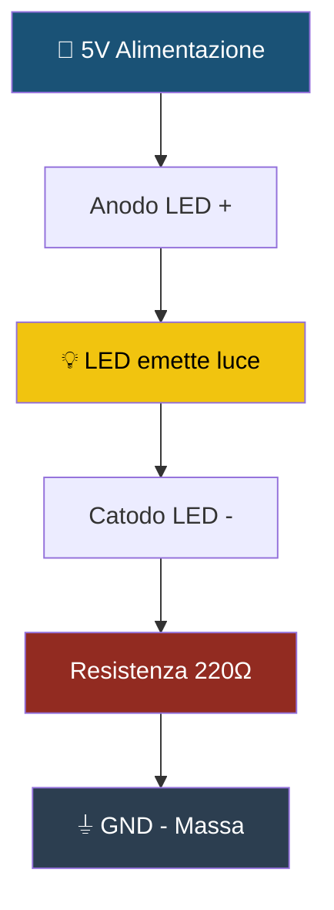
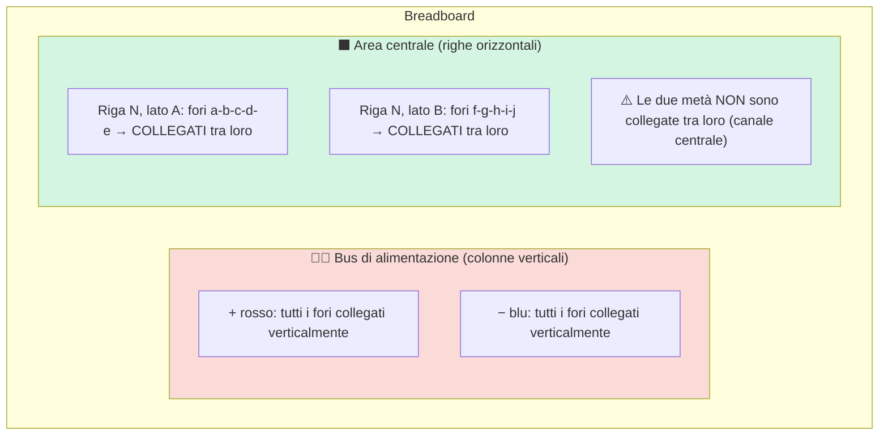
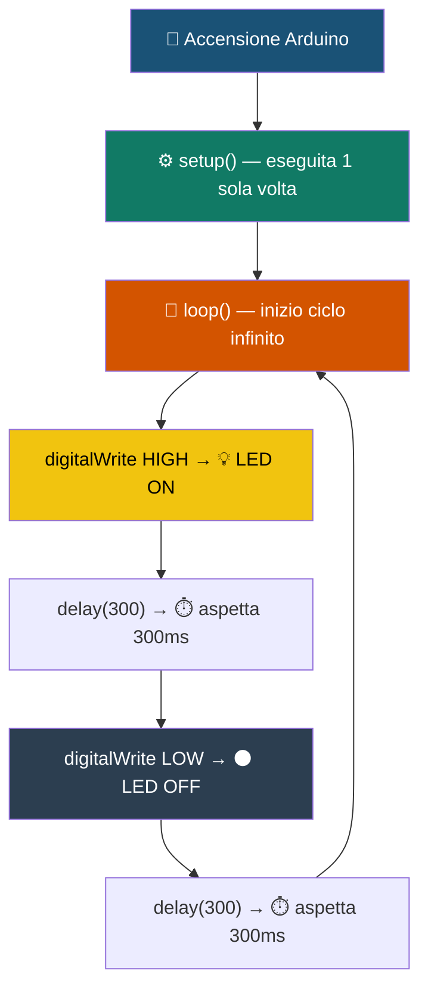
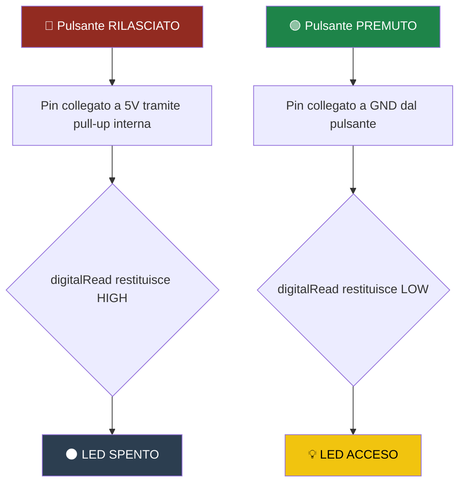

# Introduzione ai Circuiti con Tinkercad
## Dall'LED base ai circuiti interattivi

---

## 🎯 Obiettivo del Corso

Queste dispense ti guideranno nella costruzione di circuiti elettronici passo dopo passo, usando **Tinkercad** come ambiente di simulazione. Al termine dei 4 livelli sarai in grado di:

- Riconoscere e usare i componenti elettronici base
- Capire come proteggere correttamente i componenti (resistenze)
- Organizzare circuiti ordinati su breadboard
- Programmare un Arduino per controllare LED e pulsanti
- Leggere e comprendere codice Arduino riga per riga

> [!TIP]
> **Come usare queste dispense:** segui i livelli in ordine — ogni circuito si basa sul precedente. Prima di collegare i fili, leggi tutta la sezione *Collegamento passo per passo*. Gli spazi `[IMMAGINE]` verranno sostituiti con le foto dei circuiti reali.

---

## Indice

| Livello | Titolo | Difficoltà |
|---------|--------|------------|
| [Livello 1](#livello-1--circuito-base-led--resistenza) | LED + Resistenza | ⚡ Base |
| [Livello 2](#livello-2--uso-della-breadboard) | Uso della Breadboard | 🔵 Intermedio-Base |
| [Livello 3](#livello-3--led-lampeggiante-con-arduino) | LED Lampeggiante con Arduino | 🟠 Intermedio |
| [Livello 4](#livello-4--circuito-interattivo-pulsante) | Circuito Interattivo con Pulsante | 🟢 Avanzato Introduttivo |

---

# ⚡ Livello 1 — Circuito Base (LED + Resistenza)

**Difficoltà:** Base &nbsp;|&nbsp; **Obiettivo:** Accendere un LED in sicurezza

---

## 🔩 Componenti necessari

| Quantità | Componente | Scopo |
|----------|------------|-------|
| 1× | LED (qualsiasi colore) | Il componente che emette luce |
| 1× | Resistenza 220Ω o 330Ω | Protegge il LED da troppa corrente |
| — | Alimentazione 5V | Fornita da Arduino o da un alimentatore |
| — | Cavi jumper | Per collegare i componenti |

---

## 💡 Concetti chiave

### Cos'è un LED?

**LED** sta per *Light Emitting Diode* (Diodo a emissione di luce). Trasforma l'energia elettrica in luce e ha una **polarità precisa**:

- **Anodo (+)** → gamba **lunga** → collegalo al positivo (5V)
- **Catodo (−)** → gamba **corta** → collegalo al negativo (GND)

> [!WARNING]
> **Polarità del LED** — Il LED ha una direzione preferenziale: la corrente fluisce solo dall'anodo (+) al catodo (−). Se inserito al contrario non si accende, ma di solito non si danneggia. Con tensioni molto alte, però, potrebbe bruciarsi.

---

### Perché la resistenza è obbligatoria?

Un LED ha una resistenza interna bassissima. Senza una resistenza esterna, la corrente che lo attraversa sarebbe enorme e **il LED si brucerebbe in pochi istanti**.

> [!NOTE]
> **La Legge di Ohm:** `V = R × I`
>
> Con 5V di alimentazione e un LED che cade ~2V:
> ```
> R = (5V - 2V) / 0.02A = 150Ω minimo
> ```
> Valori di 220Ω o 330Ω sono sicuri: il LED è leggermente meno luminoso, ma dura molto di più!

---

### Diagramma del flusso di corrente



---

## 🔌 Collegamento passo per passo

1. Prendi il LED e individua l'**anodo** (gamba lunga) e il **catodo** (gamba corta).
2. Collega un cavo jumper dal **PIN 5V** di Arduino all'anodo (+) del LED.
3. Collega la **resistenza** (220Ω o 330Ω) tra il catodo (−) del LED e il GND.
4. Collega un cavo jumper dal **GND** di Arduino all'altro capo della resistenza.
5. Verifica che il circuito sia chiuso (ogni punto deve essere connesso).
6. Accendi l'alimentazione: il LED dovrebbe illuminarsi.

---

## 🖼️ Schema del circuito


*[Sostituire con l'immagine del circuito reale]*

---

## 🏁 Risultato atteso

Il LED si accende **stabilmente** e rimane acceso finché l'alimentazione è collegata. Non lampeggia — è un circuito statico.

---

> [!CAUTION]
> **Errori comuni al Livello 1**
>
> - ❌ **LED non si accende** → controlla la polarità (gamba lunga = anodo = positivo).
> - ❌ **LED si accende debolmente** → controlla che la resistenza sia 220Ω (bande: rosso-rosso-marrone).
> - ❌ **LED non si accende e si scalda** → il LED è inserito al contrario oppure manca la resistenza.
> - 🚫 **Non collegare mai il LED direttamente tra 5V e GND senza resistenza!**

---

# 🔵 Livello 2 — Uso della Breadboard

**Difficoltà:** Intermedio-Base &nbsp;|&nbsp; **Obiettivo:** Organizzare il circuito su breadboard

---

## 🔩 Componenti necessari

- 1× LED
- 1× Resistenza 220Ω o 330Ω
- 1× Breadboard
- Cavi jumper (rossi per +, neri per −, altri colori per il segnale)
- Alimentazione 5V (Arduino o alimentatore)

---

## 💡 Concetti chiave: la Breadboard

La breadboard è una **tavoletta forata** che permette di collegare componenti elettronici senza saldature. I fori sono collegati internamente secondo uno schema preciso.

### Struttura interna



> [!NOTE]
> **Come sono collegati i fori?**
>
> - **Colonne laterali (bus):** tutti i fori della stessa colonna sono collegati **verticalmente**. Colonna rossa = +5V, colonna blu = GND.
> - **Righe centrali:** i 5 fori di ogni riga (a,b,c,d,e) sono collegati **orizzontalmente**.
> - Il **canale centrale** separa le due metà: i lati A e B della stessa riga **NON** sono collegati!
> - I componenti a doppio pin (come i LED) vanno inseriti "a cavallo" del canale centrale.

---

## 🔌 Collegamento passo per passo

1. Posiziona la breadboard con le colonne di alimentazione ai lati.
2. Collega il **PIN 5V** di Arduino alla colonna **rossa (+)** con un cavo rosso.
3. Collega il **PIN GND** di Arduino alla colonna **blu (−)** con un cavo nero.
4. Inserisci il LED **a cavallo del canale centrale**: anodo (gamba lunga) in una riga sul lato A, catodo (gamba corta) sul lato B della stessa riga.
5. Collega l'**anodo** alla colonna rossa (+) con un cavo jumper.
6. Inserisci la **resistenza** tra il catodo del LED e una riga libera più in basso.
7. Collega quella riga libera alla colonna **blu (−)** con un cavo nero.
8. Accendi l'alimentazione: risultato identico al Livello 1, ma più ordinato!

---

## 🖼️ Schema del circuito


*[Sostituire con l'immagine del circuito reale]*

---

## 🏁 Risultato atteso

Il LED si accende come nel Livello 1. La differenza è nell'**organizzazione**: il circuito è su breadboard, modificabile senza saldature e pronto per essere espanso.

---

> [!TIP]
> **Buone abitudini sulla breadboard**
>
> - 🔴 Usa sempre cavi **rossi** per +5V e **neri** per GND.
> - ✂️ Tieni i cavi corti e ordinati: un circuito confuso è difficile da riparare.
> - 🔍 Prima di alimentare, segui il percorso come se fossi un elettrone: da +5V fino a GND.
> - 💻 In dubbio? Simula prima su Tinkercad, poi monta fisicamente.

> [!CAUTION]
> **Errori comuni al Livello 2**
>
> - ❌ **LED inserito sullo stesso lato del canale:** anodo e catodo devono essere su lati opposti (A e B).
> - ❌ **Bus di alimentazione invertiti:** controlla il segno + e − stampato sulla breadboard.
> - ❌ **Cavi non inseriti a fondo:** un contatto parziale causa comportamenti imprevedibili.

---

# 🟠 Livello 3 — LED Lampeggiante con Arduino

**Difficoltà:** Intermedio &nbsp;|&nbsp; **Obiettivo:** Controllare un LED via codice Arduino

---

## 🔩 Componenti necessari

- 1× Scheda Arduino Uno (o compatibile)
- 1× LED
- 1× Resistenza 220Ω
- 1× Breadboard
- Cavi jumper
- Cavo USB per collegare Arduino al computer

---

## 💡 Concetti chiave

### Arduino e i pin digitali

Arduino è un **microcontrollore**: un piccolo computer programmabile. I **pin digitali** (da 0 a 13) possono essere:

- **OUTPUT** → per controllare componenti (LED, motori, buzzer…)
- **INPUT** → per leggere sensori e pulsanti

> [!NOTE]
> **Il pin 13 è speciale:** ha già una resistenza integrata nella scheda e un LED SMD sulla board stessa. È il pin più comodo per i test iniziali.

---

### Come funziona un programma Arduino?

Un programma Arduino (chiamato **sketch**) ha sempre due funzioni obbligatorie:



---

## 🔌 Collegamento passo per passo

1. Collega Arduino al computer tramite cavo USB.
2. Collega il **PIN GND** di Arduino alla colonna blu (−) della breadboard.
3. Collega il **PIN 13** di Arduino all'anodo del LED tramite un cavo jumper.
4. Inserisci la **resistenza** tra il catodo del LED e la colonna GND.
5. Percorso: `PIN 13 → Anodo → LED → Catodo → Resistenza → GND`.
6. Apri l'IDE di Arduino (o Tinkercad), scrivi il codice e caricalo sulla scheda.

---

## 🖼️ Schema del circuito


*[Sostituire con l'immagine del circuito reale]*

---

## 💻 Il Codice

```cpp
// Definiamo i pin
int led = 13;

void setup() {
  pinMode(led, OUTPUT);  // Configura il pin 13 come OUTPUT
}

void loop() {
  // --- INIZIO SEQUENZA LAMPEGGIO ---
  digitalWrite(led, HIGH); // 1. Accendi il LED (pin 13 → 5V)
  delay(300);              // 2. Aspetta 300 millisecondi
  digitalWrite(led, LOW);  // 3. Spegni il LED (pin 13 → 0V)
  delay(300);              // 4. Aspetta 300 millisecondi
  // --- FINE SEQUENZA: loop riparte dall'inizio ---
}
```

---

### Spiegazione riga per riga

| Riga | Codice | Spiegazione |
|------|--------|-------------|
| 1 | `int led = 13;` | Dichiara una variabile intera `led` con valore 13 (il numero del pin). Usare una variabile rende il codice modificabile facilmente. |
| 2 | `void setup() { }` | Funzione eseguita **una sola volta** all'avvio. Qui si configurano i pin. |
| 3 | `pinMode(led, OUTPUT);` | Configura il pin 13 come **OUTPUT**: Arduino lo userà per inviare segnali. ⚠️ Senza questa riga il LED non funziona! |
| 4 | `void loop() { }` | Funzione eseguita **in ciclo infinito** dopo il setup. Qui va la logica principale. |
| 5 | `digitalWrite(led, HIGH);` | Mette il pin 13 a **5V** → il LED si **accende**. |
| 6 | `delay(300);` | Blocca il programma per **300 millisecondi** (0,3 secondi). |
| 7 | `digitalWrite(led, LOW);` | Mette il pin 13 a **0V** → il LED si **spegne**. |
| 8 | `delay(300);` | Aspetta altri 300ms. Poi `loop()` riparte dall'inizio. |

---

> [!WARNING]
> **`pinMode()` nel `setup()` è OBBLIGATORIO!**
> Il codice originale di queste dispense mancava della riga `pinMode(led, OUTPUT)` nel `setup()`. Senza questa istruzione il pin non è configurato correttamente e il LED potrebbe non accendersi o avere comportamenti imprevedibili.

---

> [!TIP]
> **Sperimenta con i valori!**
>
> - `delay(100)` → lampeggio velocissimo
> - `delay(1000)` → lampeggio lento (1 secondo)
> - `delay(100)` ON + `delay(900)` OFF → effetto "flash"
> - Aggiungi un secondo LED su un altro pin e fallo lampeggiare sfasato per un effetto alternato!

---

## 🏁 Risultato atteso

Il LED lampeggia a intervalli regolari: **300ms acceso + 300ms spento**. Modificando i valori di `delay()` puoi cambiare liberamente la velocità.

---

> [!CAUTION]
> **Errori comuni al Livello 3**
>
> - ❌ **LED non si accende** → hai dimenticato `pinMode(led, OUTPUT)` nel `setup()`?
> - ❌ **Il codice non si carica** → verifica scheda (Strumenti → Scheda → Arduino Uno) e porta COM corretta.
> - ❌ **LED sempre acceso** → controlla che entrambe le righe `delay()` siano presenti e > 0.
> - ❌ **Errore "was not declared in this scope"** → la variabile `led` deve essere dichiarata **fuori** da `setup()` e `loop()`.

---

# 🟢 Livello 4 — Circuito Interattivo (Pulsante)

**Difficoltà:** Avanzato Introduttivo &nbsp;|&nbsp; **Obiettivo:** Controllare il LED con un pulsante

---

## 🔩 Componenti necessari

- 1× Scheda Arduino Uno
- 1× LED
- 1× Resistenza 220Ω (per il LED)
- 1× Pulsante (push-button a 4 pin)
- 1× Breadboard
- Cavi jumper
- Cavo USB

---

> [!NOTE]
> **Il pulsante ha 4 pin?!**
>
> I pulsanti standard hanno 4 pin disposti agli angoli di un quadrato.
> Ecco come sono fatti internamente:
>
> ```
>        FRONTE
>         ___
>   A ---|   |--- C
>        | ○ |        ← il dischetto centrale è il meccanismo di contatto
>   B ---|___|--- D
>
>   Lato SINISTRO    Lato DESTRO
> ```
>
> **Connessioni interne (sempre attive, senza premere):**
> - **A** e **B** sono **già collegati** tra loro (stesso lato sinistro)
> - **C** e **D** sono **già collegati** tra loro (stesso lato destro)
>
> **Cosa succede quando premi?**
>
> ```
>        PREMUTO
>         ___
>   A ---|   |--- C
>        |===|        ← il ponte si chiude: A/B ora toccano C/D
>   B ---|___|--- D
>
>   └─────────────┘
>     tutto collegato
> ```
>
> Il pulsante va inserito **a cavallo del canale centrale** della breadboard,
> così i due lati (A/B e C/D) restano separati finché non premi:
>
> ```
>   Breadboard (vista dall'alto)
>
>   colonne:  a  b  c  d  e | f  g  h  i  j
>                            |
>   riga 5:               [A]|[C]
>                            |    ← canale centrale
>   riga 7:               [B]|[D]
>                            |
>   ```
>
> - Colleghi il PIN 2 di Arduino al punto **A** (o **B**, è uguale)
> - Colleghi il punto **D** (o **C**) al **GND**
> - Finché non premi: PIN 2 → pull-up → **HIGH**
> - Quando premi: PIN 2 → A → ponte → C/D → **GND** → **LOW**


---

## 💡 Concetti chiave

### INPUT_PULLUP: la resistenza interna di Arduino

Quando un pin è configurato come `INPUT`, senza un segnale definito il suo stato **"galleggia"** (floating): può leggere valori casuali. Per evitarlo si usa una **resistenza di pull-up**, che tiene il pin a 5V quando il pulsante non è premuto.

Con `INPUT_PULLUP` la logica è **invertita**:

| Stato pulsante | `digitalRead()` restituisce | LED |
|---|---|---|
| 🔴 Non premuto | `HIGH` (pin collegato a 5V via pull-up) | SPENTO |
| 🟢 Premuto | `LOW` (pin collegato a GND dal pulsante) | ACCESO |

---

### Diagramma logico



---

## 🔌 Collegamento passo per passo

1. Inserisci il **pulsante a cavallo del canale centrale** della breadboard (es. righe 5-7, colonne e-f).
2. Collega un lato del pulsante (colonna d, riga 5) al **PIN 2** di Arduino.
3. Collega lo **stesso lato** del pulsante (colonna d, riga 7) al **GND** di Arduino.
   *(Quando premi, il PIN 2 viene collegato a GND attraverso il pulsante.)*
4. In una zona separata della breadboard, inserisci il **LED** (es. riga 15).
5. Collega il **PIN 13** di Arduino all'anodo del LED tramite **resistenza 220Ω**.
6. Collega il catodo del LED al **GND**.
7. Carica il codice e testa: premi il pulsante per accendere il LED.

---

## 🖼️ Schema del circuito


*[Sostituire con l'immagine del circuito reale]*

---

## 💻 Il Codice

```cpp
const int pinPulsante = 2;   // Il pulsante è collegato al pin digitale 2
const int pinLED = 13;       // Il LED è collegato al pin 13

void setup() {
  pinMode(pinPulsante, INPUT_PULLUP); // Pin 2 come INPUT con pull-up interna attiva
  pinMode(pinLED, OUTPUT);            // Pin 13 come OUTPUT
}

void loop() {
  int statoPulsante = digitalRead(pinPulsante); // Legge lo stato del pin 2

  // Con INPUT_PULLUP: LOW = premuto, HIGH = non premuto
  if (statoPulsante == LOW) {
    digitalWrite(pinLED, HIGH); // Pulsante premuto → LED ACCESO
  } else {
    digitalWrite(pinLED, LOW);  // Pulsante rilasciato → LED SPENTO
  }
}
```

---

### Spiegazione riga per riga

| Riga | Codice | Spiegazione |
|------|--------|-------------|
| 1 | `const int pinPulsante = 2;` | Costante: il pulsante è sul pin 2. `const` significa che il valore non cambierà mai. |
| 2 | `const int pinLED = 13;` | Costante: il LED è sul pin 13. Usare costanti rende il codice più leggibile e modificabile. |
| 3 | `pinMode(pinPulsante, INPUT_PULLUP);` | Configura il pin 2 come INPUT **con resistenza pull-up interna**: mantiene il pin a HIGH quando il pulsante non è premuto. |
| 4 | `pinMode(pinLED, OUTPUT);` | Configura il pin 13 come OUTPUT: Arduino invierà segnali su questo pin. |
| 5 | `int statoPulsante = digitalRead(pinPulsante);` | Legge lo stato del pin 2: restituisce `HIGH` (1) o `LOW` (0) e lo salva nella variabile. |
| 6 | `if (statoPulsante == LOW)` | **SE** il pulsante è premuto (LOW con pull-up = collegato a GND)… |
| 7 | `digitalWrite(pinLED, HIGH);` | …**ALLORA** accendi il LED (pin 13 a 5V). |
| 8 | `} else {` | **ALTRIMENTI** (pulsante non premuto, stato HIGH)… |
| 9 | `digitalWrite(pinLED, LOW);` | …spegni il LED (pin 13 a 0V). |
| 10 | *(fine loop)* | Arduino rilegge immediatamente il pulsante e ricomincia. |

---

### Tabella della verità

| Pulsante | `digitalRead()` | `if (stato == LOW)` | LED |
|----------|-----------------|---------------------|-----|
| 🔴 Non premuto | `HIGH` (1) | `false` | ⚫ SPENTO |
| 🟢 Premuto | `LOW` (0) | `true` | 🟡 ACCESO |

---

## 🏁 Risultato atteso

Il LED si accende **solo mentre tieni premuto il pulsante**. Appena lo rilasci, il LED si spegne. Questo dimostra la lettura in tempo reale di un input digitale.

---

> [!TIP]
> **Estensioni possibili**
>
> - **Toggle:** ogni pressione cambia lo stato del LED (acceso/spento) invece di tenerlo acceso solo mentre premi.
> - **Contatore:** usa `Serial.println()` per stampare nel Monitor Seriale quante volte è stato premuto il pulsante.
> - **Più pulsanti:** collega un secondo pulsante al pin 3 e assegnagli un'altra funzione.

---

> [!CAUTION]
> **Errori comuni al Livello 4**
>
> - ❌ **LED sempre acceso o sempre spento** → ricorda: con pull-up la logica è invertita. `LOW` = premuto, `HIGH` = non premuto.
> - ❌ **Pulsante non risponde** → verifica che sia inserito correttamente a cavallo del canale centrale.
> - ❌ **Letture "ballerine" (bouncing)** → un pulsante può generare più segnali in una singola pressione. Si risolve con `delay(50)` dopo la lettura, oppure con la libreria debounce.
> - ❌ **Pin floating** → senza `INPUT_PULLUP` il pin legge valori casuali. Usa sempre `INPUT_PULLUP` o una resistenza esterna da 10kΩ.

---

# 📋 Riepilogo — Competenze acquisite

| Livello | Circuito | Concetto chiave | Novità introdotta |
|---------|----------|-----------------|-------------------|
| ⚡ 1 — Base | LED + Resistenza | Legge di Ohm, protezione LED | Corrente, tensione, polarità |
| 🔵 2 — Int. Base | Breadboard | Struttura breadboard | Modularità, bus alimentazione |
| 🟠 3 — Intermedio | LED Lampeggiante | Output digitale, timing | Arduino, `setup()`/`loop()`, `delay()` |
| 🟢 4 — Avanzato | LED + Pulsante | Input digitale, if-else | `digitalRead()`, `INPUT_PULLUP` |

---

## 📖 Glossario rapido

| Termine | Definizione |
|---------|-------------|
| **LED** | Light Emitting Diode — emette luce quando attraversato da corrente. |
| **Resistenza (Ω)** | Limita la corrente nel circuito. Valore leggibile dal codice a colori. |
| **Breadboard** | Scheda forata per circuiti senza saldature. I fori sono collegati internamente. |
| **Arduino** | Microcontrollore programmabile con pin digitali e analogici. |
| **`pinMode()`** | Configura un pin come `INPUT` o `OUTPUT` nel `setup()`. |
| **`digitalWrite()`** | Manda `HIGH` (5V) o `LOW` (0V) su un pin OUTPUT. |
| **`digitalRead()`** | Legge lo stato (`HIGH` o `LOW`) di un pin INPUT. |
| **`delay(ms)`** | Mette in pausa il programma per il numero di millisecondi specificato. |
| **`INPUT_PULLUP`** | Modalità input con resistenza pull-up interna attiva (pin stabile a HIGH a riposo). |
| **GND** | Ground — massa, 0V, il riferimento negativo del circuito. |
| **Bouncing** | Rimbalzo elettrico del pulsante: genera più segnali in una singola pressione. |

---

# 🚀 Prossimi passi

Hai completato i 4 livelli base. Ecco cosa esplorare adesso:

1. **LED in sequenza** — collega 5 LED su pin diversi e accendili uno alla volta (effetto "inseguimento").
2. **Sensore di luce (LDR)** — leggi un sensore analogico con `analogRead()` e varia la luminosità del LED.
3. **Sensore di temperatura (DHT11)** — visualizza temperatura e umidità nel Monitor Seriale.
4. **Servo motore** — controlla l'angolo di rotazione con la libreria `Servo.h`.
5. **Display LCD** — mostra testo su uno schermo 16×2 con la libreria `LiquidCrystal`.

> [!TIP]
> **Risorse utili**
>
> - 🌐 [Tinkercad](https://www.tinkercad.com) — simula circuiti gratis nel browser, con Arduino incluso.
> - 📚 [Arduino Reference](https://docs.arduino.cc/language-reference) — documentazione ufficiale di tutte le funzioni.
> - 🛠️ [Arduino Project Hub](https://create.arduino.cc/projecthub) — migliaia di progetti con tutorial.
> - 💬 [r/arduino](https://www.reddit.com/r/arduino) — community attiva per domande e ispirazione.

---

*Dispense Arduino — Introduzione ai Circuiti con Tinkercad*
