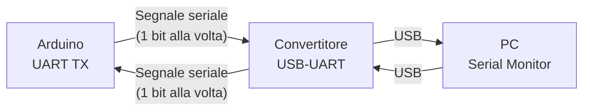
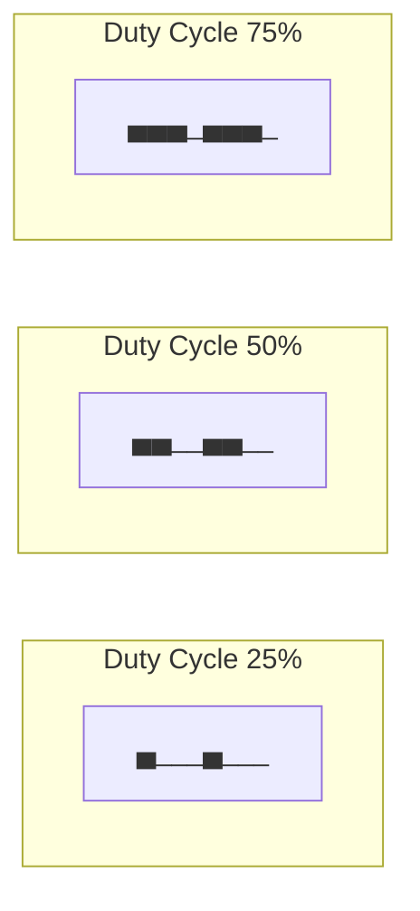
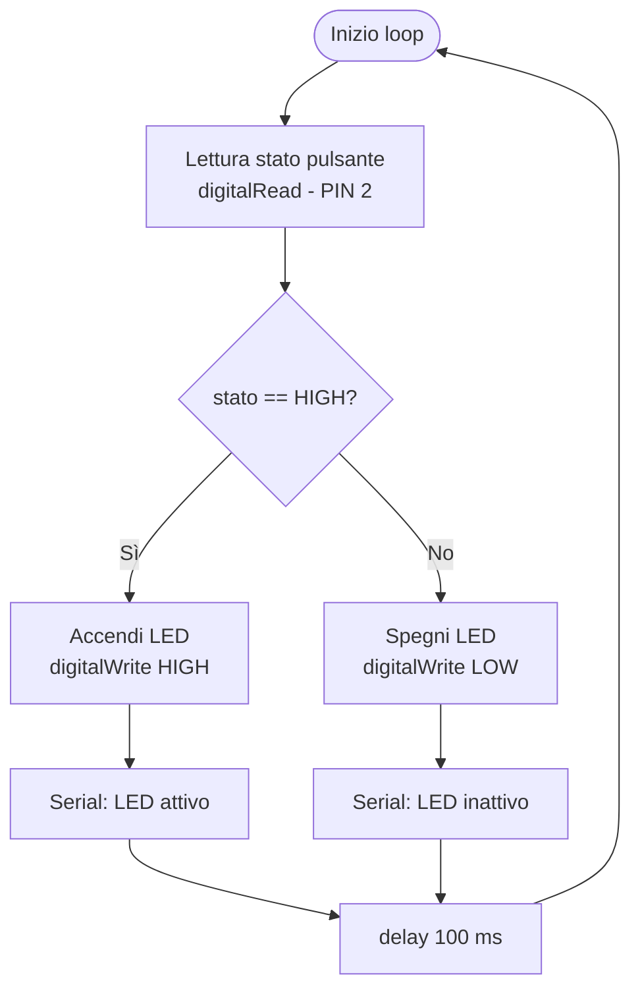

# Introduzione alla Programmazione C++ per Sistemi Arduino

**Versione:** 1.0  
**Ambito:** Programmazione embedded, microcontrollori AVR/ARM  
**Livello:** Introduttivo — Intermedio

---

## Indice

1. [Introduzione](#1-introduzione)
2. [Architettura di un Programma Arduino](#2-architettura-di-un-programma-arduino)
   - 2.1 [Funzione `setup()`](#21-funzione-setup)
   - 2.2 [Funzione `loop()`](#22-funzione-loop)
   - 2.3 [Flusso di esecuzione](#23-flusso-di-esecuzione)
3. [Tipi di Dato e Variabili](#3-tipi-di-dato-e-variabili)
4. [Operatori](#4-operatori)
   - 4.1 [Operatori Aritmetici](#41-operatori-aritmetici)
   - 4.2 [Operatori di Confronto](#42-operatori-di-confronto)
5. [Strutture Condizionali](#5-strutture-condizionali)
6. [Cicli Iterativi](#6-cicli-iterativi)
7. [Funzioni](#7-funzioni)
8. [Comunicazione Seriale](#8-comunicazione-seriale)
   - 8.1 [Protocollo UART](#81-protocollo-uart)
   - 8.2 [Oggetto `Serial`](#82-oggetto-serial)
   - 8.3 [Baud Rate](#83-baud-rate)
   - 8.4 [Monitor Seriale](#84-monitor-seriale)
9. [Input e Output Digitali](#9-input-e-output-digitali)
   - 9.1 [Controllo di un LED](#91-controllo-di-un-led)
   - 9.2 [Lettura di un Pulsante](#92-lettura-di-un-pulsante)
10. [Ingressi Analogici e Conversione ADC](#10-ingressi-analogici-e-conversione-adc)
11. [PWM (Pulse Width Modulation)](#11-pwm-pulse-width-modulation)
12. [Strutture Dati: Array e Stringhe](#12-strutture-dati-array-e-stringhe)
13. [Programmazione Orientata agli Oggetti](#13-programmazione-orientata-agli-oggetti)
14. [Librerie](#14-librerie)
15. [Esempio Applicativo Completo](#15-esempio-applicativo-completo)
16. [Errori Comuni e Buone Pratiche](#16-errori-comuni-e-buone-pratiche)
17. [Differenze tra Arduino C++ e C++ Standard](#17-differenze-tra-arduino-c-e-c-standard)
18. [Riferimenti e Risorse Ufficiali](#18-riferimenti-e-risorse-ufficiali)
19. [Glossario dei Termini Tecnici](#19-glossario-dei-termini-tecnici)

---

## 1. Introduzione

Arduino è una piattaforma hardware e software open-source progettata per lo sviluppo rapido di sistemi embedded. Il termine **embedded** (incorporato) indica sistemi computazionali integrati in dispositivi fisici, progettati per eseguire funzioni specifiche con risorse hardware limitate.

L'ambiente di sviluppo Arduino (Arduino IDE) adotta una variante semplificata del linguaggio C++. Il codice sorgente prodotto dallo sviluppatore attraversa le seguenti fasi prima dell'esecuzione:

1. **Compilazione:** il codice C++ viene tradotto in linguaggio macchina binario dal compilatore `avr-gcc` (o equivalente per architetture ARM);
2. **Linking:** le librerie hardware vengono collegate al programma compilato;
3. **Upload:** il binario viene trasferito sulla memoria flash del microcontrollore tramite un programmatore seriale (tipicamente integrato nella scheda);
4. **Esecuzione:** il microcontrollore esegue direttamente il codice in linguaggio macchina.

> [!NOTE]
> Un **microcontrollore** è un circuito integrato che incorpora in un unico chip un processore (CPU), memoria volatile (RAM), memoria non volatile (Flash/EEPROM) e periferiche di input/output. Differisce da un microprocessore generico per la sua natura autosufficiente e l'ottimizzazione per applicazioni embedded.

Le librerie hardware Arduino forniscono un'interfaccia software (API — *Application Programming Interface*) per l'accesso semplificato a:

- pin digitali e analogici;
- convertitori analogico/digitale (ADC);
- comunicazione seriale (UART, SPI, I²C);
- sensori, attuatori e moduli esterni.

---

## 2. Architettura di un Programma Arduino

Un programma Arduino è denominato **sketch**. Ogni sketch deve obbligatoriamente definire due funzioni principali: `setup()` e `loop()`.

```cpp
void setup() {
    // Inizializzazione: eseguita una sola volta all'avvio
}

void loop() {
    // Ciclo principale: eseguito ripetutamente
}
```

> [!NOTE]
> La funzione `main()` del C++ standard è presente ma nascosta nell'infrastruttura di Arduino. Internamente, `main()` invoca `setup()` una volta, quindi chiama `loop()` in un ciclo infinito. Questa astrazione semplifica lo sviluppo per utenti non esperti di programmazione sistemi.

### 2.1 Funzione `setup()`

La funzione `setup()` viene eseguita **una sola volta** immediatamente dopo l'avvio del microcontrollore o a seguito di un reset hardware. Il suo scopo è l'inizializzazione del sistema.

Operazioni tipicamente eseguite in `setup()`:

- configurazione della direzione dei pin (INPUT/OUTPUT);
- inizializzazione di periferiche hardware;
- avvio della comunicazione seriale;
- configurazione di librerie e moduli esterni.

```cpp
void setup() {
    pinMode(13, OUTPUT);       // Configura il pin 13 come uscita digitale
    Serial.begin(9600);        // Inizializza la comunicazione seriale a 9600 baud
}
```

### 2.2 Funzione `loop()`

La funzione `loop()` viene eseguita ciclicamente e indefinitamente finché il microcontrollore rimane alimentato. Costituisce il ciclo principale di controllo del sistema.

```cpp
void loop() {
    digitalWrite(13, HIGH);    // Porta il pin 13 a livello logico alto (3.3V o 5V)
    delay(1000);               // Attesa di 1000 millisecondi

    digitalWrite(13, LOW);     // Porta il pin 13 a livello logico basso (0V)
    delay(1000);               // Attesa di 1000 millisecondi
}
```

Il programma precedente genera un segnale periodico con periodo di 2 secondi sul pin 13, producendo il lampeggio del LED integrato presente sulla maggior parte delle schede Arduino.

### 2.3 Flusso di esecuzione

Il diagramma seguente illustra il ciclo di vita di un programma Arduino dall'accensione all'esecuzione continua.

```mermaid
flowchart TD
    A([Alimentazione / Reset]) --> B[Inizializzazione hardware di sistema]
    B --> C[Esecuzione di setup()]
    C --> D[Esecuzione di loop()]
    D --> E{Alimentazione\npresente?}
    E -- Sì --> D
    E -- No --> F([Arresto])
```

---

## 3. Tipi di Dato e Variabili

Una **variabile** è un'area di memoria RAM identificata da un nome simbolico, nella quale è possibile memorizzare un valore di un determinato tipo. Il tipo di dato determina la dimensione in memoria e l'insieme dei valori rappresentabili.

La tabella seguente riassume i tipi primitivi più utilizzati in Arduino:

| Tipo     | Dimensione (Arduino Uno) | Intervallo                        | Utilizzo tipico                    |
|----------|--------------------------|-----------------------------------|------------------------------------|
| `int`    | 2 byte (16 bit)          | -32.768 → 32.767                  | Contatori, valori interi           |
| `long`   | 4 byte (32 bit)          | -2.147.483.648 → 2.147.483.647    | Contatori estesi, timestamp        |
| `float`  | 4 byte (32 bit)          | ±3.4 × 10⁻³⁸ → ±3.4 × 10³⁸      | Misure fisiche, calcoli in virgola mobile |
| `char`   | 1 byte (8 bit)           | -128 → 127                        | Caratteri ASCII, byte              |
| `bool`   | 1 byte                   | `true` / `false`                  | Valori logici, flag di stato       |
| `byte`   | 1 byte (8 bit)           | 0 → 255                           | Dati binari, registri hardware     |

> [!WARNING]
> Su Arduino Uno (microcontrollore ATmega328P), il tipo `int` occupa **2 byte** (16 bit), a differenza dei sistemi a 32 o 64 bit dove tipicamente occupa 4 byte. Questa differenza può causare overflow aritmetici in codice non progettato specificamente per la piattaforma AVR.

Esempi di dichiarazione e inizializzazione:

```cpp
int contatore = 0;
float temperatura = 23.5;
char codice = 'A';
bool statoLed = false;
```

---

## 4. Operatori

### 4.1 Operatori Aritmetici

| Operatore | Operazione              | Esempio          | Risultato |
|-----------|-------------------------|------------------|-----------|
| `+`       | Somma                   | `3 + 4`          | `7`       |
| `-`       | Sottrazione             | `10 - 3`         | `7`       |
| `*`       | Moltiplicazione         | `3 * 4`          | `12`      |
| `/`       | Divisione               | `10 / 3`         | `3` (intera) |
| `%`       | Resto della divisione   | `10 % 3`         | `1`       |

> [!NOTE]
> L'operatore `/` applicato a due operandi interi produce una **divisione intera** (troncamento verso zero). Per ottenere un risultato in virgola mobile, almeno uno degli operandi deve essere di tipo `float`: `10.0 / 3` produce `3.333...`.

### 4.2 Operatori di Confronto

Gli operatori di confronto restituiscono un valore booleano (`true` o `false`) e sono utilizzati nelle strutture condizionali e nei cicli.

| Operatore | Significato        |
|-----------|--------------------|
| `==`      | Uguale             |
| `!=`      | Diverso            |
| `>`       | Maggiore           |
| `<`       | Minore             |
| `>=`      | Maggiore o uguale  |
| `<=`      | Minore o uguale    |

---

## 5. Strutture Condizionali

Le strutture condizionali permettono di alterare il flusso di esecuzione del programma in funzione del valore di una condizione logica.

**Costrutto `if`:**

```cpp
if (temperatura > 30) {
    Serial.println("Soglia termica superata");
}
```

**Costrutto `if / else`:**

```cpp
if (temperatura > 30) {
    Serial.println("Temperatura elevata");
} else {
    Serial.println("Temperatura nella norma");
}
```

**Costrutto `if / else if / else`** (per condizioni mutuamente esclusive multiple):

```cpp
if (temperatura > 40) {
    Serial.println("Allarme: temperatura critica");
} else if (temperatura > 30) {
    Serial.println("Avviso: temperatura elevata");
} else {
    Serial.println("Temperatura nominale");
}
```

---

## 6. Cicli Iterativi

I cicli consentono di ripetere un blocco di istruzioni per un numero definito o indefinito di iterazioni.

**Ciclo `for`** — utilizzo preferibile quando il numero di iterazioni è noto a priori:

```cpp
for (int i = 0; i < 5; i++) {
    Serial.println(i);    // Stampa i valori 0, 1, 2, 3, 4
}
```

La sintassi del ciclo `for` è strutturata in tre sezioni separate da punto e virgola:
1. **Inizializzazione** (`int i = 0`): eseguita una sola volta prima del ciclo;
2. **Condizione** (`i < 5`): verificata prima di ogni iterazione; se falsa, il ciclo termina;
3. **Aggiornamento** (`i++`): eseguito al termine di ogni iterazione.

**Ciclo `while`** — utilizzo preferibile quando la condizione di terminazione non è basata su un contatore:

```cpp
while (digitalRead(2) == LOW) {
    // Attende finché il pin 2 è a livello logico basso
}
```

> [!CAUTION]
> Un ciclo con condizione permanentemente vera (`while (true)`) blocca indefinitamente l'esecuzione nella funzione corrente. Nella funzione `loop()` questo comportamento è accettabile e intenzionale; all'interno di `setup()` o di funzioni ausiliarie, può impedire il completamento dell'inizializzazione del sistema.

---

## 7. Funzioni

Le funzioni consentono di modularizzare il codice, migliorandone la leggibilità, la manutenibilità e la riusabilità.

**Definizione di una funzione senza valore di ritorno:**

```cpp
void accendiLed(int pin) {
    digitalWrite(pin, HIGH);
}
```

**Definizione di una funzione con valore di ritorno:**

```cpp
float celsiusToFahrenheit(float celsius) {
    return celsius * 1.8 + 32.0;
}
```

**Invocazione:**

```cpp
accendiLed(13);
float tempF = celsiusToFahrenheit(25.0);
```

Il diagramma seguente illustra il flusso di controllo durante la chiamata a funzione:

```mermaid
sequenceDiagram
    participant loop as loop()
    participant fn as accendiLed(pin)
    participant hw as Hardware GPIO

    loop ->> fn: chiamata con parametro pin = 13
    fn ->> hw: digitalWrite(13, HIGH)
    hw -->> fn: esecuzione completata
    fn -->> loop: ritorno (void)
```

---

## 8. Comunicazione Seriale

### 8.1 Protocollo UART

La **porta seriale** è un'interfaccia di comunicazione digitale che trasmette dati **un bit alla volta** in sequenza temporale, su un singolo conduttore per direzione. Arduino implementa il protocollo **UART** (*Universal Asynchronous Receiver/Transmitter* — Ricevitore/Trasmettitore Universale Asincrono), uno standard di comunicazione seriale asincrona ampiamente diffuso in sistemi embedded.

Il termine **asincrono** indica che la sincronizzazione tra trasmettitore e ricevitore non avviene tramite un segnale di clock condiviso, bensì attraverso la definizione preventiva di parametri comuni (baud rate, formato del frame).

La comunicazione seriale Arduino supporta i seguenti scenari:

- collegamento con PC tramite cavo USB (convertitore USB-UART integrato);
- comunicazione con altri microcontrollori;
- interfacciamento con moduli esterni (Bluetooth, GPS, Wi-Fi, sensori seriali).



### 8.2 Oggetto `Serial`

In Arduino, `Serial` è un oggetto della libreria hardware che gestisce la comunicazione UART. Un **oggetto** è un'istanza di una classe che incapsula dati e funzionalità correlate (si veda la sezione [Programmazione Orientata agli Oggetti](#13-programmazione-orientata-agli-oggetti)).

I metodi principali dell'oggetto `Serial`:

| Metodo              | Descrizione                                              |
|---------------------|----------------------------------------------------------|
| `Serial.begin(baud)`| Inizializza la comunicazione al baud rate specificato    |
| `Serial.print(val)` | Trasmette un valore senza ritorno a capo                 |
| `Serial.println(val)`| Trasmette un valore con ritorno a capo finale (`\r\n`) |
| `Serial.available()`| Restituisce il numero di byte disponibili in ricezione   |
| `Serial.read()`     | Legge un byte dal buffer di ricezione                    |

### 8.3 Baud Rate

Il **baud rate** è la velocità di trasmissione, espressa in numero di simboli (bit) trasmessi per secondo (simbolo/s, convenzionalmente indicato come "baud" o "bps" per segnali binari).

La funzione `Serial.begin()` configura l'hardware UART del microcontrollore specificando:

- la velocità di trasmissione (baud rate);
- il formato del frame seriale (di default: 8 bit dati, nessuna parità, 1 bit di stop — notazione "8N1").

```cpp
Serial.begin(9600);    // Inizializzazione a 9600 bit/s
```

> [!IMPORTANT]
> Il baud rate configurato su Arduino **deve coincidere** con quello impostato nel Serial Monitor dell'IDE. Una mancata corrispondenza produce la corruzione dei dati ricevuti, che appariranno come sequenze di caratteri incomprensibili.

La tabella seguente riporta i baud rate più comunemente utilizzati e il relativo ambito di applicazione:

| Baud Rate | Utilizzo                                          |
|-----------|---------------------------------------------------|
| 9600      | Comunicazioni standard, massima compatibilità     |
| 19200     | Comunicazioni a velocità moderata                 |
| 57600     | Trasferimento dati accelerato                     |
| 115200    | Alta velocità, debug intensivo                    |

### 8.4 Monitor Seriale

Il **Serial Monitor** è uno strumento integrato nell'Arduino IDE che consente di:

- visualizzare i dati trasmessi dalla scheda verso il PC;
- inviare comandi testuali dalla tastiera verso Arduino;
- effettuare il debug del firmware in fase di sviluppo.

> [!TIP]
> Il debug seriale è la tecnica di diagnostica più diffusa nello sviluppo embedded. In assenza di un debugger hardware dedicato (come JTAG o debugWIRE), la trasmissione di messaggi di stato tramite porta seriale rappresenta il metodo principale per verificare il comportamento del firmware a runtime.

Esempio di utilizzo per il debug di variabili:

```cpp
void setup() {
    Serial.begin(9600);
}

void loop() {
    int lettura = analogRead(A0);
    Serial.print("Valore ADC: ");
    Serial.println(lettura);
    delay(500);
}
```

---

## 9. Input e Output Digitali

I pin digitali di Arduino operano in logica binaria: il livello logico **HIGH** corrisponde alla tensione di alimentazione (5 V su Arduino Uno, 3.3 V su alcune varianti), mentre **LOW** corrisponde a 0 V (massa).

La funzione `pinMode()` configura la direzione elettrica di un pin:

```cpp
pinMode(13, OUTPUT);    // Pin 13 configurato come uscita
pinMode(2, INPUT);      // Pin 2 configurato come ingresso
```

> **Nota tecnica**
> Per gli ingressi digitali collegati a pulsanti o interruttori, è consigliabile utilizzare la modalità `INPUT_PULLUP`, che attiva la resistenza di pull-up interna del microcontrollore. Questa configurazione garantisce un livello logico definito (HIGH) quando il pulsante è aperto, evitando lo stato flottante (indeterminato) del pin.

### 9.1 Controllo di un LED

```cpp
digitalWrite(13, HIGH);    // Accensione: porta il pin a livello HIGH
digitalWrite(13, LOW);     // Spegnimento: porta il pin a livello LOW
```

### 9.2 Lettura di un Pulsante

```cpp
int stato = digitalRead(2);    // Lettura del livello logico sul pin 2

if (stato == HIGH) {
    Serial.println("Pulsante premuto");
}
```

---

## 10. Ingressi Analogici e Conversione ADC

I segnali analogici, a differenza di quelli digitali, possono assumere valori continui in un determinato intervallo di tensione. Arduino integra un **convertitore ADC** (*Analog-to-Digital Converter* — Convertitore Analogico-Digitale), un circuito che campiona periodicamente una tensione analogica e la converte in una rappresentazione numerica digitale.

Su Arduino Uno, l'ADC ha una risoluzione di **10 bit**, consentendo la rappresentazione di 2¹⁰ = 1024 livelli discreti. Il risultato della conversione è un intero nell'intervallo [0, 1023], proporzionale alla tensione misurata rispetto alla tensione di riferimento (tipicamente 5 V):

```
Tensione ≈ (lettura / 1023) × V_ref
```

```cpp
int valore = analogRead(A0);    // Lettura del pin analogico A0
```

---

## 11. PWM (Pulse Width Modulation)

Il **PWM** (*Pulse Width Modulation* — Modulazione di Larghezza di Impulso) è una tecnica che permette di simulare un segnale analogico continuo mediante una sequenza di impulsi digitali. La grandezza controllata è il **duty cycle**: la frazione del periodo in cui il segnale è a livello HIGH.

Un duty cycle del 50% (segnale alto per metà periodo) corrisponde a una tensione media pari alla metà della tensione di alimentazione.



La funzione `analogWrite()` genera un segnale PWM su un pin abilitato (contrassegnato con il simbolo `~` sulle schede Arduino):

```cpp
analogWrite(9, 128);    // Duty cycle ~50% sul pin 9 (128/255 ≈ 50%)
```

Il secondo parametro accetta valori nell'intervallo [0, 255]:

- `0` corrisponde a un duty cycle dello 0% (segnale costantemente LOW);
- `255` corrisponde a un duty cycle del 100% (segnale costantemente HIGH).

Applicazioni tipiche del PWM:

- controllo della luminosità di LED;
- regolazione della velocità di motori DC;
- generazione di segnali audio a bassa risoluzione;
- controllo di servo-motori (in combinazione con la libreria `Servo.h`).

---

## 12. Strutture Dati: Array e Stringhe

### Array

Un **array** è una struttura dati che memorizza una sequenza di elementi dello stesso tipo in locazioni di memoria contigue. L'accesso agli elementi avviene tramite un indice intero, con indicizzazione a partire da zero.

```cpp
int misure[5] = {100, 204, 315, 408, 512};    // Dichiarazione e inizializzazione

Serial.println(misure[0]);    // Accesso al primo elemento: stampa 100
Serial.println(misure[4]);    // Accesso all'ultimo elemento: stampa 512
```

> **Avvertenza**
> In C++ non è previsto alcun controllo automatico sui limiti dell'array. L'accesso a un indice esterno all'intervallo valido (accesso fuori limite, o *out-of-bounds access*) causa un comportamento indefinito, che nei microcontrollori si manifesta tipicamente con corruzione della memoria o riavvii inattesi.

### Stringhe

La classe `String` di Arduino fornisce un'astrazione per la gestione di sequenze di caratteri, includendo operazioni di concatenazione, ricerca e manipolazione.

```cpp
String etichetta = "Sensore_1";
String messaggio = "Lettura di " + etichetta + ": ";
Serial.println(messaggio);
```

> **Avvertenza**
> L'utilizzo intensivo della classe `String` in sistemi con memoria RAM limitata (es. Arduino Uno: 2 KB di SRAM) può causare **frammentazione della memoria heap**. Questo fenomeno degrada progressivamente le prestazioni e può causare blocchi o comportamenti anomali del sistema. Per applicazioni che richiedono elevata affidabilità, è preferibile l'utilizzo di array di caratteri (`char[]`) e della libreria `<string.h>` del C standard.

---

## 13. Programmazione Orientata agli Oggetti

Arduino utilizza concetti fondamentali della **programmazione orientata agli oggetti** (OOP — *Object-Oriented Programming*), un paradigma di programmazione che organizza il codice intorno a entità chiamate **oggetti**, ciascuna delle quali incapsula dati (attributi) e funzionalità (metodi).

La notazione `oggetto.metodo()` indica l'invocazione di un metodo su un'istanza specifica:

```cpp
Serial.println("Dati acquisiti");
//  ^      ^
//  |      Metodo: operazione eseguita sull'oggetto
//  Oggetto: istanza della classe HardwareSerial
```

In questo esempio, `Serial` è un'istanza della classe `HardwareSerial`, fornita dalla piattaforma Arduino, che gestisce internamente i registri hardware UART.

---

## 14. Librerie

Le **librerie** sono collezioni di codice precompilato che estendono le funzionalità disponibili nell'ambiente Arduino, fornendo interfacce di alto livello per hardware e protocolli specifici.

L'inclusione di una libreria nel codice avviene tramite la direttiva del preprocessore `#include`:

```cpp
#include <Servo.h>      // Libreria per il controllo di servo-motori
#include <Wire.h>       // Libreria per il protocollo I²C
#include <SPI.h>        // Libreria per il protocollo SPI
```

Le librerie ufficiali e della comunità sono installabili direttamente tramite il **Library Manager** integrato nell'Arduino IDE.

---

## 15. Esempio Applicativo Completo

Il seguente sketch implementa un sistema elementare di monitoraggio con feedback visivo: un LED si accende o si spegne in risposta allo stato di un pulsante, con notifica dello stato corrente tramite porta seriale.

```cpp
// Definizione dei pin utilizzati
const int PIN_LED     = 13;
const int PIN_BOTTONE = 2;

void setup() {
    pinMode(PIN_LED, OUTPUT);
    pinMode(PIN_BOTTONE, INPUT);
    Serial.begin(9600);
    Serial.println("Sistema inizializzato");
}

void loop() {
    int stato = digitalRead(PIN_BOTTONE);

    if (stato == HIGH) {
        digitalWrite(PIN_LED, HIGH);
        Serial.println("Stato: LED attivo");
    } else {
        digitalWrite(PIN_LED, LOW);
        Serial.println("Stato: LED inattivo");
    }

    delay(100);    // Ritardo per limitare la frequenza di aggiornamento
}
```

Il diagramma di flusso seguente descrive il comportamento della funzione `loop()`:



---

## 16. Errori Comuni e Buone Pratiche

### Errori Sintattici Frequenti

**Omissione del punto e virgola:**
Ogni istruzione in C++ deve essere terminata con `;`. L'assenza di questo terminatore causa un errore di compilazione.

```cpp
// Errato:
int x = 5

// Corretto:
int x = 5;
```

**Confusione tra assegnazione e confronto:**
L'operatore `=` esegue un'assegnazione; l'operatore `==` esegue un confronto. L'utilizzo di `=` in una condizione assegna il valore e valuta il risultato come condizione booleana, producendo un comportamento non intenzionale che non genera errori di compilazione.

```cpp
// Errato (assegna il valore 5 a x, poi valuta x come condizione):
if (x = 5) { ... }

// Corretto (confronta il valore di x con 5):
if (x == 5) { ... }
```

### Buone Pratiche

| Pratica | Motivazione |
|---|---|
| Utilizzare costanti simboliche (`const int`) per i numeri di pin | Facilita la manutenzione e la portabilità del codice |
| Aggiungere commenti alle sezioni non ovvie | Migliora la leggibilità per revisori e per se stessi nel tempo |
| Preferire `char[]` alla classe `String` in contesti memory-critical | Evita la frammentazione della SRAM |
| Minimizzare il tempo di esecuzione nella funzione `loop()` | Garantisce reattività del sistema agli eventi esterni |
| Verificare la concordanza del baud rate tra firmware e IDE | Previene la corruzione dei dati seriali |

---

## 17. Differenze tra Arduino C++ e C++ Standard

Arduino introduce alcune semplificazioni e differenze rispetto al C++ standard ISO:

| Caratteristica          | Arduino C++                                | C++ Standard ISO                          |
|-------------------------|--------------------------------------------|-------------------------------------------|
| Punto di ingresso       | `setup()` + `loop()` (nascosto)            | `main()` esplicito                        |
| Gestione hardware       | API predefinite (`digitalWrite`, ecc.)     | Nessuna (dipendente dal sistema operativo)|
| Librerie preconfigurate | Integrate nell'IDE                         | Libreria standard STL                     |
| Eccezioni C++           | Non supportate su AVR                      | Supportate                                |
| Template avanzati       | Parzialmente supportati                    | Completamente supportati                  |
| Allocazione dinamica    | Sconsigliata (SRAM limitata)               | Utilizzo ordinario con `new`/`delete`     |

> **Nota tecnica**
> Il linguaggio rimane C++ nella sua struttura sintattica e semantica fondamentale. La differenza principale risiede nell'ambiente di runtime, estremamente vincolato rispetto a un sistema general-purpose: assenza di sistema operativo, memoria limitata (da 2 KB a poche decine di KB di SRAM), e assenza di gestione delle eccezioni sull'architettura AVR.

---

## 18. Riferimenti e Risorse Ufficiali

- [Arduino Official Website](https://www.arduino.cc/) — sito ufficiale della piattaforma Arduino
- [Arduino Documentation](https://docs.arduino.cc/) — documentazione tecnica ufficiale, reference delle API e tutorial
- [Arduino Language Reference](https://www.arduino.cc/reference/en/) — riferimento completo del linguaggio e delle funzioni built-in

---

## 19. Glossario dei Termini Tecnici

**ADC (Analog-to-Digital Converter)**
Circuito elettronico che converte una grandezza analogica continua (tipicamente una tensione) in una rappresentazione numerica digitale discreta. La risoluzione dell'ADC, espressa in bit, determina il numero di livelli discreti rappresentabili (es. 10 bit → 1024 livelli).

**API (Application Programming Interface)**
Insieme di definizioni e protocolli che specificano le modalità di interazione tra componenti software. Nell'ambito Arduino, l'API fornisce funzioni e oggetti predefiniti per l'accesso all'hardware, astraendo i dettagli di basso livello del microcontrollore.

**Architettura AVR**
Famiglia di microcontrollori RISC a 8 bit sviluppata da Atmel (ora Microchip Technology), ampiamente utilizzata nelle schede Arduino Uno, Nano e Mega.

**Baud Rate**
Velocità di trasmissione di un canale seriale, espressa in simboli per secondo. Per segnali binari (UART), il baud rate coincide con il bit rate (bit per secondo, bps).

**Compilatore**
Programma che traduce il codice sorgente scritto in un linguaggio di programmazione di alto livello (es. C++) in codice macchina eseguibile direttamente dal processore. Arduino utilizza il compilatore `avr-gcc` per l'architettura AVR.

**Duty Cycle**
Nelle applicazioni PWM, rapporto tra la durata dell'impulso attivo (HIGH) e il periodo totale del segnale, espresso in percentuale. Un duty cycle del 50% implica che il segnale è a livello HIGH per metà del periodo.

**Embedded System**
Sistema computazionale progettato per eseguire funzioni specifiche e dedicate all'interno di un dispositivo fisico più ampio. Caratterizzato da risorse hardware limitate, assenza di sistema operativo general-purpose, e requisiti spesso stringenti di affidabilità e consumo energetico.

**Flash Memory**
Tipo di memoria non volatile (il contenuto persiste in assenza di alimentazione) utilizzata nei microcontrollori per la memorizzazione del firmware (programma). Su Arduino Uno, la memoria Flash ha capacità di 32 KB.

**Firmware**
Programma memorizzato nella memoria non volatile di un dispositivo embedded. Controlla direttamente l'hardware del dispositivo e fornisce le funzionalità operative di base.

**GPIO (General Purpose Input/Output)**
Pin di un microcontrollore configurabili come ingressi o uscite digitali per il controllo di segnali elettrici. Rappresentano l'interfaccia principale tra il microcontrollore e i dispositivi periferici.

**I²C (Inter-Integrated Circuit)**
Protocollo di comunicazione seriale sincrona a due fili (SDA: dati, SCL: clock) progettato per il collegamento di più dispositivi su un bus condiviso. Comunemente utilizzato per sensori, display e convertitori.

**Libreria**
Raccolta di funzioni, classi e costanti precompilate che forniscono funzionalità specifiche riutilizzabili. Nell'ambiente Arduino, le librerie possono essere installate tramite il Library Manager e incluse nel codice tramite la direttiva `#include`.

**Microcontrollore**
Circuito integrato monolitico che incorpora un processore (CPU), memoria volatile (SRAM), memoria non volatile (Flash/EEPROM) e periferiche di input/output. Progettato per applicazioni embedded con vincoli di costo, dimensione e consumo energetico.

**OOP (Object-Oriented Programming)**
Paradigma di programmazione che organizza il software in unità chiamate oggetti, ciascuna contenente dati (attributi) e comportamenti (metodi). Principi fondamentali: incapsulamento, ereditarietà, polimorfismo.

**Porta Seriale**
Interfaccia di comunicazione che trasmette dati un bit alla volta su un singolo conduttore per direzione. Il termine si riferisce sia all'interfaccia hardware (connettore, driver elettrico) sia al protocollo logico (UART, RS-232, ecc.).

**Pull-up / Pull-down**
Resistenza collegata tra un pin di ingresso e la tensione di alimentazione (pull-up) o la massa (pull-down), al fine di definire un livello logico determinato in assenza di segnale esterno. Previene lo stato flottante (indeterminato) dei pin non pilotati.

**PWM (Pulse Width Modulation)**
Tecnica di modulazione che codifica un'informazione analogica nella durata degli impulsi di un segnale digitale periodico. Largamente utilizzata per il controllo di potenza, luminosità LED, velocità di motori e posizione di servo-motori.

**RAM (Random Access Memory)**
Memoria volatile ad accesso casuale, utilizzata per la memorizzazione temporanea di variabili e dati durante l'esecuzione del programma. Il contenuto viene perso alla rimozione dell'alimentazione. Su Arduino Uno, la SRAM disponibile è di 2 KB.

**Sketch**
Denominazione convenzionale di un programma Arduino. Il termine è mutuato dall'ambiente Processing, da cui Arduino IDE è derivato.

**SPI (Serial Peripheral Interface)**
Protocollo di comunicazione seriale sincrona a quattro fili (MOSI, MISO, SCK, SS) per la comunicazione ad alta velocità tra un master e uno o più dispositivi slave. Utilizzato tipicamente per display, memorie SD e moduli RF.

**UART (Universal Asynchronous Receiver/Transmitter)**
Protocollo di comunicazione seriale asincrona che non richiede un segnale di clock condiviso. La sincronizzazione tra trasmettitore e ricevitore avviene tramite la definizione preventiva del baud rate e del formato del frame.

**Upload**
Processo di trasferimento del firmware compilato dalla macchina di sviluppo (PC) alla memoria Flash del microcontrollore, tipicamente tramite interfaccia USB e bootloader residente sulla scheda Arduino.
