# 📡 Routing IP – Guida Introduttiva (con schemi Mermaid)

---

## 🔹 Cos'è il Routing IP

Il **routing IP** è il processo con cui un pacchetto dati viene instradato da una rete di origine a una rete di destinazione attraverso uno o più router.

### 🧠 Schema concettuale

```mermaid
flowchart LR
    A[Rete di origine] --> B[Router]
    B --> C[Router intermedio]
    C --> D[Rete di destinazione]
````

---

## 🔹 Indirizzo IP e struttura binaria

Un indirizzo IPv4 è composto da **32 bit**:

```mermaid
flowchart LR
    A[32 bit] --> B[Network bits]
    A --> C[Host bits]
```

Esempio:

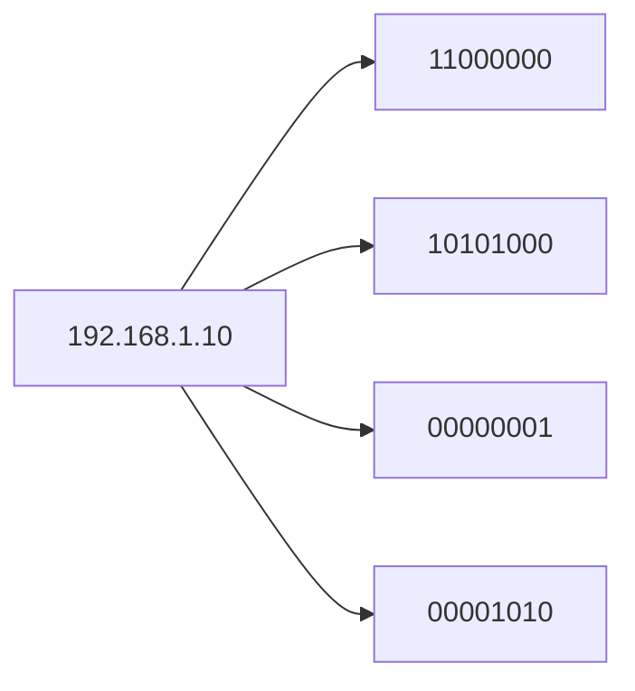

---

## 🔹 Subnet Mask e logica AND

La subnet mask separa rete e host.

### 🧠 AND logico

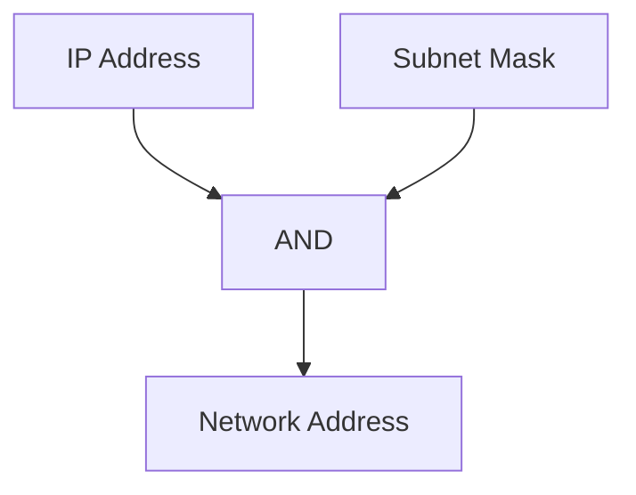

Esempio pratico:

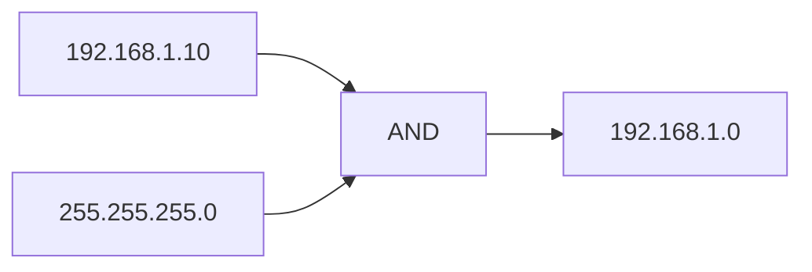

---

## 🔹 Network, Host e Broadcast


Oppure più dettagliato:

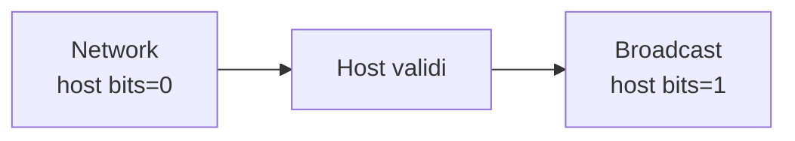

---

## 🔹 Calcolo Broadcast con OR

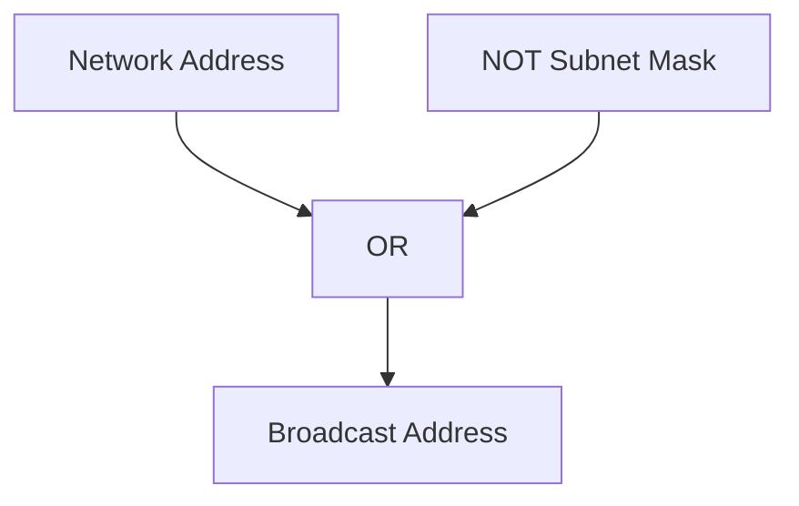

---

## 🔹 Come funziona il Routing

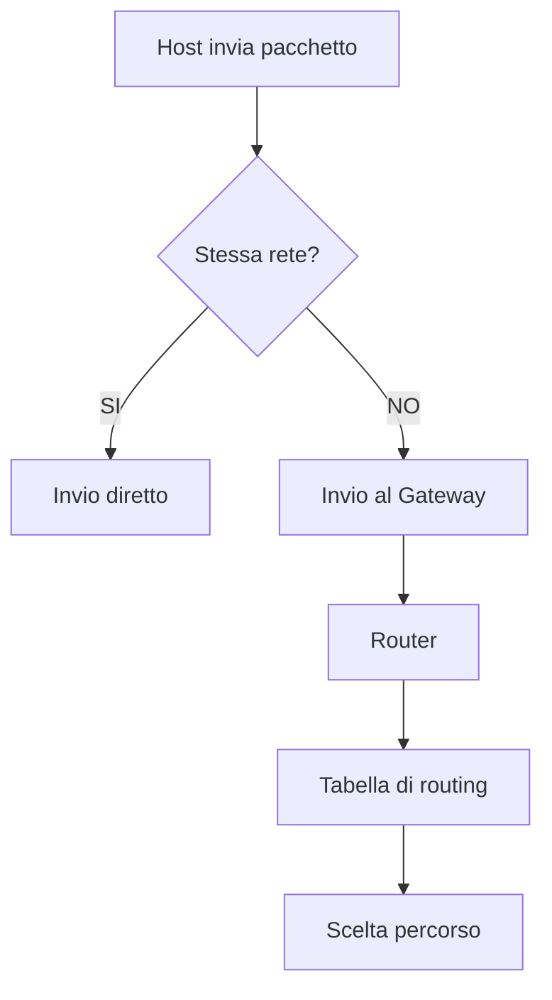

---

## 🔹 Tabella di Routing

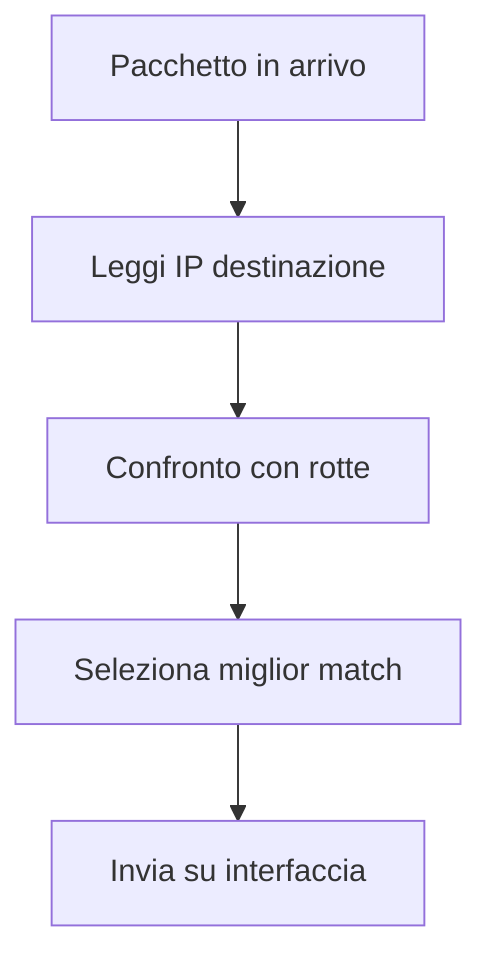

---

## 🔹 Longest Prefix Match

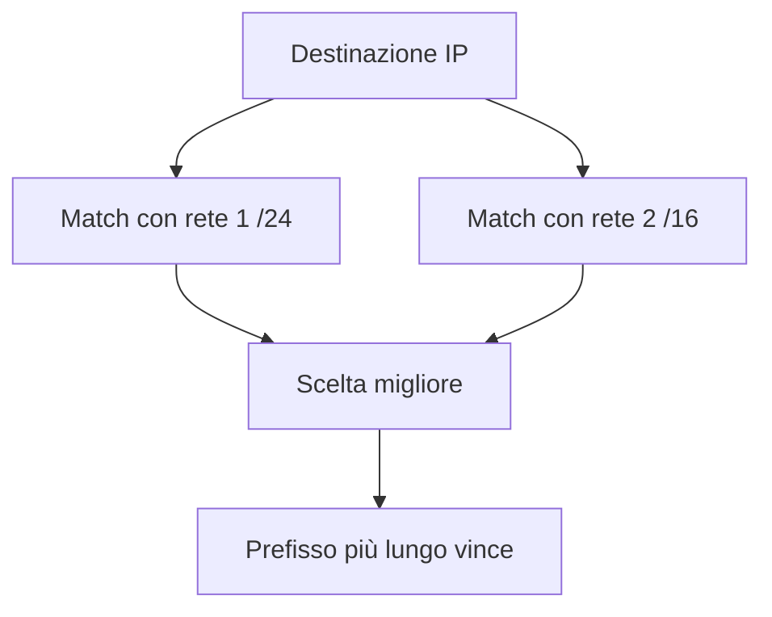

---

## 🔹 Supernetting

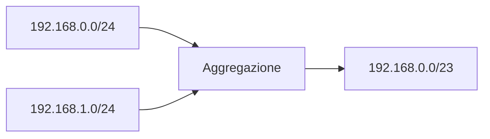

---

## 🔹 Tipi di Routing

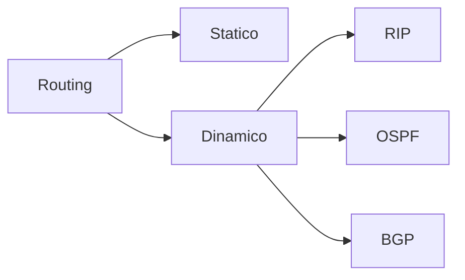

---

## 🔹 Riassunto logico (bit + operazioni)

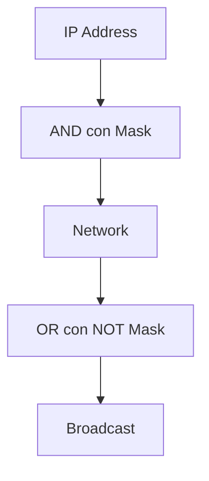

---

## 📌 Conclusione

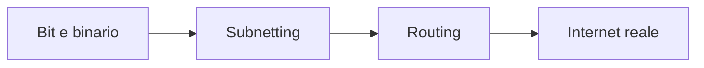

Il routing IP unisce:

* logica binaria (AND/OR)
* indirizzamento
* decisioni dinamiche

<!--

---

Se vuoi fare un salto di qualità 🔥  
posso trasformarti questo in:

- mappa mentale completa stile “schema da interrogazione”
- oppure aggiungere **esercizi con diagrammi già pronti in Mermaid** (molto utili per verifiche)
-->
