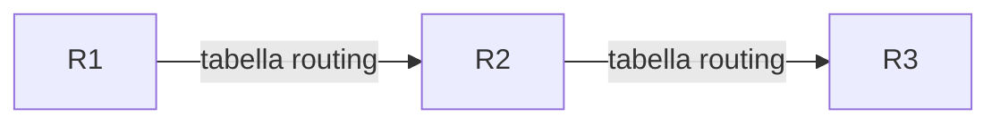
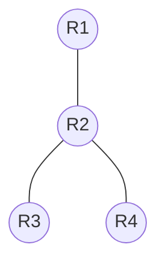
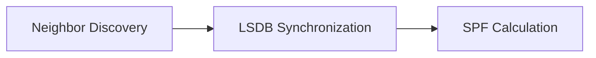
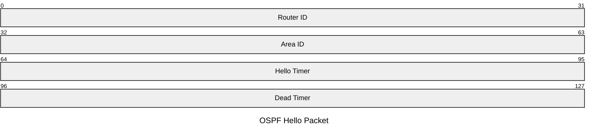
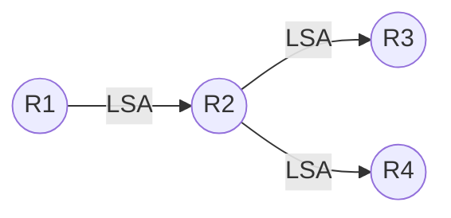
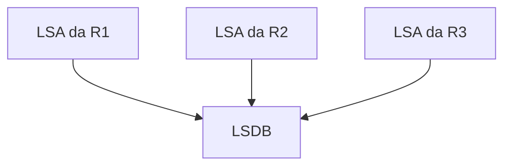
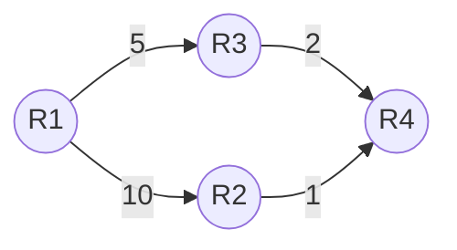
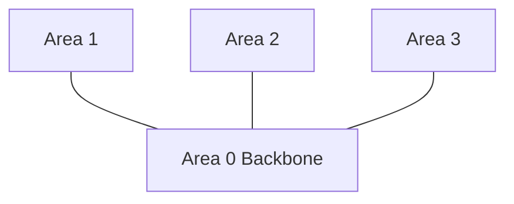
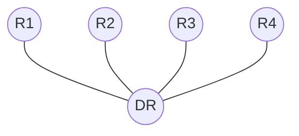
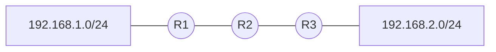

# 🌐 OSPF (Open Shortest Path First) – Introduzione Completa

---

# 1. Perché OSPF?

Nel capitolo precedente abbiamo studiato **RIP**, un protocollo di routing di tipo **Distance-Vector**.

RIP funziona bene in reti piccole, ma presenta diversi limiti:

| Limite RIP                       | Conseguenza            |
| -------------------------------- | ---------------------- |
| Max 15 hop                       | reti poco scalabili    |
| Convergenza lenta                | routing instabile      |
| Metrica solo hop count           | ignora banda e latenza |
| Aggiornamenti periodici completi | overhead inutile       |

OSPF nasce per risolvere questi problemi.

> [!NOTE]
> OSPF è oggi uno dei protocolli di routing interni (IGP) più usati nelle reti enterprise.

---

# 2. Cos'è OSPF?

**OSPF (Open Shortest Path First)** è un protocollo di routing dinamico di tipo:

* **Link-State**
* standard aperto (RFC 2328)
* progettato per reti medio-grandi

A differenza di RIP:

| RIP                     | OSPF                |
| ----------------------- | ------------------- |
| Distance-Vector         | Link-State          |
| Hop count               | Cost                |
| Aggiornamenti periodici | Event-driven        |
| Convergenza lenta       | Convergenza rapida  |
| Max 15 hop              | altamente scalabile |

> [!TIP]
> **Aggiornamenti Event-driven**: a differenza di RIP che invia aggiornamenti periodici ogni 30 secondi, OSPF invia LSA **solo quando cambia qualcosa** nella topologia (link che cade, router che si accende, ecc.). Questo riduce drasticamente il traffico di controllo e accelera la convergenza.

---

# 3. Distance-Vector vs Link-State

## RIP (Distance-Vector)

Ogni router:

* conosce solo i vicini
* apprende rotte tramite aggiornamenti periodici
* non conosce tutta la topologia


```mermaid
flowchart LR
    R1 -->|tabella routing| R2
    R2 -->|tabella routing| R3
```

---

## OSPF (Link-State)

Ogni router:

* scopre tutta la topologia
* costruisce una mappa completa della rete
* calcola autonomamente il percorso migliore


```mermaid
graph TD
    R1((R1))
    R2((R2))
    R3((R3))
    R4((R4))

    R1 --- R2
    R2 --- R3
    R2 --- R4
```

> [!IMPORTANT]
> In OSPF ogni router possiede una copia della topologia dell'area.

> [!WARNING]
> **RIP vs OSPF – Convergenza in caso di guasto**: con RIP, se un link cade, i router continuano a propagare rotte errate per decine di secondi (fino al *count-to-infinity*). Con OSPF il guasto viene rilevato immediatamente tramite il **Dead Timer** e le LSA vengono riflodate istantaneamente. La rete riconverge in pochi secondi.

---

# 4. Architettura OSPF

OSPF lavora in 3 fasi principali:


```mermaid
flowchart LR
    A[Neighbor Discovery] --> B[LSDB Synchronization]
    B --> C[SPF Calculation]
```

| Fase                 | Descrizione                         |
| -------------------- | ----------------------------------- |
| Neighbor Discovery   | scoperta dei router vicini          |
| LSDB Synchronization | sincronizzazione database topologia |
| SPF Calculation      | calcolo shortest path con Dijkstra  |

> [!NOTE]
> Queste 3 fasi avvengono **automaticamente** all'avvio di OSPF e si **riattivano parzialmente** ogni volta che la topologia cambia. Solo la fase SPF viene rieseguita se non cambiano le adiacenze.

---

# 5. Neighbor Discovery – Hello Packets

I router OSPF inviano periodicamente pacchetti **Hello**.

Servono per:

* scoprire vicini
* verificare che siano attivi
* formare adiacenze

---

## Multicast OSPF

| Tipo             | Indirizzo   |
| ---------------- | ----------- |
| All OSPF Routers | `224.0.0.5` |
| DR/BDR           | `224.0.0.6` |

---

## Hello Packet

Contiene:

* Router ID
* Area ID
* Hello Timer
* Dead Timer
* Authentication
* lista neighbor


```mermaid
packet-beta
    title OSPF Hello Packet
    0-31: "Router ID"
    32-63: "Area ID"
    64-95: "Hello Timer"
    96-127: "Dead Timer"
```

> [!CAUTION]
> Due router OSPF diventano neighbor solo se alcuni parametri coincidono:
>
> * Area ID
> * subnet mask
> * authentication
> * hello/dead timers

> [!TIP]
> **Timer di default Cisco**: Hello Timer = **10 secondi**, Dead Timer = **40 secondi** (4× l'Hello). Se non si riceve un Hello entro il Dead Timer, il neighbor viene considerato **Down** e viene ricalcolato l'SPF.

---

# 6. Router ID

Ogni router OSPF possiede un identificatore univoco:

```text
1.1.1.1
2.2.2.2
10.255.255.1
```

---

## Priorità di selezione

OSPF sceglie il Router ID così:

| Priorità | Sorgente                          |
| -------- | --------------------------------- |
| 1        | router-id configurato manualmente |
| 2        | loopback più alta                 |
| 3        | IP fisico più alto                |

> [!IMPORTANT]
> **Configura sempre il Router ID manualmente** con il comando `router-id X.X.X.X`. Affidarsi alla selezione automatica può causare comportamenti imprevedibili se cambiano le interfacce del router. Un Router ID stabile è fondamentale per la stabilità di OSPF.

---

# 7. Link-State Advertisements (LSA)

I router OSPF non inviano l'intera routing table.

Inviano invece informazioni sullo stato dei link:

* reti connesse
* costo link
* neighbor

Queste informazioni si chiamano:

# 👉 LSA (Link-State Advertisement)

---

## Flooding delle LSA


```mermaid
graph LR
    R1((R1))
    R2((R2))
    R3((R3))
    R4((R4))

    R1 -->|LSA| R2
    R2 -->|LSA| R3
    R2 -->|LSA| R4
```

Ogni router inoltra le LSA ricevute.

> [!NOTE]
> Il flooding delle LSA è **affidabile**: ogni LSA ricevuta viene confermata con un pacchetto **LSAck**. Se un router non risponde, la LSA viene ritrasmessa. Questo garantisce che tutti i router nell'area abbiano la stessa visione della topologia.

---

# 8. Link-State Database (LSDB)

Tutte le LSA formano il database topologico:

# 👉 LSDB (Link-State Database)

Ogni router dell'area possiede una LSDB identica.


```mermaid
flowchart TD
    A[LSA da R1]
    B[LSA da R2]
    C[LSA da R3]

    A --> D[LSDB]
    B --> D
    C --> D
```

> [!IMPORTANT]
> La **LSDB deve essere identica** su tutti i router della stessa area. Se due router hanno LSDB diverse, calcolano percorsi diversi e la rete è inconsistente. La sincronizzazione avviene durante la fase **Exchange/Loading** della formazione del neighbor.

---

# 9. Algoritmo SPF (Dijkstra)

Una volta costruita la LSDB:

* ogni router esegue l'algoritmo SPF
* calcola lo shortest path tree
* costruisce la routing table

---

## Esempio


```mermaid
graph LR
    A((R1))
    B((R2))
    C((R3))
    D((R4))

    A -- 10 --> B
    A -- 5 --> C
    C -- 2 --> D
    B -- 1 --> D
```

---

## Calcolo del percorso

Da R1 a R4:

| Percorso     | Costo |
| ------------ | ----- |
| R1 → R2 → R4 | 11    |
| R1 → R3 → R4 | 7     |

OSPF sceglie:

# ✅ R1 → R3 → R4

> [!NOTE]
> **SPF e CPU**: l'algoritmo di Dijkstra è **computazionalmente costoso** su reti molto grandi. Per questo OSPF usa le **aree**: ogni router esegue SPF solo sulla propria area, non sull'intera rete. Tra aree diverse si usano rotte inter-area calcolate dagli ABR.

---

# 10. Metrica OSPF – Cost

OSPF usa una metrica chiamata:

# 👉 Cost

Basata sulla banda del link.

Formula classica Cisco:

```text
Cost = Reference Bandwidth / Interface Bandwidth
```

---

## Esempio

| Banda    | Cost                       |
| -------- | -------------------------- |
| 10 Mbps  | 10                         |
| 100 Mbps | 1                          |
| 1 Gbps   | 1 (default Cisco classico) |

> [!WARNING]
> **Problema con link ad alta velocità**: la Reference Bandwidth di default Cisco è **100 Mbps**. Questo significa che FastEthernet (100M), GigabitEthernet (1G) e 10GigabitEthernet (10G) hanno tutti **Cost = 1**, rendendo OSPF incapace di distinguerli. Soluzione: aumentare la Reference Bandwidth con:
> ```bash
> router ospf 1
>  auto-cost reference-bandwidth 10000
> ```
> *(imposta la reference a 10 Gbps — da configurare su **tutti** i router dell'area)*

---

> [!NOTE]
> RIP ignora completamente la velocità dei link.
>
> OSPF invece preferisce link più veloci.

---

# 11. Aree OSPF

OSPF divide la rete in:

# 👉 Aree

per migliorare:

* scalabilità
* convergenza
* dimensione LSDB

---

## Backbone Area

L'area principale è:

# 👉 Area 0


```mermaid
graph TD
    A0[Area 0 Backbone]

    A1[Area 1]
    A2[Area 2]
    A3[Area 3]

    A1 --- A0
    A2 --- A0
    A3 --- A0
```

> [!IMPORTANT]
> **Tutte le aree devono connettersi ad Area 0**. Il traffico inter-area passa sempre attraverso il backbone. Se un'area non è direttamente connessa ad Area 0, è necessario configurare un **Virtual Link** — ma è una soluzione temporanea, non raccomandata in produzione.

---

## Tipi di router OSPF

| Tipo            | Funzione                           |
| --------------- | ---------------------------------- |
| Internal Router | tutte interfacce nella stessa area |
| ABR             | collega aree                       |
| ASBR            | connette altri protocolli          |
| Backbone Router | connesso ad Area 0                 |

---

# 12. DR e BDR

Su reti multi-accesso (Ethernet), OSPF elegge:

* **DR** → Designated Router
* **BDR** → Backup Designated Router

per ridurre il flooding.

---

## Senza DR

Numero adiacenze:

```text
n(n-1)/2
```

Con 5 router:

```text
5×4/2 = 10 adiacenze
```

---

## Con DR/BDR


```mermaid
graph TD
    DR((DR))

    R1((R1))
    R2((R2))
    R3((R3))
    R4((R4))

    R1 --- DR
    R2 --- DR
    R3 --- DR
    R4 --- DR
```

Molto più efficiente.

> [!TIP]
> **Elezione DR/BDR**: il DR viene eletto in base alla **priorità OSPF** (default 1, range 0–255). In caso di parità, vince il **Router ID più alto**. Priorità 0 = il router non partecipa all'elezione. L'elezione è **non-preemptiva**: se entra un router con priorità più alta, non scalza il DR esistente — bisogna fare `clear ip ospf process`.

---

# 13. Stati Neighbor OSPF

| Stato    | Significato                 |
| -------- | --------------------------- |
| Down     | nessun hello ricevuto       |
| Init     | hello ricevuto              |
| 2-Way    | comunicazione bidirezionale |
| ExStart  | negoziazione database       |
| Exchange | scambio database            |
| Loading  | richiesta LSA mancanti      |
| Full     | sincronizzazione completa   |

---

> [!IMPORTANT]
> Lo stato finale desiderato è:
>
> # FULL

> [!WARNING]
> **Stato bloccato in 2-Way o ExStart**: è uno dei problemi più comuni. In 2-Way i router si "vedono" ma non diventano adiacenti (normale tra router non-DR/BDR su reti broadcast). ExStart bloccato può indicare un problema di **MTU mismatch** tra le interfacce: verificare con `show interfaces` e allineare l'MTU o usare `ip ospf mtu-ignore`.

---

# 14. Pacchetti OSPF

OSPF usa direttamente il protocollo IP:

| Campo           | Valore    |
| --------------- | --------- |
| Protocol Number | 89        |
| TCP/UDP         | non usati |

---

## Tipi di pacchetti

| Tipo  | Funzione             |
| ----- | -------------------- |
| Hello | neighbor discovery   |
| DBD   | database description |
| LSR   | link-state request   |
| LSU   | link-state update    |
| LSAck | acknowledgment       |

> [!NOTE]
> OSPF **non usa TCP o UDP** — gira direttamente su IP (Protocol 89) e implementa la propria affidabilità tramite gli **LSAck**. Questo lo rende più efficiente ma significa che eventuali firewall devono essere configurati per permettere IP Protocol 89, non una porta TCP/UDP.

---

# 15. Configurazione Cisco IOS

## Base

```bash
router ospf 1
 router-id 1.1.1.1
 network 10.0.12.0 0.0.0.3 area 0
 network 192.168.1.0 0.0.0.255 area 0
```

---

## Wildcard Mask

OSPF usa wildcard mask:

| Subnet Mask     | Wildcard  |
| --------------- | --------- |
| 255.255.255.0   | 0.0.0.255 |
| 255.255.255.252 | 0.0.0.3   |

---

> [!TIP]
> Wildcard = inversione della subnet mask.

---

# 16. Verifica OSPF

## Neighbor

```bash
show ip ospf neighbor
```

---

## Routing table

```bash
show ip route ospf
```

---

## Database LSDB

```bash
show ip ospf database
```

> [!TIP]
> **Debug rapido in sequenza**: se OSPF non funziona, verifica in quest'ordine:
> 1. `show ip ospf neighbor` → i neighbor esistono? Sono in stato FULL?
> 2. `show ip ospf database` → la LSDB è popolata?
> 3. `show ip route ospf` → le rotte OSPF sono nella routing table?
> 4. `show ip interface brief` → le interfacce sono up/up?
>
> Ogni step esclude una categoria di problemi.

---

# 17. OSPF vs RIP

| Caratteristica | RIP             | OSPF           |
| -------------- | --------------- | -------------- |
| Tipo           | Distance-Vector | Link-State     |
| Metrica        | Hop count       | Cost           |
| Max hop        | 15              | molto elevato  |
| Convergenza    | lenta           | rapida         |
| Aggiornamenti  | periodici       | triggered      |
| Scalabilità    | bassa           | alta           |
| Algoritmo      | Bellman-Ford    | Dijkstra       |
| Trasporto      | UDP 520         | IP Protocol 89 |

---

# 18. Esempio Completo

## Topologia


```mermaid
graph LR
    R1((R1))
    R2((R2))
    R3((R3))
    LAN1[192.168.1.0/24]
    LAN2[192.168.2.0/24]

    LAN1 --- R1
    R1 --- R2
    R2 --- R3
    R3 --- LAN2
```

---

## Processo

### Step 1 – Hello

I router scoprono i neighbor.

### Step 2 – LSA Flooding

Ogni router pubblica i propri link.

### Step 3 – LSDB

Tutti costruiscono la stessa topologia.

### Step 4 – SPF

Ogni router calcola shortest paths.

### Step 5 – Routing Table

Le rotte vengono installate.

> [!NOTE]
> **Cosa succede se cade il link R1–R2?**
> 1. R1 e R2 non ricevono più gli Hello → Dead Timer scade
> 2. Entrambi generano una nuova LSA con il link marcato come down
> 3. Le LSA vengono riflodate a tutti i router dell'area
> 4. Ogni router riesegue SPF
> 5. Le routing table vengono aggiornate
>
> Tutto questo avviene in **pochi secondi** — questo è il vantaggio di OSPF event-driven.

---

# 19. Problemi comuni

| Problema          | Possibile causa     |
| ----------------- | ------------------- |
| Neighbor non FULL | mismatch timer      |
| Nessuna adiacenza | area mismatch       |
| Route mancanti    | wildcard errata     |
| Instabilità       | duplicate router-id |

---

> [!CAUTION]
> Router ID duplicati causano problemi gravi di convergenza.

> [!CAUTION]
> **Router ID duplicato – effetti concreti**: se due router hanno lo stesso Router ID, i router vicini ricevono LSA contraddittorie dallo "stesso" router. Questo causa **flapping** della LSDB, ricalcoli SPF continui e routing instabile o blackhole. Per individuare duplicati: `show ip ospf` su ogni router e confronta i Router ID. La correzione richiede `clear ip ospf process` dopo aver cambiato il Router ID.

---

# 20. Riepilogo Finale

| Concetto    | OSPF                  |
| ----------- | --------------------- |
| Tipo        | Link-State            |
| Algoritmo   | Dijkstra SPF          |
| Metrica     | Cost                  |
| Trasporto   | IP Protocol 89        |
| Multicast   | 224.0.0.5 / 224.0.0.6 |
| Database    | LSDB                  |
| Scalabilità | elevata               |
| Backbone    | Area 0                |

---

# 21. Prossimi Argomenti Consigliati

Dopo OSPF:

1. Dijkstra Algorithm approfondito
2. OSPF Areas avanzate
3. Route Summarization
4. EIGRP
5. BGP
6. MPLS
7. IPv6 + OSPFv3

---

# 📚 Concetti chiave da ricordare

> [!IMPORTANT]
>
> * OSPF è un protocollo **Link-State**: ogni router conosce la topologia completa dell'area
> * Gli aggiornamenti sono **event-driven**: vengono inviati solo quando cambia qualcosa, non periodicamente
> * Usa **Dijkstra** per calcolare lo shortest path dalla LSDB
> * La metrica è il **Cost** basato sulla banda — attenzione alla Reference Bandwidth su link Gigabit+
> * **Area 0** è il backbone obbligatorio: tutte le aree devono connettersi ad esso
> * La convergenza è **molto più rapida** rispetto a RIP grazie al flooding immediato delle LSA
> * Lo stato neighbor desiderato è **FULL** — qualsiasi altro stato finale indica un problema
