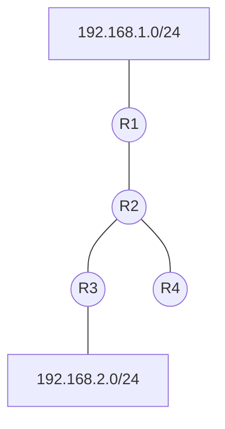
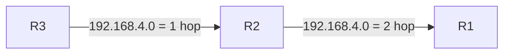
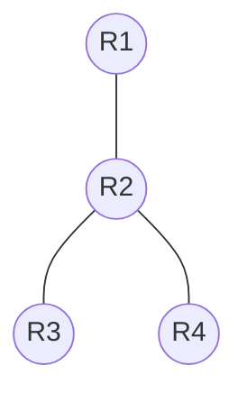
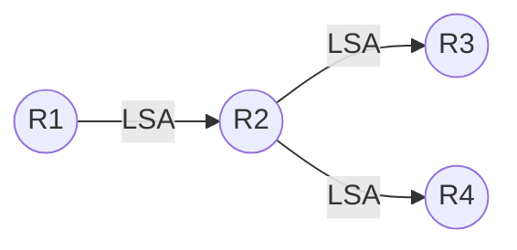
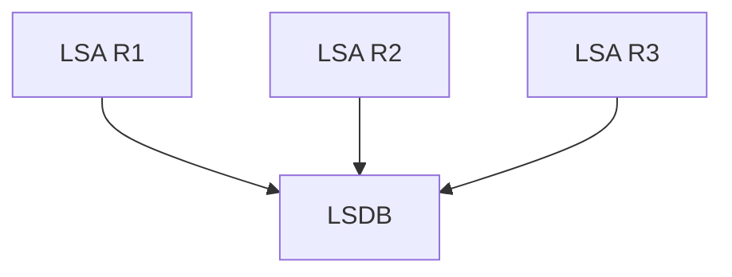
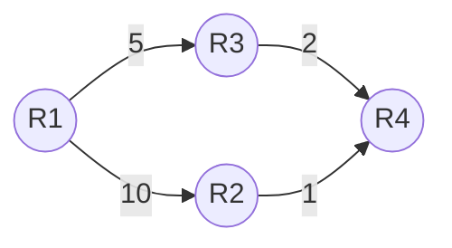
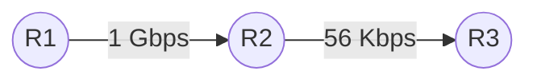
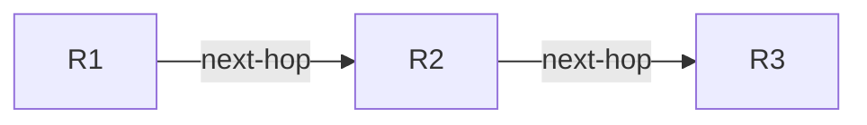
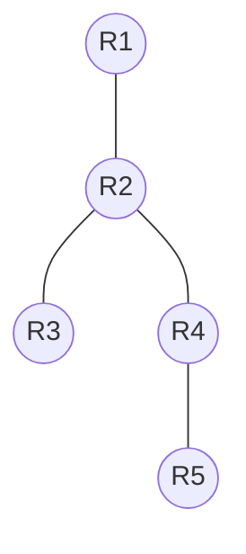

# 🌐 Distance-Vector vs Link-State – Capire davvero la differenza

---

# 1. Introduzione

Quando si studiano i protocolli di routing dinamico, una delle differenze più importanti è:

# 👉 Distance-Vector vs Link-State

Molti studenti memorizzano:

* RIP = Distance-Vector
* OSPF = Link-State

ma senza capire davvero cosa significhi.

La vera differenza è:

# 👉 quanto della rete conosce ogni router

---

# 2. Cos'è la topologia della rete?

La **topologia della rete** è:

> la mappa completa della rete

cioè:

* quali router esistono
* come sono collegati
* quali link esistono
* quali reti sono connesse
* quali costi hanno i link

---

## Esempio di topologia



Questa figura rappresenta la:

# 👉 topologia della rete

Perché mostra:

* tutti i router
* tutti i link
* tutte le connessioni

---

# 3. Analogia reale – Google Maps

Pensiamo a una città.

---

## Caso 1 – Non hai la mappa completa

Chiedi indicazioni strada per strada:

```text
"Vai avanti fino al prossimo incrocio,
poi chiedi ancora."
```

Conosci solo:

* la prossima direzione
* la distanza

Questo è:

# 👉 Distance-Vector

---

## Caso 2 – Hai Google Maps

Possiedi:

* tutta la mappa
* tutte le strade
* traffico
* percorsi alternativi

Puoi calcolare da solo il percorso migliore.

Questo è:

# 👉 Link-State

---

# 4. RIP = Distance-Vector

RIP NON conosce la topologia completa.

Ogni router conosce solo:

| Informazione | Significato          |
| ------------ | -------------------- |
| Distance     | distanza (hop count) |
| Vector       | direzione (next-hop) |

---

## Esempio



R2 dice a R1:

```text
"Per arrivare a 192.168.4.0/24,
passa da me.
Distanza = 2 hop"
```

---

## Cosa NON sa R1?

R1 NON sa:

* che esiste R3
* come è fatta la rete
* quali link ci sono
* se esistono percorsi alternativi

R1 si fida semplicemente di R2.

---

> [!IMPORTANT]
> In RIP i router NON possiedono la mappa completa della rete.

---

# 5. OSPF = Link-State

OSPF funziona in modo completamente diverso.

Ogni router:

* descrive i propri link
* invia informazioni sullo stato delle connessioni
* riceve informazioni da tutti gli altri router

Alla fine:

* ogni router costruisce la topologia completa

---

## Esempio



Con OSPF:

* R1 conosce R2
* R1 conosce R3
* R1 conosce R4
* R1 conosce tutti i link

---

# 6. Cosa significa “Link-State”?

“Link-State” significa:

# 👉 stato dei collegamenti

Ogni router annuncia:

| Informazione   | Esempio        |
| -------------- | -------------- |
| Link esistenti | R2 ↔ R3        |
| Stato link     | up/down        |
| Costo link     | cost 10        |
| Reti collegate | 192.168.1.0/24 |

---

## Esempio pratico

R2 invia qualcosa del tipo:

```text
Sono R2.
Sono collegato a:
- R1 con costo 10
- R3 con costo 5
- R4 con costo 2
```

Questa informazione viene propagata in tutta la rete.

---

# 7. Flooding delle informazioni

In OSPF le informazioni vengono diffuse ovunque.



Le LSA (Link-State Advertisements):

* vengono replicate
* inoltrate
* sincronizzate

---

# 8. LSDB – Database topologico

Tutte le informazioni raccolte formano:

# 👉 LSDB (Link-State Database)

---

## Concetto importante

Ogni router OSPF possiede:

# 👉 la stessa mappa della rete



---

# 9. Conseguenza pratica

Grazie alla topologia completa:

OSPF può:

* calcolare percorsi migliori
* evitare loop
* reagire velocemente ai guasti
* usare percorsi alternativi

---

# 10. Algoritmo SPF (Dijkstra)

Con la topologia completa:

ogni router esegue:

# 👉 Dijkstra SPF

per trovare il percorso migliore.

---

## Esempio



---

## Calcolo

Da R1 a R4:

| Percorso     | Costo |
| ------------ | ----- |
| R1 → R2 → R4 | 11    |
| R1 → R3 → R4 | 7     |

OSPF sceglie:

# ✅ R1 → R3 → R4

---

# 11. RIP invece non può fare questo bene

RIP:

* non conosce tutta la rete
* non conosce tutti i costi
* usa solo hop count

---

## Problema



RIP vede:

```text
R1 → R2 → R3 = 2 hop
```

e basta.

NON capisce che:

* il link è lentissimo
* il percorso è pessimo

---

# 12. Visione mentale corretta

---

## RIP



Ogni router vede:

* solo “la prossima direzione”

---

## OSPF



Ogni router vede:

* tutta la rete

---

# 13. Differenza fondamentale

| RIP               | OSPF               |
| ----------------- | ------------------ |
| conosce next-hop  | conosce topologia  |
| distance-vector   | link-state         |
| semplice          | più intelligente   |
| lenta convergenza | convergenza rapida |
| poca CPU          | più CPU/RAM        |
| reti piccole      | reti grandi        |

---

# 14. Analogia finale

## RIP

```text
"Vai dal mio vicino.
Lui sa dove andare."
```

---

## OSPF

```text
"Ecco la mappa completa della città.
Calcola tu il percorso migliore."
```

---

# 15. Definizioni finali

---

## Distance-Vector

Il router conosce:

* distanza
* direzione

ma NON la topologia completa.

---

## Link-State

Il router conosce:

* stato dei link
* topologia completa

e calcola autonomamente il miglior percorso.

---

# 📚 Concetti chiave da ricordare

> [!SUMMARY]
>
> * La topologia è la mappa completa della rete
> * RIP NON conosce la topologia
> * OSPF conosce la topologia completa
> * RIP usa hop count
> * OSPF usa cost basato sulla banda
> * OSPF usa Dijkstra per calcolare shortest path
> * Link-State = conoscenza globale della rete
