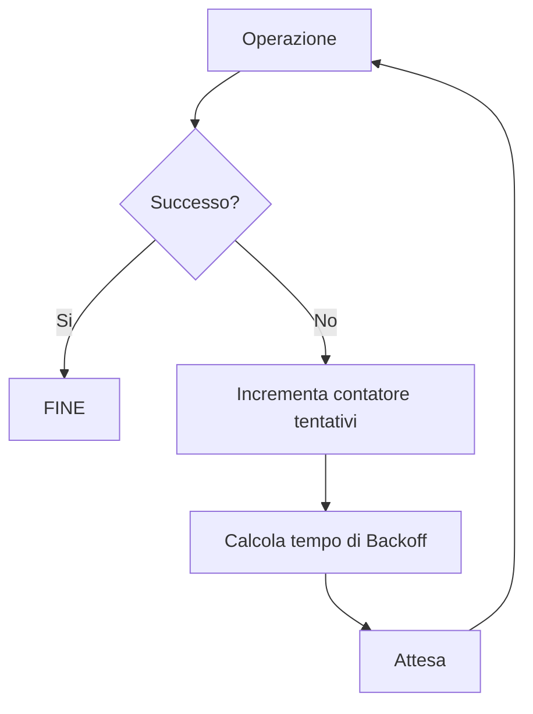
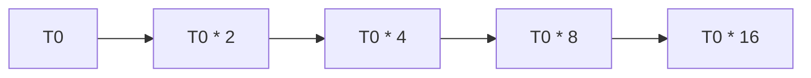

# Backoff – Modello Logico, Matematico e Algoritmico

## Introduzione

Nei sistemi informatici distribuiti e nelle reti di comunicazione, molte operazioni possono **fallire temporaneamente**.

Esempi tipici:

- collisioni di pacchetti su un mezzo condiviso
- server temporaneamente non disponibile
- congestione di rete
- risorse concorrenti

Una strategia ingenua sarebbe **ritentare immediatamente**.  
Tuttavia questo comportamento genera facilmente **effetti di amplificazione del problema**:

| Problema | Effetto |
|--------|--------|
| Server sovraccarico | i client continuano a inviare richieste |
| Collisione di rete | i nodi ritrasmettono simultaneamente |
| Congestione | si genera traffico aggiuntivo |

Questo porta a fenomeni noti come:

- **congestion collapse**
- **retry storm**
- **collision amplification**

Per evitare questi problemi si utilizza una strategia di controllo chiamata **backoff**.

---

# Definizione formale di Backoff

Il **backoff** è una strategia algoritmica in cui, dopo un fallimento, il sistema:

1. attende un certo tempo
2. ritenta l’operazione
3. aumenta progressivamente il tempo di attesa se i fallimenti continuano

Formalmente:

> Backoff = funzione che determina il **tempo di attesa prima del prossimo tentativo**.

---

# Modello logico

Sia:

- $k$ = numero di tentativi falliti
- $T(k)$ = tempo di attesa prima del tentativo successivo

La strategia di backoff è una funzione:

$$
T : \mathbb{N} \rightarrow \mathbb{R}^{+}
$$

che associa ad ogni tentativo fallito un tempo di attesa.

---

# Strategie di Backoff

Le principali strategie utilizzate nei sistemi informatici sono:

| Strategia | Formula | Caratteristica |
|--------|--------|--------|
| Backoff costante | $T(k) = T_0$ | sempre lo stesso intervallo |
| Backoff lineare | $T(k) = T_0 + k\Delta$ | crescita lineare |
| Backoff esponenziale | $T(k) = T_0 \cdot 2^k$ | crescita rapida |
| Backoff esponenziale limitato | $T(k)=\min(T_{max},T_0 2^k)$ | limite massimo |

La strategia **più diffusa nei protocolli di rete** è il **backoff esponenziale**.

---

# Backoff esponenziale

Nel backoff esponenziale il tempo di attesa cresce **esponenzialmente** con il numero di fallimenti.

$$
T(k) = T_0 \cdot 2^k
$$

Dove:

| Simbolo | Significato |
|-------|--------|
| $T_0$ | tempo iniziale |
| $k$ | numero di tentativi falliti |
| $T(k)$ | tempo di attesa |

---

## Versione con limite massimo

Nella pratica si introduce un limite:

$$
T(k) = \min(T_{max}, T_0 \cdot 2^k)
$$

---

## Tabella di esempio

Supponiamo:

- $T_0 = 1s$
- $T_{max} = 32s$

| Tentativo $k$ | Tempo $T(k)$ |
|---|---|
| 0 | 1s |
| 1 | 2s |
| 2 | 4s |
| 3 | 8s |
| 4 | 16s |
| 5 | 32s |
| 6 | 32s |

---

# Backoff casuale

Nei sistemi distribuiti è necessario introdurre **casualità**.

Se due nodi utilizzassero la stessa funzione deterministica:

$$
T(k) = T_0 2^k
$$

ritenterebbero **sempre nello stesso momento**.

Per evitare sincronizzazione si utilizza:

$$
T(k) = Random(0,W) \cdot t_{slot}
$$

dove

$$
W = 2^k - 1
$$

---

# Esempio: Ethernet (CSMA/CD)

Nel protocollo **Ethernet classico** il backoff segue la strategia:

**Binary Exponential Backoff**

Dopo una collisione:

$$
W = 2^k - 1
$$

Il nodo sceglie casualmente:

$$
r \in [0,W]
$$

e aspetta

$$
T = r \cdot t_{slot}
$$

---

## Tabella delle finestre di backoff

| Collisioni $k$ | Finestra $W$ | Valori possibili |
|---|---|---|
| 1 | 1 | 0..1 |
| 2 | 3 | 0..3 |
| 3 | 7 | 0..7 |
| 4 | 15 | 0..15 |
| 5 | 31 | 0..31 |

---

# Modello probabilistico

Supponiamo:

- $n$ nodi in competizione
- ogni nodo sceglie casualmente uno slot

Probabilità che **due nodi scelgano lo stesso slot**:

$$
P_{collisione} = 1 - \frac{W!}{(W-n)! W^n}
$$

All'aumentare di $W$:

- la probabilità di collisione **diminuisce**
- il tempo medio di attesa **aumenta**

Questo rappresenta il **compromesso fondamentale** del backoff.

---

# Pseudocodice generale

```text
procedure RETRY_WITH_BACKOFF(operation)

k ← 0

while k < MAX_RETRIES

    result ← operation()

    if result = SUCCESS
        return SUCCESS

    wait_time ← backoff(k)

    sleep(wait_time)

    k ← k + 1

return FAILURE
````

---

# Pseudocodice con backoff esponenziale

```text
function backoff(k)

T0 ← initial_delay
Tmax ← max_delay

delay ← T0 * 2^k

if delay > Tmax
    delay ← Tmax

return delay
```

---

# Pseudocodice con jitter casuale

```text
function backoff_random(k)

W ← 2^k - 1

r ← random(0,W)

return r * slot_time
```

---

# Diagramma del processo



---

# Diagramma della crescita del backoff



---

# Applicazioni reali

Il backoff è utilizzato in numerosi sistemi:

| Sistema             | Uso                        |
| ------------------- | -------------------------- |
| Ethernet            | gestione collisioni        |
| Wi-Fi               | accesso al canale          |
| TCP                 | controllo congestione      |
| API Web             | retry delle richieste      |
| Sistemi distribuiti | gestione errori temporanei |

---

# Proprietà fondamentali

Il backoff permette di ottenere:

| Proprietà   | Descrizione                  |
| ----------- | ---------------------------- |
| Stabilità   | evita il collasso della rete |
| Scalabilità | funziona con molti nodi      |
| Equità      | distribuisce le opportunità  |
| Robustezza  | gestisce errori temporanei   |

---

# Conclusione

Il **backoff** è un meccanismo fondamentale nei sistemi distribuiti e nelle reti.

Attraverso una combinazione di:

* crescita esponenziale
* limiti superiori
* casualità

è possibile ridurre drasticamente:

* collisioni
* congestione
* sovraccarico dei sistemi.

Dal punto di vista matematico, il backoff rappresenta un esempio interessante di **algoritmo adattivo**, in cui il comportamento del sistema dipende dalla **storia dei fallimenti precedenti**.


