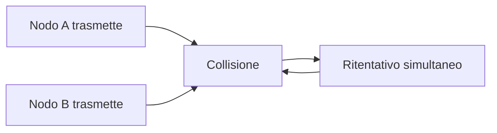
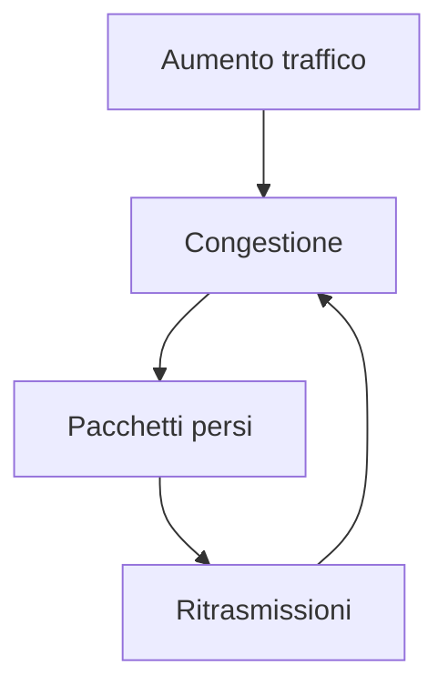
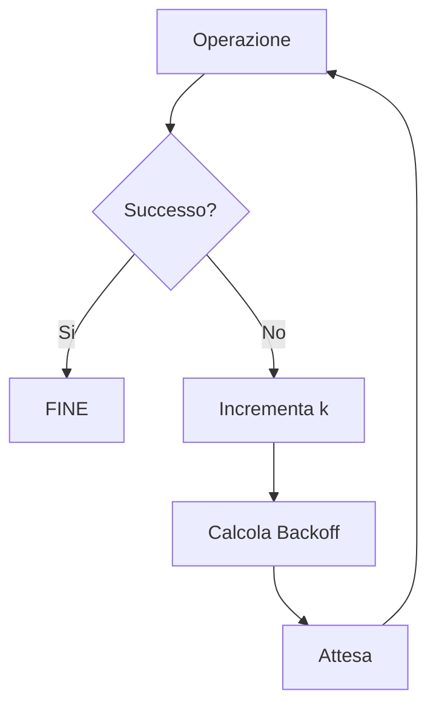

# Backoff nei Sistemi di Rete e Distribuiti

## Introduzione

Nei sistemi di rete e nei sistemi distribuiti è frequente che un’operazione fallisca temporaneamente.

Alcuni esempi tipici:

| Situazione | Descrizione |
|---|---|
| Server non disponibile | il server è sovraccarico o temporaneamente offline |
| Collisione di rete | due nodi trasmettono contemporaneamente |
| Congestione di rete | troppi pacchetti saturano la rete |
| Timeout | una richiesta non riceve risposta entro il tempo previsto |

Una strategia ingenua sarebbe **ritentare immediatamente l’operazione**.

Tuttavia questo comportamento può generare problemi molto gravi:

| Problema | Effetto |
|---|---|
| Retry simultanei | sovraccarico improvviso del server |
| Collisioni ripetute | degrado delle prestazioni di rete |
| Ritrasmissioni continue | congestione crescente |

Questi fenomeni sono noti come:

- **Congestion Collapse**
- **Retry Storm**
- **Collision Amplification**

Per evitare tali problemi viene utilizzata una strategia chiamata **Backoff**.

---

# Cos'è il Backoff

Il **backoff** è una tecnica utilizzata nei sistemi informatici per **ritardare i tentativi successivi dopo un fallimento**.

Invece di ritentare immediatamente, il sistema:

1. attende un certo intervallo di tempo
2. ritenta l’operazione
3. aumenta progressivamente il tempo di attesa se i fallimenti continuano

---

## Definizione formale

Sia:

- $k$ = numero di tentativi falliti
- $T(k)$ = tempo di attesa prima del prossimo tentativo

La strategia di backoff è una funzione:

$$
T : \mathbb{N} \rightarrow \mathbb{R}^+
$$

che associa ad ogni numero di fallimenti un tempo di attesa.

---

# Fenomeni che motivano il Backoff

## Tabella riassuntiva

| Fenomeno | Descrizione | Esempio |
|---|---|---|
| **Congestion Collapse** | la rete diventa così congestionata che la maggior parte del traffico consiste in ritrasmissioni | reti TCP sovraccariche |
| **Retry Storm** | molti client ritentano contemporaneamente la stessa operazione | migliaia di client che richiamano una API |
| **Collision Amplification** | più nodi ritrasmettono simultaneamente causando nuove collisioni | reti Ethernet condivise |

---

## Schema concettuale

```mermaid
flowchart TD

A[Errore o Fallimento] --> B{Ritentare subito?}

B -->|Si| C[Retry simultanei]

C --> D[Retry Storm]

C --> E[Collision Amplification]

C --> F[Congestion Collapse]

B -->|No| G[Backoff]

G --> H[Ritentativo controllato]
````

---

# Retry Storm

## Definizione

Il **Retry Storm** si verifica quando molti client ritentano simultaneamente un’operazione fallita.

---

## Processo

```mermaid
sequenceDiagram
participant Client1
participant Client2
participant Client3
participant Server

Client1->>Server: Request
Client2->>Server: Request
Client3->>Server: Request

Server-->>Client1: Error
Server-->>Client2: Error
Server-->>Client3: Error

Client1->>Server: Retry
Client2->>Server: Retry
Client3->>Server: Retry
```

Tutti i client ritentano **nello stesso istante**, causando un nuovo sovraccarico.

---

# Collision Amplification

## Definizione

Fenomeno tipico delle **reti a mezzo condiviso**.

Quando più nodi trasmettono simultaneamente:

* si verifica una **collisione**
* i nodi ritrasmettono
* se ritrasmettono nello stesso istante si genera una **nuova collisione**

---

## Schema



Questo genera una **catena di collisioni**.

---

# Congestion Collapse

## Definizione

Il **Congestion Collapse** è una situazione in cui la rete continua a trasmettere pacchetti ma **quasi nessun dato utile arriva a destinazione**.

Gran parte del traffico è costituita da:

* ritrasmissioni
* pacchetti duplicati
* traffico di controllo

---

## Schema



Si crea un **ciclo di congestione**.

---

# Strategie di Backoff

Le principali strategie sono:

| Strategia             | Formula                 | Caratteristica   |
| --------------------- | ----------------------- | ---------------- |
| Costante              | $T(k)=T_0$              | attesa fissa     |
| Lineare               | $T(k)=T_0 + k\Delta$    | crescita lineare |
| Esponenziale          | $T(k)=T_0 2^k$          | crescita rapida  |
| Esponenziale limitato | $\min(T_{max},T_0 2^k)$ | limite massimo   |

---

# Backoff esponenziale

È la strategia più utilizzata nelle reti.

Formula:

$$
T(k)=T_0 \cdot 2^k
$$

---

## Tabella di esempio

Supponiamo:

* $T_0 = 1s$

| Tentativo | Attesa |
| --------- | ------ |
| 0         | 1s     |
| 1         | 2s     |
| 2         | 4s     |
| 3         | 8s     |
| 4         | 16s    |

---

# Backoff con limite massimo

Nella pratica si usa:

$$
T(k)=\min(T_{max},T_0 2^k)
$$

---

## Tabella

| Tentativo | Tempo |
| --------- | ----- |
| 0         | 1s    |
| 1         | 2s    |
| 2         | 4s    |
| 3         | 8s    |
| 4         | 16s   |
| 5         | 32s   |
| 6         | 32s   |

---

# Introduzione della casualità (Jitter)

Per evitare sincronizzazione tra nodi si introduce un valore casuale.

$$
T = Random(0,W) \cdot t_{slot}
$$

dove

$$
W = 2^k - 1
$$

---

# Binary Exponential Backoff (Ethernet)

Nel protocollo Ethernet classico si utilizza:

**Binary Exponential Backoff**

Dopo una collisione:

$$
W = 2^k -1
$$

Il nodo sceglie:

$$
r \in [0,W]
$$

e attende:

$$
T = r \cdot t_{slot}
$$

---

## Tabella

| Collisioni | Finestra |
| ---------- | -------- |
| 1          | 0..1     |
| 2          | 0..3     |
| 3          | 0..7     |
| 4          | 0..15    |

---

# Pseudocodice generale

```
procedure retry(operation)

k ← 0

while k < MAX_RETRIES

    result ← operation()

    if result = success
        return success

    delay ← backoff(k)

    sleep(delay)

    k ← k + 1

return failure
```

---

# Diagramma dell'algoritmo



---

# Applicazioni del Backoff

| Sistema             | Uso                        |
| ------------------- | -------------------------- |
| Ethernet            | gestione collisioni        |
| WiFi                | accesso al canale          |
| TCP                 | controllo congestione      |
| API Web             | retry delle richieste      |
| sistemi distribuiti | gestione errori temporanei |

---

# Proprietà del Backoff

| Proprietà   | Significato                            |
| ----------- | -------------------------------------- |
| Stabilità   | evita collasso della rete              |
| Scalabilità | funziona con molti nodi                |
| Robustezza  | gestisce errori temporanei             |
| Equità      | distribuisce le opportunità di accesso |

---

# Conclusione

Il **Backoff** è una tecnica fondamentale per garantire la stabilità dei sistemi distribuiti e delle reti.

Attraverso:

* aumento progressivo dei tempi di attesa
* introduzione di casualità
* limiti superiori

è possibile ridurre drasticamente:

* collisioni
* sovraccarico dei server
* congestione di rete.

```
