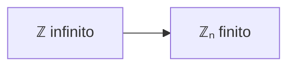

# Congruenza: la matematica del “conta solo ciò che resta”

> “Due numeri possono essere diversi… e allo stesso tempo identici, se cambi il modo di guardarli.”

---

## 1. L’idea centrale

In matematica normale:

- 17 ≠ 5
- 100 ≠ 4
- 26 ≠ 2

Ma esiste un altro punto di vista:

👉 guardare i numeri solo attraverso il loro **resto modulo n**

---

## 2. Il modello mentale: l’orologio

### ⏰ Tempo come matematica modulare

```mermaid
flowchart LR
    A[0] --> B[1] --> C[2] --> D[3] --> E[4] --> F[5] --> G[6]
    G --> H[7] --> I[8] --> J[9] --> K[10] --> L[11] --> A
````

👉 Dopo 12 ore si torna a 0

Quindi:

$$
14 \equiv 2 \pmod{12}
$$

---

### 💡 Interpretazione

L’orologio non chiede:

> “che numero è 14?”

ma:

> “dove arrivo dopo aver fatto tutti i giri completi?”

---

## 3. Definizione matematica (formale ma intuitiva)

$$
a \equiv b \pmod{n}
$$

si legge:

👉 “a è congruo a b modulo n”

e significa:

$$
n \mid (a - b)
$$

cioè:

> la differenza tra a e b è un multiplo di n

---

## 4. La vera idea (più importante della formula)

La congruenza non dice che due numeri sono uguali.

Dice qualcosa di più profondo:

> Due numeri sono equivalenti se il sistema non riesce a distinguerli rispetto a n.

---

## 5. Il mondo dei resti: una “realtà alternativa”

Quando scegli un modulo n, stai creando un nuovo mondo:

```mermaid
flowchart TB
    A["Z (infiniti numeri)"] --> B["Classi di equivalenza"]
    B --> C["Z_n = {0, 1, ..., n-1}"]
```

👉 L’infinito diventa finito

---

## 6. Esempio concreto

Modulo 6:

| Numero | Resto |
| ------ | ----- |
| 17     | 5     |
| 11     | 5     |
| 5      | 5     |

Quindi:

$$
17 \equiv 11 \equiv 5 \pmod{6}
$$

👉 Sono numeri diversi, ma “la stessa cosa” nel mondo modulo 6

---

## 7. Un cambio di filosofia

### Matematica classica

> Un numero è ciò che è.

### Matematica modulare

> Un numero è ciò che fa.

---

## 8. Perché è così potente?

### 🔹 1. Riduce l’infinito



---

### 🔹 2. Introduce cicli naturali

Tutto ciò che è periodico diventa naturale:

* tempo
* rotazioni
* calendari
* clock dei computer

---

### 🔹 3. È la base della crittografia

La crittografia moderna lavora così:


---

## 9. Un’idea filosofica profonda

La congruenza ci insegna che:

> la realtà matematica non è unica, dipende dal “modo di osservare”

È come cambiare lente:

* senza modulo → numeri assoluti
* con modulo → numeri relativi a un contesto

---

## 10. Intuizione finale

$$
a \equiv b \pmod{n}
$$

significa:

> “a e b sono diversi, ma indistinguibili se osserviamo solo il resto modulo n”

---

## 11. Perché è importante ricordarlo

Perché questa idea è la base di:

* crittografia moderna (AES, RSA)
* teoria dei gruppi
* informatica teorica
* sistemi distribuiti

---

## 12. Chiusura concettuale

La matematica modulare non è solo un trucco.

È un cambio di mentalità:

👉 dai numeri come oggetti assoluti
👉 ai numeri come comportamenti dentro un sistema

E questo è uno dei primi veri “salti concettuali” della matematica moderna.


