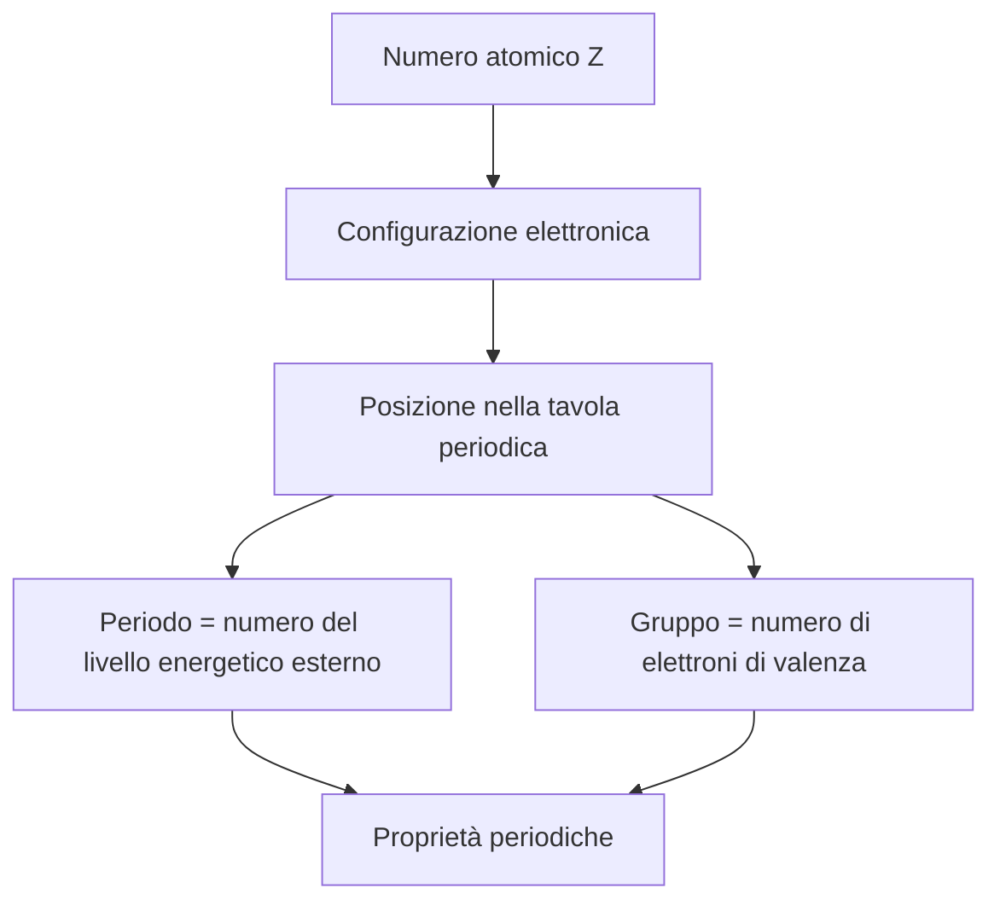
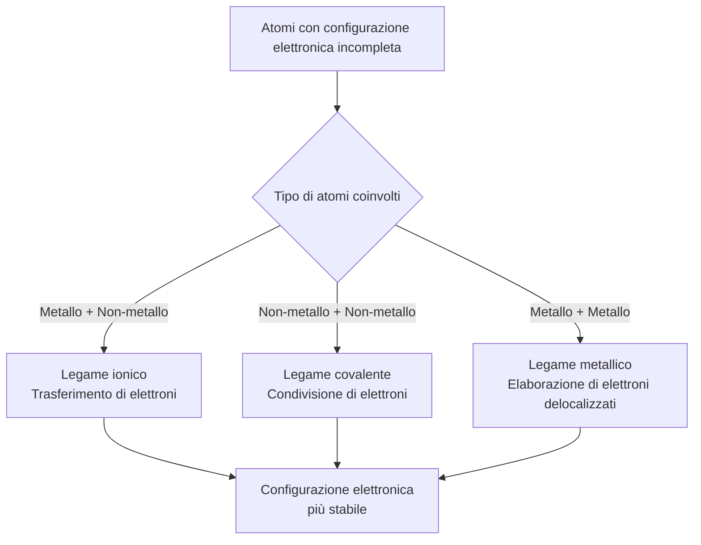
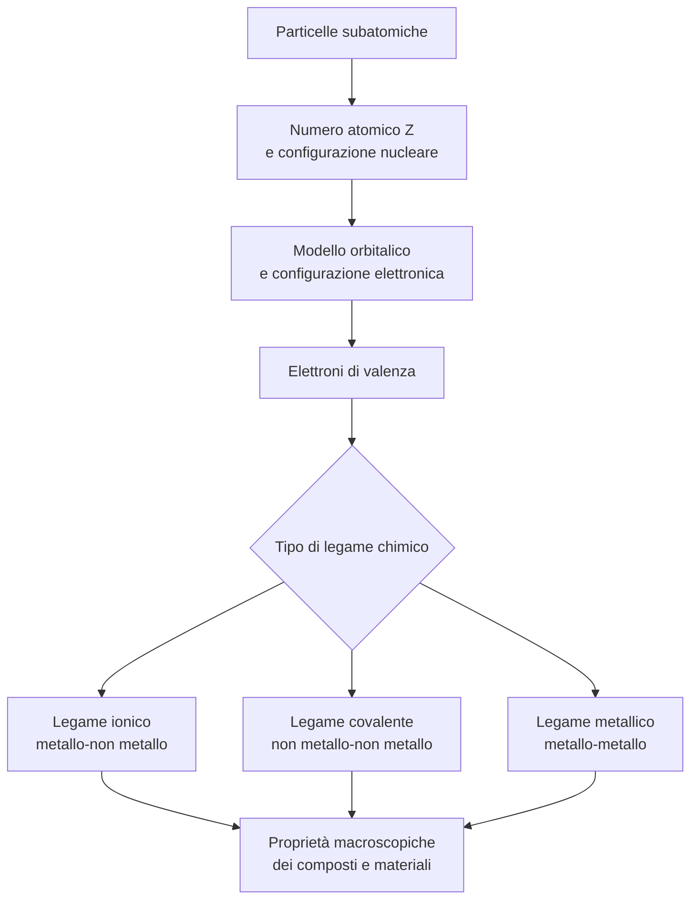

# Chimica – Classe Seconda ITT
## Struttura della materia, modello orbitalico e legami chimici

**Livello:** Istituto Tecnico Tecnologico – Secondo Anno  
**Argomenti trattati:** Particelle subatomiche · Modello orbitalico · Legami chimici  
**Versione:** 1.0

---

## Indice

- [1. Particelle subatomiche](#1-particelle-subatomiche)
  - [1.1 Struttura dell'atomo](#11-struttura-dellatomo)
  - [1.2 Numero atomico e numero di massa](#12-numero-atomico-e-numero-di-massa)
  - [1.3 Isotopi](#13-isotopi)
- [2. Modello orbitalico e proprietà periodiche](#2-modello-orbitalico-e-proprietà-periodiche)
  - [2.1 Dal modello di Bohr al modello orbitalico](#21-dal-modello-di-bohr-al-modello-orbitalico)
  - [2.2 Livelli e sottolivelli energetici](#22-livelli-e-sottolivelli-energetici)
  - [2.3 Configurazione elettronica](#23-configurazione-elettronica)
  - [2.4 Tavola periodica e proprietà periodiche](#24-tavola-periodica-e-proprietà-periodiche)
- [3. Legami chimici](#3-legami-chimici)
  - [3.1 Principio di formazione dei legami](#31-principio-di-formazione-dei-legami)
  - [3.2 Legame ionico](#32-legame-ionico)
  - [3.3 Legame covalente](#33-legame-covalente)
  - [3.4 Legame metallico](#34-legame-metallico)
  - [3.5 Schema riepilogativo e relazioni tra i concetti](#35-schema-riepilogativo-e-relazioni-tra-i-concetti)
- [Glossario dei termini tecnici](#glossario-dei-termini-tecnici)

---

## 1. Particelle subatomiche

### 1.1 Struttura dell'atomo

L'atomo è la più piccola unità di materia che conserva le proprietà chimiche caratteristiche di un elemento. La struttura atomica è articolata in due regioni distinte: il **nucleo** e la **nube elettronica** circostante.

> **Nota tecnica**
> Il nucleo, pur contenendo la quasi totalità della massa atomica, occupa un volume estremamente ridotto rispetto alle dimensioni complessive dell'atomo. Il raggio nucleare è dell'ordine di 10⁻¹⁵ m (femtometri), mentre il raggio atomico è dell'ordine di 10⁻¹⁰ m (ångström): un rapporto di circa 1 : 100.000.

Le tre particelle subatomiche fondamentali che costituiscono l'atomo sono descritte nella tabella seguente:

| Particella | Simbolo | Carica elettrica | Massa (u.m.a.) | Posizione nell'atomo |
|---|---|---|---|---|
| Protone | p⁺ | +1 | 1,0073 | Nucleo |
| Neutrone | n⁰ | 0 | 1,0087 | Nucleo |
| Elettrone | e⁻ | −1 | 0,000549 | Nube elettronica esterna |

> **Definizione**
> **Unità di massa atomica (u.m.a.):** unità convenzionale pari a 1/12 della massa dell'isotopo carbonio-12, equivalente a circa 1,661 × 10⁻²⁷ kg.

---

### 1.2 Numero atomico e numero di massa

Due grandezze fondamentali caratterizzano ogni atomo:

- **Numero atomico (Z):** il numero di protoni presenti nel nucleo. Identifica univocamente l'elemento chimico. In un atomo neutro, Z coincide con il numero di elettroni.
- **Numero di massa (A):** la somma del numero di protoni e neutroni nel nucleo.

$$A = Z + N$$

dove $N$ è il numero di neutroni.

**Esempio – Carbonio:**

$$Z = 6 \quad A = 12 \quad \Rightarrow \quad N = A - Z = 6 \text{ neutroni}$$

La notazione standard per rappresentare un nuclide è:

$$^A_Z\text{X}$$

dove X è il simbolo chimico dell'elemento. Nel caso del carbonio: $^{12}_6\text{C}$.

---

### 1.3 Isotopi

Gli isotopi sono atomi appartenenti allo stesso elemento (identico numero atomico Z) che differiscono nel numero di neutroni, e dunque nel numero di massa A.

> **Definizione**
> **Isotopi:** specie atomiche dello stesso elemento con uguale Z e diverso A. Presentano proprietà chimiche pressoché identiche (determinate dagli elettroni) ma differenti proprietà nucleari, tra cui la stabilità radioattiva.

**Esempio – Isotopi del carbonio:**

| Isotopo | Z | N | A | Stabilità |
|---|---|---|---|---|
| Carbonio-12 (¹²C) | 6 | 6 | 12 | Stabile |
| Carbonio-13 (¹³C) | 6 | 7 | 13 | Stabile |
| Carbonio-14 (¹⁴C) | 6 | 8 | 14 | Radioattivo (β⁻) |

La massa atomica riportata nella tavola periodica è la media ponderata delle masse degli isotopi naturali, pesata in base alla loro abbondanza isotopica relativa.

---

## 2. Modello orbitalico e proprietà periodiche

### 2.1 Dal modello di Bohr al modello orbitalico

Il modello atomico di Bohr (1913), pur avendo rappresentato un importante progresso rispetto al modello classico, descrive gli elettroni come particelle in orbite circolari definite attorno al nucleo. Questo approccio risulta inadeguato per spiegare il comportamento degli atomi polielettronici e i fenomeni di interferenza e diffrazione elettronica.

Il **modello orbitalico quantomeccanico** moderno, derivato dall'equazione di Schrödinger, sostituisce le orbite determinate con il concetto probabilistico di **orbitale atomico**.

> **Definizione**
> **Orbitale atomico:** funzione matematica (funzione d'onda, $\psi$) che descrive la distribuzione di probabilità spaziale di un elettrone attorno al nucleo. La densità di probabilità in un dato punto dello spazio è proporzionale a $|\psi|^2$. Convenzionalmente, l'orbitale è rappresentato come la superficie che racchiude il 90% della probabilità di trovare l'elettrone.

Il passaggio concettuale fondamentale è il seguente: non è possibile conoscere simultaneamente con precisione la posizione e la quantità di moto di un elettrone (principio di indeterminazione di Heisenberg). Si descrive pertanto la distribuzione di probabilità, non la traiettoria.

---

### 2.2 Livelli e sottolivelli energetici

Gli elettroni di un atomo sono organizzati in una struttura energetica gerarchica descritta da quattro numeri quantici. Ai fini introduttivi, si considerano i due livelli di organizzazione principali:

**Livelli energetici principali** (numero quantico principale $n$): identificati dai valori interi $n = 1, 2, 3, 4, \ldots$. Al crescere di $n$, l'energia dell'elettrone e la sua distanza media dal nucleo aumentano.

**Sottolivelli energetici**: ciascun livello $n$ è suddiviso in sottolivelli denominati **s, p, d, f**, caratterizzati da forme geometriche degli orbitali differenti.

| Sottolivello | Numero di orbitali | Numero max di elettroni | Forma degli orbitali |
|---|---|---|---|
| s | 1 | 2 | Sferica |
| p | 3 | 6 | Bilobata (tre orientazioni) |
| d | 5 | 10 | Complessa (cinque orientazioni) |
| f | 7 | 14 | Molto complessa |

> **Nota tecnica**
> Ogni orbitale, indipendentemente dal tipo, può ospitare al massimo **2 elettroni**, con spin opposti (principio di esclusione di Pauli). La capacità massima di un livello $n$ è pari a $2n^2$ elettroni.

La sequenza di riempimento degli orbitali segue la **regola di Aufbau** (ordine crescente di energia), il **principio di Pauli** e la **regola di Hund** (massima molteplicità di spin).

```
Ordine di riempimento degli orbitali (regola di Aufbau):
1s → 2s → 2p → 3s → 3p → 4s → 3d → 4p → 5s → 4d → 5p → ...
```

---

### 2.3 Configurazione elettronica

La configurazione elettronica rappresenta la distribuzione degli elettroni di un atomo nei vari orbitali disponibili, secondo le regole enunciate nella sezione precedente.

**Notazione:** si elencano i sottolivelli nell'ordine di riempimento, con il numero di elettroni come esponente.

**Esempi:**

| Elemento | Z | Configurazione elettronica | Elettroni di valenza |
|---|---|---|---|
| Idrogeno (H) | 1 | 1s¹ | 1 |
| Carbonio (C) | 6 | 1s² 2s² 2p² | 4 |
| Ossigeno (O) | 8 | 1s² 2s² 2p⁴ | 6 |
| Sodio (Na) | 11 | 1s² 2s² 2p⁶ 3s¹ | 1 |
| Cloro (Cl) | 17 | 1s² 2s² 2p⁶ 3s² 3p⁵ | 7 |

> **Definizione**
> **Elettroni di valenza:** elettroni appartenenti all'ultimo livello energetico occupato (livello più esterno). Sono i principali responsabili del comportamento chimico dell'atomo e della formazione dei legami.

La configurazione elettronica è determinante per comprendere la reattività chimica degli elementi e la loro posizione nella tavola periodica.

---

### 2.4 Tavola periodica e proprietà periodiche

La tavola periodica moderna è organizzata in ordine crescente di numero atomico Z. La struttura a periodi (righe) e gruppi (colonne) riflette direttamente la struttura elettronica degli atomi.



Le principali proprietà periodiche sono descritte di seguito:

**Raggio atomico** – misura delle dimensioni dell'atomo, convenzionalmente definita come metà della distanza internucleare tra due atomi identici legati.

- Aumenta scendendo lungo un gruppo (aggiunta di livelli energetici).
- Diminuisce lungo un periodo da sinistra a destra (aumento della carica nucleare a parità di livello esterno, con maggiore attrazione sugli elettroni).

**Energia di ionizzazione (EI)** – energia minima necessaria per rimuovere un elettrone da un atomo allo stato gassoso nel suo stato fondamentale.

$$\text{X}_{(g)} + \text{EI} \rightarrow \text{X}^+_{(g)} + e^-$$

- Diminuisce scendendo lungo un gruppo.
- Aumenta lungo un periodo da sinistra a destra.

**Elettronegatività** – capacità relativa di un atomo di attrarre verso di sé gli elettroni di un legame chimico (scala di Pauling, adimensionale).

| Andamento | Direzione | Effetto |
|---|---|---|
| Lungo un periodo (→) | Da sinistra a destra | Aumenta |
| Lungo un gruppo (↓) | Dall'alto verso il basso | Diminuisce |

> **Nota tecnica**
> Il fluoro (F) è l'elemento con la maggiore elettronegatività nella scala di Pauling (valore: 3,98). Il cesio (Cs) e il francio (Fr) sono i meno elettronegativi tra gli elementi misurabili.

---

## 3. Legami chimici

### 3.1 Principio di formazione dei legami

Gli atomi tendono a formare legami chimici per raggiungere una configurazione elettronica di maggiore stabilità energetica. Per la maggior parte degli elementi del blocco p (dalla seconda alla terza riga), la configurazione più stabile corrisponde all'ottetto elettronico, ovvero otto elettroni nel livello di valenza, analoga a quella dei gas nobili.

> **Definizione**
> **Regola dell'ottetto:** principio secondo cui gli atomi tendono a formare legami sino ad acquisire otto elettroni nel livello di valenza. Gli atomi del secondo periodo (H e He) sono eccezioni, poiché si stabilizzano con due elettroni (duetto).



---

### 3.2 Legame ionico

Il legame ionico si forma tra un atomo con bassa energia di ionizzazione (tipicamente un metallo) che **cede** uno o più elettroni, e un atomo con elevata elettronegatività (tipicamente un non-metallo) che li **acquisisce**.

Il trasferimento di elettroni produce specie cariche denominate **ioni**: catione (carica positiva) e anione (carica negativa). L'attrazione elettrostatica tra ioni di carica opposta costituisce il legame ionico.

**Esempio – Cloruro di sodio (NaCl):**

$$\text{Na} \; (2,8,1) \xrightarrow{-e^-} \text{Na}^+ \; (2,8)$$
$$\text{Cl} \; (2,8,7) \xrightarrow{+e^-} \text{Cl}^- \; (2,8,8)$$

Entrambi gli ioni raggiungono la configurazione dei gas nobili.

| Proprietà dei composti ionici | Descrizione |
|---|---|
| Struttura | Reticolo cristallino tridimensionale |
| Punto di fusione | Elevato (interazioni elettrostatiche intense) |
| Conducibilità elettrica | Nulla allo stato solido; elevata allo stato fuso o in soluzione |
| Solubilità in acqua | Generalmente elevata |

---

### 3.3 Legame covalente

Il legame covalente si forma tra atomi non metallici che **condividono** una o più coppie di elettroni. Ciascuno degli atomi coinvolti contribuisce uno o più elettroni alla coppia condivisa, denominata **coppia di legame** o **coppia condivisa**.

> **Definizione**
> **Legame covalente:** interazione chimica che si stabilisce quando due atomi condividono una o più coppie di elettroni, ciascuno dei quali contribuisce uno o più elettroni al legame.

**Classificazione in base alla polarità:**

| Tipo di legame covalente | Differenza di elettronegatività (Δχ) | Caratteristica |
|---|---|---|
| Covalente puro (apolare) | Δχ ≈ 0 | Distribuzione simmetrica degli elettroni |
| Covalente polare | 0 < Δχ < 1,7 | Distribuzione asimmetrica; momento dipolare parziale |
| (Ionico) | Δχ > 1,7 | Trasferimento pressoché completo dell'elettrone |

**Classificazione in base al numero di coppie condivise:**

| Ordine di legame | Coppie condivise | Esempio |
|---|---|---|
| Legame singolo | 1 | H–H (H₂), H–Cl (HCl) |
| Legame doppio | 2 | O=O (O₂), C=O (CO₂) |
| Legame triplo | 3 | N≡N (N₂), C≡C |

**Esempio – Molecola d'acqua (H₂O):**

L'ossigeno (χ = 3,44) è significativamente più elettronegativo dell'idrogeno (χ = 2,20), pertanto il legame O–H è covalente polare. La molecola d'acqua presenta una geometria angolare e un momento di dipolo netto, con l'ossigeno parzialmente negativo (δ⁻) e i due idrogeni parzialmente positivi (δ⁺).

---

### 3.4 Legame metallico

Il legame metallico è caratteristico degli elementi metallici. In un solido metallico, gli atomi cedono i propri elettroni di valenza a un sistema condiviso comune, dando luogo a una struttura in cui gli ioni metallici positivi sono immersi in un "gas" o "mare" di elettroni **delocalizzati**, cioè non associati a un singolo atomo.

> **Definizione**
> **Delocalizzazione elettronica:** condizione in cui gli elettroni non sono localizzati in un legame specifico tra due atomi, bensì liberi di muoversi su un dominio esteso del materiale.

**Proprietà derivanti dalla struttura del legame metallico:**

| Proprietà | Spiegazione microscopica |
|---|---|
| Conducibilità elettrica | Gli elettroni liberi si muovono sotto l'azione di un campo elettrico |
| Conducibilità termica | Gli elettroni liberi trasportano energia cinetica |
| Duttilità e malleabilità | I piani di ioni possono scorrere senza rompere il legame, poiché gli elettroni si ridistribuiscono |
| Lucentezza metallica | Gli elettroni liberi assorbono e riemettono radiazione luminosa |

---

### 3.5 Schema riepilogativo e relazioni tra i concetti

I tre argomenti principali del documento sono interconnessi secondo la seguente struttura logica:



> **Nota conclusiva**
> La comprensione della struttura atomica e della distribuzione degli elettroni costituisce il fondamento di tutta la chimica. La natura e le proprietà di qualsiasi sostanza – dall'acqua ai polimeri, dai metalli alle ceramiche – dipendono in ultima analisi dalla modalità con cui gli elettroni di valenza degli atomi coinvolti interagiscono tra loro.

---
## Glossario dei termini tecnici

| Termine | Definizione |
|---|---|
| **Atomo** | Unità fondamentale della materia che conserva le proprietà chimiche di un elemento; composto da nucleo e nube elettronica. |
| **Protone** | Particella elementare a carica positiva (+1) localizzata nel nucleo; il suo numero determina l'identità dell'elemento (numero atomico Z). |
| **Neutrone** | Particella elementare elettricamente neutra localizzata nel nucleo; contribuisce alla massa atomica ma non alla carica. |
| **Elettrone** | Particella elementare a carica negativa (−1) che occupa la regione extranucleare; la sua distribuzione determina il comportamento chimico. |
| **Numero atomico (Z)** | Numero di protoni nel nucleo di un atomo; identifica univocamente l'elemento chimico. |
| **Numero di massa (A)** | Somma del numero di protoni e neutroni nel nucleo; A = Z + N. |
| **Isotopo** | Atomo dello stesso elemento (stesso Z) con diverso numero di neutroni (diverso N e quindi diverso A). |
| **Configurazione elettronica** | Distribuzione degli elettroni di un atomo nei livelli e sottolivelli energetici, secondo le regole di Aufbau, Pauli e Hund. |
| **Principio di esclusione di Pauli** | Principio secondo cui nessun elettrone in un atomo può avere i quattro numeri quantici identici; di conseguenza ogni orbitale può ospitare al massimo due elettroni con spin opposto (↑↓). |
| **Principio di indeterminazione di Heisenberg** | Principio secondo cui è impossibile conoscere simultaneamente e con precisione arbitraria sia la posizione sia la quantità di moto di una particella; matematicamente: Δx · Δp ≥ ℏ/2. Implica che gli elettroni non seguono traiettorie definite, ma sono descritti da orbitali probabilistici. |
| **Elettroni di valenza** | Elettroni appartenenti al livello energetico più esterno dell'atomo; direttamente coinvolti nella formazione dei legami chimici. |
| **Regola dell'ottetto** | Tendenza degli atomi a formare legami fino ad acquisire otto elettroni nel livello di valenza, raggiungendo la stabilità dei gas nobili. |
| **Legame ionico** | Legame chimico che si forma per attrazione elettrostatica tra ioni di carica opposta, generati dal trasferimento di elettroni tra un metallo e un non-metallo. |
| **Legame covalente** | Legame chimico che si forma per condivisione di una o più coppie di elettroni tra due atomi, tipicamente non metallici. |
| **Legame covalente polare** | Legame covalente in cui la coppia di elettroni è condivisa in modo asimmetrico a causa della differenza di elettronegatività tra gli atomi coinvolti. |
| **Legame metallico** | Legame chimico tipico dei metalli, caratterizzato da elettroni di valenza delocalizzati su tutto il reticolo cristallino. |
| **Catione** | Ione a carica positiva, ottenuto per perdita di uno o più elettroni da parte di un atomo neutro. |
| **Anione** | Ione a carica negativa, ottenuto per acquisizione di uno o più elettroni da parte di un atomo neutro. |

<!--
## Glossario dei termini tecnici

| Termine | Definizione |
|---|---|
| **Atomo** | Unità fondamentale della materia che conserva le proprietà chimiche di un elemento; composto da nucleo e nube elettronica. |
| **Protone** | Particella subatomica a carica positiva (+1) localizzata nel nucleo; il suo numero determina l'identità dell'elemento (numero atomico Z). |
| **Neutrone** | Particella subatomica elettricamente neutra localizzata nel nucleo; contribuisce alla massa atomica ma non alla carica. |
| **Elettrone** | Particella subatomica a carica negativa (−1) che occupa la regione extranucleare; la sua distribuzione determina il comportamento chimico. |
| **Numero atomico (Z)** | Numero di protoni nel nucleo di un atomo; identifica univocamente l'elemento chimico. |
| **Numero di massa (A)** | Somma del numero di protoni e neutroni nel nucleo; A = Z + N. |
| **Isotopo** | Atomo dello stesso elemento (stesso Z) con diverso numero di neutroni (diverso N e quindi diverso A). |
| **Orbitale atomico** | Funzione matematica (funzione d'onda) che descrive la distribuzione di probabilità spaziale di un elettrone attorno al nucleo. |
| **Configurazione elettronica** | Distribuzione degli elettroni di un atomo nei livelli e sottolivelli energetici, secondo le regole di Aufbau, Pauli e Hund. |
| **Elettroni di valenza** | Elettroni appartenenti al livello energetico più esterno dell'atomo; direttamente coinvolti nella formazione dei legami chimici. |
| **Elettronegatività** | Proprietà relativa di un atomo di attrarre verso di sé la coppia di elettroni di un legame. Espressa sulla scala adimensionale di Pauling. |
| **Energia di ionizzazione** | Energia minima necessaria per rimuovere un elettrone da un atomo neutro in fase gassosa nel suo stato fondamentale. |
| **Raggio atomico** | Misura convenzionale delle dimensioni dell'atomo, definita come metà della distanza internucleare tra due atomi identici legati. |
| **Regola dell'ottetto** | Tendenza degli atomi a formare legami fino ad acquisire otto elettroni nel livello di valenza, raggiungendo la stabilità dei gas nobili. |
| **Legame ionico** | Legame chimico che si forma per attrazione elettrostatica tra ioni di carica opposta, generati dal trasferimento di elettroni tra un metallo e un non-metallo. |
| **Legame covalente** | Legame chimico che si forma per condivisione di una o più coppie di elettroni tra due atomi, tipicamente non metallici. |
| **Legame covalente polare** | Legame covalente in cui la coppia di elettroni è condivisa in modo asimmetrico a causa della differenza di elettronegatività tra gli atomi coinvolti. |
| **Legame metallico** | Legame chimico tipico dei metalli, caratterizzato da elettroni di valenza delocalizzati su tutto il reticolo cristallino. |
| **Delocalizzazione elettronica** | Condizione in cui gli elettroni non sono confinati in un legame tra due atomi specifici, ma si muovono liberamente su un dominio esteso del materiale. |
| **Catione** | Ione a carica positiva, ottenuto per perdita di uno o più elettroni da parte di un atomo neutro. |
| **Anione** | Ione a carica negativa, ottenuto per acquisizione di uno o più elettroni da parte di un atomo neutro. |
| **Reticolo cristallino** | Struttura tridimensionale regolare e periodica in cui sono organizzati gli ioni o gli atomi in un solido cristallino. |
| **Momento di dipolo** | Grandezza vettoriale che misura la separazione di cariche parziali in una molecola polare; dipende dall'intensità delle cariche parziali e dalla distanza che le separa. |--~
