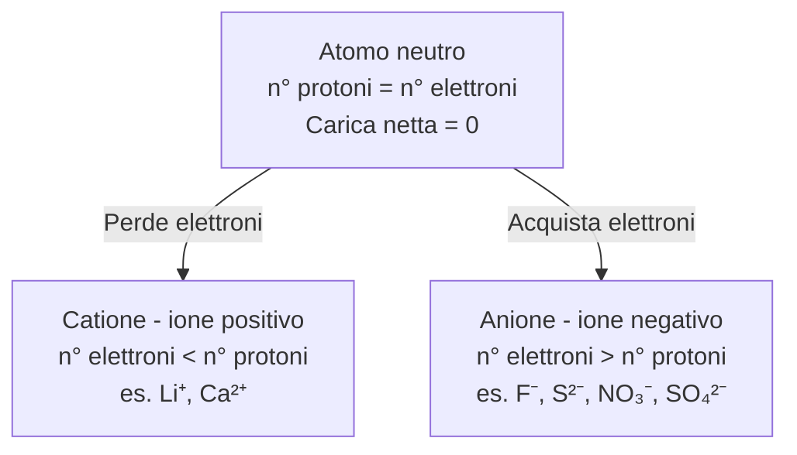
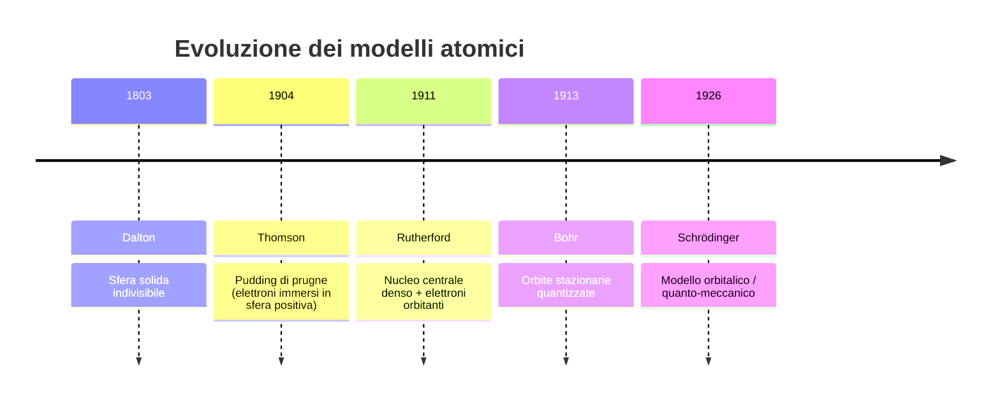
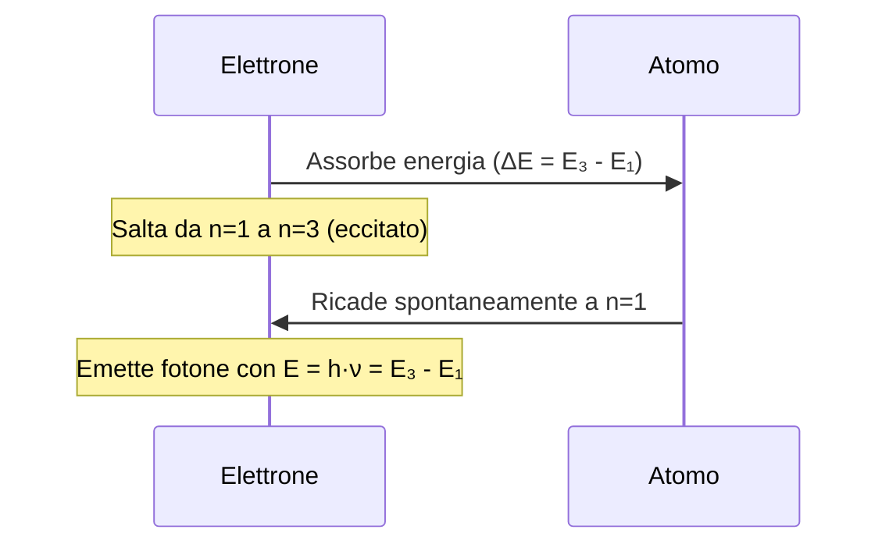
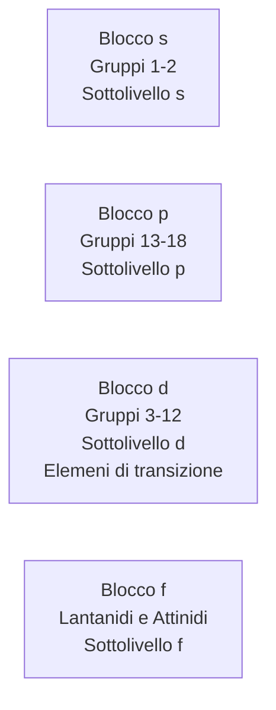
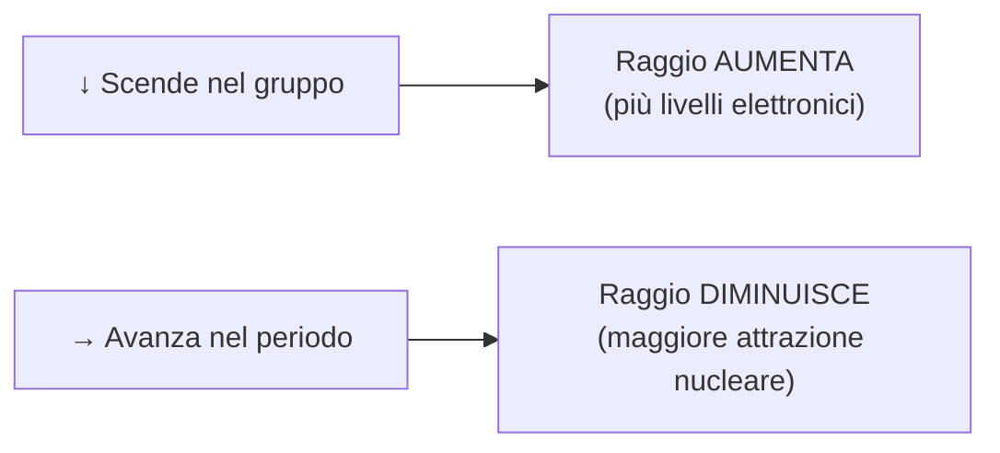
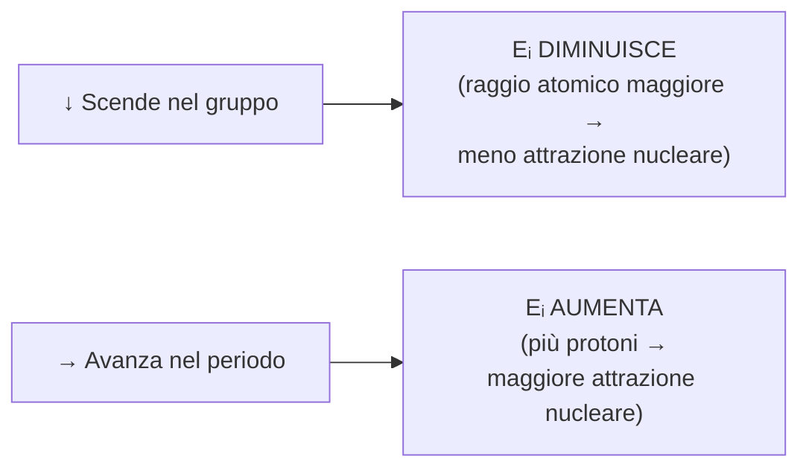
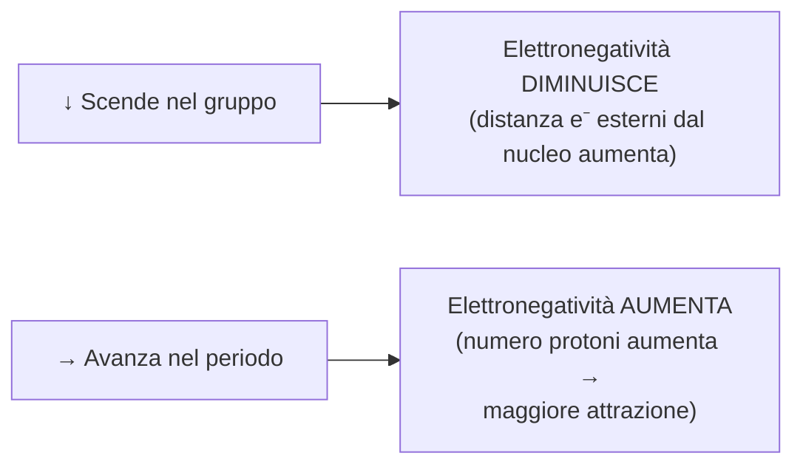
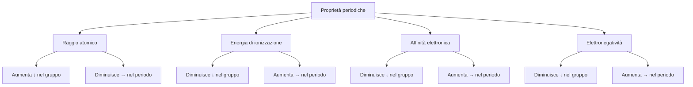

# La Struttura dell'Atomo e i Modelli Atomici

---

## 1. Introduzione: dal modello di Dalton alle particelle subatomiche

**John Dalton** considerava gli atomi come:
- Sfere solide e indivisibili.
- Diverse per ogni elemento.
- La più piccola parte di una sostanza elementare che ne conserva tutte le proprietà.

In realtà gli atomi sono composti da particelle ancora più piccole: le **particelle subatomiche**.

| Particella | Carica | Massa relativa | Posizione |
|---|---|---|---|
| **Protone** (p⁺) | Positiva (+1) | ~1 u.m.a. | Nucleo |
| **Neutrone** (n⁰) | Neutra (0) | ~1 u.m.a. | Nucleo |
| **Elettrone** (e⁻) | Negativa (−1) | ~1/1836 u.m.a. | Orbitali esterni |

---

## 2. Dimensioni dell'atomo e delle particelle subatomiche

```
         raggio atomico: 0,3·10⁻¹⁰ – 3·10⁻¹⁰ m
  ┌──────────────────────────────────────────┐
  │                                          │
  │          (nuvola elettronica)            │
  │                                          │
  │               ●                          │
  │            nucleo                        │
  │    raggio ≈ 1/100 000 del raggio atomico │
  │    contiene quasi tutta la massa         │
  └──────────────────────────────────────────┘
```

> Il nucleo ha un raggio **100 000 volte** più piccolo del raggio atomico, eppure contiene quasi tutta la massa dell'atomo.

### Come fanno i protoni a coesistere nel nucleo?

I protoni hanno tutti carica positiva e si respingerebbero. La coesione è garantita dalla **forza nucleare forte**:
- Agisce solo a distanze infinitamente piccole (scala del nucleo).
- Tiene saldamente uniti protoni e neutroni (**nucleoni**).

---

## 3. La carica elettrica

La **carica elettrica** è una proprietà fisica estensiva delle particelle (come la massa).

> **Regola fondamentale:** cariche dello stesso segno si respingono; cariche di segno opposto si attraggono.

- Unità di misura: **coulomb (C)**
- 1 C = carica associata a 6,24 × 10¹⁸ elettroni

### Atomo neutro, cationi e anioni



> Un atomo può caricarsi solo modificando il **numero degli elettroni**, non dei protoni.

---

## 4. Numero atomico e numero di massa

| Grandezza | Simbolo | Definizione |
|---|---|---|
| **Numero atomico** | Z | Numero di protoni nel nucleo — identifica l'elemento |
| **Numero di massa** | A | Somma di protoni + neutroni (A = Z + n) |

- In un **atomo neutro**: numero di protoni = numero di elettroni.
- Tutti gli atomi di uno stesso elemento hanno **sempre lo stesso Z**.

**Esempi:**
- Carbonio: Z = 6 → 6 protoni, 6 elettroni
- Uranio: Z = 92 → 92 protoni, 92 elettroni

**Notazione standard:**

```
    A
   Z X   →  esempio:  ¹²₆C  (carbonio-12)
```

---

## 5. Evoluzione dei modelli atomici



---

## 6. Il modello atomico di Bohr

### 6.1 Premessa: la radiazione elettromagnetica

La **radiazione elettromagnetica** è energia che si muove nello spazio come un'onda (non necessita di mezzo, si propaga anche nel vuoto). È composta da un campo elettrico e un campo magnetico perpendicolari tra loro e alla direzione di propagazione.

**Grandezze caratteristiche di un'onda:**

| Grandezza | Simbolo | Definizione | Unità |
|---|---|---|---|
| Lunghezza d'onda | λ (lambda) | Distanza tra due creste consecutive | nm, μm |
| Frequenza | ν (ni) | Numero di oscillazioni complete in 1 s | Hz (s⁻¹) |
| Velocità | v | Velocità di spostamento dell'onda | m/s |
| Ampiezza | A | Altezza tra un punto e il punto di equilibrio | — |

**Relazione fondamentale:**

```
v = λ · ν

Nel vuoto: v = c = 3,00 × 10⁸ m/s (velocità della luce)
→ λ e ν sono inversamente proporzionali
```

### 6.2 Lo spettro elettromagnetico

```
Frequenza crescente →
Energia crescente  →

  Onde radio | Microonde | IR | Luce vis. | UV | Raggi X | Raggi γ
  ───────────┴───────────┴────┴───────────┴────┴─────────┴────────
                              ↑
                    4·10¹⁴ Hz ← → intervallo luce visibile
```

La **luce visibile** occupa un intervallo di frequenze molto ristretto. La radiazione solare include luce visibile, UV (A e B) e infrarossi.

### 6.3 I quanti e i fotoni (Max Planck)

Max Planck (1858–1947) ipotizzò che le radiazioni elettromagnetiche siano costituite da **quanti** — "pacchetti" discreti di energia:

```
E = h · ν

h = costante di Planck = 6,63 × 10⁻³⁴ J·s
ν = frequenza della radiazione
```

- I quanti elettromagnetici si chiamano **fotoni**.
- Il fotone è privo di massa ma interagisce con la materia come un corpuscolo.
- Maggiore è la frequenza, maggiore è l'energia del fotone.

> La teoria dei quanti descrive la radiazione elettromagnetica in due modi complementari: come **onda** e come **particella** (fotone).

### 6.4 Gli spettri di emissione

Quando un atomo assorbe energia (calore, luce, scarica elettrica), la riemette sotto forma di luce. Analizzando questa luce si ottiene uno **spettro di emissione a righe** — non continuo.

```
Spettro continuo (luce bianca):
  ████████████████████████████████
  (tutte le lunghezze d'onda)

Spettro a righe (H atomico):
  |   |  |  |
  410 434 486 656  nm
  (solo determinate λ)
```

> La domanda fondamentale: **perché solo certe lunghezze d'onda?** → risposta: il modello di Bohr.

### 6.5 Il modello a strati di Bohr (1913)

Niels Bohr (1885–1962) propose un modello in cui gli elettroni percorrono **orbite circolari stazionarie** attorno al nucleo.

**Postulati principali:**

- Gli elettroni possono orbitare **solo a distanze fisse** dal nucleo → orbite quantizzate.
- Ogni orbita è identificata dal **numero quantico principale n** (n = 1, 2, 3, …).
- A ogni orbita corrisponde una ben precisa energia: le orbite sono anche dette **livelli energetici**.
- Finché l'elettrone rimane sulla stessa orbita **non emette né assorbe energia**.
- Se l'atomo assorbe energia → l'elettrone **salta** a un'orbita più esterna (stato eccitato).
- L'elettrone eccitato **ricade** spontaneamente all'orbita di partenza → emette un **fotone** con energia pari alla differenza tra i due livelli.



**Analogia della scala:**

```
n=4  ──────  ← gradino più alto (energia maggiore)
n=3  ──────
n=2  ──────
n=1  ──────  ← stato fondamentale (energia minima)

L'elettrone può stare solo SUI gradini, mai tra un gradino e l'altro.
```

**Esempio — riga a 486 nm (blu-verde) dell'idrogeno:**
- Transizione: n = 4 → n = 2

**Convenzioni del modello di Bohr:**

- Energia dell'elettrone = 0 a distanza infinita dal nucleo.
- Le energie delle orbite sono sempre **valori negativi**.
- Livelli energetici permessi: da n = 1 a n = 7 (massimo).
- I raggi delle orbite crescono con **n²**.
- Raggio minimo (n=1, atomo di idrogeno) = **53 pm**.
- Stato fondamentale = elettrone nell'orbita con n = 1.

### 6.6 Energia di ionizzazione e affinità elettronica

**Energia di ionizzazione (Eᵢ):** energia minima per rimuovere un elettrone da un atomo isolato allo stato gassoso.

```
Eᵢ¹ < Eᵢ² < Eᵢ³  (cresce ad ogni elettrone rimosso)
```

- È **minima** per rimuovere l'elettrone più esterno (lontano dal nucleo).
- È **massima** per rimuovere l'elettrone più interno.

**Esempio (Na):**
- Eᵢ¹ = 496 kJ/mol
- Eᵢ² = 4562 kJ/mol (~9× maggiore → il 2° elettrone appartiene al livello stabile del neon)

**Affinità elettronica (Eₐₑ):** energia ceduta o assorbita quando un atomo acquista un elettrone diventando anione.

- Generalmente **negativa** (energia rilasciata → anione stabile).
- Valori **positivi** → anione instabile.
- Esempio: Cl ha Eₐₑ negativa (tende ad acquistare elettroni).

---

## 7. Dal modello di Bohr al modello orbitalico

### 7.1 Limiti del modello di Bohr

Il modello di Bohr descriveva perfettamente l'**atomo di idrogeno** ma **falliva** con atomi più complessi (più elettroni).

### 7.2 La natura ondulatoria della materia — de Broglie

Louis de Broglie scoprì che la materia, come la luce, ha una **doppia natura**: particellare e ondulatoria.

Combinando l'equazione di Planck (E = hν) con quella di Einstein (E = mc²) e sostituendo la velocità della luce con la velocità del corpo:

```
λ = h / (m · v)

λ = lunghezza d'onda associata alla particella
m = massa della particella
v = velocità della particella
h = costante di Planck
```

### 7.3 Il principio di indeterminazione — Heisenberg

> **È impossibile misurare contemporaneamente con precisione la posizione e la velocità di un elettrone.**
> La precisione di misura di una grandezza è **inversamente proporzionale** alla precisione dell'altra.

**Esempio:** per localizzare un elettrone devo inviargli un fotone; la collisione modifica posizione e velocità dell'elettrone → non posso conoscerle entrambe con certezza nello stesso istante.

**Conseguenza:** non si possono attribuire orbite definite agli elettroni → il modello di Bohr è superato.

### 7.4 Il modello orbitalico — Schrödinger (1926)

Erwin Schrödinger (1887–1961) formulò un'**equazione d'onda** che descrive il comportamento degli elettroni tenendo conto della loro natura ondulatoria.

- Le soluzioni dell'equazione sono dette **funzioni d'onda** o **orbitali**, indicate con **Ψ (psi)**.
- **Ψ²** esprime la **probabilità** di trovare l'elettrone in un certo volume di spazio attorno al nucleo.

> Un **orbitale** è la regione di spazio attorno al nucleo in cui esiste una probabilità **superiore al 95%** di trovare un elettrone con una determinata energia.

**Differenza chiave:**

| Modello di Bohr | Modello di Schrödinger |
|---|---|
| **Orbita** = traiettoria definita e certa | **Orbitale** = mappa di probabilità (Ψ²) |
| Posizione dell'elettrone nota con certezza | Posizione dell'elettrone solo probabilistica |

---

## 8. Il modello orbitalico: i numeri quantici

Dalle soluzioni dell'equazione di Schrödinger derivano **quattro numeri quantici** che descrivono univocamente ogni elettrone. Ogni elettrone ha una quaterna di numeri quantici **unica**.

### 8.1 Numero quantico principale (n)

| Proprietà | Valore |
|---|---|
| Simbolo | n |
| Descrive | Dimensioni ed energia dell'orbitale |
| Valori ammessi | 1, 2, 3, … (interi positivi) |
| Numero di orbitali per livello n | n² |

- All'aumentare di n: aumentano dimensioni ed energia dell'orbitale.

### 8.2 Numero quantico secondario / azimutale (l)

| Proprietà | Valore |
|---|---|
| Simbolo | l |
| Descrive | Forma dell'orbitale e sottolivello energetico |
| Valori ammessi | 0, 1, 2, … (n−1) |

| Valore di l | Tipo di orbitale | Rappresentazione |
|---|---|---|
| 0 | **s** | sfera |
| 1 | **p** | due lobi (manubrio) |
| 2 | **d** | forma complessa (4 lobi) |
| 3 | **f** | forma molto complessa |

### 8.3 Numero quantico magnetico (m)

| Proprietà | Valore |
|---|---|
| Simbolo | m |
| Descrive | Orientazione dell'orbitale nello spazio (x, y, z) |
| Valori ammessi | −l, …, 0, …, +l |
| Numero di orientazioni per dato l | 2l + 1 |

**Esempio:** per l = 1 → m = −1, 0, +1 → **3 orbitali p** degeneri (stessa energia, diversa orientazione: px, py, pz).

**Orbitali degeneri:** stessi valori di n e l, diverso m → stessa energia.

### 8.4 Numero quantico di spin (mₛ)

- L'elettrone ruota anche attorno al proprio asse → **spin**.
- Può assumere solo **due valori**: mₛ = +½ (spin ↑) oppure mₛ = −½ (spin ↓).

---

## 9. Forma e simboli degli orbitali

### Orbitali s (l = 0)

- Forma **sferica** — simmetrica in tutte le direzioni.
- Uno per ogni livello n.
- Nomenclatura: 1s, 2s, 3s, …
- Rappresentazione: `□` (un quadratino)

### Orbitali p (l = 1)

- Forma a **due lobi** (manubrio).
- Tre orientazioni: **px, py, pz** → orbitali degeneri.
- Il primo livello con orbitali p è n = 2 → **2p**.
- Rappresentazione: `□□□` (tre quadratini)

### Orbitali d (l = 2)

- Forma complessa a **quattro lobi** (eccetto dz²).
- Cinque orientazioni → 5 orbitali d degeneri.
- Il primo livello con orbitali d è n = 3 → **3d**.
- Rappresentazione: `□□□□□` (cinque quadratini)

### Orbitali f (l = 3)

- Forma molto complessa.
- Sette orientazioni → 7 orbitali f degeneri.
- Il primo livello con orbitali f è n = 4 → **4f**.
- Rappresentazione: `□□□□□□□` (sette quadratini)

### Riepilogo

| Tipo | l | Numero di orbitali (2l+1) | Primo livello n |
|---|---|---|---|
| s | 0 | 1 | n = 1 |
| p | 1 | 3 | n = 2 |
| d | 2 | 5 | n = 3 |
| f | 3 | 7 | n = 4 |

---

## 10. Ordine di energia degli orbitali

L'energia degli orbitali dipende da **n** e da **l**.

**Regole:**
- A parità di forma (l), l'energia cresce con n: `1s < 2s < 3s < 4s`
- A parità di livello (n), l'energia cresce con l: `4s < 4p < 4d < 4f`
- Orbitali con stesso n e stesso l → stessa energia (degeneri).

### Diagramma delle diagonali (ordine di riempimento)

```
   1s
   2s  2p
   3s  3p  3d
   4s  4p  4d  4f
   5s  5p  5d  5f
   6s  6p  6d
   7s  7p

Ordine di riempimento (frecce diagonali dal basso verso l'alto):
1s → 2s → 2p → 3s → 3p → 4s → 3d → 4p → 5s → 4d → 5p → 6s → 4f → 5d → 6p → 7s → 5f → 6d → 7p
```

---

## 11. Disposizione degli elettroni negli orbitali

Gli elettroni si distribuiscono secondo tre principi fondamentali:

### Principio della minima energia
> Gli elettroni occupano prima gli orbitali a **minore energia**.

### Principio di esclusione di Pauli
> Due elettroni nello stesso atomo **non possono** avere la stessa quaterna di numeri quantici.
> → In ogni orbitale possono stare **al massimo 2 elettroni**, con spin opposti (↑↓).

### Principio di Hund
> In orbitali degeneri (stessa energia), gli elettroni si dispongono con **spin parallelo**, occupando prima uno per orbitale.
> → Più elettroni con spin parallelo → maggiore stabilità.

```
Esempio: carbonio (Z=6) — distribuzione nei 2p

  2p: [↑] [↑] [ ]   ← corretto (Hund)
  2p: [↑↓][ ] [ ]   ← errato
```

### Configurazione elettronica

La **configurazione elettronica** indica la distribuzione degli elettroni negli orbitali nello stato fondamentale.

**Esempi:**

| Elemento | Z | Configurazione elettronica |
|---|---|---|
| H | 1 | 1s¹ |
| He | 2 | 1s² |
| Li | 3 | 1s² 2s¹ |
| C | 6 | 1s² 2s² 2p² |
| Ne | 10 | 1s² 2s² 2p⁶ |
| Na | 11 | 1s² 2s² 2p⁶ 3s¹ |

---

## 12. La tavola periodica e la sua organizzazione

### 12.1 Periodi

- Vanno da **1 a 7**, corrispondenti al numero quantico principale n.
- Gli elementi dello stesso periodo hanno gli elettroni di valenza nello stesso livello energetico n.
- Il periodo termina sempre con un **gas nobile** (ottetto completo).
- I periodi 6 e 7 includono anche i **lantanidi** e gli **attinidi** (riportati a parte).

### 12.2 Gruppi

- Sono le **colonne** della tavola periodica (18 gruppi).
- Numerazione IUPAC (attuale): numeri arabi 1–18.
- Numerazione romana (vecchia): numeri romani + A o B (es. IIIA, IVB).
- Elementi dello stesso gruppo hanno la **stessa configurazione elettronica esterna** → proprietà chimiche simili.

**Gruppi con nomi speciali:**

| Gruppo | Nome | Esempi | Caratteristica |
|---|---|---|---|
| 1 | Metalli alcalini | Li, Na, K | Molto reattivi |
| 2 | Metalli alcalino-terrosi | Be, Mg, Ca | Abbastanza reattivi |
| 17 | Alogeni | F, Cl, Br, I | Alta affinità elettronica |
| 18 | Gas nobili | He, Ne, Ar, Kr, Xe, Rn | Inerti, stabile |

### 12.3 Blocchi



| Blocco | Gruppi | Sottolivello completato |
|---|---|---|
| **s** | 1–2 | s |
| **p** | 13–18 | p |
| **d** | 3–12 | d (elementi di transizione) |
| **f** | Lantanidi / Attinidi | 4f / 5f (terre rare) |

### 12.4 Metalli, semimetalli e non metalli

```
┌──────────────────────────────────────────────────────┐
│  METALLI          │ Semi- │       NON METALLI        │
│  (sinistra e      │ metal.│       (destra e alto)    │
│   centro)         │       │                          │
│                   │ B     │                          │
│                   │ Si    │  C  N  O  F  Ne          │
│                   │ Ge    │  P  S  Cl Ar             │
│                   │ As    │  Se Br Kr                │
│                   │ Sb    │  Te  I Xe                │
│                   │ Te    │  At Rn                   │
└──────────────────────────────────────────────────────┘
           ↑ linea a zig-zag dal Boro (B) verso il basso
```

**Metalli** (parte sinistra e centrale):
- Buoni conduttori di calore e corrente elettrica.
- Malleabili e duttili.
- Lucentezza tipica.
- Tendono a **perdere elettroni** (cedono e⁻).
- Solidi a temperatura ambiente (eccetto Hg, liquido).
- Spesso si trovano in natura in combinazione con altri elementi (minerali).
- Eccezioni (elementi nativi): Au, Pt.

**Non metalli** (parte destra e in alto):
- Cattivi conduttori di calore e corrente.
- Fragili (se solidi).
- Tendono ad **acquistare elettroni**.
- Alcuni solidi, alcuni gassosi, il bromo (Br) è liquido.

**Semimetalli** (lungo la linea a zig-zag):
- Proprietà intermedie tra metalli e non metalli.
- **Semiconduttori**: conducibilità elettrica modulabile.
- Impiegati in elettronica (computer, smartphone).
- Esempi: Si (silicio), Ge (germanio), As (arsenico).

---

## 13. Proprietà periodiche

### 13.1 Raggio atomico

> Il **raggio atomico** è la semidistanza tra i nuclei di due atomi uguali legati tra loro.



### 13.2 Energia di prima ionizzazione

> L'**energia di ionizzazione (Eᵢ)** è l'energia minima per allontanare l'elettrone più esterno da un atomo isolato allo stato gassoso. Si misura in **kJ/mol**.

- È correlata al **carattere metallico**: i metalli hanno bassa Eᵢ (cedono facilmente elettroni).
- Metalli alcalini (gruppo 1) e alcalino-terrosi (gruppo 2): Eᵢ più bassa.



**Esempio Na — ionizzazioni successive:**

| Ionizzazione | Energia (kJ/mol) | Nota |
|---|---|---|
| 1ª (Na → Na⁺) | 496 | Rimozione elettrone esterno |
| 2ª (Na⁺ → Na²⁺) | 4562 | Rompe configurazione stabile del Ne |

> Il salto enorme tra 1ª e 2ª ionizzazione segnala che il 2° elettrone appartiene a un livello completo (configurazione del gas nobile).

### 13.3 Affinità elettronica

> L'**affinità elettronica (Eₐₑ)** è la variazione di energia quando un atomo neutro, isolato e gassoso, **acquista** un elettrone.

- Generalmente **negativa** (energia rilasciata → anione stabile).
- Più negativa = maggiore tendenza ad acquistare elettroni.
- Valori **positivi** → anione instabile (es. gas nobili).

**Andamento nei gruppi e nei periodi:**

| Tendenza | Affinità elettronica |
|---|---|
| Alogeni (gruppo 17) | Valori molto negativi → fortissima tendenza ad acquistare e⁻ |
| Gas nobili (gruppo 18) | Valori positivi → non acquistano e⁻ |
| Scende nel gruppo | Diminuisce (in valore assoluto) |

> Il **carattere non metallico** è correlato all'affinità elettronica: i non metalli tendono ad acquistare elettroni, formando anioni con configurazione del gas nobile più vicino.

### 13.4 Elettronegatività

> L'**elettronegatività** è la capacità di un atomo, all'interno di una molecola, di attrarre verso di sé gli elettroni di legame.

- Scala di Pauling (Linus Pauling, 1901–1994):
  - Valore **minimo**: Francio (Fr) = **0,7**
  - Valore **massimo**: Fluoro (F) = **4,0**



---

## 14. Riepilogo degli andamenti delle proprietà periodiche

```
                   Raggio atomico    ↓ aumenta nel gruppo
                                     ← diminuisce nel periodo

          Energia di ionizzazione    ↑ diminuisce nel gruppo
                                     → aumenta nel periodo

            Affinità elettronica     ↑ diminuisce nel gruppo (valore assoluto)
                                     → aumenta nel periodo (valore assoluto)

               Elettronegatività     ↑ diminuisce nel gruppo
                                     → aumenta nel periodo

            Carattere metallico      ↓ aumenta nel gruppo
                                     ← aumenta nel periodo (verso sinistra)

         Carattere non metallico     ↑ diminuisce nel gruppo
                                     → aumenta nel periodo (verso destra)
```


