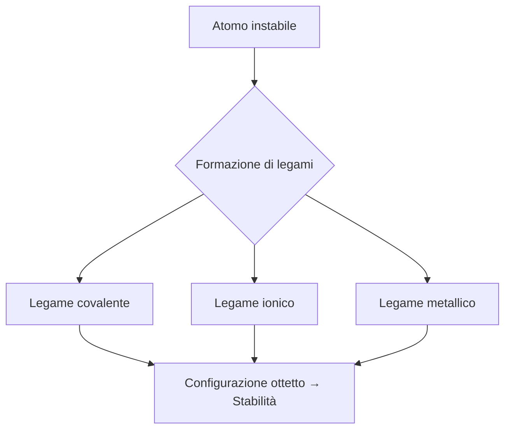
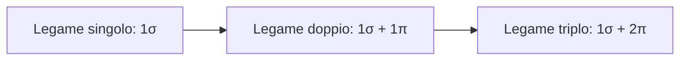
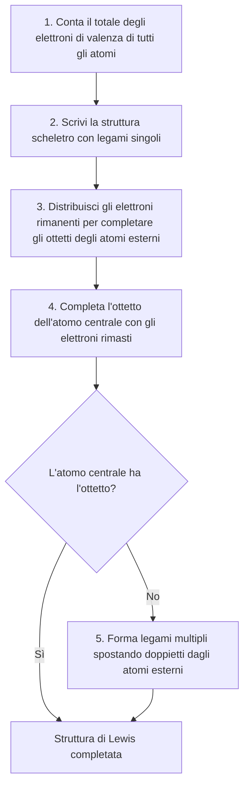
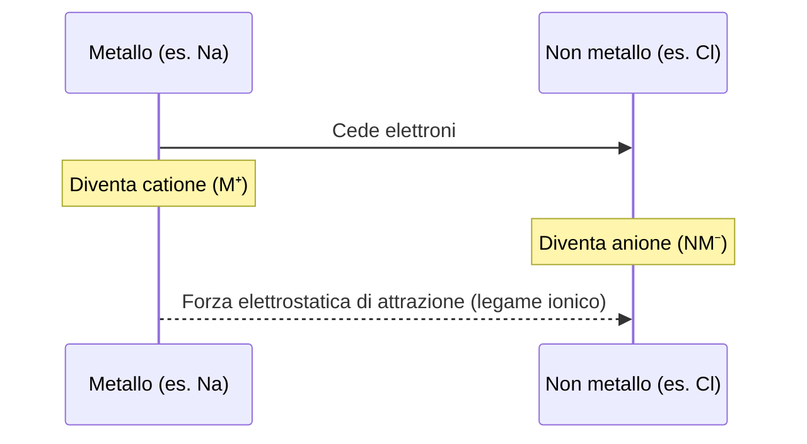
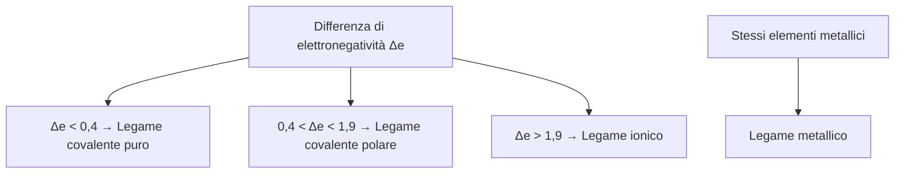

# I Legami Chimici

---

## 1. Perché gli atomi si combinano?

Ogni atomo può essere considerato come un sistema a sé stante, caratterizzato da un proprio valore di energia.

La formazione dei legami chimici avviene **se l'energia potenziale della molecola che si forma è minore dell'energia potenziale totale** posseduta dai singoli atomi: in questo caso l'intero sistema chimico diviene più stabile.

> Gli atomi si legano per raggiungere un sistema con energia minore rispetto agli atomi singoli. La differenza di energia potenziale tra prima e dopo la formazione del legame viene liberata nell'ambiente circostante.

### Schema energetico

```
Energia
potenziale
    |
    *         *       ← atomi singoli (sistema instabile, alta energia)
    |        / \
    |       /   \
    |      /     \
    |_____/   *   \___   ← molecola formata (sistema stabile, bassa energia)
                         (valle energetica)
                    ΔE = energia liberata (linea tratteggiata)
```

---

## 2. Forze che determinano il legame chimico

Quando due atomi si avvicinano, sono soggetti a forze elettriche di due tipi:

| Tipo di forza | Tra quali particelle |
|---|---|
| **Attrattiva** | Nucleo (+) ↔ Elettroni (−) di entrambi gli atomi |
| **Repulsiva** | Nucleo (+) ↔ Nucleo (+) / Elettroni (−) ↔ Elettroni (−) |

A una certa distanza si raggiunge un **equilibrio** tra forze attrattive e repulsive.

### Distanza di legame

La **distanza di legame** (o lunghezza di legame) è il valore medio della distanza tra i nuclei di due atomi legati, che permette l'equilibrio tra forze attrattive e repulsive. Si misura in **ångström (Å)**, dove:

$$1 \text{ Å} = 0{,}1 \text{ nm} = 1 \times 10^{-10} \text{ m}$$

- La distanza di legame **aumenta** all'aumentare delle dimensioni atomiche e al diminuire della forza di legame.
- Si calcola come media tra i raggi atomici dei due atomi coinvolti.
- I nuclei sono in continuo moto vibrazionale → la distanza subisce variazioni minime in funzione della temperatura.

**Analogia con la molla:**

```
Atomo A ~~~[molla]~~~ Atomo B

  Molla rilassata → energia minima (distanza di equilibrio)
  Molla compressa → energia aumenta
  Molla allungata → energia aumenta
```

### Energia di legame

> La **energia di legame** è la quantità di energia necessaria per rompere i legami di **una mole** di sostanza (N_A = 6,022 × 10²³ molecole). Si misura in **kJ/mol**.
> Maggiore è l'energia di legame, più forte è il legame.

---

## 3. I gas nobili e la regola dell'ottetto

Gli elementi del **gruppo VIII (18)** del sistema periodico sono detti **gas nobili** o gas inerti:
- A temperatura ambiente si trovano allo stato gassoso.
- Hanno bassa reattività e grande stabilità.
- Causa: configurazione elettronica esterna con **8 elettroni (ottetto)**.

Il chimico **Gilbert N. Lewis** ipotizzò che anche gli altri atomi tendano a raggiungere la configurazione dell'ottetto attraverso la formazione di legami chimici:



### Eccezioni alla regola dell'ottetto

| Caso | Esempi | Elettroni al livello esterno |
|---|---|---|
| Stabilità con **2 elettroni** | H (1s¹), Li (1s² 2s¹) | 2 (config. dell'elio) |
| Stabilità con **meno di 8 elettroni** (ottetto incompleto) | Be (4e o 2e), B (6e), Al (6e o 8e) | < 8 |
| Stabilità con **più di 8 elettroni** (espansione dell'ottetto) | P (10e), S (12e) | > 8 |

---

## 4. Notazione di Lewis

Nella notazione di Lewis ogni **elettrone di valenza** è rappresentato da un pallino `•` posizionato intorno al simbolo dell'elemento.

**Regola di disposizione:**
1. Si segna un pallino su ciascuno dei 4 lati del simbolo (per i primi 4 elettroni).
2. Si ricomincia, aggiungendo un secondo pallino su ogni lato per formare **doppietti elettronici**.

**Esempio (fluoro, 7 elettroni di valenza):**

```
    •
  • F •
    ••
```

---

## 5. Elettronegatività e tipo di legame

L'**elettronegatività** esprime la capacità di un atomo di attrarre verso di sé gli elettroni di legame.

Il tipo di legame si determina dalla **differenza di elettronegatività (Δe)** tra i due atomi:

```mermaid
graph LR
    A[Calcola Δe = |χ₁ - χ₂|]
    A --> B{Δe < 0,4}
    A --> C{0,4 ≤ Δe ≤ 1,9}
    A --> D{Δe > 1,9}
    B --> E[Legame covalente puro]
    C --> F[Legame covalente polare]
    D --> G[Legame ionico]
```

---

## 6. Il legame covalente

### 6.1 Teoria del legame di valenza

Nel legame covalente gli atomi si legano condividendo gli **elettroni spaiati** dello strato di valenza. Per ogni coppia di elettroni condivisi si forma un legame (con spin opposto).

La **teoria del legame di valenza** ipotizza che:
- Gli orbitali atomici interni restano inalterati.
- Si crea una **sovrapposizione** tra gli orbitali esterni dei due atomi coinvolti.

---

### 6.2 Legame singolo (σ – sigma)

Ogni legame singolo covalente è **sempre di tipo σ (sigma)**. Caratteristiche:

- È diretto **lungo la congiungente dei due nuclei**.
- È un legame **forte**.
- Può formarsi dalla sovrapposizione di:
  - due orbitali `s`
  - due orbitali `p`
  - un orbitale `s` e uno `p`

```
  Nucleo A ●————————● Nucleo B
            [legame σ]
```

---

### 6.3 Legame multiplo (doppio e triplo)

Alcuni atomi raggiungono la configurazione del gas nobile solo condividendo **2 o 3 coppie** di elettroni → legami **doppi** o **tripli**.

In un legame multiplo i legami non sono identici: si distingue un legame **σ** e uno o due legami **π (pi greco)**.



**Evidenze sperimentali sui legami C–C:**

| Tipo di legame | Distanza (Å) | Energia (kJ/mol) |
|---|---|---|
| C—C (singolo) | 1,54 | 348 |
| C=C (doppio) | 1,34 | 614 |
| C≡C (triplo) | 1,20 | 839 |

> I legami multipli sono **più corti** e **più energetici** rispetto al corrispondente legame singolo.

---

### 6.4 Legame covalente puro (omopolare / apolare)

Si forma tra due atomi con **Δe < 0,4** → distribuzione elettronica uniforme.

- Esempi: F₂, O₂, N₂ (stesso elemento → stessa elettronegatività → sempre covalente puro).

---

### 6.5 Legame covalente polare (eteropolare)

Si forma tra due atomi diversi con **0,4 < Δe < 1,9**.

- Gli elettroni di legame sono attratti di più dall'atomo più elettronegativo.
- Si formano **poli parziali**:
  - `δ−` sull'atomo più elettronegativo
  - `δ+` sull'atomo meno elettronegativo

**Esempio: HCl**

```
δ+        δ−
 H ——————— Cl
(χ=2,20)  (χ=3,16)
   Δe = 0,96 → covalente polare
```

---

### 6.6 Legame covalente dativo (o di coordinazione)

Nel legame dativo **entrambi gli elettroni** di legame provengono da **uno solo** dei due atomi coinvolti.

| Ruolo | Caratteristica |
|---|---|
| **Donatore (datore)** | Possiede un doppietto elettronico libero (non impegnato in legami) |
| **Accettore** | Possiede orbitali esterni liberi per accogliere il doppietto |

- Il legame dativo si rappresenta con una **freccia** (→) dal donatore all'accettore, al posto della lineetta.
- Il vantaggio per il donatore è **energetico**: più legami → sistema più stabile.
- Gli elettroni sono contati nell'ottetto **sia del donatore che dell'accettore**.

**Esempio: Acido ipocloroso (HClO)**

```
H — O → Cl
```
(l'ossigeno dona un doppietto al cloro per permettere a quest'ultimo di raggiungere l'ottetto)

---

### 6.7 Linee guida per scrivere le strutture di Lewis

> ⚠️ **Nota:** questo metodo è valido per gli elementi fino al secondo periodo.



---

## 7. Il legame ionico

Il legame ionico si forma per **trasferimento di elettroni** da un atomo metallico a un atomo non metallico, con **Δe > 1,9**.



- **Catione**: ione positivo (metallo che perde elettroni).
- **Anione**: ione negativo (non metallo che acquista elettroni).
- La forza del legame è di tipo **coulombiano** (attrazione tra cariche opposte).

---

### 7.1 Formazione del cloruro di sodio (NaCl)

**Tappa 1 – Formazione degli ioni:**

```
Na(g)  →  Na⁺(g) + e⁻         ΔE = +496 kJ/mol  (energia di ionizzazione)
Cl(g) + e⁻  →  Cl⁻(g)         ΔE = −349 kJ/mol  (affinità elettronica)
──────────────────────────────────────────────────────
Bilancio formazione coppia [Na⁺Cl⁻]:  +147 kJ/mol  (endotermico)
```

**Tappa 2 – Formazione del reticolo cristallino:**

```
[Na⁺(g) + Cl⁻(g)]  →  NaCl(s)    ΔE = −786 kJ/mol  (energia di reticolo)

Bilancio complessivo:
+147 kJ/mol + (−786 kJ/mol) = −639 kJ/mol  ← energia liberata
```

> La notevole diminuzione di energia spiega la **stabilità del reticolo cristallino** e l'elevata temperatura di fusione del NaCl (801 °C).

---

### 7.2 Proprietà dei composti ionici

- **Elevate temperature di fusione** (forti forze di legame).
- La forza di legame **aumenta** con la carica degli ioni (legge di Coulomb) e **diminuisce** con le dimensioni ioniche.

| Composto | Ioni | T. fusione |
|---|---|---|
| NaCl | Na⁺, Cl⁻ | 801 °C |
| KCl | K⁺, Cl⁻ | 776 °C |
| CsCl | Cs⁺, Cl⁻ | 645 °C |
| MgO | Mg²⁺, O²⁻ | 2852 °C |

**Conducibilità elettrica:**

| Stato | Conduce? | Motivo |
|---|---|---|
| Solido cristallino | ❌ No | Ioni in posizioni fisse |
| Fuso o disciolto in acqua | ✅ Sì | Ioni liberi di muoversi |

> Per condurre corrente: (1) deve contenere ioni; (2) gli ioni devono essere liberi di muoversi.

---

### 7.3 Ioni poliatomici

Due o più atomi legati con legami covalenti possono avere nel complesso una carica elettrica → **ione poliatomico**.

| Ione | Formula | Carica |
|---|---|---|
| Ammonio | NH₄⁺ | 1+ |
| Nitrato | NO₃⁻ | 1− |
| Solfato | SO₄²⁻ | 2− |
| Fosfato | PO₄³⁻ | 3− |
| Carbonato | CO₃²⁻ | 2− |

> Gli ioni poliatomici negativi sono più numerosi di quelli positivi.

---

## 8. Il legame metallico

Circa l'**80% degli elementi** della tavola periodica sono metalli. Nel legame metallico ogni atomo mette in condivisione **tutti i propri elettroni di valenza** con un grande numero di atomi dello stesso tipo.

```
  ⊕  ⊕  ⊕  ⊕  ⊕  ⊕
    ~~~~~~~~~~~~~~~~    ← nuvola elettronica (elettroni delocalizzati)
  ⊕  ⊕  ⊕  ⊕  ⊕  ⊕
    ~~~~~~~~~~~~~~~~
  ⊕  ⊕  ⊕  ⊕  ⊕  ⊕

  ⊕ = cationi metallici (posizioni fisse)
  ~ = elettroni liberi (nuvola elettronica)
```

> Il **legame metallico** è l'attrazione che si instaura tra i cationi e la nuvola elettronica in cui sono immersi.

- **Energia di legame**: altamente variabile, da 75 kJ/mol fino a ~1000 kJ/mol.

---

### 8.1 Proprietà dei metalli

La presenza di **elettroni liberi e delocalizzati** spiega le principali proprietà metalliche:

| Proprietà | Spiegazione |
|---|---|
| Buona conducibilità elettrica | Elettroni liberi di muoversi |
| Buona conducibilità termica | Elettroni liberi trasmettono energia |
| Duttilità | Gli strati di atomi scivolano senza rompere il legame |
| Malleabilità | Come la duttilità |

---

### 8.2 Le leghe metalliche

I metalli puri trovano poche applicazioni pratiche. Vengono spesso usati come **leghe metalliche**: miscugli omogenei in cui il componente principale è un metallo fuso, al quale si aggiungono altri elementi per ottenere specifiche proprietà chimico-fisiche.

| Lega | Composizione principale |
|---|---|
| **Ghisa** | Fe + C |
| **Acciaio** | Fe + C + Cr + Ni |
| **Bronzo** | Cu + Sn |
| **Ottone** | Cu + Zn |

---

## Riepilogo: Confronto tra i tipi di legame



| Tipo di legame | Δe | Tra | Elettroni |
|---|---|---|---|
| Covalente puro | < 0,4 | Non metallo – Non metallo (stesso elem.) | Condivisi simmetricamente |
| Covalente polare | 0,4 – 1,9 | Non metallo – Non metallo (diversi) | Condivisi asimmetricamente |
| Ionico | > 1,9 | Metallo – Non metallo | Trasferiti |
| Metallico | — | Metallo – Metallo | Delocalizzati (nuvola) |

---

## Glossario (20 concetti fondamentali – Legami Chimici)

| concetto                     | descrizione / definizione                                                                                                          |
| ---------------------------- | ---------------------------------------------------------------------------------------------------------------------------------- |
| Legame chimico               | Interazione tra atomi che porta alla formazione di molecole o solidi più stabili (energia più bassa rispetto agli atomi separati). |
| Energia potenziale di legame | Energia associata alla posizione degli atomi in un sistema; diminuisce quando si forma un legame stabile.                          |
| Forze attrattive             | Interazioni elettriche tra nuclei positivi ed elettroni negativi che favoriscono il legame.                                        |
| Forze repulsive              | Interazioni tra cariche uguali (nucleo-nucleo, elettrone-elettrone) che ostacolano il legame.                                      |
| Distanza di legame           | Distanza media tra i nuclei di due atomi legati, corrispondente all’equilibrio tra forze attrattive e repulsive.                   |
| Energia di legame            | Energia necessaria per rompere una mole di legami chimici; misura la forza del legame.                                             |
| Regola dell’ottetto          | Tendenza degli atomi a raggiungere 8 elettroni di valenza per ottenere una configurazione stabile simile ai gas nobili.            |
| Gas nobili                   | Elementi del gruppo 18 con configurazione elettronica stabile (ottetto completo) e bassa reattività chimica.                       |
| Elettronegatività            | Capacità di un atomo di attrarre a sé gli elettroni di legame in una molecola.                                                     |
| Legame covalente             | Legame formato dalla condivisione di coppie di elettroni tra due atomi.                                                            |
| Legame covalente puro        | Legame covalente tra atomi identici o con Δe < 0,4, con distribuzione simmetrica degli elettroni.                                  |
| Legame covalente polare      | Legame covalente tra atomi con diversa elettronegatività (0,4 < Δe < 1,9), con cariche parziali δ+ e δ−.                           |
| Legame dativo                | Legame covalente in cui entrambi gli elettroni condivisi provengono dallo stesso atomo (donatore).                                 |
| Legame σ (sigma)             | Legame covalente singolo formato dalla sovrapposizione frontale degli orbitali lungo l’asse internucleare.                         |
| Legame π (pi greco)          | Legame laterale presente nei doppi e tripli legami, più debole del legame σ.                                                       |
| Legame ionico                | Legame dovuto al trasferimento di elettroni tra atomo metallico e non metallico con formazione di ioni.                            |
| Catione                      | Ione positivo formato dalla perdita di elettroni da parte di un atomo.                                                             |
| Anione                       | Ione negativo formato dall’acquisto di elettroni da parte di un atomo.                                                             |
| Energia reticolare           | Energia liberata nella formazione di un solido ionico dal suo reticolo cristallino; misura la stabilità del composto ionico.       |
| Legame metallico             | Legame tra atomi metallici basato su una “nuvola” di elettroni delocalizzati che tengono uniti i cationi metallici.                |

