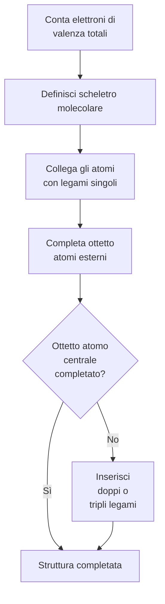
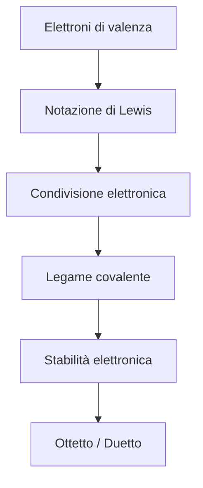

# Notazione di Lewis — Dispensa completa

## 1. Definizione

La notazione di Lewis è una rappresentazione degli elettroni di valenza di un atomo mediante punti (•) disposti attorno al simbolo chimico dell'elemento.

Serve a descrivere:
- la struttura elettronica esterna degli atomi
- la formazione dei legami chimici
- il raggiungimento della stabilità elettronica (ottetto o duetto)

---

## 2. Principio di base

Ogni punto rappresenta un elettrone di valenza.  
Gli elettroni vengono disposti inizialmente come elettroni spaiati sui quattro lati del simbolo chimico e solo successivamente accoppiati.

<table>
<tr>
  <td align="center">&nbsp;</td>
  <td align="center">•</td>
  <td align="center">&nbsp;</td>
</tr>
<tr>
  <td align="center">•</td>
  <td align="center"><b>X</b></td>
  <td align="center">•</td>
</tr>
<tr>
  <td align="center">&nbsp;</td>
  <td align="center">•</td>
  <td align="center">&nbsp;</td>
</tr>
</table>

---

## 3. Rappresentazione di atomi isolati

| Elemento | Struttura di Lewis | Elettroni di valenza |
|---|---|---|
| Idrogeno (H) | <table><tr><td>&nbsp;</td><td align="center">&nbsp;</td><td>&nbsp;</td></tr><tr><td>&nbsp;</td><td align="center"><b>H</b></td><td align="center">•</td></tr><tr><td>&nbsp;</td><td align="center">&nbsp;</td><td>&nbsp;</td></tr></table> | 1 |
| Litio (Li) | <table><tr><td>&nbsp;</td><td align="center">&nbsp;</td><td>&nbsp;</td></tr><tr><td>&nbsp;</td><td align="center"><b>Li</b></td><td align="center">•</td></tr><tr><td>&nbsp;</td><td align="center">&nbsp;</td><td>&nbsp;</td></tr></table> | 1 |
| Carbonio (C) | <table><tr><td>&nbsp;</td><td align="center">•</td><td>&nbsp;</td></tr><tr><td align="center">•</td><td align="center"><b>C</b></td><td align="center">•</td></tr><tr><td>&nbsp;</td><td align="center">•</td><td>&nbsp;</td></tr></table> | 4 |
| Azoto (N) | <table><tr><td>&nbsp;</td><td align="center">•</td><td>&nbsp;</td></tr><tr><td align="center">•</td><td align="center"><b>N</b></td><td align="center">••</td></tr><tr><td>&nbsp;</td><td align="center">•</td><td>&nbsp;</td></tr></table> | 5 |
| Ossigeno (O) | <table><tr><td>&nbsp;</td><td align="center">••</td><td>&nbsp;</td></tr><tr><td align="center">•</td><td align="center"><b>O</b></td><td align="center">•</td></tr><tr><td>&nbsp;</td><td align="center">••</td><td>&nbsp;</td></tr></table> | 6 |
| Fluoro (F) | <table><tr><td>&nbsp;</td><td align="center">••</td><td>&nbsp;</td></tr><tr><td align="center">••</td><td align="center"><b>F</b></td><td align="center">•</td></tr><tr><td>&nbsp;</td><td align="center">••</td><td>&nbsp;</td></tr></table> | 7 |
| Neon (Ne) | <table><tr><td>&nbsp;</td><td align="center">••</td><td>&nbsp;</td></tr><tr><td align="center">••</td><td align="center"><b>Ne</b></td><td align="center">••</td></tr><tr><td>&nbsp;</td><td align="center">••</td><td>&nbsp;</td></tr></table> | 8 |

> [!TIP]
> **Logica della griglia 3×3:** la cella centrale è il simbolo chimico, le celle sopra/sotto/sinistra/destra contengono gli elettroni (`•` spaiato, `••` coppia), gli angoli sono sempre vuoti.

---

## 4. Regola dell'ottetto

Gli atomi tendono a raggiungere una configurazione elettronica stabile con **8 elettroni** nel livello esterno, analoga a quella dei gas nobili.

**Eccezioni:**
- **Idrogeno:** stabile con 2 elettroni (duetto)
- **Berillio e boro:** possono avere ottetto incompleto
- **Elementi del terzo periodo:** possono espandere l'ottetto

> [!WARNING]
> Non confondere la regola dell'ottetto con una legge assoluta. Molecole come BF₃ (6 e⁻ attorno al B) e PCl₅ (10 e⁻ attorno al P) sono stabili pur violandola.

---

## 5. Formazione del legame covalente

Un legame covalente si forma quando due atomi **condividono** una o più coppie di elettroni.

| Tipo di legame | Coppie condivise | Rappresentazione | Esempio |
|---|---|---|---|
| Singolo | 1 | — | H—H |
| Doppio | 2 | = | O=O |
| Triplo | 3 | ≡ | N≡N |

> [!TIP]
> Ogni trattino del legame equivale a **2 elettroni condivisi** (una coppia di legame). Un legame triplo = 6 elettroni condivisi.

---

## 6. Molecole fondamentali

### Idrogeno molecolare (H₂) — legame singolo

<table>
<tr>
  <td align="center">&nbsp;</td>
  <td align="center">&nbsp;</td>
  <td align="center">&nbsp;</td>
  <td align="center">&nbsp;</td>
  <td align="center">&nbsp;</td>
</tr>
<tr>
  <td align="center">&nbsp;</td>
  <td align="center"><b>H</b></td>
  <td align="center">—</td>
  <td align="center"><b>H</b></td>
  <td align="center">&nbsp;</td>
</tr>
<tr>
  <td align="center">&nbsp;</td>
  <td align="center">&nbsp;</td>
  <td align="center">&nbsp;</td>
  <td align="center">&nbsp;</td>
  <td align="center">&nbsp;</td>
</tr>
</table>

### Acqua (H₂O) — 2 legami singoli, 2 coppie solitarie sull'ossigeno

<table>
<tr>
  <td align="center">&nbsp;</td>
  <td align="center">••</td>
  <td align="center">&nbsp;</td>
</tr>
<tr>
  <td align="center"><b>H</b> —</td>
  <td align="center"><b>O</b></td>
  <td align="center">— <b>H</b></td>
</tr>
<tr>
  <td align="center">&nbsp;</td>
  <td align="center">••</td>
  <td align="center">&nbsp;</td>
</tr>
</table>

### Ammoniaca (NH₃) — 3 legami singoli, 1 coppia solitaria sull'azoto

<table>
<tr>
  <td align="center">&nbsp;</td>
  <td align="center">••</td>
  <td align="center">&nbsp;</td>
</tr>
<tr>
  <td align="center"><b>H</b> —</td>
  <td align="center"><b>N</b></td>
  <td align="center">— <b>H</b></td>
</tr>
<tr>
  <td align="center">&nbsp;</td>
  <td align="center">|</td>
  <td align="center">&nbsp;</td>
</tr>
<tr>
  <td align="center">&nbsp;</td>
  <td align="center"><b>H</b></td>
  <td align="center">&nbsp;</td>
</tr>
</table>

### Metano (CH₄) — 4 legami singoli, nessuna coppia solitaria

<table>
<tr>
  <td align="center">&nbsp;</td>
  <td align="center"><b>H</b></td>
  <td align="center">&nbsp;</td>
</tr>
<tr>
  <td align="center">&nbsp;</td>
  <td align="center">|</td>
  <td align="center">&nbsp;</td>
</tr>
<tr>
  <td align="center"><b>H</b> —</td>
  <td align="center"><b>C</b></td>
  <td align="center">— <b>H</b></td>
</tr>
<tr>
  <td align="center">&nbsp;</td>
  <td align="center">|</td>
  <td align="center">&nbsp;</td>
</tr>
<tr>
  <td align="center">&nbsp;</td>
  <td align="center"><b>H</b></td>
  <td align="center">&nbsp;</td>
</tr>
</table>

### Anidride carbonica (CO₂) — 2 legami doppi, coppie solitarie sugli ossigeni

<table>
<tr>
  <td align="center">••</td>
  <td align="center">&nbsp;</td>
  <td align="center">&nbsp;</td>
  <td align="center">&nbsp;</td>
  <td align="center">••</td>
</tr>
<tr>
  <td align="center"><b>O</b></td>
  <td align="center">=</td>
  <td align="center"><b>C</b></td>
  <td align="center">=</td>
  <td align="center"><b>O</b></td>
</tr>
<tr>
  <td align="center">••</td>
  <td align="center">&nbsp;</td>
  <td align="center">&nbsp;</td>
  <td align="center">&nbsp;</td>
  <td align="center">••</td>
</tr>
</table>

---

## 7. Esempi aggiuntivi

### Cl₂ — legame singolo, 3 coppie solitarie per atomo

<table>
<tr>
  <td align="center">&nbsp;</td>
  <td align="center">••</td>
  <td align="center">&nbsp;</td>
  <td align="center">••</td>
  <td align="center">&nbsp;</td>
</tr>
<tr>
  <td align="center">••</td>
  <td align="center"><b>Cl</b></td>
  <td align="center">—</td>
  <td align="center"><b>Cl</b></td>
  <td align="center">••</td>
</tr>
<tr>
  <td align="center">&nbsp;</td>
  <td align="center">••</td>
  <td align="center">&nbsp;</td>
  <td align="center">••</td>
  <td align="center">&nbsp;</td>
</tr>
</table>

### HF — legame singolo, 3 coppie solitarie sul fluoro

<table>
<tr>
  <td align="center">&nbsp;</td>
  <td align="center">&nbsp;</td>
  <td align="center">••</td>
</tr>
<tr>
  <td align="center"><b>H</b></td>
  <td align="center">—</td>
  <td align="center"><b>F</b></td>
</tr>
<tr>
  <td align="center">&nbsp;</td>
  <td align="center">&nbsp;</td>
  <td align="center">••</td>
</tr>
<tr>
  <td align="center">&nbsp;</td>
  <td align="center">&nbsp;</td>
  <td align="center">••</td>
</tr>
</table>

---

## 8. Regole operative

- Gli elettroni di valenza si distribuiscono **uno per lato** prima di formare coppie.
- Un legame covalente corrisponde a una **coppia di elettroni condivisa**.
- Gli atomi tendono a completare **ottetto** (8 e⁻) o **duetto** (2 e⁻ per H).
- Le coppie non condivise si chiamano **coppie solitarie** (o lone pairs).

> [!CAUTION]
> Conta sempre il totale degli elettroni di valenza **prima** di disegnare la struttura. Per gli ioni, aggiungi un e⁻ per ogni carica negativa e sottraili per ogni carica positiva.

---

## 9. Diagramma di flusso — costruzione di una struttura di Lewis

---

## 10. Esercizi progressivi

### Livello 1 — atomi isolati
Rappresentare la struttura di Lewis di: H, C, N, O, F

### Livello 2 — molecole semplici
H₂, Cl₂, HF, CH₄, NH₃

### Livello 3 — molecole con ottetto completo
H₂O, CO₂, N₂, O₂, HCN

### Livello 4 — ioni e risonanza
NH₄⁺, NO₃⁻, CO₃²⁻, SO₂, O₃

> [!TIP]
> Per gli **ioni**: NH₄⁺ ha un e⁻ in meno (totale: 4+1−1 = 8 e⁻); NO₃⁻ ha un e⁻ in più (totale: 5+18+1 = 24 e⁻).

### Livello 5 — avanzato (ottetto espanso)
SO₄²⁻, PO₄³⁻, H₂SO₄, ClO₃⁻, N₂O

> [!WARNING]
> Gli elementi del **terzo periodo** (S, P, Cl…) possono espandere l'ottetto usando gli orbitali d. Non applicare rigidamente la regola dell'ottetto a questi elementi.

---

## 11. Schema riassuntivo

