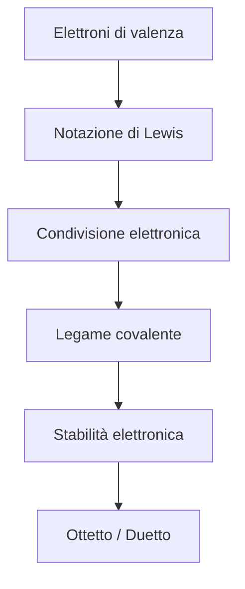

# Notazione di Lewis — Dispensa completa

## 1. Definizione

La notazione di Lewis è una rappresentazione degli elettroni di valenza di un atomo mediante punti (•) disposti attorno al simbolo chimico dell’elemento.

Serve a descrivere:
- la struttura elettronica esterna degli atomi
- la formazione dei legami chimici
- il raggiungimento della stabilità elettronica (ottetto o duetto)

---

## 2. Principio di base

Ogni punto rappresenta un elettrone di valenza.

Gli elettroni vengono disposti inizialmente come elettroni spaiati sui quattro lati del simbolo chimico e solo successivamente accoppiati.

```

•
• X •
•

```

---

## 3. Rappresentazione di atomi isolati

### Idrogeno (H)
```

H•

```

### Litio (Li)
```

Li•

```

### Carbonio (C)
```

•
• C •
•

```

### Azoto (N)
```

••
• N •
•

```

### Ossigeno (O)
```

••
• O •
••

```

### Fluoro (F)
```

••
: F :
•

```

### Neon (Ne)
```

••
: Ne :
••

```

---

## 4. Regola dell’ottetto

Gli atomi tendono a raggiungere una configurazione elettronica stabile con 8 elettroni nel livello esterno, analoga a quella dei gas nobili.

Eccezioni:
- Idrogeno: stabile con 2 elettroni (duetto)
- Berillio e boro: possono avere ottetto incompleto
- Elementi del terzo periodo: possono espandere l’ottetto

---

## 5. Formazione del legame covalente

Un legame covalente si forma quando due atomi condividono una o più coppie di elettroni.

### Legame singolo
```

H-H

```

### Legame doppio
```

O=O

```

### Legame triplo
```

N≡N

```

---

## 6. Molecole fondamentali

### Acqua (H₂O)
```

••
H-O-H
••

```

### Ammoniaca (NH₃)
```

••
H-N-H
|
H

```

### Metano (CH₄)
```

H
|
H-C-H
|
H

```

### Anidride carbonica (CO₂)
```

O=C=O
••   ••

````

---

## 7. Regole operative

- Gli elettroni di valenza si distribuiscono uno per lato prima di formare coppie
- Un legame covalente corrisponde a una coppia di elettroni condivisa
- Gli atomi tendono a completare ottetto o duetto
- L’idrogeno segue la regola del duetto

---

## 8. Diagramma di flusso — costruzione di una struttura di Lewis

```mermaid
flowchart TD
    A[Conta elettroni di valenza totali] --> B[Definisci scheletro molecolare]
    B --> C[Collega gli atomi con legami singoli]
    C --> D[Completa ottetto atomi esterni]
    D --> E{Ottetto atomo centrale completato?}
    E -- Sì --> F[Struttura completata]
    E -- No --> G[Inserisci doppi o tripli legami]
    G --> F
````

---

## 9. Esempi di applicazione

### H₂

```
H-H
```

### Cl₂

```
..     ..
:Cl-Cl:
..     ..
```

### HF

```
H-F
  ..
  ..
  ..
```

---

## 10. Esercizi progressivi

### Livello 1 — atomi

Rappresentare:

* H
* C
* N
* O
* F

---

### Livello 2 — molecole semplici

* H₂
* Cl₂
* HF
* CH₄
* NH₃

---

### Livello 3 — molecole con ottetto completo

* H₂O
* CO₂
* N₂
* O₂
* HCN

---

### Livello 4 — ioni e risonanza

* NH₄⁺
* NO₃⁻
* CO₃²⁻
* SO₂
* O₃

---

### Livello 5 — avanzato

* SO₄²⁻
* PO₄³⁻
* H₂SO₄
* ClO₃⁻
* N₂O

---

## 11. Schema riassuntivo



```
```
