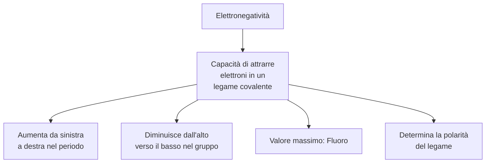
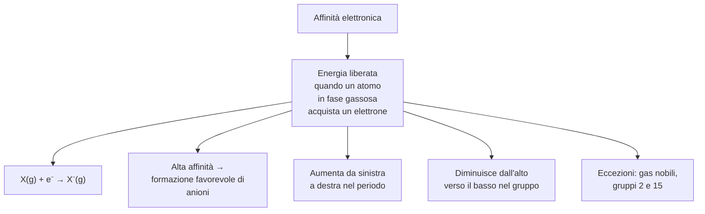
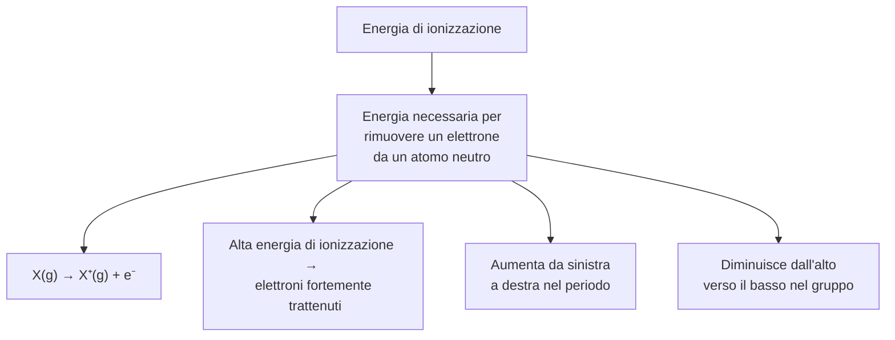
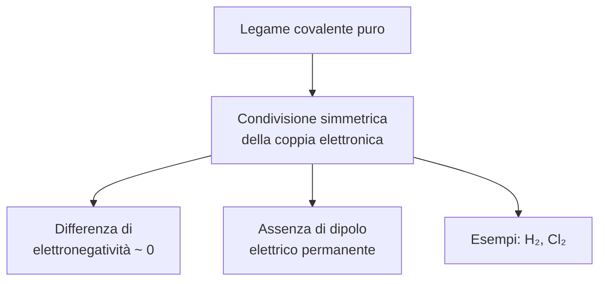
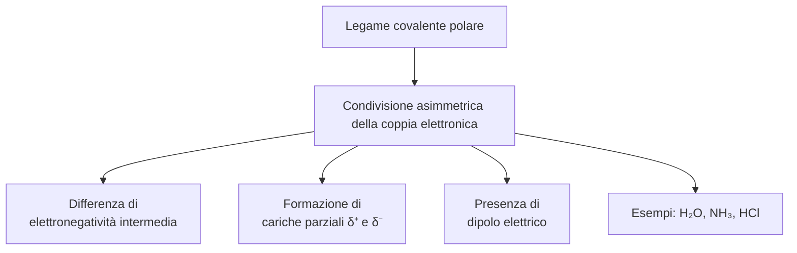
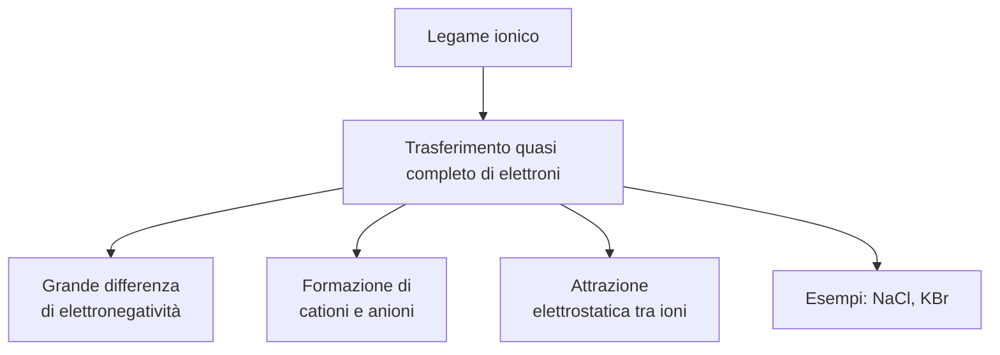
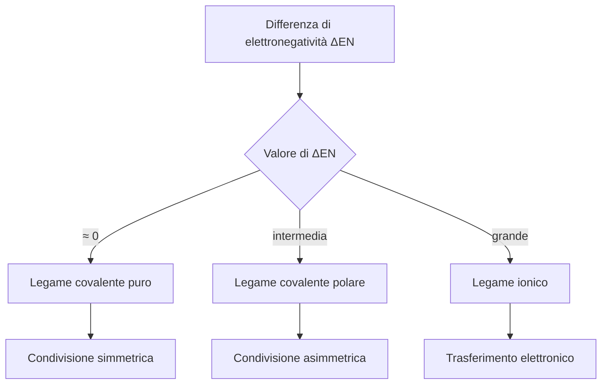
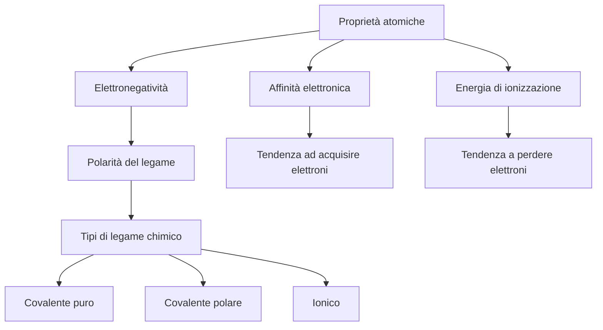

# Mappa concettuale — Proprietà atomiche e legami chimici

## Introduzione

Questo documento presenta una sintesi strutturata delle principali proprietà atomiche e della loro relazione con la formazione dei legami chimici.

La rappresentazione è organizzata in diagrammi di flusso (Mermaid) separati per ciascun concetto fondamentale, al fine di facilitare la comprensione modulare dei contenuti.

---

# 1. Elettronegatività

> [!NOTE]
> L’elettronegatività è una proprietà relativa: descrive la capacità di un atomo *all’interno di un legame chimico* di attrarre verso di sé la densità elettronica condivisa.

---

# 2. Affinità elettronica

> [!NOTE]
> L’affinità elettronica descrive un processo energetico isolato su atomi neutri in fase gassosa. Non deve essere confusa con l’elettronegatività, che si riferisce a sistemi legati.

---

# 3. Energia di ionizzazione

> [!NOTE]
> L’energia di ionizzazione misura la resistenza di un atomo alla perdita di elettroni. È strettamente correlata alla stabilità del guscio elettronico esterno.

---

# 4. Legame covalente puro

> [!NOTE]
> In un legame covalente puro, la densità elettronica è distribuita uniformemente tra i due atomi coinvolti.

---

# 5. Legame covalente polare

> [!NOTE]
> La polarizzazione del legame deriva dallo spostamento della densità elettronica verso l’atomo più elettronegativo.

---

# 6. Legame ionico

> [!NOTE]
> Il legame ionico è dominato dall’interazione coulombiana tra cariche opposte, più che dalla condivisione elettronica.

---

# 7. Relazione tra differenza di elettronegatività e tipo di legame

> [!NOTE]
> La classificazione dei legami in funzione di ΔEN è una approssimazione utile. In realtà, esiste un continuum tra carattere covalente e ionico.

---

# 8. Sintesi delle relazioni fondamentali

> [!NOTE]
> Le proprietà atomiche non sono indipendenti: derivano tutte dall’interazione tra carica nucleare efficace, schermaggio elettronico e distanza degli elettroni dal nucleo.

---

# Conclusione

La comprensione dei legami chimici richiede l’integrazione di tre concetti fondamentali: elettronegatività, affinità elettronica ed energia di ionizzazione. La loro variazione periodica consente di prevedere il comportamento chimico degli elementi e il tipo di legame che essi tendono a formare.
