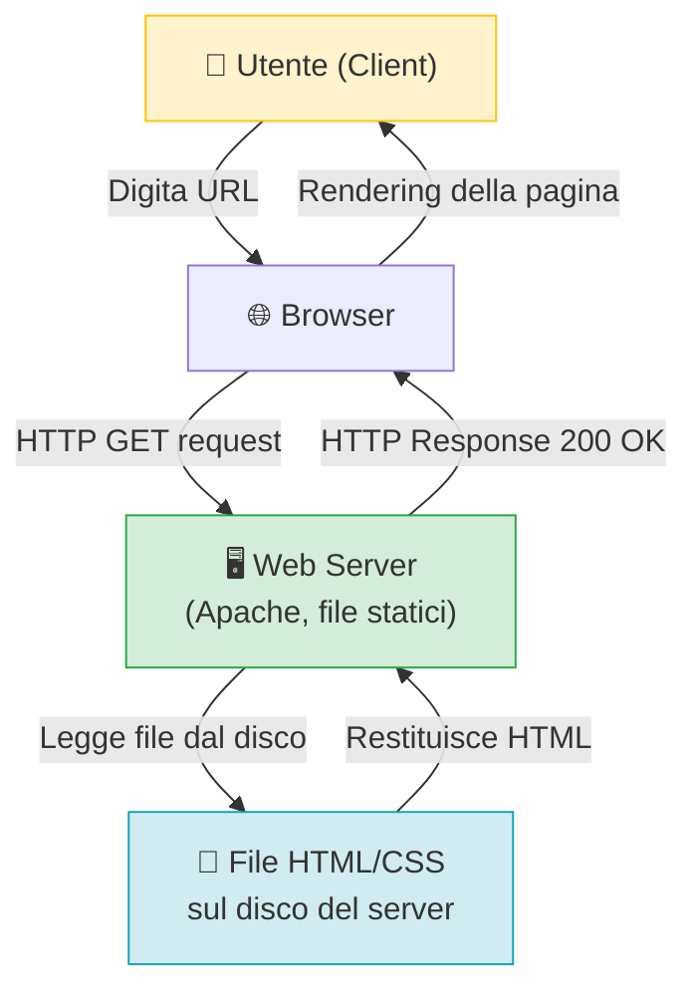
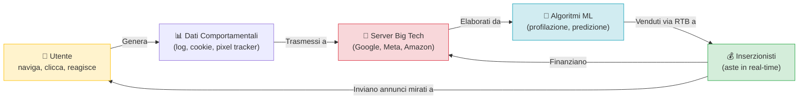
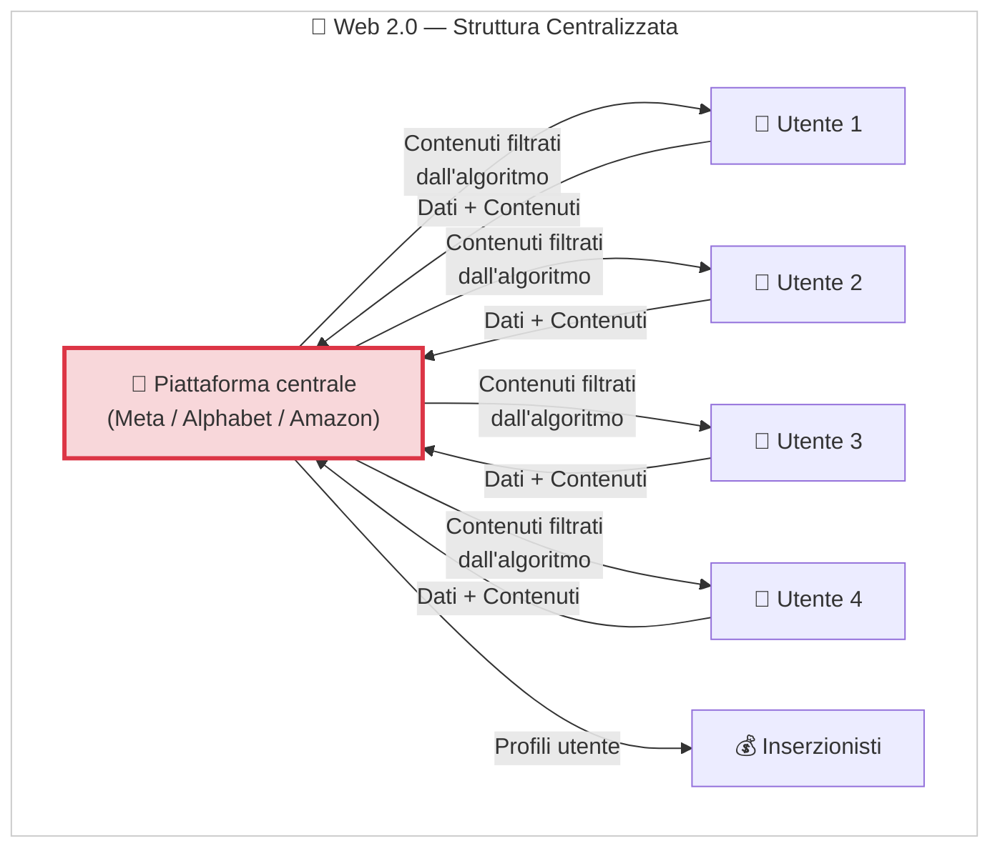
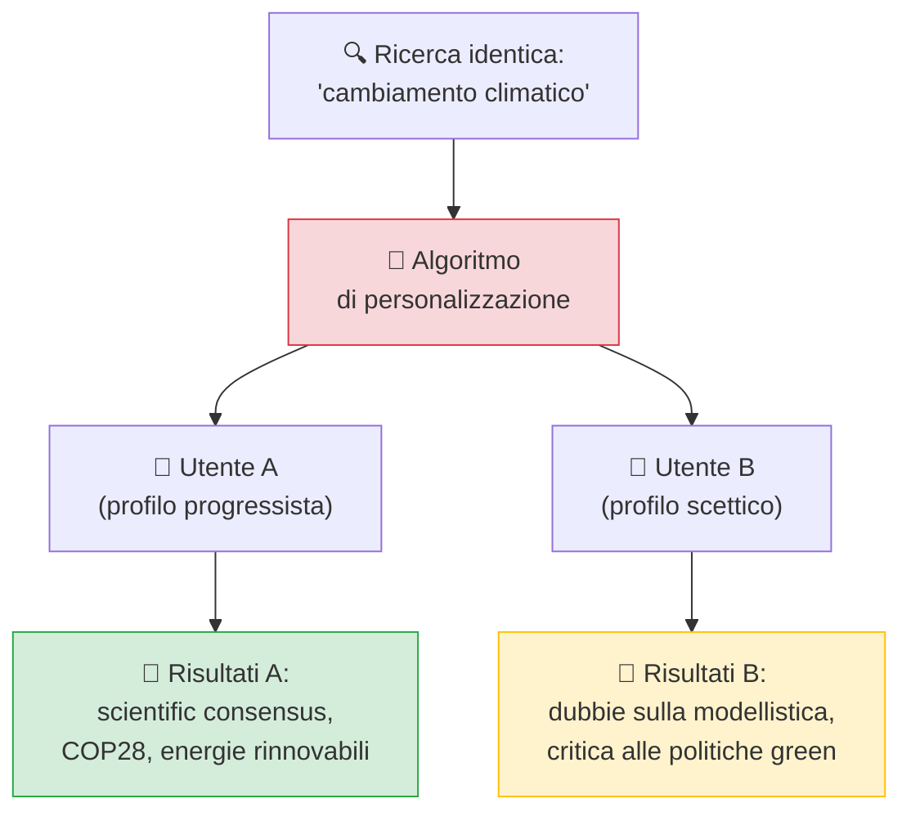
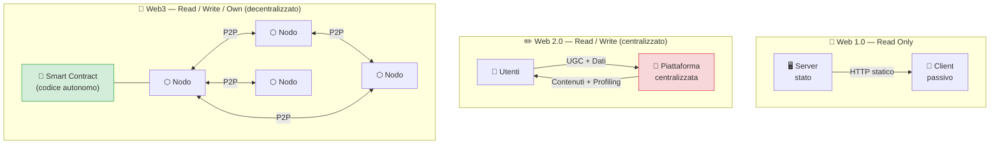
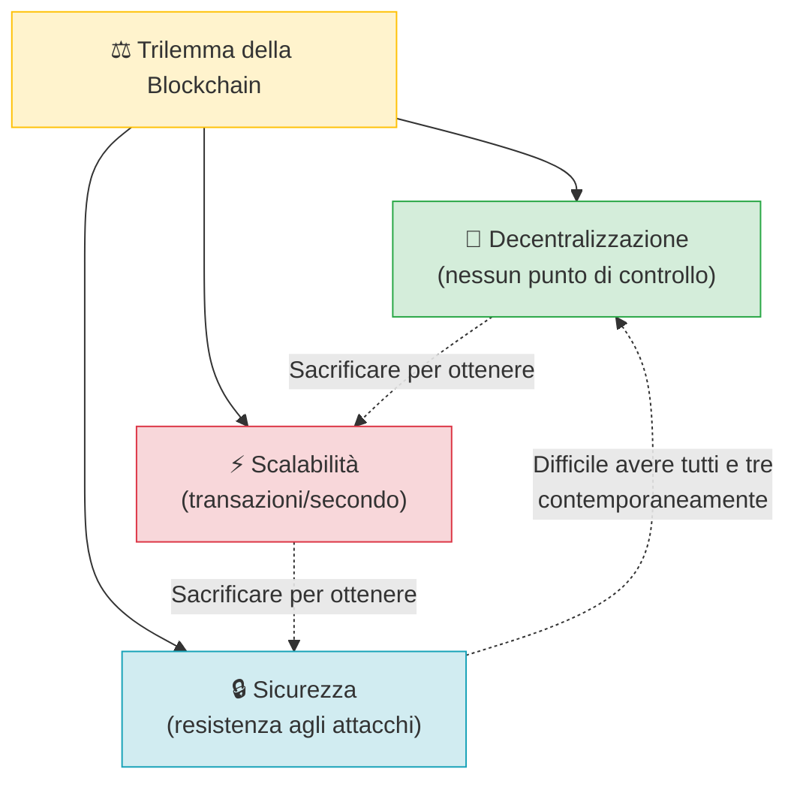
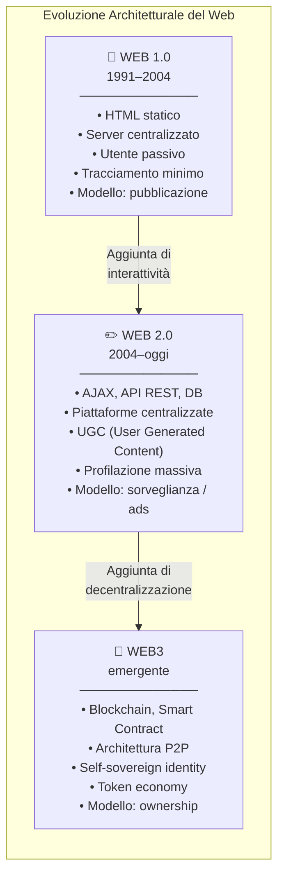
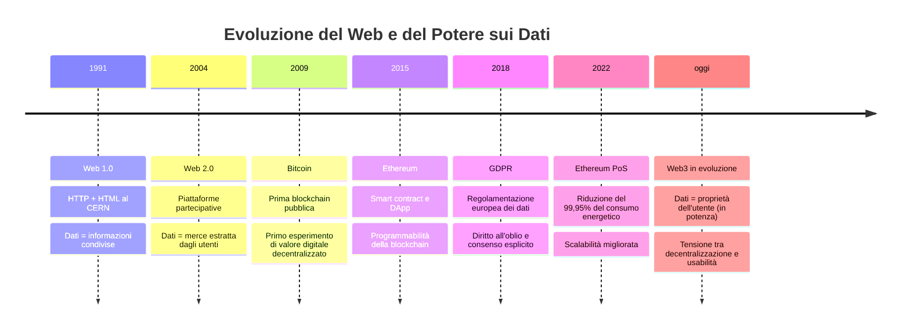

# Evoluzione del Web: Architettura, Dati e Potere Digitale

> **Livello:** Scuola secondaria di secondo grado | **Area:** Educazione Civica / Informatica
> **Obiettivi didattici:** Comprendere l'evoluzione architetturale del web, il modello economico dei dati, e le implicazioni per la privacy e la sovranità digitale.

---

## 1. Web 1.0 — Architettura Read-Only (1991–2004)

### Contesto storico-tecnico

Il World Wide Web nasce nel **1991** al CERN di Ginevra, sviluppato da **Tim Berners-Lee** come sistema di condivisione documentale su rete IP. Il protocollo fondante è l'**HTTP** (*HyperText Transfer Protocol*), che definisce le regole di comunicazione tra client e server, abbinato all'**HTML** (*HyperText Markup Language*) per la strutturazione semantica dei documenti.

Il modello architetturale dominante è **client-server strettamente asimmetrico**: il server eroga contenuti statici pre-compilati (file `.html`, immagini), il client (browser) si limita a riceverli e renderizzarli. Non esistono meccanismi di interazione bidirezionale né di persistenza dello stato utente.

### Caratteristiche tecniche

- **Contenuto statico:** Le pagine sono file HTML pre-generati, non prodotti dinamicamente in risposta a input utente.
- **Assenza di database relazionali lato web:** Nessuna query SQL generata a runtime; i dati sono hardcoded nel markup.
- **Protocollo stateless:** HTTP/1.0 non mantiene sessioni persistenti; ogni richiesta è indipendente.
- **Tracciamento minimo:** I log del server registrano indirizzi IP e URL richiesti, ma non esiste profilazione comportamentale sistematica.

### Schema architetturale

> 👉 **Per i ragazzi:** Navigare nel Web 1.0 era come sfogliare un'enciclopedia digitale. Leggevi, ma non scrivevi. Non lasciavi dati, non avevi un profilo, non venivi "seguito" dal sistema.

---

## 2. Web 2.0 — Architettura Read-Write e Centralizzazione dei Dati (2004–oggi)

### La transizione tecnologica

Il termine **Web 2.0** è attribuito a **Tim O'Reilly** (2004) e descrive un cambio paradigmatico nell'architettura e nell'uso del web. Le innovazioni tecnologiche abilitanti includono:

- **AJAX** (*Asynchronous JavaScript and XML*): permette aggiornamenti parziali della pagina senza ricaricarla completamente, rendendo le interfacce reattive e dinamiche.
- **Database relazionali e NoSQL lato server:** MySQL, PostgreSQL, MongoDB gestiscono contenuti generati dagli utenti (UGC, *User Generated Content*).
- **CDN** (*Content Delivery Network*): reti distribuite di server che accelerano l'erogazione di contenuti multimediali su scala globale.
- **API REST** (*Representational State Transfer*): interfacce standardizzate che permettono a diverse applicazioni di comunicare e scambiarsi dati in tempo reale.

### Il modello economico della sorveglianza

Il Web 2.0 introduce un modello economico basato sulla **raccolta massiva di dati comportamentali** degli utenti, noto in letteratura come **Surveillance Capitalism** (Shoshana Zuboff, 2019).

Il meccanismo funziona attraverso quattro fasi:

1. **Raccolta** (*Data Collection*): ogni interazione — click, tempo di permanenza, scrolling, acquisti, geolocalizzazione — viene registrata nei log dei server e nei cookie di terze parti.
2. **Aggregazione** (*Data Aggregation*): i dati grezzi vengono correlati tra loro e con dati provenienti da fonti esterne (data broker), costruendo profili psicografici dettagliati.
3. **Inferenza** (*Predictive Modeling*): algoritmi di machine learning (es. regressione logistica, reti neurali) calcolano la probabilità che un utente esegua determinate azioni (acquisto, voto, cambio di opinione).
4. **Monetizzazione** (*Targeted Advertising*): i profili predittivi vengono venduti agli inserzionisti attraverso aste in tempo reale (**RTB**, *Real-Time Bidding*) che avvengono in millisecondi ogni volta che si carica una pagina web.

> **"I dati sono il nuovo petrolio"** — Clive Humby, matematico e data scientist, 2006.
> La frase evidenzia che i dati grezzi, come il petrolio, hanno valore solo dopo essere stati "raffinati" (analizzati e trasformati in insight azionabili).

### Il paradosso della partecipazione

Il Web 2.0 appare più "democratico" — chiunque può pubblicare — ma introduce una **centralizzazione strutturale** inedita. Poche corporation controllano l'infrastruttura, i dati e gli algoritmi di distribuzione dei contenuti. Questo crea asimmetrie di potere:

| Dimensione | Web 1.0 | Web 2.0 |
|---|---|---|
| Chi produce contenuti | Aziende, istituzioni | Tutti gli utenti |
| Chi controlla i dati | Nessuno in modo sistematico | Big Tech (Meta, Alphabet, Amazon) |
| Modello economico | Abbonamenti, banner fissi | Pubblicità comportamentale (RTB) |
| Tracciamento utente | Minimo (log IP) | Massivo e persistente |
| Algoritmo di raccomandazione | Nessuno | Ottimizzato per engagement (tempo sullo schermo) |

---

## 3. Implicazioni per la Privacy e i Diritti Digitali

### Cosa perdiamo — analisi scientifica

#### 3.1 Privacy e tracciamento

Il **GDPR** (*General Data Protection Regulation*, Regolamento UE 2016/679) definisce il *dato personale* come «qualsiasi informazione riguardante una persona fisica identificata o identificabile». Nelle piattaforme Web 2.0 sono raccolti sistematicamente:

- **Metadati di navigazione:** URL visitati, durata della sessione, frequenza di accesso.
- **Dati di interazione:** pattern di click, hover, scrolling depth — anche senza che l'utente carichi una pagina esplicitamente.
- **Identificatori persistenti:** cookie di terze parti (in fase di dismissione), fingerprinting del browser (combinazione di user agent, risoluzione schermo, font installati, fuso orario — sufficiente a identificare univocamente un dispositivo nell'87% dei casi, secondo Eckersley, 2010).
- **Dati inferiti:** non forniti direttamente dall'utente, ma dedotti dagli algoritmi (es. orientamento politico, stato di salute, situazione finanziaria).

#### 3.2 Filter Bubble e Camera d'eco

Il concetto di **Filter Bubble** (Eli Pariser, 2011) descrive il fenomeno per cui gli algoritmi di raccomandazione — ottimizzati per massimizzare l'**engagement** (tempo di permanenza, interazioni) — tendono a mostrare contenuti coerenti con le preferenze pregresse dell'utente, riducendo l'esposizione a prospettive diverse.

Meccanismo tecnico: gli algoritmi (es. EdgeRank di Facebook, ora sostituito da sistemi basati su reti neurali profonde) assegnano uno **score di rilevanza** a ogni contenuto combinando:
- Affinità tra utente e fonte
- Tipo di interazione prevista (like > commento > condivisione)
- Decadimento temporale del contenuto

> **Esempio concreto:** Due utenti che cercano "vaccini" su Google riceveranno SERP (*Search Engine Results Page*) diverse in base alla loro cronologia di navigazione, geolocalizzazione e profilo demografico — fenomeno documentato da Hannak et al. (2013) in "Measuring Personalization of Web Search".

---

## 4. Web3 — Verso la Decentralizzazione (paradigma emergente)

### Definizione tecnica

Il termine **Web3** (coniato da **Gavin Wood**, co-fondatore di Ethereum, 2014) indica un'architettura web basata su **tecnologie decentralizzate**, in cui la gestione di dati, identità e transazioni non dipende da un'autorità centrale, ma è distribuita su una rete peer-to-peer.

Le tecnologie fondanti includono:

- **Blockchain:** registro distribuito e immutabile di transazioni, replicato su migliaia di nodi. Ogni blocco contiene un hash crittografico del blocco precedente, garantendo l'integrità della catena.
- **Smart Contract:** programmi auto-eseguibili scritti su blockchain (es. Ethereum con linguaggio Solidity) che eseguono automaticamente condizioni predefinite senza intermediari.
- **Token e criptovalute:** unità di valore native delle blockchain, usate per incentivare la partecipazione alla rete (es. ETH per Ethereum, BTC per Bitcoin).
- **DID** (*Decentralized Identifiers*): identificatori digitali che l'utente controlla autonomamente, senza dipendere da un provider centralizzato.
- **IPFS** (*InterPlanetary File System*): protocollo di archiviazione distribuita in cui i contenuti sono indirizzati tramite hash del contenuto (*content-addressing*) anziché per posizione su server.

### Confronto architetturale

### Caso studio: Brave Browser e il modello BAT

**Brave Browser** è un browser basato su Chromium che implementa un'alternativa al modello pubblicitario tradizionale:

| Componente | Descrizione tecnica |
|---|---|
| **Ad blocking nativo** | Blocco a livello di rete dei tracker e degli annunci tramite liste di filtri (EasyList, uBlock Origin rules) |
| **Brave Shields** | Fingerprinting protection, blocco cookie di terze parti, upgrade HTTPS automatico |
| **BAT** (*Basic Attention Token*) | Token ERC-20 su blockchain Ethereum, usato come valuta di scambio tra utenti, publisher e inserzionisti |
| **Brave Ads** | Sistema opt-in: l'utente sceglie di vedere annunci localmente (matching lato client, nessun dato inviato a server esterni) e riceve il 70% dei ricavi in BAT |

Il modello ribalta la logica del Web 2.0: il **valore economico dell'attenzione** viene (parzialmente) restituito all'utente anziché estratto da intermediari.

---

## 5. Analisi Critica del Web3 — Limiti e Contraddizioni

> ⚠️ La tecnologia non è neutra. Ogni paradigma tecnico incorpora scelte di valore. Analizzare criticamente il Web3 è fondamentale per una cittadinanza digitale consapevole.

### Problemi tecnici e strutturali aperti

#### 5.1 Il Trilemma della Blockchain (Vitalik Buterin)
Le blockchain devono bilanciare tre proprietà in tensione tra loro:

#### 5.2 Impatto energetico

Il meccanismo di consenso **Proof of Work** (PoW), usato da Bitcoin, richiede che i nodi della rete (*miner*) eseguano operazioni computazionali intensive per validare le transazioni. Il costo energetico stimato della rete Bitcoin è comparabile al consumo annuo di stati come Argentina o Norvegia (Cambridge Centre for Alternative Finance, 2023).

Ethereum ha migrato nel 2022 a **Proof of Stake** (PoS), riducendo il consumo energetico del ~99,95% (Ethereum Foundation, 2022), dimostrando che l'impatto energetico non è una caratteristica intrinseca delle blockchain.

#### 5.3 Ricentralizzazione de facto

Nonostante la promessa di decentralizzazione, nel Web3 emergono nuove forme di concentrazione del potere:
- **Whale problem:** pochi grandi possessori di token controllano la governance dei protocolli decentralizzati (DAO, *Decentralized Autonomous Organization*).
- **Infrastruttura centralizzata:** molte DApp (*Decentralized Applications*) si appoggiano a provider cloud centralizzati (AWS, Cloudflare) per il front-end.
- **Exchange centralizzati (CEX):** la maggior parte delle transazioni crypto avviene su piattaforme centralizzate (Binance, Coinbase) che operano come intermediari tradizionali.

#### 5.4 Accessibilità e digital divide

La complessità tecnica del Web3 (gestione di wallet, seed phrase, gas fee) crea barriere all'accesso che possono escludere utenti meno esperti, replicando o amplificando le disuguaglianze digitali esistenti.

---

## 6. Confronto sinottico: Web 1.0 / Web 2.0 / Web3

---

## 7. Attività Pratiche — Laboratorio di Consapevolezza Digitale

### Attività A — Audit dei dati personali

1. **Apri Google Account → Dati e Privacy → La mia attività web e app**
   Osserva quante ricerche, video YouTube e interazioni sono registrate e con quale granularità temporale.

2. **Verifica i permessi delle app sul tuo smartphone:**
   - Android: *Impostazioni → App → Autorizzazioni*
   - iOS: *Impostazioni → Privacy e sicurezza*
   Quante app accedono a microfono, posizione o contatti senza un motivo evidente?

3. **Analizza i cookie di un sito web:**
   - Apri il browser → F12 → tab *Application* → *Cookies*
   - Identifica i cookie di prima parte (stessa origine del sito) e di terza parte (domini diversi = tracker)

### Attività B — Fingerprinting del browser

Visita **coveryourtracks.eff.org** (Electronic Frontier Foundation) e verifica quanto il tuo browser è "unico" e tracciabile senza cookie.

### Attività C — Navigazione normale vs privata vs Tor

Confronta i risultati di una stessa ricerca in:
1. Browser normale (profilo completo)
2. Finestra privata/incognito (cookie rimossi, ma IP visibile)
3. Browser Tor (routing attraverso nodi intermedi, IP mascherato)

Discuti: quali differenze osservate? Quali protezioni agisce ciascuna modalità?

### Domande per la discussione in classe

- Un'app gratuita ha davvero costo zero? Qual è il costo reale?
- Chi possiede i tuoi dati? Tu o la piattaforma su cui li carichi?
- È possibile "uscire" dall'ecosistema Big Tech? A quali costi pratici?
- Il Web3 risolve davvero i problemi del Web 2.0, o li sposta altrove?

---

## 8. Conclusione — La Tecnologia come Scelta Politica

L'evoluzione del web non è stata un processo neutro e inevitabile: ogni architettura incorpora scelte su chi controlla i dati, chi trae valore dall'informazione, chi decide cosa è visibile.

**La domanda non è solo tecnica, ma etica e politica:**

> *Quanto vale la tua privacy?*
> *Chi dovrebbe avere il controllo della tua identità digitale?*
> *Che tipo di internet vogliamo costruire?*

La risposta non la dà la tecnologia. La diamo noi — come utenti, cittadini e, in futuro, come progettisti di sistemi.

---

### Riferimenti e approfondimenti

- Berners-Lee, T. (1999). *Weaving the Web*. Harper Collins.
- Zuboff, S. (2019). *The Age of Surveillance Capitalism*. PublicAffairs.
- Pariser, E. (2011). *The Filter Bubble*. Penguin Press.
- Buterin, V. (2014). *A Next-Generation Smart Contract and Decentralized Application Platform* (Ethereum Whitepaper).
- Eckersley, P. (2010). *How Unique Is Your Web Browser?* EFF / PETS 2010.
- Hannak, A. et al. (2013). *Measuring Personalization of Web Search*. WWW '13.
- Ethereum Foundation (2022). *The Merge: Ethereum's transition to Proof-of-Stake*.
- Cambridge Centre for Alternative Finance (2023). *Cambridge Bitcoin Electricity Consumption Index*.
- Regolamento (UE) 2016/679 — GDPR.
