# L'Handshake nel Networking: Guida Tecnica Completa

> [!NOTE]
> Questo documento approfondisce il concetto di **handshake** nel networking, partendo dall'analogia intuitiva fino ai dettagli tecnici dei principali protocolli. È pensato sia per lo studio sia come riferimento tecnico professionale.

---

## Indice

1. [Il concetto generale di Handshake](#1-il-concetto-generale-di-handshake)
2. [Perché l'Handshake è necessario?](#2-perché-lhandshake-è-necessario)
3. [Handshake Logico vs Fisico](#3-handshake-logico-vs-fisico)
4. [Handshake a Layer 4 — TCP Three-Way Handshake](#4-handshake-a-layer-4--tcp-three-way-handshake)
5. [Handshake a Layer 5/6 — TLS Handshake](#5-handshake-a-layer-56--tls-handshake)
6. [Handshake a Layer 2 — PPP e LCP](#6-handshake-a-layer-2--ppp-e-lcp)
7. [Handshake a Layer 3 — OSPF Neighbor Establishment](#7-handshake-a-layer-3--ospf-neighbor-establishment)
8. [Confronto tra i principali Handshake](#8-confronto-tra-i-principali-handshake)
9. [Handshake e il comando Cisco `show interfaces`](#9-handshake-e-il-comando-cisco-show-interfaces)
10. [Cosa succede quando l'Handshake fallisce?](#10-cosa-succede-quando-lhandshake-fallisce)
11. [Riepilogo concettuale](#11-riepilogo-concettuale)

---

## 1. Il concetto generale di Handshake

### L'analogia umana

Il termine **handshake** (stretta di mano) deriva direttamente dal comportamento umano. Quando due persone si incontrano per la prima volta — o riprendono una conversazione dopo una pausa — non iniziano immediatamente a parlare nel merito. Prima si salutano, si identificano, e si accordano implicitamente su alcune regole della comunicazione (lingua, tono, contesto).

In networking accade esattamente lo stesso: prima che due dispositivi possano scambiarsi dati utili, devono **negoziare le condizioni della comunicazione** attraverso una sequenza di messaggi preliminari.

### Definizione tecnica

Un **handshake di protocollo** è una sequenza strutturata e predefinita di messaggi scambiati tra due entità di rete con l'obiettivo di:

- **Stabilire** che entrambe le parti sono presenti e raggiungibili
- **Negoziare** i parametri della comunicazione
- **Autenticare** le parti (quando richiesto)
- **Sincronizzare** lo stato interno dei due endpoint
- **Autorizzare** l'inizio del trasferimento dati

> [!IMPORTANT]
> L'handshake è un meccanismo **logico**: non dipende dal mezzo fisico. Un cavo perfettamente integro non garantisce che l'handshake abbia successo. È il protocollo, non l'hardware, a gestire questo processo.

### Schema generale di un handshake

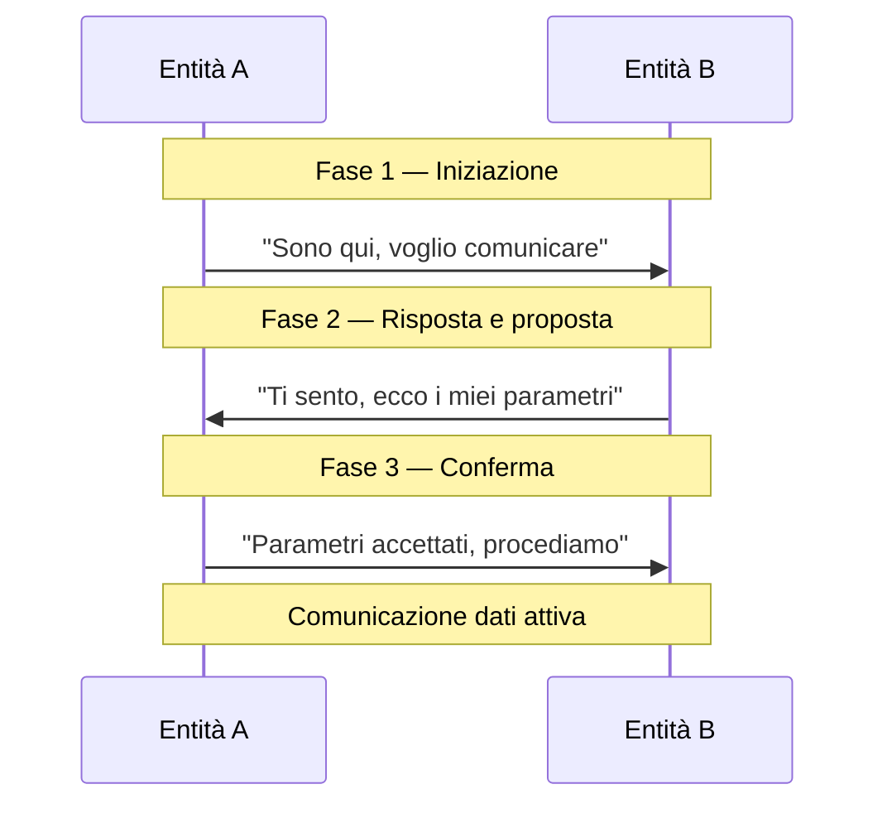

---

## 2. Perché l'Handshake è necessario?

### Il problema della comunicazione distribuita

In una rete, due dispositivi non hanno visibilità diretta sullo stato dell'altro. Non sanno se:

- Il peer è acceso e operativo
- Il peer sta eseguendo lo stesso protocollo
- I parametri di configurazione sono compatibili
- Il canale di comunicazione è affidabile
- Il peer è chi dice di essere (autenticazione)

Senza un handshake, un dispositivo potrebbe iniziare a trasmettere dati verso un peer che:
- Non esiste
- Usa un protocollo diverso
- Ha parametri incompatibili
- Non è pronto a ricevere

### Le domande a cui risponde l'handshake

| Domanda | Meccanismo | Esempio |
|---|---|---|
| Sei presente? | Probe / SYN iniziale | TCP SYN, PPP LCP Configure-Request |
| Sei raggiungibile? | Risposta affermativa | TCP SYN-ACK, PPP LCP Configure-Ack |
| Usiamo gli stessi parametri? | Negoziazione | Dimensione MTU, algoritmo di cifratura |
| Sei chi dici di essere? | Autenticazione | PPP PAP/CHAP, TLS certificati |
| Siamo pronti a comunicare? | Conferma finale | TCP ACK, TLS Finished |

> [!TIP]
> Puoi pensare all'handshake come a una **checklist di sicurezza** che due piloti eseguono prima del decollo: non si parte finché tutte le voci non sono verificate e confermate da entrambe le parti.

---

## 3. Handshake Logico vs Fisico

### La separazione fondamentale

Cisco (e il modello OSI in generale) distingue nettamente tra due livelli di "connessione":

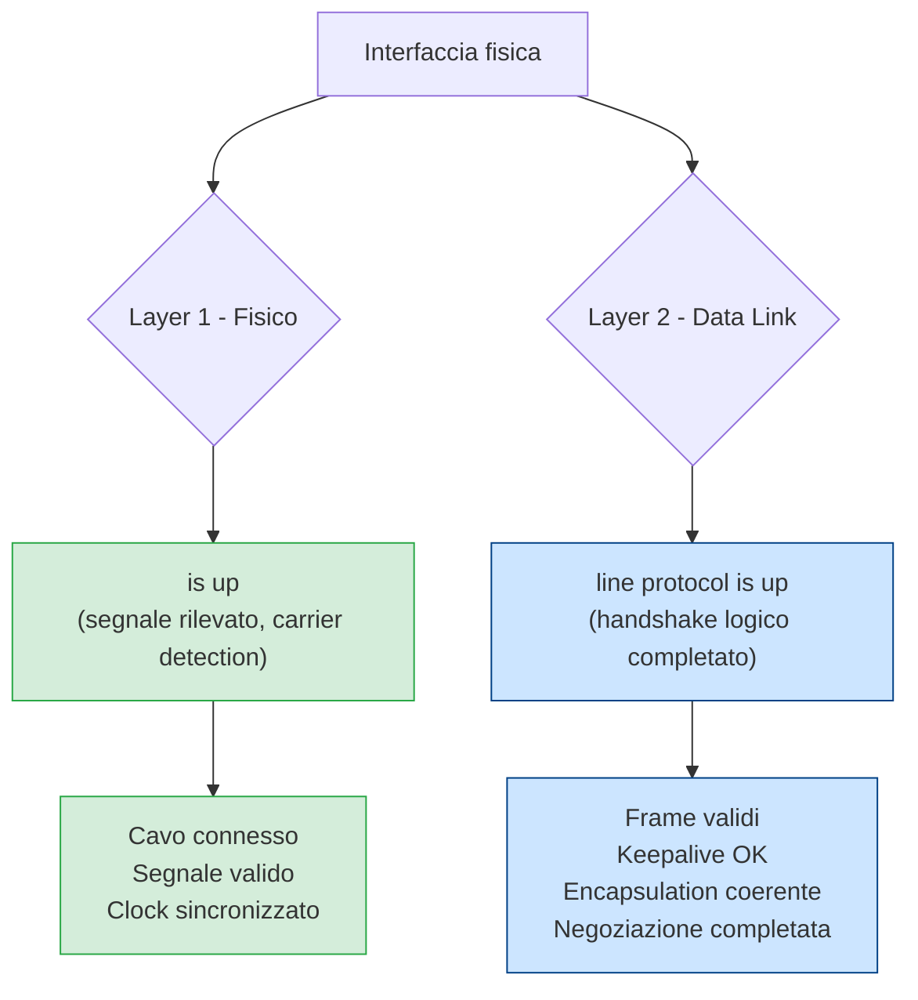

### Layer 1 — Il livello fisico (non è handshake)

Al Layer 1, il rilevamento del segnale è un processo **passivo**:

- Il PHY (Physical Layer chip) rileva la presenza di tensione o segnale ottico
- Verifica la sincronizzazione del clock
- Rileva il carrier (portante)

Questo **non è un handshake**: non c'è scambio di messaggi, non c'è negoziazione, non c'è stato logico. È semplicemente la rilevazione di un segnale fisico.

### Layer 2+ — Il livello logico (vero handshake)

A partire dal Layer 2, entra in gioco la logica di protocollo:

- Si scambiano messaggi strutturati
- Si negoziano parametri
- Si verifica la compatibilità di configurazione
- Si mantiene uno stato condiviso tra i due endpoint

> [!IMPORTANT]
> Questo è il **handshake logico**: una sequenza di messaggi definita dal protocollo, che avviene indipendentemente dal mezzo fisico sottostante. Può fallire anche con un cavo perfetto.

### Esempio pratico: il paradosso del cavo integro

```
Router A ──────────── cavo seriale ──────────── Router B
   │                                                │
   │  encapsulation: PPP                            │  encapsulation: HDLC
   │                                                │
```

In questo scenario:

- `Serial0/0 is up` → **TRUE** (il cavo c'è, il segnale c'è)
- `line protocol is down` → **FALSE** (PPP e HDLC sono incompatibili, la negoziazione fallisce)

Il cavo fisico è perfetto. Il traffico non passa. Il motivo è il fallimento dell'handshake logico.

---

## 4. Handshake a Layer 4 — TCP Three-Way Handshake

### Contesto

TCP (Transmission Control Protocol) è un protocollo **connection-oriented**: prima di trasmettere dati, deve stabilire una connessione logica con il peer. Questo avviene tramite il celebre **three-way handshake** (handshake a tre vie).

### I flag TCP coinvolti

| Flag | Nome | Significato |
|---|---|---|
| `SYN` | Synchronize | Richiesta di sincronizzazione / apertura connessione |
| `ACK` | Acknowledge | Conferma di ricezione |
| `FIN` | Finish | Richiesta di chiusura connessione |
| `RST` | Reset | Chiusura immediata e forzata |

### Il numero di sequenza

Un elemento chiave del TCP handshake è il **Sequence Number (SEQ)**: un numero a 32 bit che identifica la posizione dei dati nel flusso. Durante l'handshake, i due endpoint si sincronizzano sui rispettivi numeri di sequenza iniziali (ISN — Initial Sequence Number).

### Il Three-Way Handshake nel dettaglio

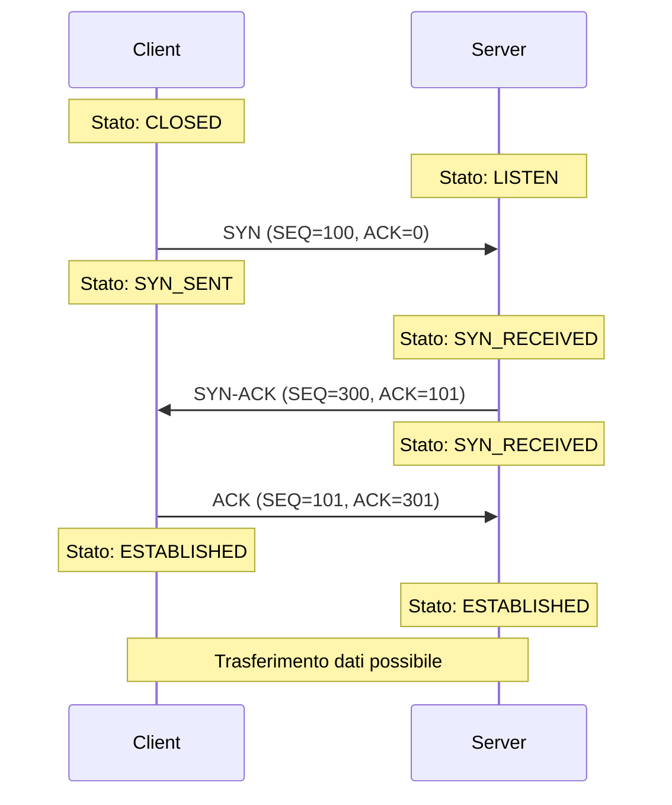

### Analisi passo per passo

#### Passo 1 — SYN (Client → Server)

```
TCP Header:
  SYN = 1
  SEQ = 100   (ISN scelto casualmente dal client)
  ACK = 0     (nessun dato ancora ricevuto)
```

Il client comunica:
- *"Voglio aprire una connessione"*
- *"Il mio numero di sequenza iniziale è 100"*
- *"Da questo momento mi aspetto che tu conti i miei byte a partire da 101"*

#### Passo 2 — SYN-ACK (Server → Client)

```
TCP Header:
  SYN = 1
  ACK = 1
  SEQ = 300   (ISN scelto casualmente dal server)
  ACK = 101   (confermo di aver ricevuto fino al byte 100, mi aspetto il 101)
```

Il server comunica:
- *"Ho ricevuto la tua richiesta"*
- *"Accetto la connessione"*
- *"Il mio numero di sequenza iniziale è 300"*
- *"Mi aspetto il tuo prossimo byte con SEQ=101"*

#### Passo 3 — ACK (Client → Server)

```
TCP Header:
  ACK = 1
  SEQ = 101
  ACK = 301   (confermo di aver ricevuto fino al byte 300 del server)
```

Il client comunica:
- *"Ho ricevuto il tuo SYN-ACK"*
- *"Confermo i tuoi parametri"*
- *"La connessione è stabilita"*

### Perché tre messaggi e non due?

Due messaggi sarebbero sufficienti per il client a sapere che il server è pronto. Ma con due messaggi il **server non saprebbe se il client ha ricevuto correttamente il SYN-ACK**.

Il terzo messaggio (ACK finale) serve proprio a dare al server la conferma che la negoziazione è stata completata con successo da entrambe le parti. Senza di esso, il server rimarrebbe in uno stato di incertezza.

> [!NOTE]
> Il three-way handshake garantisce che **entrambi gli endpoint abbiano sincronizzato i rispettivi numeri di sequenza** e siano pronti a comunicare. È il minimo indispensabile per stabilire una connessione bidirezionale affidabile.

### Chiusura della connessione — Four-Way Handshake

La chiusura di una connessione TCP richiede quattro messaggi, perché i due flussi (client→server e server→client) vengono chiusi **indipendentemente**:

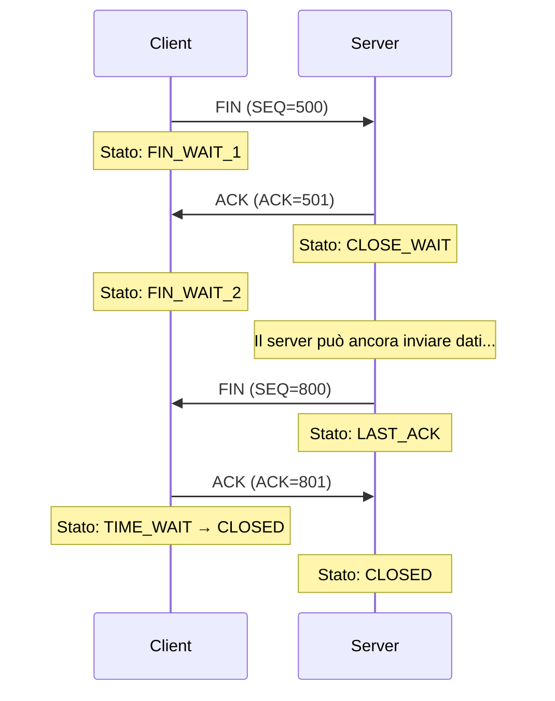

---

## 5. Handshake a Layer 5/6 — TLS Handshake

### Contesto

TLS (Transport Layer Security) opera **sopra TCP** e aggiunge cifratura, autenticazione e integrità alla comunicazione. Il suo handshake è più complesso di quello TCP, perché deve negoziare algoritmi crittografici e verificare identità tramite certificati.

> [!NOTE]
> TLS è ciò che trasforma HTTP in HTTPS. Il TCP handshake avviene prima, poi TLS stabilisce il canale cifrato, e solo dopo inizia il trasferimento HTTP.

### TLS 1.3 Handshake (versione moderna e semplificata)

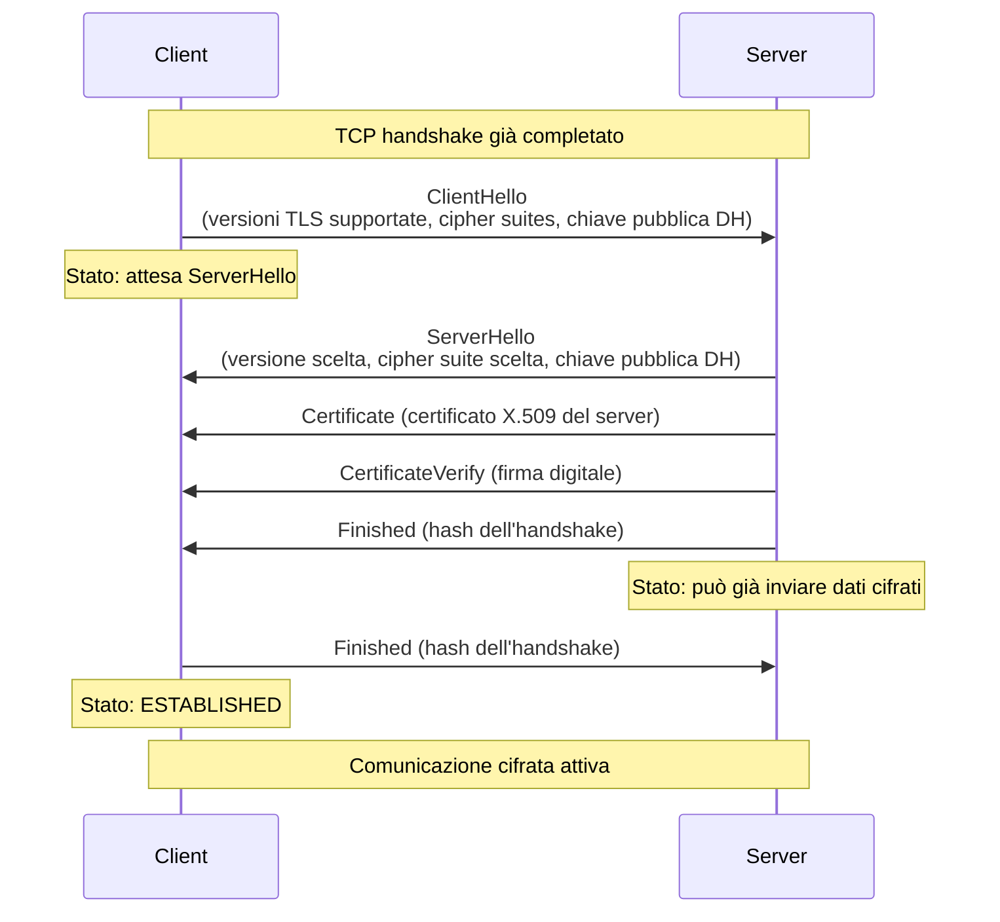

### Cosa viene negoziato nel TLS Handshake

| Parametro | Descrizione | Esempio |
|---|---|---|
| **Versione TLS** | La versione del protocollo da usare | TLS 1.3, TLS 1.2 |
| **Cipher Suite** | Combinazione di algoritmi crittografici | `TLS_AES_256_GCM_SHA384` |
| **Chiave di sessione** | Chiave simmetrica per cifrare i dati | Derivata con Diffie-Hellman |
| **Certificato server** | Identità del server verificata da una CA | X.509 firmato da DigiCert |
| **Autenticazione client** | Opzionale, certificato lato client | Mutual TLS (mTLS) |

### La cipher suite — cosa nasconde quel nome

Una cipher suite come `TLS_AES_256_GCM_SHA384` è una stringa che codifica quattro scelte crittografiche:

```
TLS_AES_256_GCM_SHA384
 │    │       │    │
 │    │       │    └── Algoritmo di hash per HMAC (SHA-384)
 │    │       └─────── Modalità operativa (GCM = Galois/Counter Mode)
 │    └─────────────── Algoritmo di cifratura simmetrica (AES-256)
 └──────────────────── Protocollo (TLS)
```

> [!TIP]
> In TLS 1.3, lo scambio di chiavi avviene **sempre** con Diffie-Hellman, che garantisce la **Perfect Forward Secrecy (PFS)**: anche se la chiave privata del server venisse compromessa in futuro, le sessioni passate rimangono cifrate e irrecuperabili.

---

## 6. Handshake a Layer 2 — PPP e LCP

### Contesto

PPP (Point-to-Point Protocol) è un protocollo Layer 2 usato su collegamenti WAN seriali (e in passato su connessioni dial-up). Prima che il `line protocol` di un'interfaccia PPP risulti `up`, deve completare un handshake articolato in più fasi.

### Le fasi del PPP Link Establishment

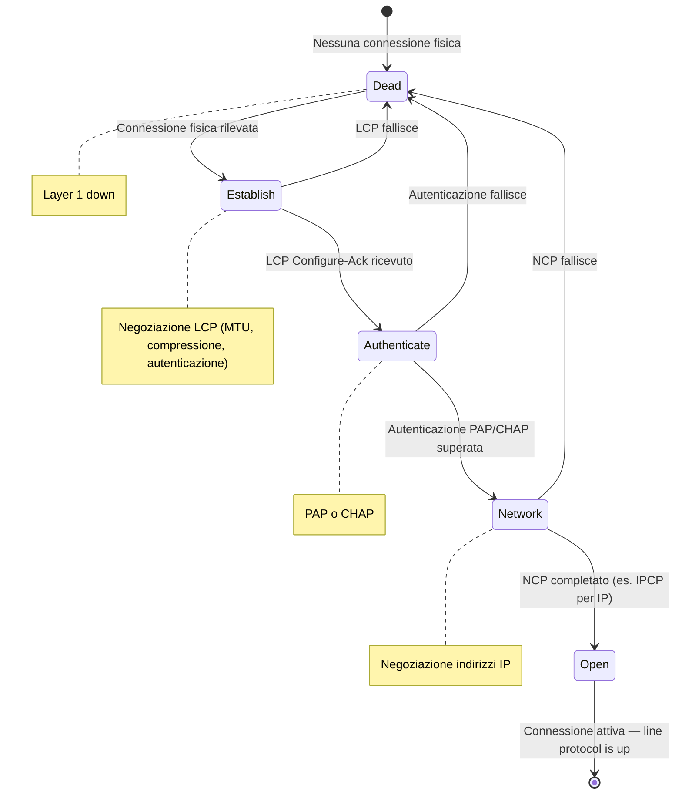

### Fase 1 — LCP (Link Control Protocol)

LCP è il sottoprotocollo PPP che negozia i parametri del collegamento:

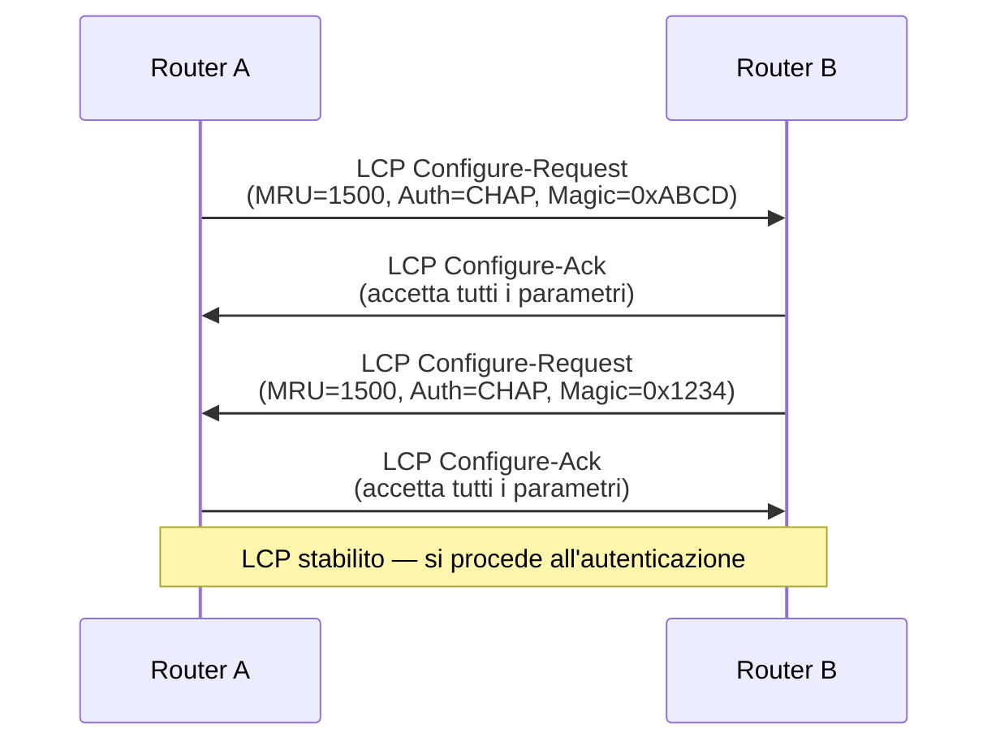

I parametri negoziati da LCP includono:

| Parametro | Significato |
|---|---|
| **MRU** | Maximum Receive Unit — dimensione massima del frame accettabile |
| **Auth Protocol** | Metodo di autenticazione: PAP o CHAP |
| **Magic Number** | Numero casuale per rilevare loop sul collegamento |
| **Compression** | Algoritmi di compressione dei dati |

### Fase 2 — Autenticazione (PAP o CHAP)

#### PAP — Password Authentication Protocol

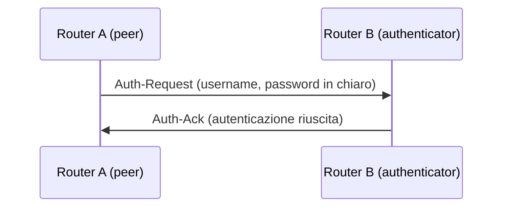

> [!WARNING]
> PAP trasmette le credenziali **in chiaro** sul collegamento. È considerato insicuro e non dovrebbe essere usato su collegamenti non fidati.

#### CHAP — Challenge Handshake Authentication Protocol

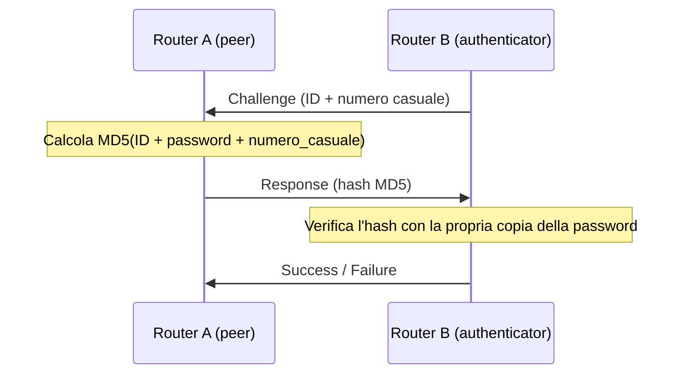

> [!NOTE]
> CHAP non trasmette mai la password sul canale. Usa un **challenge-response**: il peer dimostra di conoscere la password calcolando un hash, senza rivelarla. Inoltre, il challenge viene rinnovato periodicamente durante la sessione per prevenire attacchi replay.

### Fase 3 — NCP (Network Control Protocol)

Dopo l'autenticazione, PPP negozia i parametri del Layer 3 tramite NCP. Per IP si usa **IPCP** (IP Control Protocol):

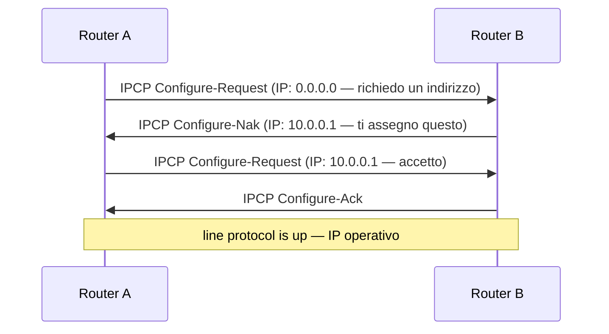

---

## 7. Handshake a Layer 3 — OSPF Neighbor Establishment

### Contesto

OSPF (Open Shortest Path First) è un protocollo di routing a stato di link (Layer 3). Prima di scambiarsi informazioni di routing, due router OSPF devono stabilire una **relazione di adiacenza** (neighbor relationship) attraverso un processo di handshake.

### Gli stati OSPF

```mermaid
stateDiagram-v2
    [*] --> Down : Nessun Hello ricevuto

    Down --> Init : Hello ricevuto dal peer<br/>(ma il nostro RID non è nella lista)

    Init --> 2-Way : Il nostro RID appare nell'Hello del peer<br/>(comunicazione bidirezionale confermata)

    2-Way --> ExStart : Elezione DR/BDR completata<br/>(su reti multi-access)

    ExStart --> Exchange : Master/Slave determinati<br/>DBD iniziale scambiato

    Exchange --> Loading : LSA summary scambiati<br/>(Database Description)

    Loading --> Full : Tutti gli LSR soddisfatti<br/>Database sincronizzato

    Full --> [*] : Adiacenza completa — routing attivo
```

### Il processo passo per passo

#### Down → Init: ricezione del primo Hello

```
OSPF Hello packet:
  Router ID: 2.2.2.2
  Hello Interval: 10s
  Dead Interval: 40s
  Area ID: 0.0.0.0
  Neighbor list: (vuota)
```

Router A riceve un Hello da Router B, ma non vede il proprio RID nella lista dei neighbor di B.

#### Init → 2-Way: bidirezionalità confermata

```
OSPF Hello packet:
  Router ID: 2.2.2.2
  Neighbor list: [1.1.1.1]  ← RID di A è ora presente
```

Router A vede il proprio RID nell'Hello di B: la comunicazione è **bidirezionale** confermata.

> [!NOTE]
> Lo stato **2-Way** è il minimo per la comunicazione OSPF. Su reti multi-access (Ethernet), non tutti i router formano adiacenza completa: solo con il **DR** (Designated Router) e il **BDR** (Backup Designated Router) si arriva allo stato Full.

#### ExStart → Exchange → Loading → Full: sincronizzazione del database

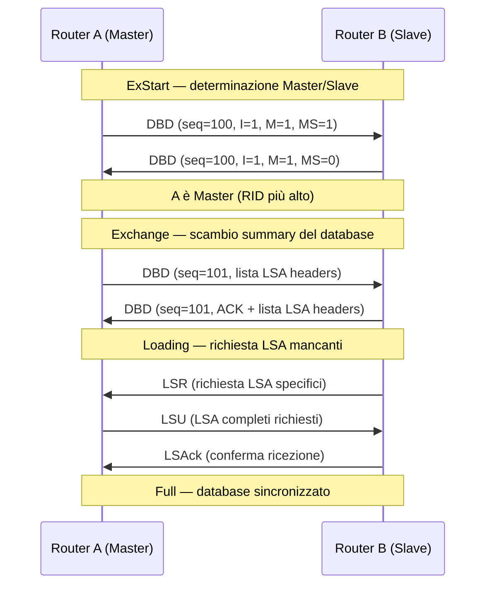

---

## 8. Confronto tra i principali Handshake

| Caratteristica | TCP | TLS 1.3 | PPP/LCP | OSPF |
|---|---|---|---|---|
| **Layer OSI** | 4 | 5/6 | 2 | 3 |
| **N° messaggi** | 3 (apertura) | 2 round-trip | Variabile | Variabile |
| **Obiettivo principale** | Connessione affidabile | Cifratura + autenticazione | Link logico L2 | Adiacenza routing |
| **Autenticazione** | No | Certificati X.509 | PAP / CHAP | MD5 / SHA |
| **Negoziazione parametri** | SEQ numbers | Cipher suite | MTU, auth, compressione | Area, timer, DR/BDR |
| **Stato mantenuto** | Connection state | Session state | Link state | Neighbor state |
| **Comando Cisco correlato** | `show tcp brief` | N/A (livello app) | `debug ppp negotiation` | `show ip ospf neighbor` |

---

## 9. Handshake e il comando Cisco `show interfaces`

### Il significato di `line protocol`

Come visto in precedenza, Cisco separa lo stato fisico dallo stato logico. Il `line protocol` diventa `up` solo dopo che il **handshake di Layer 2 è completato con successo**.

```
Router# show interfaces Serial0/0
Serial0/0 is up, line protocol is up
```

Questo output indica che:

1. **`is up`** → Layer 1 OK: segnale fisico rilevato, clock sincronizzato
2. **`line protocol is up`** → Layer 2 OK: handshake LCP completato, keepalive funzionanti, encapsulation coerente

### I keepalive — l'handshake continuo

Un aspetto spesso trascurato: l'handshake non è un evento singolo. Molti protocolli mantengono la connessione **inviando messaggi periodici** (keepalive) per verificare che il peer sia ancora operativo.

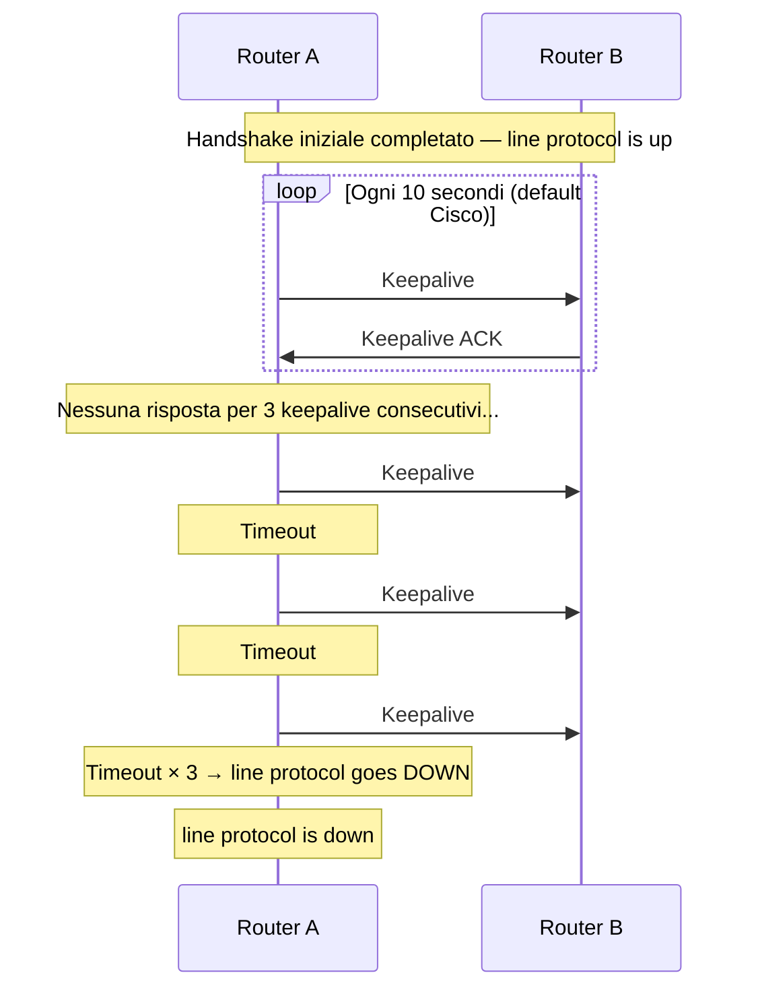

> [!WARNING]
> Se i keepalive vengono disabilitati su un'interfaccia (`no keepalive`) e il peer li ha abilitati, si può verificare un mismatch che porta il `line protocol` a flappare (oscillare tra up e down) o a rimanere indefinitamente in uno stato inconsistente.

### Verifica dello stato PPP con i comandi Cisco

```bash
# Stato generale dell'interfaccia
Router# show interfaces Serial0/0

# Dettaglio della negoziazione PPP
Router# show ppp all

# Debug in tempo reale della negoziazione LCP
Router# debug ppp negotiation

# Debug dell'autenticazione CHAP/PAP
Router# debug ppp authentication
```

Esempio di output `debug ppp negotiation` durante un handshake riuscito:

```
*Mar 1 00:01:23.456: Se0/0 PPP: Phase is ESTABLISHING
*Mar 1 00:01:23.457: Se0/0 LCP: O CONFREQ [Closed] id 1 len 15
*Mar 1 00:01:23.501: Se0/0 LCP: I CONFREQ [REQsent] id 1 len 15
*Mar 1 00:01:23.502: Se0/0 LCP: O CONFACK [REQsent] id 1 len 15
*Mar 1 00:01:23.545: Se0/0 LCP: I CONFACK [ACKsent] id 1 len 15
*Mar 1 00:01:23.546: Se0/0 PPP: Phase is AUTHENTICATING
*Mar 1 00:01:23.600: Se0/0 CHAP: O CHALLENGE id 1
*Mar 1 00:01:23.650: Se0/0 CHAP: I RESPONSE id 1
*Mar 1 00:01:23.651: Se0/0 CHAP: O SUCCESS id 1
*Mar 1 00:01:23.700: Se0/0 PPP: Phase is UP
```

---

## 10. Cosa succede quando l'Handshake fallisce?

### Scenari di fallimento e diagnosi

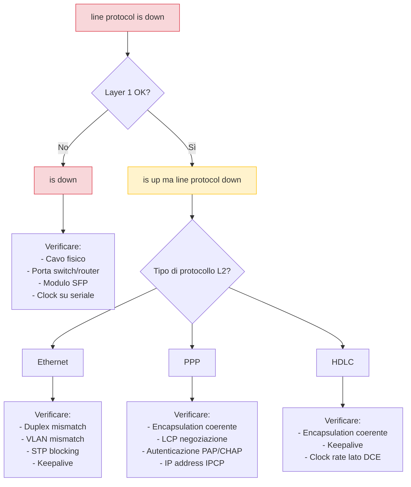

### Tabella di diagnostica rapida

| Sintomo | Causa probabile | Comando di verifica |
|---|---|---|
| `is up, line protocol is down` su seriale PPP | Encapsulation mismatch o LCP fallisce | `debug ppp negotiation` |
| `is up, line protocol is down` su seriale PPP | Autenticazione CHAP/PAP fallisce | `debug ppp authentication` |
| `is up, line protocol is down` su Ethernet | Keepalive mismatch | `show interfaces` → controlla keepalive |
| `is up, line protocol is down` su trunk | VLAN mismatch o native VLAN diversa | `show interfaces trunk` |
| OSPF bloccato in `Init` | Comunicazione unidirezionale | `show ip ospf neighbor` |
| OSPF bloccato in `2-Way` | DR/BDR non eletto o mismatch area | `show ip ospf interface` |
| TCP connection refused | Porta chiusa o firewall | `telnet <ip> <porta>` |

> [!CAUTION]
> Un errore comune in fase di troubleshooting è concentrarsi subito sul Layer 3 (routing, IP) quando il problema è al Layer 2 (handshake logico). Segui sempre il modello OSI **dal basso verso l'alto**: prima verifica Layer 1, poi Layer 2, poi Layer 3.

---

## 11. Riepilogo concettuale

### La gerarchia degli handshake

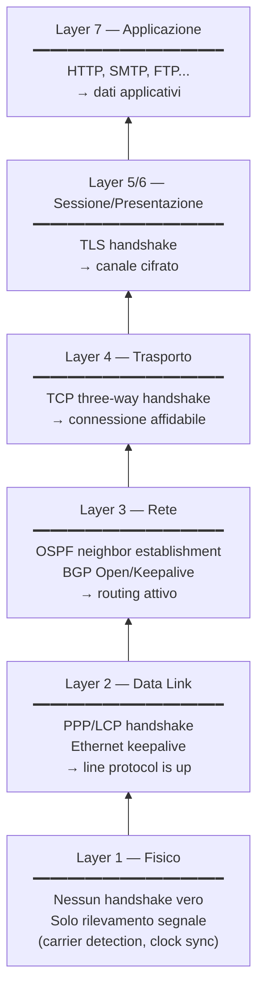

### Formula mentale finale

```
Handshake = "Accordo preliminare tra due entità
             prima di iniziare a comunicare"

Handshake logico ≠ connessione fisica

Layer 1 → segnale rilevato  (is up)
Layer 2 → accordo logico    (line protocol is up)
Layer 3 → routing attivo    (show ip ospf neighbor → FULL)
Layer 4 → sessione TCP      (SYN → SYN-ACK → ACK)
Layer 5 → canale cifrato    (TLS Finished)
```

> [!IMPORTANT]
> Ogni layer ha il **proprio** handshake, indipendente dagli altri. Il successo di un handshake a un layer superiore **presuppone** che tutti i layer inferiori abbiano completato il proprio handshake con successo. Se il TCP handshake fallisce, verificare prima che i layer 1 e 2 siano operativi.

---

*Documento generato per uso didattico e documentazione tecnica professionale.*
*Compatibile con GitHub Markdown — i diagrammi Mermaid richiedono un renderer compatibile (GitHub, GitLab, Obsidian, Typora, ecc.).*
