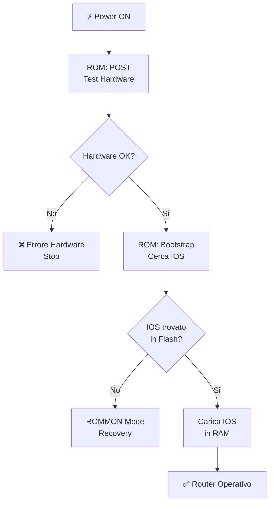
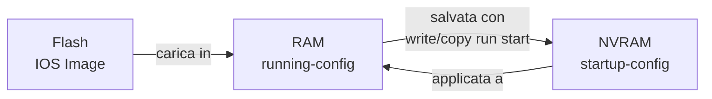
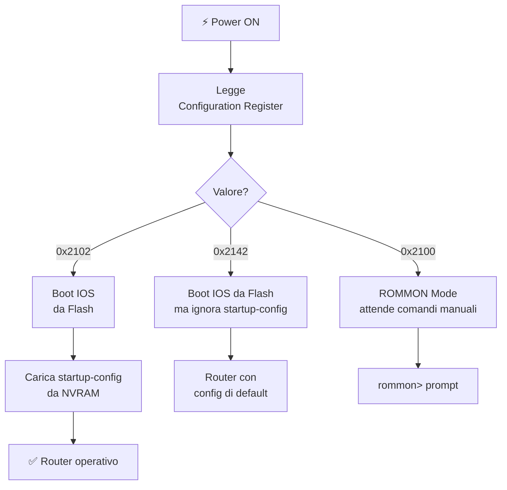
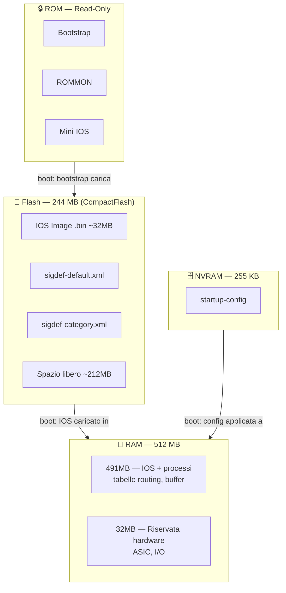

# 🖥️ Comando `show version` — Analisi Completa per CCNA

> **Documento di riferimento** per studenti CCNA che vogliono comprendere a fondo l'output del comando `show version` su router Cisco serie 1900.

---

## 📋 Indice

1. [Output completo del comando](#1-output-completo-del-comando)
2. [Sezione IOS — Sistema Operativo](#2-sezione-ios--sistema-operativo)
3. [Sezione ROM — Bootstrap](#3-sezione-rom--bootstrap)
4. [Sezione Uptime e Immagine di Sistema](#4-sezione-uptime-e-immagine-di-sistema)
5. [Memoria RAM — Analisi Dettagliata](#5-memoria-ram--analisi-dettagliata)
6. [NVRAM — Memoria Non Volatile](#6-nvram--memoria-non-volatile)
7. [Flash Memory — Analisi Dettagliata](#7-flash-memory--analisi-dettagliata)
8. [Licenze IOS](#8-licenze-ios)
9. [Configuration Register](#9-configuration-register)
10. [Comandi per esplorare le memorie](#10-comandi-per-esplorare-le-memorie)
11. [Riepilogo delle memorie del router](#11-riepilogo-delle-memorie-del-router)
12. [Frase da esame](#12-frase-da-esame)

---

## 1. Output completo del comando

Ecco l'output reale del comando `show version` su un router **Cisco CISCO1941/K9**:

```text
ISPRouter#show version
Cisco IOS Software, C1900 Software (C1900-UNIVERSALK9-M), Version 15.1(4)M4, RELEASE SOFTWARE (fc2)
Technical Support: http://www.cisco.com/techsupport
Copyright (c) 1986-2007 by Cisco Systems, Inc.
Compiled Wed 23-Feb-11 14:19 by pt_team

ROM: System Bootstrap, Version 15.1(4)M4, RELEASE SOFTWARE (fc1)
cisco1941 uptime is 1 days, 20 hours, 35 minutes, 10 seconds
System returned to ROM by power-on
System image file is "flash0:c1900-universalk9-mz.SPA.151-1.M4.bin"
Last reload type: Normal Reload

[...sezione legale omessa per brevità...]

Cisco CISCO1941/K9 (revision 1.0) with 491520K/32768K bytes of memory.
Processor board ID FTX152400KS
2 Gigabit Ethernet interfaces
2 Low-speed serial(sync/async) network interface(s)
DRAM configuration is 64 bits wide with parity disabled.
255K bytes of non-volatile configuration memory.
249856K bytes of ATA System CompactFlash 0 (Read/Write)

License Info:
License UDI:
-------------------------------------------------
Device#   PID              SN
-------------------------------------------------
*0        CISCO1941/K9     FTX152404S8

Technology Package License Information for Module:'c1900'
-----------------------------------------------------------------
Technology   Technology-package    Technology-package
             Current       Type    Next reboot
-----------------------------------------------------------------
ipbase       ipbasek9   Permanent  ipbasek9
security     disable    None       None
data         disable    None       None

Configuration register is 0x2102
```

> **💡 Suggerimento per lo studio:** Non cercare di memorizzare tutto l'output. Concentrati sulle **righe chiave** evidenziate nelle sezioni seguenti.

---

## 2. Sezione IOS — Sistema Operativo

```text
Cisco IOS Software, C1900 Software (C1900-UNIVERSALK9-M), Version 15.1(4)M4, RELEASE SOFTWARE (fc2)
```

### 📊 Decodifica del nome dell'immagine IOS

| Campo | Valore | Significato |
|-------|--------|-------------|
| `C1900` | Piattaforma | Router Cisco serie 1900 |
| `UNIVERSALK9` | Feature Set | Immagine universale con crittografia |
| `M` | Train | Immagine "Mainline" (stabile per produzione) |
| `15.1(4)M4` | Versione | Release 15.1, sub-versione 4, manutenzione 4 |
| `RELEASE SOFTWARE` | Tipo | Software di produzione (non beta) |
| `fc2` | Build | "Feature Complete" build numero 2 |

### 🔍 Come leggere il numero di versione IOS

```text
      15  .  1  (  4  )  M  4
       |     |     |     |   |
       |     |     |     |   └─ Numero di manutenzione
       |     |     |     └───── Train (M = Mainline)
       |     |     └─────────── Sub-release
       |     └───────────────── Minor version
       └─────────────────────── Major version
```

> **📌 Nota per l'esame CCNA:** La versione `15.x` è la più comune nei laboratori Packet Tracer. Le versioni più recenti hardware fisici usano IOS XE, ma la struttura del comando `show version` è simile.

---

## 3. Sezione ROM — Bootstrap

```text
ROM: System Bootstrap, Version 15.1(4)M4, RELEASE SOFTWARE (fc1)
```

### 🧠 Cos'è la ROM nel router Cisco?

La **ROM (Read-Only Memory)** è la memoria non cancellabile che contiene il **bootstrap** (o boot loader), ovvero il programma minimo che si avvia quando il router viene acceso per la prima volta.

| Funzione ROM | Descrizione |
|---|---|
| **POST** | Power-On Self Test — verifica hardware al boot |
| **Bootstrap** | Carica l'IOS dalla Flash in RAM |
| **ROMMON** | ROM Monitor — modalità di recovery avanzata |
| **Mini-IOS** | Versione minima di IOS per operazioni base |



---

## 4. Sezione Uptime e Immagine di Sistema

### ⏱️ Uptime del router

```text
cisco1941 uptime is 1 days, 20 hours, 35 minutes, 10 seconds
System returned to ROM by power-on
```

L'**uptime** indica da quanto tempo il router è acceso e operativo senza interruzioni. Il campo `System returned to ROM by` indica la **causa dell'ultimo riavvio**:

| Causa riavvio | Significato |
|---|---|
| `power-on` | Riavvio da accensione normale |
| `reload` | Comando `reload` eseguito dall'amministratore |
| `bus error at PC` | Crash del software (problema critico!) |
| `abort` | Eccezione hardware o software |

### 💾 Immagine IOS caricata

```text
System image file is "flash0:c1900-universalk9-mz.SPA.151-1.M4.bin"
```

Questa riga è **fondamentale**: indica esattamente **quale file IOS** è stato caricato in RAM al momento del boot.

| Parte del percorso | Significato |
|---|---|
| `flash0:` | Dispositivo di storage (CompactFlash slot 0) |
| `c1900` | Piattaforma hardware |
| `universalk9` | Feature set (universale con crittografia K9) |
| `mz` | Formato: **m**emory-relocatable, com**z**pressed |
| `SPA` | Versione firmata digitalmente |
| `151-1.M4` | Versione IOS 15.1(1)M4 |
| `.bin` | File binario eseguibile |

> **⚠️ ATTENZIONE — Differenza versione IOS:**
> L'output mostra due versioni leggermente diverse:
> - Versione in esecuzione: `15.1(4)M4` (dalla riga Cisco IOS Software)
> - File su Flash: `151-1.M4` (dal nome del file)
>
> In ambienti reali queste devono coincidere. In Packet Tracer può esserci una piccola discrepanza nella nomenclatura del file.

---

## 5. Memoria RAM — Analisi Dettagliata

```text
Cisco CISCO1941/K9 (revision 1.0) with 491520K/32768K bytes of memory.
```

### ❓ Cosa significa `491520K/32768K`?

Questa è una delle righe **più fraintese** dagli studenti. Il simbolo `/` **NON è una divisione matematica**.

È un **separatore tra due aree di memoria fisicamente distinte** all'interno della DRAM del router.

### 📊 Le due aree di RAM

| Pool | Dimensione | Utilizzo |
|---|---|---|
| `491520K` | ~480 MB | RAM principale — usata da IOS, processi, tabelle di routing, buffer pacchetti |
| `32768K` | 32 MB | RAM riservata — buffer I/O hardware, ASIC, gestione interfacce |
| **Totale** | **~512 MB** | RAM fisica installata |

```text
491520K + 32768K = 524288K = 512 MB (esatto)
```

### 🧠 Modello mentale corretto

Immagina la RAM come un **ufficio a due piani**:

```
┌─────────────────────────────────────────┐
│         RAM TOTALE: ~512 MB             │
├─────────────────────────────────────────┤
│  🧑‍💻 491 MB — Piano Operativo           │
│     • IOS in esecuzione                 │
│     • Tabelle di routing (RIB)          │
│     • Tabelle ARP                       │
│     • Buffer pacchetti                  │
│     • Processi attivi                   │
├─────────────────────────────────────────┤
│  🏗️  32 MB — Piano Tecnico (riservato)  │
│     • Buffer I/O interfacce             │
│     • ASIC hardware                     │
│     • DMA (Direct Memory Access)        │
└─────────────────────────────────────────┘
```

> **⚠️ ERRORE COMUNE:** Molti studenti pensano che `491520K/32768K` significhi "491 MB diviso 32 MB". In realtà rappresenta **due pool separati** che sommati danno la RAM totale.

```text
DRAM configuration is 64 bits wide with parity disabled.
```

Questa riga aggiuntiva conferma che il bus di memoria è a **64 bit** (configurazione standard per router enterprise) e che la parità della memoria è disabilitata.

---

## 6. NVRAM — Memoria Non Volatile

```text
255K bytes of non-volatile configuration memory.
```

### 🧠 Cos'è la NVRAM?

La **NVRAM (Non-Volatile RAM)** è una memoria piccola ma fondamentale: mantiene il suo contenuto anche **senza alimentazione elettrica**.

| Proprietà | Valore |
|---|---|
| Dimensione | 255 KB |
| Contenuto | `startup-config` (configurazione salvata) |
| Persistenza | Mantiene i dati senza corrente |
| Accesso | `show startup-config`, `copy running-config startup-config` |

### 🔄 NVRAM nel ciclo di boot



> **📌 Regola chiave CCNA:**
> - `running-config` → vive in RAM (persa al riavvio se non salvata)
> - `startup-config` → vive in NVRAM (persistente tra i riavvii)
> - Salvare la config: `copy running-config startup-config` oppure `write memory`

---

## 7. Flash Memory — Analisi Dettagliata

```text
249856K bytes of ATA System CompactFlash 0 (Read/Write)
```

### 🧠 Cos'è la Flash Memory?

La **Flash Memory** è la memoria di archiviazione permanente del router. Contiene:

- L'immagine IOS (file `.bin`)
- File di configurazione opzionali
- File di firma IPS (Intrusion Prevention)
- Certificati e chiavi crittografiche

| Proprietà | Valore |
|---|---|
| Tipo | ATA CompactFlash (scheda rimovibile) |
| Dimensione | 249856 KB ≈ **244 MB** |
| Accesso | Lettura e Scrittura (`Read/Write`) |
| Identificatore | `flash0:` |
| Persistenza | Permanente (mantiene i dati senza corrente) |

### 📊 Confronto tra le memorie del router

| Memoria | Dimensione | Volatile? | Contenuto principale |
|---|---|---|---|
| RAM | ~512 MB | ✅ Sì | IOS in esecuzione, routing table, processi |
| NVRAM | 255 KB | ❌ No | startup-config |
| Flash | ~244 MB | ❌ No | Immagine IOS (.bin), file aggiuntivi |
| ROM | Fissa | ❌ No | Bootstrap, ROMMON, Mini-IOS |

---

## 8. Licenze IOS

```text
Technology Package License Information for Module:'c1900'
-----------------------------------------------------------------
Technology   Technology-package    Technology-package
             Current       Type    Next reboot
-----------------------------------------------------------------
ipbase       ipbasek9   Permanent  ipbasek9
security     disable    None       None
data         disable    None       None
```

### 📋 I Technology Package su IOS 15.x

Su IOS versione 15.x, le funzionalità sono raggruppate in **pacchetti di licenza**:

| Pacchetto | Stato | Funzionalità incluse |
|---|---|---|
| `ipbase` | ✅ Attivo (Permanent) | Routing base, IPv4/IPv6, OSPF, EIGRP, RIP |
| `security` | ❌ Disabilitato | Firewall, VPN, IPS, SSH avanzato |
| `data` | ❌ Disabilitato | MPLS, ATM, Frame Relay avanzato |

> **📌 Nota:** `ipbasek9` indica la versione con crittografia (K9 = crittografia abilitata per SSH, IPsec base).

---

## 9. Configuration Register

```text
Configuration register is 0x2102
```

### 🔧 Cos'è il Configuration Register?

Il **Configuration Register** è un campo a 16 bit (espresso in esadecimale) che controlla il **comportamento di boot** del router. Non è un indirizzo di memoria: è un insieme di **flag di controllo hardware**.

### 📊 Valori principali

| Valore | Comportamento | Quando si usa |
|---|---|---|
| **`0x2102`** | Boot normale da Flash + carica startup-config | Operatività normale (produzione) |
| **`0x2142`** | Ignora la startup-config | Password recovery |
| **`0x2100`** | Entra direttamente in ROMMON | Recovery avanzata, diagnostica |
| **`0x2101`** | Boot minimale da ROM | Diagnostica hardware |

### 🔁 Flusso di boot con Configuration Register



### 🔐 Procedura di Password Recovery (cenni)

La procedura standard per recuperare l'accesso a un router di cui si è dimenticata la password sfrutta proprio il configuration register:

1. Interrompere il boot (Ctrl+Break durante i primi secondi)
2. In ROMMON, impostare: `confreg 0x2142`
3. Riavviare: `reset`
4. Il router si avvia **ignorando la startup-config** → nessuna password richiesta
5. Entrare in privileged mode, copiare startup in running, cambiare password
6. Ripristinare: `config-register 0x2102` e `reload`

> **⚠️ ATTENZIONE:** La procedura di password recovery richiede accesso fisico al router. È una caratteristica di sicurezza: senza accesso fisico, non è possibile effettuare il recovery.

---

## 10. Comandi per esplorare le memorie

### 📁 `dir flash0:` — Elenco file nella Flash

**Cosa fa:** Elenca tutti i file presenti nella Flash CompactFlash primaria (`flash0:`).

```text
ISPRouter#dir flash0:
Directory of flash0:/

    3  -rw-    33591768           <no date>  c1900-universalk9-mz.SPA.151-4.M4.bin
    2  -rw-       28282           <no date>  sigdef-category.xml
    1  -rw-      227537           <no date>  sigdef-default.xml

256487424 bytes total (222610432 bytes free)
```

#### 🔍 Analisi dettagliata dell'output

| Campo | Esempio | Significato |
|---|---|---|
| Numero inode | `3`, `2`, `1` | Identificatore interno del file nel filesystem |
| Permessi | `-rw-` | Lettura e scrittura abilitati (`r`=read, `w`=write, `-`=no execute) |
| Dimensione (byte) | `33591768` | Circa **32 MB** per l'immagine IOS |
| Data | `<no date>` | Data di creazione/modifica (assente in Packet Tracer) |
| Nome file | `c1900-...M4.bin` | Nome del file IOS |

#### 📊 Analisi dello spazio

```text
256487424 bytes total  →  244 MB totali (≈ 249856K dall'output show version)
222610432 bytes free   →  212 MB liberi
 33877992 bytes used   →   32 MB occupati (IOS + file XML)
```

> **📌 Punto chiave:** Prima di aggiornare un'immagine IOS, verifica **sempre** lo spazio libero in Flash con `dir flash0:`. Un'immagine IOS è tipicamente 30–50 MB.

#### 📄 I file XML presenti

| File | Funzione |
|---|---|
| `sigdef-category.xml` | Definizioni categorie per IPS (Intrusion Prevention) |
| `sigdef-default.xml` | Firme di sicurezza predefinite per IPS |

---

### 📁 `dir flash:` — Alias per flash0:

**Cosa fa:** Equivalente a `dir flash0:` sul Cisco 1941 con una sola CompactFlash. Su router con più slot, `flash:` punta sempre allo slot primario.

```text
ISPRouter#dir flash:
Directory of flash:/

    3  -rw-    33591768           <no date>  c1900-universalk9-mz.SPA.151-4.M4.bin
    2  -rw-       28282           <no date>  sigdef-category.xml
    1  -rw-      227537           <no date>  sigdef-default.xml

256487424 bytes total (222610432 bytes free)
```

> **💡 Nota:** `flash:` e `flash0:` producono lo stesso output su questo modello. Su router con due slot CompactFlash esisterebbe anche `flash1:`.

---

### 📁 `show flash:` — Informazioni dettagliate Flash

**Cosa fa:** Fornisce sia il listato dei file che informazioni sul dispositivo Flash (più dettagliato di `dir`).

```text
ISPRouter#show flash:
-#- --length-- -----date/time------ path
  1    227537  <no date>             sigdef-default.xml
  2     28282  <no date>             sigdef-category.xml
  3  33591768  <no date>             c1900-universalk9-mz.SPA.151-4.M4.bin

[222610432 bytes available/256487424 bytes total]
```

---

### 📁 `show flash0:` — Variante con slot esplicito

**Cosa fa:** Come `show flash:` ma con riferimento esplicito allo slot 0. Utile su router multi-slot.

```text
ISPRouter#show flash0:
-#- --length-- -----date/time------ path
  1    227537  <no date>             sigdef-default.xml
  2     28282  <no date>             sigdef-category.xml
  3  33591768  <no date>             c1900-universalk9-mz.SPA.151-4.M4.bin

[222610432 bytes available/256487424 bytes total]
```

---

### 📄 `more flash0:/nome-file` — Visualizza contenuto di un file

**Cosa fa:** Visualizza il contenuto testuale di un file nella Flash. Utile per i file di configurazione o XML, ma non per i file binari `.bin`.

```text
ISPRouter#more flash0:/sigdef-category.xml
<?xml version="1.0" encoding="UTF-8"?>
<SIGCATEGORY-DEFINITIONS version="1.0">
  <CATEGORY id="IOS-IPS" description="IOS IPS Signatures"/>
  <CATEGORY id="CISCO" description="Cisco Signatures"/>
  ...
</SIGCATEGORY-DEFINITIONS>
```

> **⚠️ ATTENZIONE:** Non usare `more` su file `.bin` (immagini IOS): produrrebbe output binario illeggibile e potrebbe bloccare il terminale. Usa `dir` o `show flash:` per verificare le immagini IOS.

---

### 💾 `show nvram` — Informazioni sulla NVRAM

**Cosa fa:** Mostra informazioni sull'utilizzo della NVRAM (disponibile su alcune piattaforme).

```text
ISPRouter#show nvram
Contents of nvram:
  2048 startup-config
  4096 private-config
255K bytes total
```

---

### 📋 `show startup-config` — Configurazione in NVRAM

**Cosa fa:** Visualizza la configurazione salvata nella NVRAM (quella che verrà caricata al prossimo riavvio).

```text
ISPRouter#show startup-config
Using 1236 out of 262136 bytes
!
version 15.1
service timestamps debug datetime msec
service timestamps log datetime msec
no service password-encryption
!
hostname ISPRouter
...
```

La riga `Using 1236 out of 262136 bytes` indica:
- **1236 byte** usati per la configurazione attuale
- **262136 byte** = 256 KB ≈ spazio NVRAM disponibile

---

### 🔍 `show version` — Riepilogo completo (già visto)

**Uso rapido:** Per verificare la versione IOS, la quantità di RAM, lo spazio Flash e il configuration register.

---

## 11. Riepilogo delle memorie del router



### 📊 Tabella riepilogativa

| Memoria | Dim. | Volatile | Funzione | Comandi |
|---|---|---|---|---|
| **ROM** | Fissa | ❌ | Bootstrap, ROMMON | — |
| **Flash** | 244 MB | ❌ | Immagine IOS, file | `dir flash:`, `show flash:` |
| **NVRAM** | 255 KB | ❌ | startup-config | `show startup-config` |
| **RAM** | 512 MB | ✅ | IOS in esecuzione, running-config | `show version`, `show processes memory` |

---

## 12. Frase da esame

> **"Il `show version` fornisce una fotografia completa del sistema: la versione IOS in esecuzione caricata dalla Flash in RAM, la quantità di memoria suddivisa tra pool operativo e riservato hardware, la dimensione della NVRAM che ospita la startup-config, e il configuration register che determina il comportamento di boot. I comandi `dir flash:` e `show flash:` permettono di esplorare il filesystem della Flash per verificare le immagini IOS disponibili e lo spazio libero prima di aggiornamenti."**

---

*Documento tecnico-didattico per la preparazione all'esame CCNA — Router Cisco 1941 IOS 15.x*
