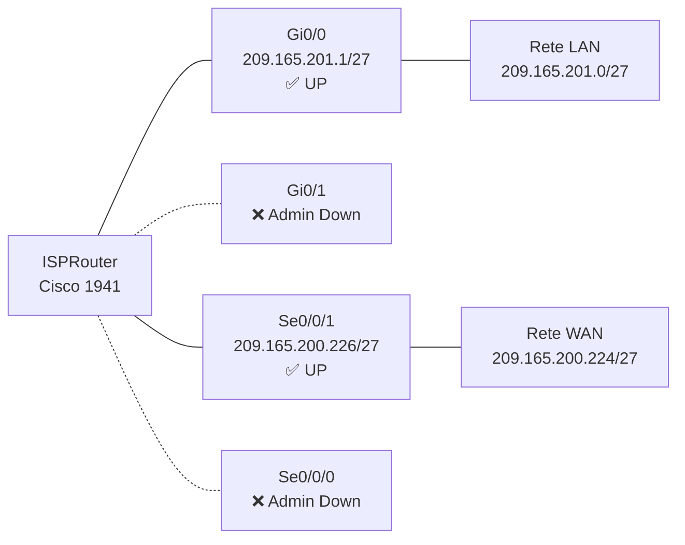
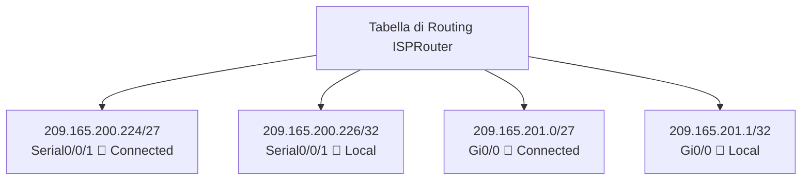
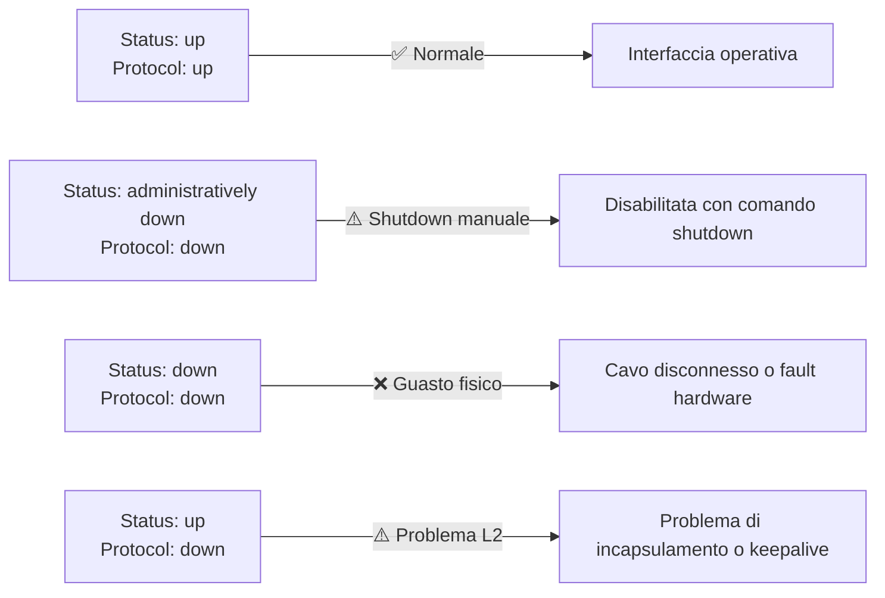
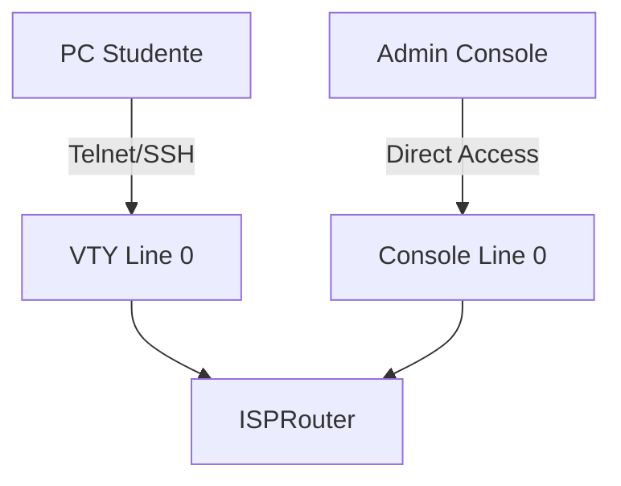

# 17.5.9 Lab — Interpretare l'output del comando `show`

> **Dispositivo:** `ISPRouter` — Cisco CISCO1941/K9  
> **IOS:** Cisco IOS 15.1(4)M4  
> **Obiettivo:** Eseguire e interpretare i principali comandi `show` su un router Cisco per raccogliere informazioni su interfacce, routing, memoria e sessioni attive.

---

## Topologia di rete



---

## Part 1 — Esecuzione dei comandi `show`

---

### 1. `show arp`

#### Scopo
Visualizza la **tabella ARP** (Address Resolution Protocol) del router: l'associazione tra indirizzi IP e indirizzi MAC noti nelle interfacce direttamente connesse.

#### Acronimi
| Acronimo | Significato |
|----------|-------------|
| ARP | Address Resolution Protocol |
| ARPA | Advanced Research Projects Agency (formato ARP standard per Ethernet) |
| Gi0/0 | GigabitEthernet 0/0 |

#### Output

```
Protocol  Address          Age (min)  Hardware Addr   Type   Interface
Internet  209.165.201.1           -   0030.F275.CE01  ARPA   GigabitEthernet0/0
```

#### Analisi

| Campo | Valore | Significato |
|-------|--------|-------------|
| Protocol | Internet | Protocollo IPv4 |
| Address | 209.165.201.1 | IP dell'interfaccia locale del router |
| Age (min) | `-` | Voce statica (interfaccia del router stesso, non scade) |
| Hardware Addr | 0030.F275.CE01 | Indirizzo MAC dell'interfaccia Gi0/0 |
| Type | ARPA | Tipo di incapsulamento Ethernet standard |
| Interface | GigabitEthernet0/0 | Interfaccia associata |

> [!NOTE]
> Il segno `-` nel campo Age indica che la voce è **locale** al router (il router conosce il proprio MAC senza necessità di risoluzione ARP). Le voci apprese da altri host avrebbero un valore numerico (timeout default: 4 ore).

---

### 2. `show flash:`

#### Scopo
Visualizza il contenuto della **memoria Flash** del router, dove è memorizzata l'immagine IOS e altri file di sistema.

#### Output

```
System flash directory:
File  Length     Name/status
  3   33591768   c1900-universalk9-mz.SPA.151-4.M4.bin
  2   28282      sigdef-category.xml
  1   227537     sigdef-default.xml
[33847587 bytes used, 221896413 available, 255744000 total]
249856K bytes of processor board System flash (Read/Write)
```

#### Analisi

| File | Dimensione | Descrizione |
|------|-----------|-------------|
| `c1900-universalk9-mz.SPA.151-4.M4.bin` | ~32 MB | Immagine IOS — firmware principale del router |
| `sigdef-category.xml` | 28 KB | Definizioni categorie firme IDS/IPS |
| `sigdef-default.xml` | 222 KB | Firme di sicurezza predefinite |

| Metrica Flash | Valore |
|---------------|--------|
| Spazio utilizzato | ~32 MB (33.847.587 byte) |
| Spazio disponibile | ~211 MB (221.896.413 byte) |
| Totale | ~244 MB (255.744.000 byte) |

> [!TIP]
> Prima di aggiornare l'IOS, verificare che lo spazio disponibile sia **sufficiente per la nuova immagine**. Con `show flash:` si ottiene subito il dato `available`.

#### Acronimi nome file IOS

| Parte | Significato |
|-------|-------------|
| `c1900` | Piattaforma hardware (Cisco 1900 series) |
| `universalk9` | Feature set universale con crittografia (K9 = crypto) |
| `mz` | Compresso (m=RAM, z=zip) |
| `SPA` | Signed Package — firmato digitalmente da Cisco |
| `151-4.M4` | Versione 15.1(4)M4 |
| `.bin` | File binario eseguibile |

---

### 3. `show ip route`

#### Scopo
Visualizza la **tabella di routing IP**: tutti i percorsi noti al router verso le reti di destinazione.

#### Output

```
Gateway of last resort is not set

     209.165.200.0/24 is variably subnetted, 2 subnets, 2 masks
C       209.165.200.224/27 is directly connected, Serial0/0/1
L       209.165.200.226/32 is directly connected, Serial0/0/1
     209.165.201.0/24 is variably subnetted, 2 subnets, 2 masks
C       209.165.201.0/27 is directly connected, GigabitEthernet0/0
L       209.165.201.1/32 is directly connected, GigabitEthernet0/0
```

#### Legenda codici di routing

| Codice | Significato |
|--------|-------------|
| `C` | Connected — rete direttamente connessa |
| `L` | Local — indirizzo IP specifico dell'interfaccia del router (/32) |
| `S` | Static — rotta statica configurata manualmente |
| `R` | RIP — rotta appresa via RIP |
| `O` | OSPF — rotta appresa via OSPF |
| `B` | BGP — rotta appresa via BGP |

#### Analisi delle rotte

| Tipo | Rete/Host | Interfaccia | Nota |
|------|-----------|-------------|------|
| C | 209.165.200.224/27 | Serial0/0/1 | Rete WAN connessa |
| L | 209.165.200.226/32 | Serial0/0/1 | IP locale del router su WAN |
| C | 209.165.201.0/27 | GigabitEthernet0/0 | Rete LAN connessa |
| L | 209.165.201.1/32 | GigabitEthernet0/0 | IP locale del router su LAN |

> [!WARNING]
> **Gateway of last resort is not set**: il router **non ha un default route**. Qualsiasi pacchetto verso reti non presenti in tabella verrà scartato. In un router ISP reale, questo sarebbe un problema critico.



---

### 4. `show interfaces`

#### Scopo
Visualizza **statistiche dettagliate** per ogni interfaccia: stato fisico, stato del protocollo, indirizzi, contatori di traffico ed errori.

#### Riepilogo interfacce

| Interfaccia | IP Address | Stato fisico | Protocollo | Note |
|-------------|-----------|--------------|------------|------|
| GigabitEthernet0/0 | 209.165.201.1/27 | up | up | Operativa — LAN |
| GigabitEthernet0/1 | — | admin down | down | Disabilitata manualmente |
| Serial0/0/0 | — | admin down | down | Disabilitata manualmente |
| Serial0/0/1 | 209.165.200.226/27 | up | up | Operativa — WAN |
| Vlan1 | — | admin down | down | Disabilitata |

#### Dettaglio GigabitEthernet0/0 (attiva)

```
GigabitEthernet0/0 is up, line protocol is up (connected)
  Hardware is CN Gigabit Ethernet, address is 0030.f275.ce01
  Internet address is 209.165.201.1/27
  MTU 1500 bytes, BW 1000000 Kbit, DLY 10 usec
  Full-duplex, 100Mb/s, media type is RJ45
```

| Parametro | Valore | Significato |
|-----------|--------|-------------|
| MTU | 1500 byte | Maximum Transmission Unit — dimensione massima frame |
| BW | 1.000.000 Kbit | Banda nominale (1 Gbps) |
| DLY | 10 usec | Delay utilizzato nei calcoli di routing |
| Duplex | Full-duplex | Trasmissione bidirezionale simultanea |
| Speed | 100 Mb/s | Velocità di negoziazione effettiva |

> [!NOTE]
> La differenza tra BW dichiarata (1 Gbps) e velocità reale (100 Mbps) è normale in Packet Tracer. Il parametro `BW` è usato da protocolli come EIGRP/OSPF per i calcoli di metrica.

#### Dettaglio Serial0/0/1 (attiva)

```
Serial0/0/1 is up, line protocol is up (connected)
  Internet address is 209.165.200.226/27
  MTU 1500 bytes, BW 1544 Kbit, DLY 20000 usec
  Encapsulation HDLC
  DCD=up  DSR=up  DTR=up  RTS=up  CTS=up
```

| Segnale | Stato | Descrizione |
|---------|-------|-------------|
| DCD | up | Data Carrier Detect — portante rilevata |
| DSR | up | Data Set Ready — DCE pronto |
| DTR | up | Data Terminal Ready — DTE pronto |
| RTS | up | Request To Send — richiesta di trasmissione |
| CTS | up | Clear To Send — ok alla trasmissione |

> [!TIP]
> Tutti i segnali seriali `up` confermano un collegamento WAN correttamente stabilito. Se `DCD=down`, significa che il collegamento fisico è interrotto.

---

### 5. `show ip interface brief`

#### Scopo
Fornisce un **riepilogo compatto** dello stato di tutte le interfacce IP: indirizzo, metodo di configurazione, stato fisico e stato del protocollo. È il comando più usato per una verifica rapida.

#### Output

```
Interface              IP-Address      OK? Method Status                Protocol
GigabitEthernet0/0     209.165.201.1   YES manual up                    up
GigabitEthernet0/1     unassigned      YES unset  administratively down down
Serial0/0/0            unassigned      YES unset  administratively down down
Serial0/0/1            209.165.200.226 YES manual up                    up
Vlan1                  unassigned      YES unset  administratively down down
```

#### Analisi colonne

| Colonna | Significato |
|---------|-------------|
| Interface | Nome dell'interfaccia |
| IP-Address | Indirizzo IP configurato (`unassigned` = nessun IP) |
| OK? | La configurazione IP è valida? |
| Method | Come è stato assegnato l'IP (`manual`=statico, `DHCP`, `unset`) |
| Status | Stato fisico (Layer 1) |
| Protocol | Stato del protocollo (Layer 2) |

> [!NOTE]
> `show ip interface brief` mostra l'indirizzo IP ma **non il prefisso di rete** (/27). Per vedere la subnet mask completa occorre usare `show interfaces` o `show protocols`.

#### Interpretazione degli stati



---

### 6. `show protocols`

#### Scopo

Visualizza lo **stato dei protocolli di rete** attivi sulle interfacce e indica se il **routing IP è abilitato globalmente**.

---

#### Output

```
Global values:
  Internet Protocol routing is enabled
GigabitEthernet0/0 is up, line protocol is up
  Internet address is 209.165.201.1/27
GigabitEthernet0/1 is administratively down, line protocol is down
Serial0/0/0 is administratively down, line protocol is down
Serial0/0/1 is up, line protocol is up
  Internet address is 209.165.200.226/27
Vlan1 is administratively down, line protocol is down
```

---

#### Analisi

| Interfaccia        | Stato        | IP con prefisso        |
| ------------------ | ------------ | ---------------------- |
| GigabitEthernet0/0 | ✅ up/up      | 209.165.201.1/**27**   |
| GigabitEthernet0/1 | ❌ admin down | —                      |
| Serial0/0/0        | ❌ admin down | —                      |
| Serial0/0/1        | ✅ up/up      | 209.165.200.226/**27** |
| Vlan1              | ❌ admin down | —                      |

---

> [!NOTE]
> A differenza di `show ip interface brief`, questo comando mostra l’indirizzo IP con il **prefisso CIDR** (es. `/27`), utile per capire la dimensione della subnet.

---

> [!IMPORTANT]
> La riga:
>
> ```
> Internet Protocol routing is enabled
> ```
>
> si riferisce al **Layer 3 (Network Layer)** del modello OSI.
>
> Qui “IP” = Internet Protocol → **non è Layer 4**.
>
> * **IP = Layer 3 (routing tra reti)**
> * **TCP/UDP = Layer 4 (trasporto tra applicazioni)**

---

> [!TIP]
> Questa distinzione è fondamentale in CCNA:
>
> * Layer 3 → instradamento tra reti (IP routing)
> * Layer 4 → comunicazione end-to-end tra processi (porte TCP/UDP)


---

Perfetto, quello che vuoi ottenere è proprio il comportamento “didattico classico”: una sessione console + una sessione remota Telnet/SSH visibile su `show users`.

Ti riscrivo la sezione **aggiornata in modo professionale + coerente con il tuo scenario**.

---

### 7. `show users`

#### Scopo

Visualizza le **sessioni utente attive sul router**, mostrando chi è connesso e tramite quale linea (Console, VTY per Telnet/SSH, AUX).

---

#### Output (scenario con accesso locale + remoto)

```
    Line       User       Host(s)              Idle       Location
*  0 con 0    admin       idle                 00:00:00
 134 vty 0    student     idle                 00:00:59   209.165.201.10
```

---

#### Analisi

| Campo                     | Valore              | Significato                                            |
| ------------------------- | ------------------- | ------------------------------------------------------ |
| `*`                       | presente su `con 0` | Indica la sessione attualmente attiva (console locale) |
| Line `0 con 0`            | Console             | Accesso fisico/locale al router                        |
| Line `vty 0`              | VTY                 | Connessione remota (Telnet/SSH)                        |
| User `admin`              | locale              | Utente connesso da console                             |
| User `student`            | remoto              | Utente collegato via rete                              |
| Location `209.165.201.10` | IP remoto           | Host da cui è avvenuto l’accesso Telnet/SSH            |
| Idle                      | tempo inattività    | Da quanto la sessione è inattiva                       |

---

## ⚙️ Configurazione necessaria per mostrare questo scenario

Per far vedere agli studenti **una seconda connessione reale da un’altra macchina**, il router deve avere VTY configurate correttamente:

```bash
line vty 0 4
password cisco
login
transport input telnet
```

Oppure (consigliato):

```bash
line vty 0 4
login local
transport input ssh
```

---

## 🧪 Come riprodurre la demo in laboratorio

### 1. Dal router (sessione console)

Tu sei connesso fisicamente → `con 0`

### 2. Da un’altra macchina (PC studente)

```bash
telnet 209.165.201.1
```

oppure SSH:

```bash
ssh -l student 209.165.201.1
```

---

## 🔁 Risultato atteso

Dopo la connessione remota:

```text
show users
```

mostrerà:

* una sessione console (tu)
* una sessione VTY (studente)
* IP del PC remoto nella colonna Location

---

## 📊 Schema visivo



---

Se vuoi, posso anche:

* costruirti un **laboratorio Packet Tracer completo**
* oppure una **lezione pronta da 30 minuti con esercizi per studenti**
* oppure una versione “esame CCNA style” con domande tipiche su `show users`, VTY e accesso remoto


---

### 8. `show version`

#### Scopo
Visualizza informazioni complete sul **sistema**: versione IOS, tipo di hardware, memoria, licenze attive, tempo di uptime e registro di configurazione.

#### Dati principali estratti

| Parametro | Valore |
|-----------|--------|
| IOS Version | **15.1(4)M4** |
| Platform | Cisco CISCO1941/K9 |
| Processor Board ID | FTX152400KS |
| RAM | 491.520 KB + 32.768 KB (totale ~512 MB) |
| NVRAM | 255 KB |
| Flash | 249.856 KB (~244 MB) |
| Uptime | 2 ore, 53 minuti |
| Config Register | 0x2102 |
| System image | `flash0:c1900-universalk9-mz.SPA.151-1.M4.bin` |

#### Licenze attive

| Technology | Package | Tipo | Prossimo riavvio |
|------------|---------|------|------------------|
| ipbase | ipbasek9 | Permanent | ipbasek9 |
| security | disable | None | None |
| data | disable | None | None |

> [!WARNING]
> Le licenze **security** e **data** sono disabilitate. Funzionalità come VPN, firewall avanzato (security) e MPLS/BGP avanzato (data) **non sono disponibili** su questo router senza acquistare le relative licenze.

> [!NOTE]
> Il **Configuration Register** `0x2102` è il valore standard: al boot il router carica l'IOS dalla Flash e la configurazione dalla NVRAM (startup-config). Un valore `0x2142` indicherebbe modalità password recovery.

#### Interfacce hardware

| Tipo | Quantità |
|------|---------|
| Gigabit Ethernet | 2 |
| Serial (sync/async) | 2 |

---

## Part 2 — Domande di riflessione

### Tabella riassuntiva delle risposte

| # | Domanda | Risposta |
|---|---------|----------|
| **1** | Quali comandi mostrano IP **e prefisso** di rete delle interfacce? | `show interfaces`, `show protocols`, `show ip route` |
| **2** | Quale comando mostra l'IP ma **non il prefisso**? | `show ip interface brief` |
| **3** | Quali comandi indicano se un'interfaccia è **up**? | `show interfaces`, `show ip interface brief`, `show protocols` |
| **4** | Quale comando mostra la **versione IOS** in esecuzione? | `show version` |
| **5** | Quali comandi forniscono informazioni sugli **indirizzi** delle interfacce? | `show arp`, `show interfaces`, `show ip interface brief`, `show protocols`, `show ip route` |
| **6** | Quale comando mostra la **memoria Flash disponibile** per un aggiornamento IOS? | `show flash:`, `show version` |
| **7** | Quale comando mostra le **sessioni utente attive** (per sapere se un collega è connesso)? | `show users` |
| **8** | Quale comando mostra le **statistiche di traffico** per le interfacce? | `show interfaces` |
| **9** | Quale comando mostra i **percorsi disponibili** nella rete (tabella di routing)? | `show ip route` |
| **10** | Quali interfacce sono **attualmente attive** sull'ISP Router? | `GigabitEthernet0/0` (209.165.201.1/27) e `Serial0/0/1` (209.165.200.226/27) |

---

## Riepilogo comandi

| Comando | Layer | Informazioni principali | Prefix /xx? |
|---------|-------|------------------------|:-----------:|
| `show arp` | L2/L3 | Mapping IP ↔ MAC | ❌ |
| `show flash:` | Sistema | File e spazio Flash | — |
| `show ip route` | L3 | Tabella di routing completa | ✅ |
| `show interfaces` | L1/L2/L3 | Stato, statistiche, errori | ✅ |
| `show ip interface brief` | L3 | Riepilogo rapido IP e stato | ❌ |
| `show protocols` | L3 | Stato protocolli e IP con prefisso | ✅ |
| `show users` | Gestione | Sessioni attive (console/VTY) | — |
| `show version` | Sistema | IOS, hardware, licenze, uptime | — |
