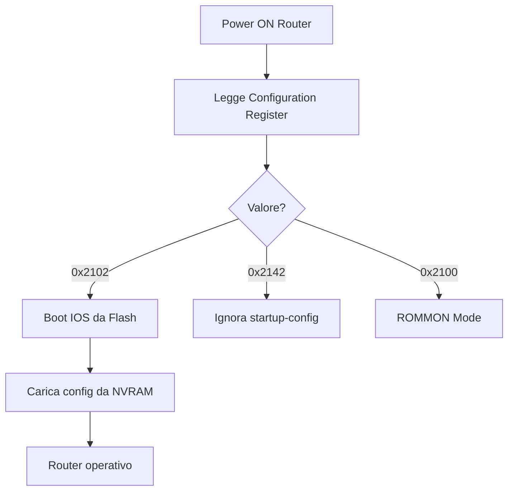
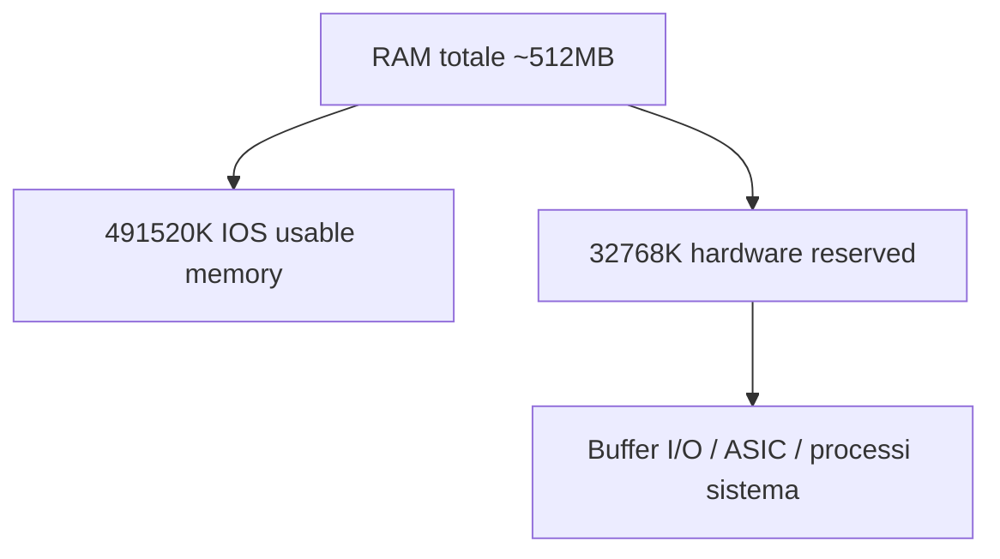
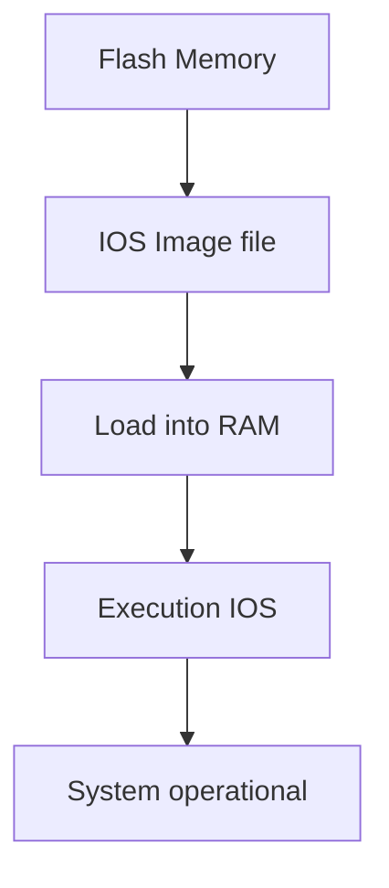

### 8. `show version`

### 📌 Scopo

Visualizza informazioni complete sul sistema: versione IOS, hardware, memoria, uptime, licenze e **configuration register (boot behavior)**.

---

## 📊 Dati principali estratti

| Parametro          | Valore                                       |
| ------------------ | -------------------------------------------- |
| IOS Version        | 15.1(4)M4                                    |
| Platform           | Cisco CISCO1941/K9                           |
| Processor Board ID | FTX152400KS                                  |
| RAM                | 491520 KB + 32768 KB (~512 MB)               |
| NVRAM              | 255 KB                                       |
| Flash              | 249856 KB (~244 MB)                          |
| Uptime             | 2 ore, 53 minuti                             |
| Config Register    | 0x2102                                       |
| System image       | flash0:c1900-universalk9-mz.SPA.151-1.M4.bin |

---

# 🧠 Approfondimenti fondamentali

---

## 🔧 1. Configuration Register (0x2102, 0x2142, ecc.)

Il campo:

```text id="cfgreg1"
Configuration Register = 0x2102
```

non è un indirizzo di memoria, ma un **insieme di bit di controllo del boot** del router Cisco 1941 Router.

---

### 📊 Significato dei principali valori

| Valore     | Comportamento                                 | Uso pratico         |
| ---------- | --------------------------------------------- | ------------------- |
| **0x2102** | Boot normale da Flash + carica startup-config | Modalità produzione |
| **0x2142** | Ignora startup-config                         | Password recovery   |
| **0x2100** | Entra in ROMMON                               | Recovery avanzata   |
| **0x2101** | Boot minimale                                 | Diagnostica         |

---

### 🧠 Come pensarci (metafora potente)

:::admonition type="tip"
Il configuration register è come il “selettore di avvio” di un dispositivo:

* come il BIOS boot order nei PC
* come il bootloader mode negli smartphone
* come un “interruttore di comportamento” hardware
  :::

---

### 📱 Analogia intuitiva

| Sistema | Equivalente                 |
| ------- | --------------------------- |
| 0x2102  | Avvio normale del telefono  |
| 0x2142  | Reset / modalità senza dati |
| ROMMON  | Recovery mode / fastboot    |

---

### 🔁 Flusso di boot



---

## 💾 2. RAM: perché “491520K / 32768K”?

```text id="mem1"
491520K + 32768K ≈ 524288K (~512 MB)
```

---

### 📌 Significato del simbolo “/”

Il simbolo:

```text id="slash"
491520K / 32768K
```

NON è una divisione.

È un **separatore tra due aree di memoria fisicamente distinte**.

---

### 🧠 Interpretazione corretta

| Blocco  | Significato                                 |
| ------- | ------------------------------------------- |
| 491520K | RAM principale utilizzata da IOS            |
| 32768K  | Memoria riservata a funzioni hardware / I/O |

---

### ⚠️ Punto chiave

:::admonition type="important"
Non è una divisione logica software: è una **mappatura hardware della memoria**.
:::

---

### 🧠 Modello mentale corretto



---

### 💡 Analogia intuitiva

Immagina la RAM come un ufficio:

* 🧑‍💻 491 MB → scrivanie per lavoratori (IOS + processi)
* 🏢 32 MB → sala server / impianti / gestione edificio

Non è “divisione matematica”, è **organizzazione funzionale degli spazi**.

---

## ⚠️ NOTE IMPORTANTE (didattica)

:::admonition type="warning"
Molti studenti pensano che “/” significhi divisione o partizione software.

In realtà:
👉 è solo una rappresentazione di due pool di memoria fisicamente separati
:::

---

## 🔌 3. Lettura del sistema operativo (IOS)

```text id="iosboot"
System image file is flash0:c1900-universalk9-mz.SPA.151-1.M4.bin
```

---

### 🧠 Significato

Il router:

1. cerca l’IOS in Flash
2. lo carica in RAM
3. lo esegue

---

### 🔁 Flusso completo



---

## 💡 RIASSUNTO INTUITIVO

:::admonition type="tip"

* Configuration register = “come devo avviarmi?”
* RAM “A / B” = “chi usa cosa nella memoria”
* Flash = “dove sta il sistema operativo”
  :::

---

## 🧠 Frase da esame (molto utile)

> “Il configuration register controlla il comportamento di boot del router, mentre la memoria mostrata in `show version` rappresenta una mappatura fisica della RAM separata tra uso del sistema operativo e aree riservate hardware.”


