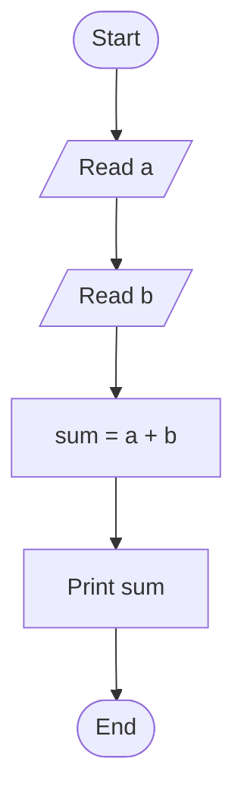
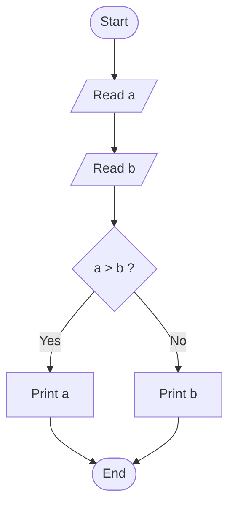
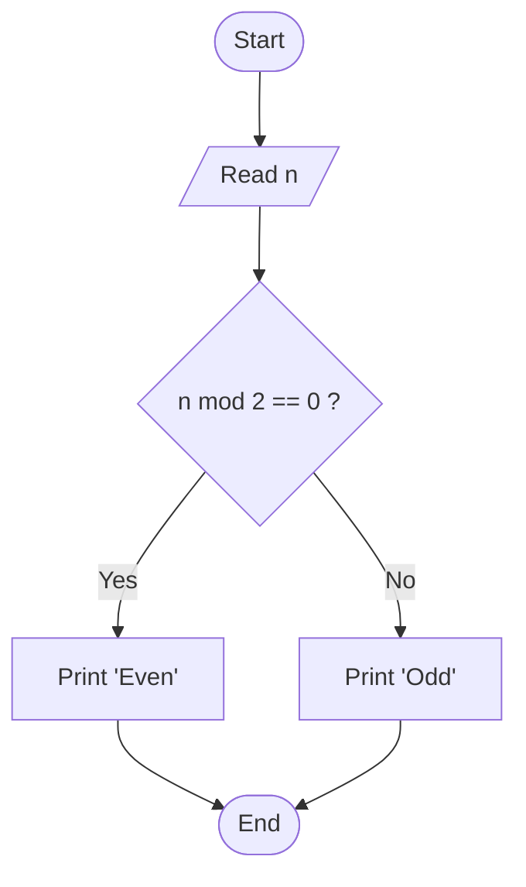
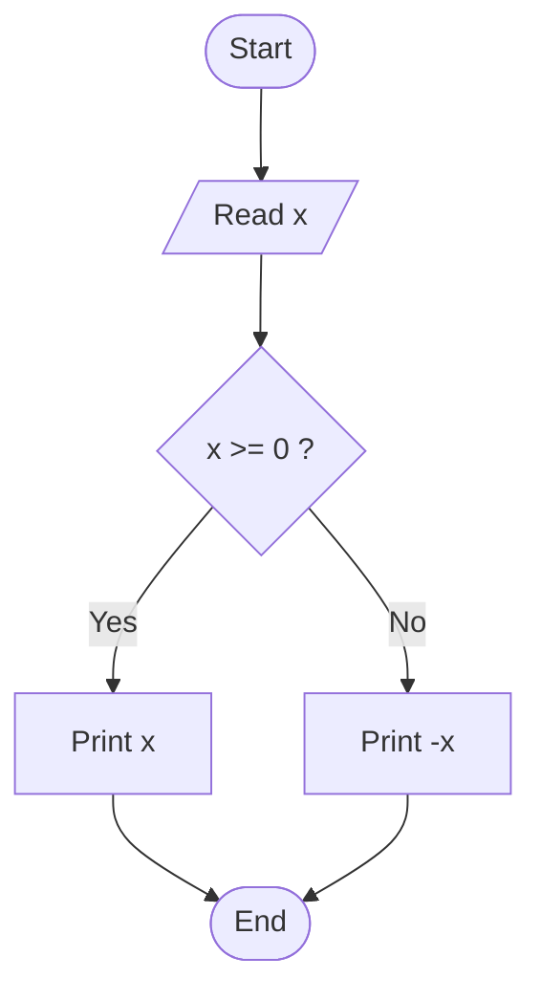

# Flowcharts

## 1. Introduction

A **flowchart** is a graphical representation of an algorithm.

Instead of describing the steps using text (as in pseudocode), a flowchart uses **symbols connected by arrows** to show the sequence of operations.

Flowcharts help us:

- visualize the structure of an algorithm
- understand decision points
- communicate algorithms clearly

Flowcharts are often used before writing actual code.

---

# 2. Basic Flowchart Symbols

Flowcharts use a small set of standard symbols.

| Symbol | Meaning |
|------|------|
| Oval | Start / End of the algorithm |
| Rectangle | Process or computation |
| Parallelogram | Input / Output |
| Diamond | Decision (condition) |
| Arrow | Flow of execution |

In this course we will represent flowcharts using **Mermaid diagrams**, which are supported by GitHub.

---

# 3. Example 1 — Print a Message

## Problem

Display the message **"Hello World"**.

## Flowchart

```mermaid
flowchart TD
    A([Start]) --> B[Print 'Hello World']
    B --> C([End])
````

This is the simplest possible algorithm.

---

# 4. Example 2 — Read and Print a Number

## Problem

Read a number and print it.

## Flowchart

```mermaid
flowchart TD
    A([Start]) --> B[/Read number/]
    B --> C[Print number]
    C --> D([End])
```

The parallelogram represents **input/output operations**.

---

# 5. Example 3 — Sum of Two Numbers

## Problem

Read two numbers and print their sum.

## Flowchart



This algorithm contains only **sequential operations**.

---

# 6. Example 4 — Maximum of Two Numbers

## Problem

Given two numbers, print the larger one.

## Flowchart



The **diamond** represents a **decision**.

The flow splits into two possible paths.

---

# 7. Example 5 — Even or Odd

## Problem

Determine whether a number is even or odd.

A number is even if it is divisible by 2.

## Flowchart



---

# 8. Example 6 — Absolute Value

## Problem

Compute the **absolute value** of a number.

Definition:

|x| = x if x ≥ 0
|x| = -x if x < 0

## Flowchart



---

# 9. Exercises

Draw a **flowchart** for each of the following problems.

---

## Exercise 1

Read two numbers and print their **product**.

---

## Exercise 2

Read a number and determine whether it is:

* positive
* negative
* zero

---

## Exercise 3

Read three numbers and print their **average**.

---

## Exercise 4

Read a student's exam score.

Print:

* `"Pass"` if the score ≥ 18
* `"Fail"` otherwise

---

## Exercise 5

Read two numbers.

If the numbers are equal, print `"Equal"`.
Otherwise, print the **larger number**.

---

# 10. From Flowcharts to Programs

Flowcharts help us design the **logic of an algorithm** before implementing it in a programming language.

The typical workflow is:

```
Problem
   ↓
Pseudocode
   ↓
Flowchart
   ↓
Program (Python)
```

In the next section we will start translating algorithms into **Python programs**.


