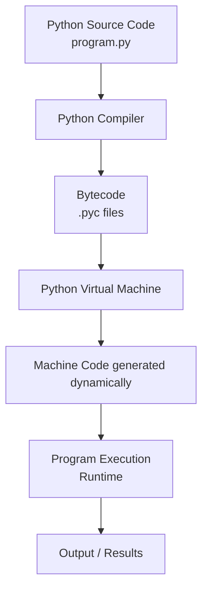
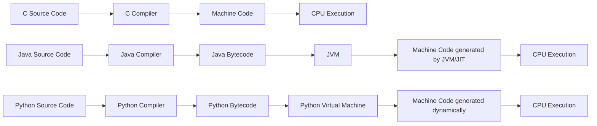

# Runtime vs Compile Time

## 1. Introduction

When we write a program, two important moments exist in its lifecycle:

- **Compile Time**
- **Runtime**

These two phases describe **when certain operations happen** during the life of a program.

Understanding this distinction helps explain:

- why some errors are detected early
- why others appear only when the program runs
- why programming languages behave differently

---

# 2. A Simple Metaphor

Imagine you are preparing a recipe.

## Compile Time

Compile time is like **checking the recipe before cooking**.

You verify:

- whether the ingredients exist
- whether the instructions make sense
- whether quantities are written correctly

If a mistake is found here, **cooking never begins**.

---

## Runtime

Runtime is the moment when **you actually cook the meal**.

Now you:

- mix ingredients
- heat the pan
- combine steps

Problems may appear during cooking:

- something burns
- an ingredient is missing
- the result is wrong

These problems are **runtime errors**.

---

# 3. Compile Time in Programming

Compile time is the phase when a program is **translated into machine-understandable instructions**.

Languages such as:

- C
- C++
- Rust
- Java

use a **compiler** that analyzes the program before execution.

Typical checks performed at compile time:

- syntax correctness
- variable declarations
- type compatibility

Example in C:

```c
int x = 10;
int y = "hello";
````

This produces a **compile-time error** because `"hello"` is a string, not an integer.

The program **cannot run** until the error is fixed.

---

# 4. Runtime in Programming

Runtime is the moment when the program **is actually executed**.

During runtime:

* variables receive values
* operations are computed
* input is processed
* output is produced

Example in Python:

```python
x = 10
y = 0

print(x / y)
```

This produces the error:

```
ZeroDivisionError
```

The program was syntactically correct, but the error appears **during execution**.

---

# 5. Static vs Dynamic Typing

The distinction between compile time and runtime is strongly related to **type systems**.

## Statically Typed Languages

Languages such as:

* C
* C++
* Java
* Rust

check types **before execution**.

Example in Java:

```java
int x = 10;
String y = "hello";

System.out.println(x + y);
```

The compiler reports an error **before the program runs**.

---

## Dynamically Typed Languages

Languages such as:

* Python
* JavaScript
* Ruby

perform type checking mostly **at runtime**.

**Important clarification for Python:**
Python **does perform a compilation step to bytecode** before execution.

* During this compilation, **syntax errors** are detected immediately (these are "compile-time errors").
* Errors related to **types or values** are detected **only at runtime**.

Example of a syntax error in Python:

```python
x = 5
if x > 0    # missing colon
    print(x)
```

This produces:

```
SyntaxError: invalid syntax
```

Example of a runtime type error:

```python
x = 10
y = "hello"
print(x + y)
```

This produces:

```
TypeError
```

---

# 6. How Python Executes a Program

Python programs go through multiple stages before execution.

Even though Python is often called an **interpreted language**, there is still an internal compilation step.

## Python Execution Pipeline



---

# 7. Comparison with Other Languages

Different programming languages follow different execution models.



---

# 8. Language Comparison

| Language   | Compilation                               | Type System               |
| ---------- | ----------------------------------------- | ------------------------- |
| C          | compiled directly to machine code         | static typing             |
| Java       | compiled to bytecode then executed by JVM | static typing             |
| Python     | compiled to bytecode then executed by PVM | dynamic typing            |
| JavaScript | interpreted / JIT compiled                | dynamic typing            |
| Assembly   | executed directly by CPU                  | no high-level type system |

---

# 9. Example: Type Behaviour

### Python

```python
x = "5"
y = 3

print(x + y)
```

Result:

```
TypeError
```

Python does **not implicitly convert incompatible types**.

---

### JavaScript

```javascript
console.log("5" + 3)
```

Output:

```
"53"
```

JavaScript performs **implicit type coercion**.

---

# 10. Summary

Key ideas:

* **Compile time** is when the program is analyzed and translated before execution.
* **Syntax errors** in Python are detected **at compile time** (bytecode compilation).
* **Runtime** is when the program actually runs.
* **Type and value errors** in Python are detected **at runtime**.
* **Statically typed languages** detect many errors at compile time.
* Python compiles code into **bytecode**, which is executed by the **Python Virtual Machine**.

Understanding these concepts helps explain why different programming languages behave differently.

```
