# Python — Functions · Theory

> **Course:** Computer Science for Mathematics Students  
> **Level:** First year university  
> **Prerequisites:** `for` loops · `if/else` · `input/output`

---

## Table of contents

1. [The mathematical concept of function](#1-the-mathematical-concept-of-function)
2. [Why functions in programming?](#2-why-functions-in-programming)
3. [Anatomy of a Python function](#3-anatomy-of-a-python-function)
4. [Parameters and arguments](#4-parameters-and-arguments)
5. [The `return` statement](#5-the-return-statement)
6. [Pure functions](#6-pure-functions)
7. [Scope of variables](#7-scope-of-variables)
8. [Functions calling functions](#8-functions-calling-functions)
9. [Summary](#9-summary)

---

## 1. The mathematical concept of function

### Definition

A **function** $f$ from a set $A$ to a set $B$ is a rule that assigns to each element $x \in A$ **exactly one** element $f(x) \in B$:

$$f : A \longrightarrow B \qquad x \longmapsto f(x)$$

- $A$ is the **domain** — the set of valid inputs
- $B$ is the **codomain** — the set of possible outputs
- $f(x)$ is the **image** of $x$ under $f$

### Key property: determinism

For the same input, a function always returns the same output:

$$x_1 = x_2 \implies f(x_1) = f(x_2)$$

This is not obvious — a *relation* can map one input to multiple outputs, but a *function* cannot.

### Examples

$$f : \mathbb{R} \to \mathbb{R}, \quad f(x) = x^2$$

$$g : \mathbb{N} \to \mathbb{N}, \quad g(n) = n!$$

$$h : \mathbb{Z} \times \mathbb{Z} \to \mathbb{Z}, \quad h(a, b) = a + b$$

Note that $h$ takes **two inputs** — this is a function of two variables, which in Python corresponds to a function with two parameters.

### Visualising a function as a mapping

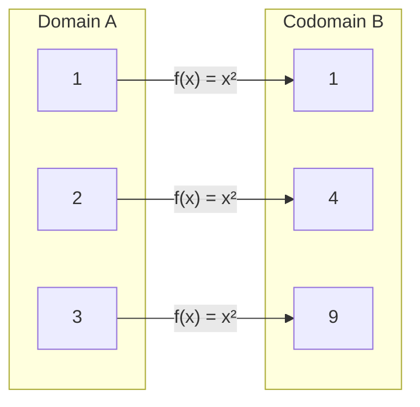

### Composition of functions

Given $f : A \to B$ and $g : B \to C$, the **composition** $g \circ f : A \to C$ is defined as:

$$(g \circ f)(x) = g(f(x))$$

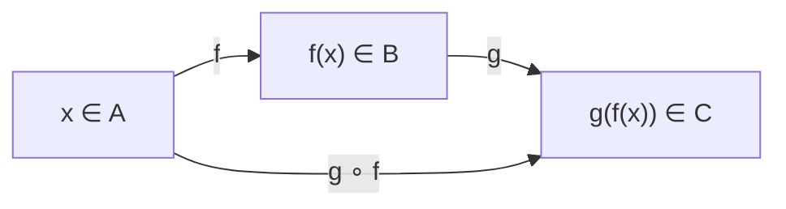

This idea maps directly to **functions calling other functions** in Python (see Section 7).

---

## 2. Why functions in programming?

### The problem: code without functions

Suppose we need to compute $n!$ in three different places in a program:

```python
# First use
result_1 = 1
for i in range(1, 6):
    result_1 *= i

# Second use
result_2 = 1
for i in range(1, 11):
    result_2 *= i

# Third use
result_3 = 1
for i in range(1, 4):
    result_3 *= i
```

This code has three problems:

| Problem | Description |
|:---|:---|
| **Duplication** | The same logic is written three times |
| **Fragility** | A bug must be fixed in three places |
| **Illegibility** | The intent (`factorial`) is hidden inside mechanics |

### The solution: abstraction

A function lets us **name a computation** and reuse it:

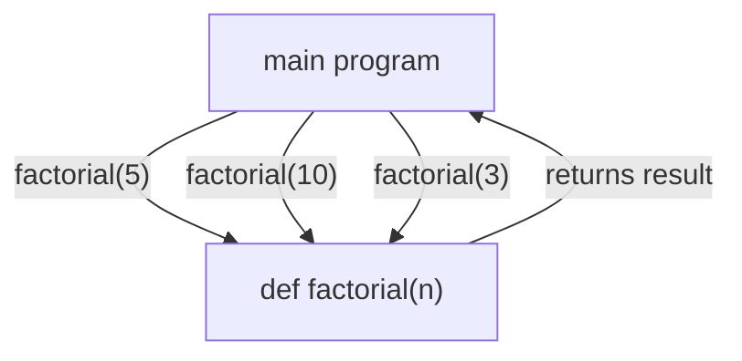

The three principles behind functions:

**1. DRY — Don't Repeat Yourself**
Write a piece of logic once, call it many times.

**2. Abstraction**
The caller does not need to know *how* the function works, only *what* it does. Exactly like using $\sin(x)$ without re-deriving its Taylor series every time.

**3. Decomposition**
A complex problem is split into smaller, independent sub-problems — each solved by one function.

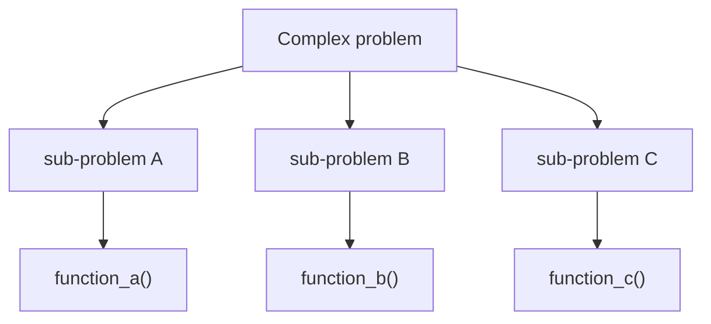

### The analogy with mathematics

In mathematics we write $f(x) = x^2 + 1$ once and then freely use $f(3)$, $f(-2)$, $f(t)$ without rewriting the formula. Programming functions work in exactly the same way.

---

## 3. Anatomy of a Python function

### Syntax

```python
def function_name(parameter_1, parameter_2, ...):
    """Docstring: brief description of what the function does."""
    # function body
    return value
```

### Annotated example

```python
def square(x):
    """Return the square of x."""
    result = x ** 2
    return result
```

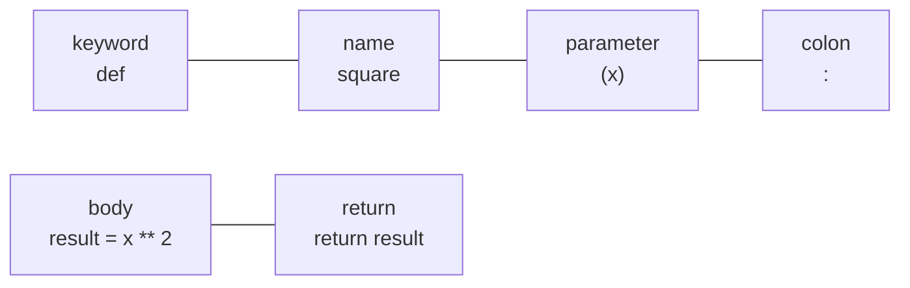

### The execution flow

When Python encounters `square(5)`:

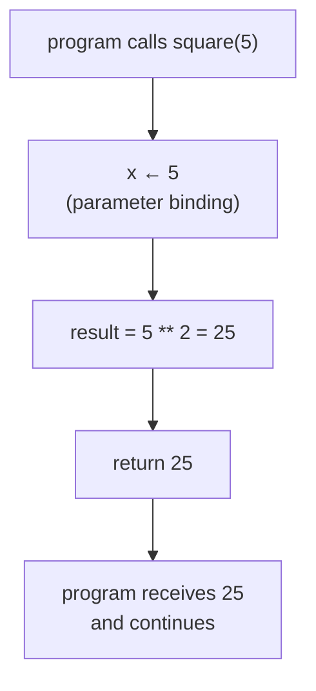

1. Execution **jumps** into the function body
2. The parameter `x` is bound to the value `5`
3. The body executes line by line
4. `return` sends the result back and **exits** the function
5. Execution resumes where the call was made

### Calling a function

```python
y = square(5)       # y receives the value 25
print(square(3))    # prints 9 directly
z = square(square(2))  # z = square(4) = 16  — composition!
```

---

## 4. Parameters and arguments

### Terminology

| Term | Meaning | Example |
|:---|:---|:---|
| **Parameter** | Variable name in the `def` line | `x` in `def square(x)` |
| **Argument** | Actual value passed at call time | `5` in `square(5)` |

### Multiple parameters

A function can accept any number of parameters, corresponding to a function $f : A_1 \times A_2 \times \cdots \times A_n \to B$:

```python
def add(a, b):
    """Return the sum of a and b."""
    return a + b

def power(base, exponent):
    """Return base raised to exponent."""
    return base ** exponent
```

### Default parameter values

A parameter can have a **default value**, used when the argument is omitted:

```python
def power(base, exponent=2):
    """Return base raised to exponent (default: square)."""
    return base ** exponent

print(power(3))     # 9  — exponent defaults to 2
print(power(3, 3))  # 27 — exponent is explicitly 3
```

> **Rule:** parameters with default values must come **after** parameters without defaults.

### Parameter passing: an important detail

In Python, when you pass an argument to a function, the parameter receives a **copy of the value** (for simple types like `int`, `float`, `str`). Modifying the parameter inside the function does not affect the original variable:

```python
def double(x):
    x = x * 2      # modifies the local copy only
    return x

n = 5
result = double(n)
print(n)       # 5  — unchanged
print(result)  # 10
```

---

## 5. The `return` statement

### `return` sends a value back

```python
def absolute_value(x):
    """Return the absolute value of x."""
    if x >= 0:
        return x
    else:
        return -x
```

The function has **two possible exit points** — whichever `return` is reached first terminates the function:

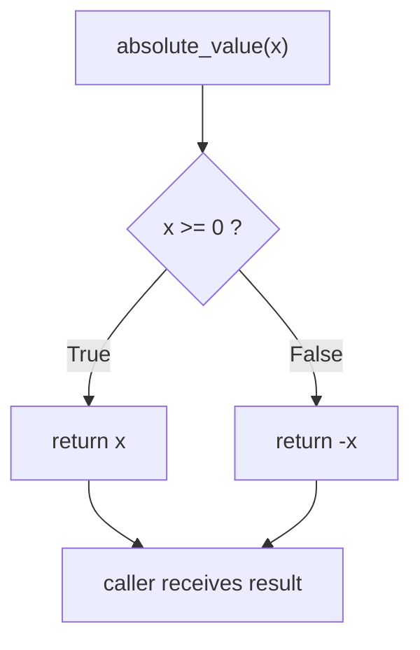

### Functions without `return`

A function that does not explicitly return a value returns `None` — Python's way of representing "nothing":

```python
def greet(name):
    """Print a greeting (returns nothing)."""
    print(f"Hello, {name}!")

result = greet("Alice")   # prints: Hello, Alice!
print(result)             # prints: None
```

These are called **void functions** (or *procedures*). They are used for their **side effects** — observable actions beyond returning a value, such as printing to the screen or writing to a file. The distinction between functions that *compute and return* versus functions that *act on the world* is explored in depth in Section 6.

### Returning multiple values

Python allows returning multiple values as a **tuple**:

```python
def divide_with_remainder(a, b):
    """Return quotient and remainder of a divided by b."""
    quotient = a // b
    remainder = a % b
    return quotient, remainder      # returns a tuple

q, r = divide_with_remainder(17, 5)
print(q)    # 3
print(r)    # 2
```

Mathematically this corresponds to $f : \mathbb{Z} \times \mathbb{Z} \to \mathbb{Z} \times \mathbb{Z}$, i.e. a function whose codomain is a Cartesian product.
---

## 6. Pure functions

### Definition

A function is **pure** if it satisfies two conditions simultaneously:

1. **Determinism** — given the same input, it always returns the same output:

$$x_1 = x_2 \implies f(x_1) = f(x_2)$$

2. **No side effects** — it does not modify anything outside its own local scope: no printing, no writing to files, no changing external variables.

This is exactly the mathematical definition of function. A pure function *is* a mathematical function, translated into code.

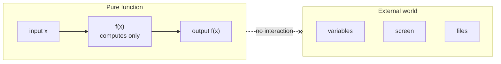

### Pure vs impure: a direct comparison

```python
# ✅ PURE — same input always gives same output, nothing external touched
def square(x):
    return x ** 2

# ✅ PURE — depends only on its parameters
def add(a, b):
    return a + b

# ❌ IMPURE — prints to screen (side effect)
def square_and_print(x):
    result = x ** 2
    print(result)       # side effect: interacts with the world
    return result

# ❌ IMPURE — reads external variable (hidden dependency)
multiplier = 3

def scale(x):
    return x * multiplier   # result changes if multiplier changes!
```

The last example is particularly dangerous: `scale(5)` returns `15` today, but if `multiplier` is changed elsewhere in the program it will return a different value with the **same input**.

### Why pure functions matter

#### 1. Easy to test

A pure function can be verified by checking input/output pairs alone — no setup, no external state, no surprises:

```python
assert square(3) == 9
assert square(-4) == 16
assert add(2, 3) == 5
```

An impure function that prints, reads files, or depends on global state requires careful setup before each test.

#### 2. Memoization — avoiding repeated computation

Because a pure function's output depends **only** on its input, if we have already computed $f(x)$ once we can **store and reuse** the result instead of recomputing it. This technique is called **memoization**:

$$f(x) \text{ already computed} \implies \text{look up the stored result instead of rerunning } f$$

```python
# Without memoization: recomputes the same values exponentially many times
def fibonacci(n):
    if n <= 1:
        return n
    return fibonacci(n - 1) + fibonacci(n - 2)

# With memoization: each value is computed at most once
cache = {}

def fibonacci_memo(n):
    if n in cache:
        return cache[n]         # reuse stored result
    if n <= 1:
        result = n
    else:
        result = fibonacci_memo(n - 1) + fibonacci_memo(n - 2)
    cache[n] = result           # store before returning
    return result
```

Memoization is **only correct for pure functions** — if the function had side effects or depended on external state, returning a cached past result would give the wrong answer.

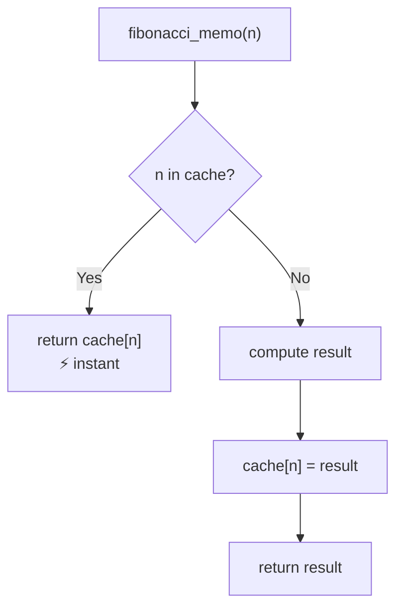

#### 3. Free composability

Pure functions compose safely because there are no hidden interactions between them. The output of one feeds cleanly into the input of another, exactly like $g \circ f$ in mathematics:

$$(g \circ f)(x) = g(f(x))$$

If $f$ or $g$ had side effects, composing them could cause unexpected interactions. With pure functions, composition always behaves exactly as expected.

### When impure functions are acceptable

Pure functions are the ideal, but **side effects are sometimes necessary** — a program that never prints, never writes a file, and never reads input is useless. The best practice is to keep the structure clean:

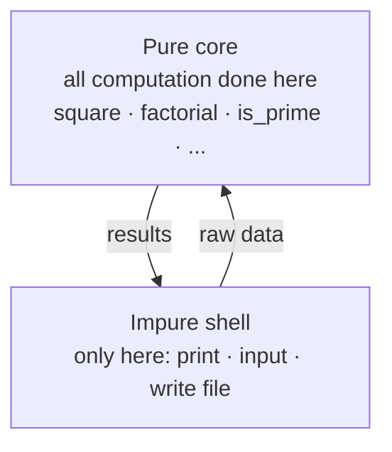

**Keep the impure parts as thin and isolated as possible.** All meaningful computation lives in pure functions; the impure layer only handles input/output at the boundary.

```python
# ✅ Good structure: pure core, impure shell

def celsius_to_fahrenheit(c):        # pure: only computation
    return c * 9 / 5 + 32

# impure shell: handles all interaction with the world
temp_c = float(input("Enter temperature in Celsius: "))
temp_f = celsius_to_fahrenheit(temp_c)
print(f"{temp_c}°C = {temp_f}°F")
```

### Summary: pure vs impure

| Property | Pure function | Impure function |
|:---|:---:|:---:|
| Same input → same output | ✅ always | ❌ not guaranteed |
| Modifies external state | ❌ never | ✅ may do so |
| Equivalent to $f: A \to B$ | ✅ yes | ❌ no |
| Easy to test | ✅ yes | ⚠️ requires setup |
| Memoizable | ✅ yes | ❌ unsafe |
| Freely composable | ✅ yes | ⚠️ with care |

## 7. Scope of variables

### Local vs global

Variables defined **inside** a function are **local**: they exist only during the function's execution and are invisible from outside.

```python
def compute():
    local_var = 42      # local variable
    return local_var

print(compute())    # 42
print(local_var)    # NameError: local_var is not defined here
```

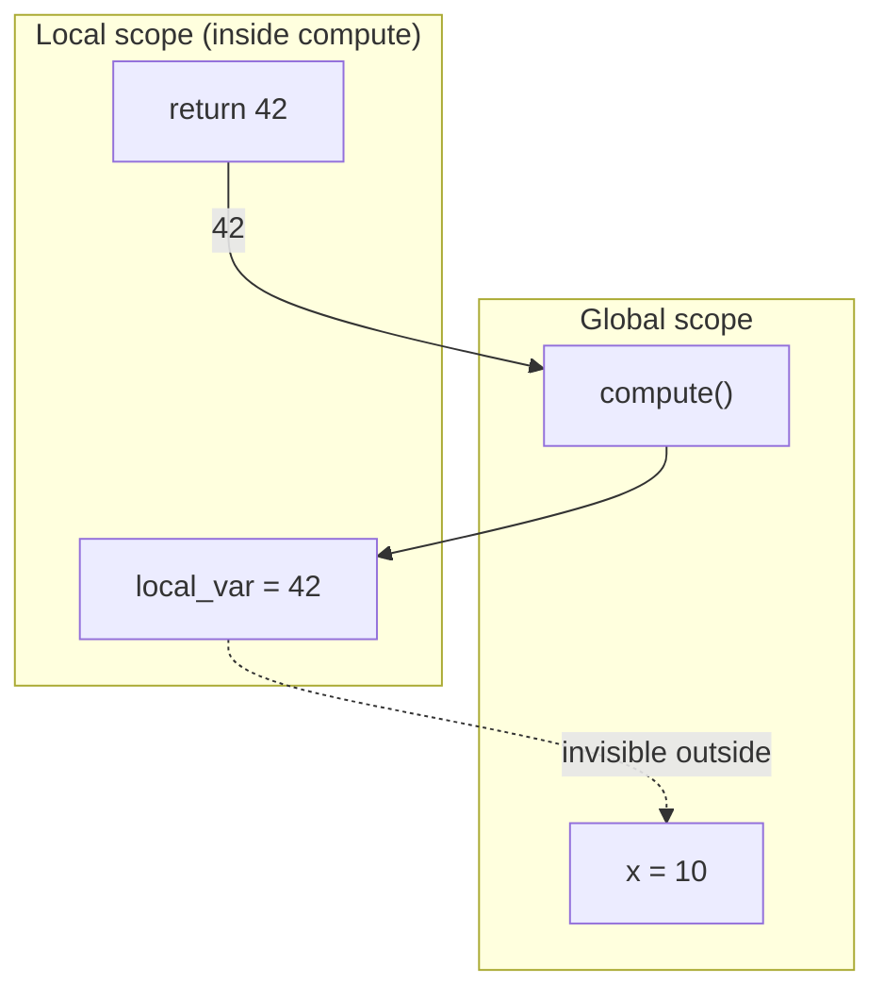

### Why does this matter?

Scope isolation is a feature, not a limitation. It means:
- functions are **self-contained** — they cannot accidentally modify variables in the rest of the program
- the same variable name can be used in different functions without conflict
- this mirrors mathematical notation: $f(x) = x^2$ and $g(x) = x+1$ both use $x$, but they refer to independent variables

---

## 8. Functions calling functions

Functions can call other functions, directly implementing **composition** $g \circ f$:

```python
def square(x):
    """Return x squared."""
    return x ** 2

def increment(x):
    """Return x + 1."""
    return x + 1

def square_then_increment(x):
    """Return (x^2) + 1  — composition: increment ∘ square."""
    return increment(square(x))

print(square_then_increment(3))   # increment(9) = 10
print(square_then_increment(5))   # increment(25) = 26
```

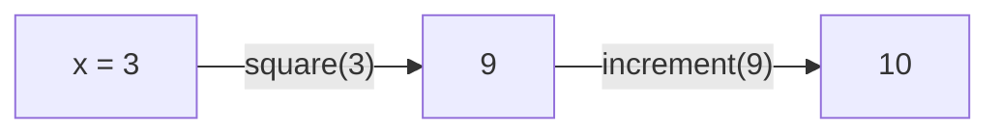

This is precisely the mathematical composition:

$$(f \circ g)(x) = f(g(x)) \qquad \text{where } g(x) = x^2,\; f(x) = x+1$$

### A realistic example: is a number a perfect square?

```python
import math

def is_integer(x):
    """Return True if x is a whole number."""
    return x == int(x)

def is_perfect_square(n):
    """Return True if n is a perfect square."""
    return is_integer(math.sqrt(n))

print(is_perfect_square(16))    # True   — sqrt(16) = 4.0
print(is_perfect_square(20))    # False  — sqrt(20) ≈ 4.47
```

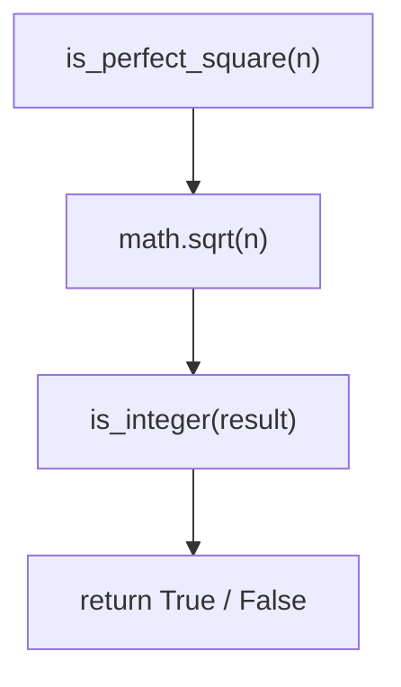

---

## 9. Summary

### Correspondence: mathematics ↔ Python

| Mathematical concept | Python equivalent |
|:---|:---|
| $f : A \to B$ | `def f(x):` |
| Domain $A$ | type / valid range of the parameter |
| Codomain $B$ | type of the returned value |
| $f(x)$ | `return x` |
| $f(a, b)$ — two variables | `def f(a, b):` |
| $(g \circ f)(x) = g(f(x))$ | `g(f(x))` |
| Undefined for $x \notin A$ | `ValueError` / guard clause |

### The four things to remember about a function

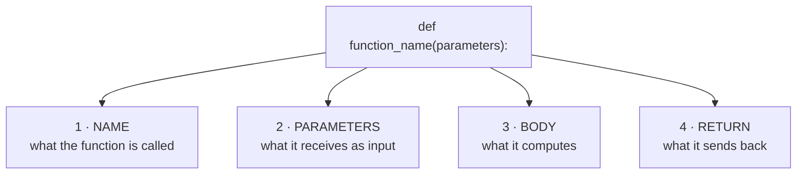

### When to write a function

Write a function when:
- the same block of code appears **more than once**
- a block of code has a clear, **nameable purpose**
- you want to **test** a piece of logic independently
- the main program is becoming too long to read easily

---

> **Next:** `python_functions_exercises.md`  
> Exercises with increasing difficulty — from simple converters to recursive definitions
