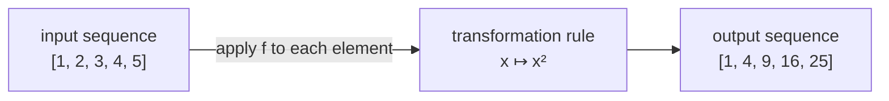
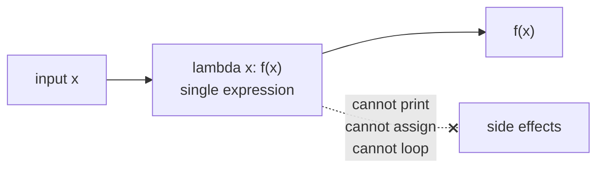
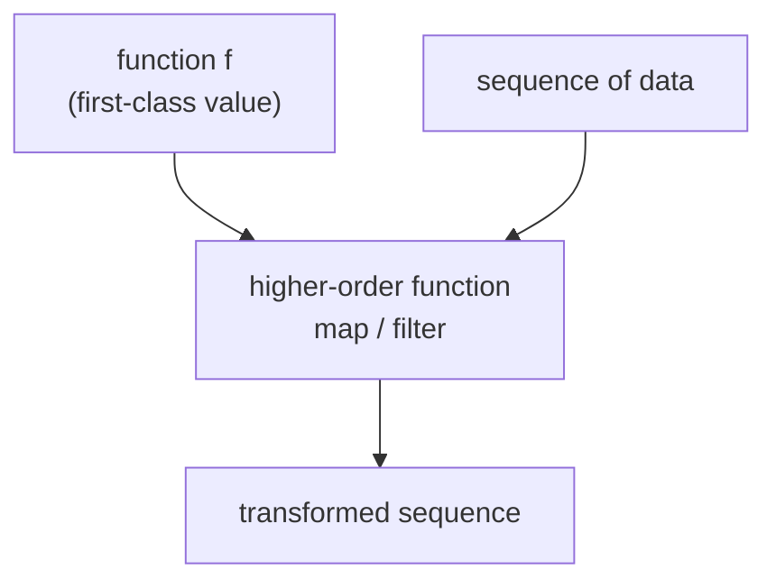
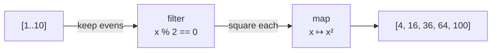
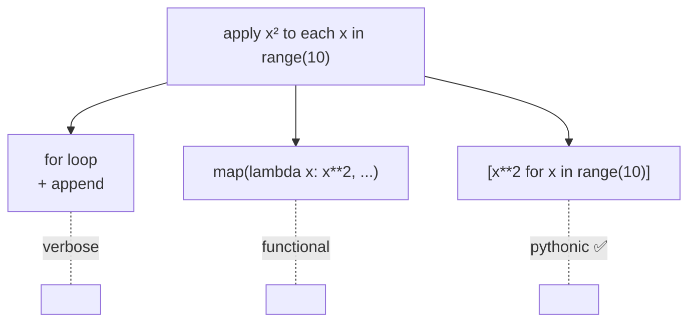
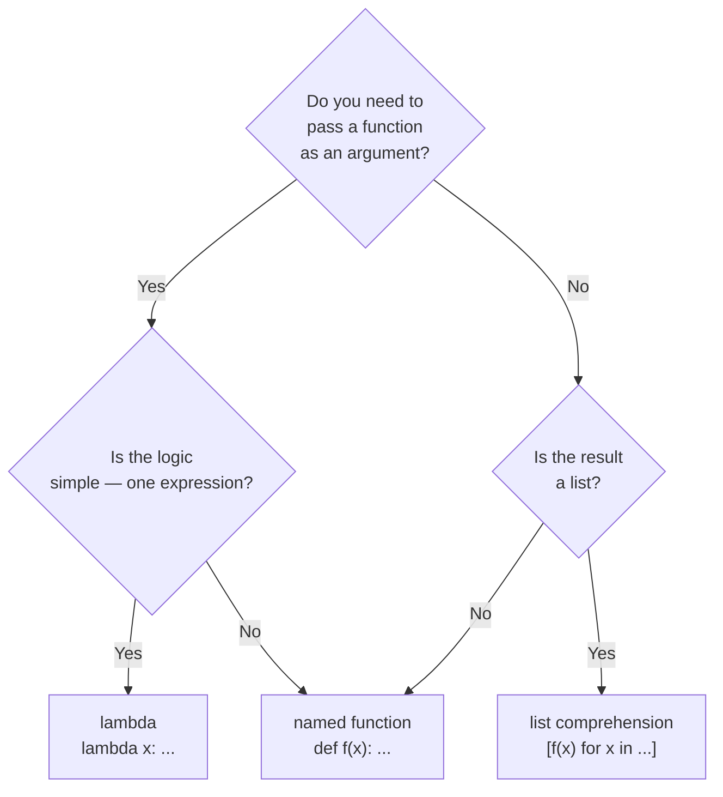
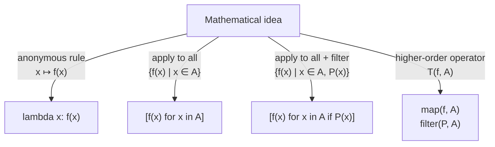

# Python — Lambda Functions & List Comprehensions · Theory
## `python_lambda_listcomp_theory.md`

> **Course:** Computer Science for Mathematics Students
> **Level:** First year university
> **Prerequisites:** `python_functions_theory.md` · `for` loops · `if/else`

---

## Table of contents

1. [The mathematical background](#1-the-mathematical-background)
2. [Lambda functions](#2-lambda-functions)
3. [Higher-order functions — `map` and `filter`](#3-higher-order-functions--map-and-filter)
4. [List comprehensions](#4-list-comprehensions)
5. [List comprehensions with conditions](#5-list-comprehensions-with-conditions)
6. [Nested list comprehensions](#6-nested-list-comprehensions)
7. [Lambda vs list comprehension — when to use which](#7-lambda-vs-list-comprehension--when-to-use-which)
8. [Summary](#8-summary)

---

## 1. The mathematical background

### Anonymous functions

In mathematics we often write a function **without giving it a name**:

$$x \longmapsto x^2 + 1$$

This is read *"the function that maps $x$ to $x^2 + 1$"*. We are describing the rule, not naming it $f$ or $g$.
In Python this is exactly a **lambda function**.

### Set-builder notation

In mathematics we describe sets by specifying a rule:

$$\{x^2 \mid x \in \{1, 2, 3, 4, 5\}\} = \{1, 4, 9, 16, 25\}$$

$$\{x \in \mathbb{Z} \mid 1 \leq x \leq 20 \text{ and } 2 \mid x\} = \{2, 4, 6, \ldots, 20\}$$

In Python this is exactly a **list comprehension**.

| Mathematical notation | Python equivalent |
|:---|:---|
| $x \mapsto x^2$ | `lambda x: x ** 2` |
| $\{f(x) \mid x \in A\}$ | `[f(x) for x in A]` |
| $\{f(x) \mid x \in A,\ P(x)\}$ | `[f(x) for x in A if P(x)]` |
| $T : (A \to B) \to C$ | `def apply(func, data):` |

### Transformations on sequences

Both tools express the same mathematical idea — applying a rule to a collection of values — but with different emphasis:



This pattern — *apply a function to every element of a sequence* — is one of the most fundamental operations in both mathematics and functional programming.

---

## 2. Lambda functions

### Syntax

A lambda function is a **function without a name**, defined in a single expression:

```python
lambda parameter_1, parameter_2, ... : expression
```

Comparison with a regular `def`:

```python
# Regular named function
def square(x):
    return x ** 2

# Equivalent lambda
lambda x: x ** 2
```

The two are **identical in behaviour**. The difference is that a lambda has no name and no `return` keyword — the expression after `:` is the return value implicitly.

### Assigning a lambda to a variable

A lambda can be stored in a variable, making it callable exactly like a `def` function:

```python
square = lambda x: x ** 2
add    = lambda a, b: a + b
is_even = lambda n: n % 2 == 0

print(square(5))       # 25
print(add(3, 4))       # 7
print(is_even(6))      # True
```

> **Note:** assigning a lambda to a variable is functionally equivalent to `def`. In practice, prefer `def` when the function needs a name — lambdas shine when used *inline*, without assignment (see Section 3).

### Lambdas are pure by design

A lambda can only contain a **single expression** — no statements, no loops, no assignments. This constraint makes it impossible to produce side effects, so **every lambda is a pure function**:

$$\text{lambda } x : f(x) \quad \longleftrightarrow \quad x \mapsto f(x)$$



### Multiple parameters

```python
multiply   = lambda a, b: a * b
clamp      = lambda x, lo, hi: max(lo, min(x, hi))
hypotenuse = lambda a, b: (a**2 + b**2) ** 0.5

print(multiply(3, 7))          # 21
print(clamp(15, 0, 10))        # 10
print(hypotenuse(3, 4))        # 5.0
```

### Default values

Like regular functions, lambdas support default parameter values:

```python
power = lambda base, exp=2: base ** exp

print(power(3))     # 9   — exp defaults to 2
print(power(2, 10)) # 1024
```

---

## 3. Higher-order functions — `map` and `filter`

### What is a higher-order function?

A **higher-order function** is a function that takes another function as an argument — or returns one.
In mathematics this is common: the integral operator $\int_a^b$ takes a function $f$ and returns a number; the derivative operator $\frac{d}{dx}$ takes $f$ and returns another function.

$$T : (A \to B) \times \text{Sequence}(A) \to \text{Sequence}(B)$$

In Python, `map` and `filter` are built-in higher-order functions.



### `map` — apply a function to every element

`map(f, sequence)` applies $f$ to each element of the sequence:

$$\text{map}(f, [a_1, a_2, \ldots, a_n]) = [f(a_1),\ f(a_2),\ \ldots,\ f(a_n)]$$

```python
numbers = [1, 2, 3, 4, 5]

# Using a named function
def square(x):
    return x ** 2

squares = list(map(square, numbers))
print(squares)      # [1, 4, 9, 16, 25]

# Using a lambda — more concise, same result
squares = list(map(lambda x: x ** 2, numbers))
print(squares)      # [1, 4, 9, 16, 25]
```

> `map` returns a **lazy iterator**, not a list. Wrapping with `list()` forces evaluation and gives a concrete list.

### `filter` — keep elements satisfying a predicate

`filter(P, sequence)` keeps only elements for which the predicate $P$ is `True`:

$$\text{filter}(P, [a_1,\ldots,a_n]) = [a_i \mid P(a_i) = \text{True}]$$

```python
numbers = [1, 2, 3, 4, 5, 6, 7, 8, 9, 10]

evens = list(filter(lambda n: n % 2 == 0, numbers))
print(evens)        # [2, 4, 6, 8, 10]

positives = list(filter(lambda x: x > 0, [-3, -1, 0, 2, 5]))
print(positives)    # [2, 5]
```

### Combining `map` and `filter` — function composition

`map` and `filter` compose naturally, mirroring $f \circ g$:

```python
numbers = range(1, 11)

# Filter evens, then square them
# Mathematically: {x² | x ∈ {1,...,10}, 2|x}
result = list(map(lambda x: x ** 2,
                  filter(lambda x: x % 2 == 0, numbers)))
print(result)       # [4, 16, 36, 64, 100]
```



---

## 4. List comprehensions

### Syntax

A list comprehension builds a new list by expressing a rule directly — mirroring set-builder notation:

```python
[expression  for variable in iterable]
```

| Part | Role | Mathematical analogue |
|:---:|:---|:---|
| `expression` | transformation applied to each element | $f(x)$ |
| `variable` | loop variable | $x$ |
| `iterable` | source sequence | $x \in A$ |

### Basic examples

```python
# {x² | x ∈ {0,1,...,9}}
squares = [x ** 2 for x in range(10)]
print(squares)
# [0, 1, 4, 9, 16, 25, 36, 49, 64, 81]

# {2x | x ∈ {1,...,5}}
doubled = [2 * x for x in range(1, 6)]
print(doubled)
# [2, 4, 6, 8, 10]

# Apply a function to a list of strings
words = ["hello", "world", "python"]
upper = [w.upper() for w in words]
print(upper)
# ['HELLO', 'WORLD', 'PYTHON']
```

### Equivalence with `map`

A list comprehension and `map` with a lambda express the same thing:

```python
# These three are equivalent
squares_loop = []
for x in range(10):
    squares_loop.append(x ** 2)

squares_map  = list(map(lambda x: x ** 2, range(10)))

squares_comp = [x ** 2 for x in range(10)]
```



> **Pythonic style:** list comprehensions are the preferred idiom in Python for this pattern. They are more readable than `map + lambda` and more concise than explicit loops.

---

## 5. List comprehensions with conditions

### Syntax with filter

Adding an `if` clause mirrors the set-builder condition $P(x)$:

```python
[expression  for variable in iterable  if condition]
```

This is equivalent to $\{f(x) \mid x \in A,\ P(x)\}$.

### Examples

```python
# {x | x ∈ {1,...,20}, 2|x}
evens = [x for x in range(1, 21) if x % 2 == 0]
print(evens)
# [2, 4, 6, 8, 10, 12, 14, 16, 18, 20]

# {x² | x ∈ {1,...,10}, 2|x}
even_squares = [x ** 2 for x in range(1, 11) if x % 2 == 0]
print(even_squares)
# [4, 16, 36, 64, 100]

# Keep only words longer than 4 characters
words = ["cat", "elephant", "dog", "hippopotamus", "ant"]
long_words = [w for w in words if len(w) > 4]
print(long_words)
# ['elephant', 'hippopotamus']
```

### Combining transformation and filter

The condition and expression are independent — we filter by one criterion and transform by another:

```python
numbers = range(1, 21)

# Square the odd numbers only
# {x² | x ∈ {1,...,20}, x odd}
odd_squares = [x ** 2 for x in numbers if x % 2 != 0]
print(odd_squares)
# [1, 9, 25, 49, 81, 121, 169, 225, 289, 361]
```

### Equivalence with `filter` + `map`

```python
# These are equivalent
result_map  = list(map(lambda x: x ** 2,
                       filter(lambda x: x % 2 == 0, range(1, 11))))

result_comp = [x ** 2 for x in range(1, 11) if x % 2 == 0]

print(result_map  == result_comp)   # True
```

The list comprehension reads in natural order — *"give me $x^2$ for each $x$ in range, if $x$ is even"* — which matches the mathematical phrasing more directly than the `map(filter(...))` nesting.

---

## 6. Nested list comprehensions

### Two-variable set-builder notation

In mathematics we write:

$$\{(x, y) \mid x \in A,\ y \in B\} = A \times B$$

$$\{x + y \mid x \in \{1,2,3\},\ y \in \{10, 20\}\}$$

In Python:

```python
# Cartesian product A × B as list of tuples
A = [1, 2, 3]
B = [10, 20]

pairs = [(x, y) for x in A for y in B]
print(pairs)
# [(1, 10), (1, 20), (2, 10), (2, 20), (3, 10), (3, 20)]

# {x + y | x ∈ A, y ∈ B}
sums = [x + y for x in A for y in B]
print(sums)
# [11, 21, 12, 22, 13, 23]
```

The order of the `for` clauses mirrors nested loops — the **rightmost** varies fastest.

### Multiplication table

```python
# Full 5×5 multiplication table as a 2D list
table = [[i * j for j in range(1, 6)] for i in range(1, 6)]

for row in table:
    print(row)
# [1,  2,  3,  4,  5]
# [2,  4,  6,  8, 10]
# [3,  6,  9, 12, 15]
# [4,  8, 12, 16, 20]
# [5, 10, 15, 20, 25]
```

This is the matrix $M_{ij} = i \cdot j$ for $i, j \in \{1,\ldots,5\}$.

### Flattening a matrix

```python
matrix = [[1, 2, 3],
          [4, 5, 6],
          [7, 8, 9]]

# Extract all elements into a flat list
flat = [element for row in matrix for element in row]
print(flat)
# [1, 2, 3, 4, 5, 6, 7, 8, 9]
```

> **Readability rule:** nested comprehensions beyond two levels become hard to read. For three or more levels, prefer explicit loops.

---

## 7. Lambda vs list comprehension — when to use which

### Decision guide



### Side-by-side comparison

| Situation | Best tool | Example |
|:---|:---:|:---|
| Pass a short rule to `map`/`filter`/`sort` | `lambda` | `sorted(data, key=lambda x: x[1])` |
| Build a new list from a sequence | list comp | `[x**2 for x in range(10)]` |
| Build a filtered list | list comp | `[x for x in data if x > 0]` |
| Reusable logic with a name | `def` | `def is_prime(n): ...` |
| Multi-line logic | `def` | anything needing `if/else` blocks or loops |

### A concrete example showing the difference

**Task:** from a list of integers, keep the negatives and return their absolute values.

```python
data = [-3, 1, -7, 4, -2, 8, -5]

# lambda + map + filter (functional style)
result_lambda = list(map(lambda x: abs(x),
                         filter(lambda x: x < 0, data)))

# list comprehension (pythonic style)
result_comp   = [abs(x) for x in data if x < 0]

print(result_lambda)    # [3, 7, 2, 5]
print(result_comp)      # [3, 7, 2, 5]
```

Both are correct. The list comprehension is shorter and reads left-to-right in a single line.

---

## 8. Summary

### The three tools at a glance



### Complete syntax reference

```python
# Lambda
lambda x: expression
lambda x, y: expression

# List comprehension — basic
[expression for var in iterable]

# List comprehension — with filter
[expression for var in iterable if condition]

# List comprehension — nested (Cartesian product)
[expression for x in A for y in B]

# List comprehension — nested 2D list
[[expression for j in cols] for i in rows]

# map and filter
list(map(lambda x: f(x), sequence))
list(filter(lambda x: P(x), sequence))

# Composed
list(map(f, filter(P, sequence)))
[f(x) for x in sequence if P(x)]       # equivalent, preferred
```

### Mathematical correspondence — complete table

| Mathematical notation | Python |
|:---|:---|
| $x \mapsto f(x)$ | `lambda x: f(x)` |
| $\{f(x) \mid x \in A\}$ | `[f(x) for x in A]` |
| $\{f(x) \mid x \in A,\ P(x)\}$ | `[f(x) for x in A if P(x)]` |
| $A \times B$ | `[(x,y) for x in A for y in B]` |
| $M_{ij} = f(i,j)$ | `[[f(i,j) for j in cols] for i in rows]` |
| $T : (A\to B) \to C$ | `def apply(func, data):` |
| $\text{map}(f, A)$ | `list(map(f, A))` |
| $\{x \in A \mid P(x)\}$ | `list(filter(P, A))` |

---

> **Next:** `python_lambda_listcomp_exercises.md`
> Exercises with increasing difficulty — from simple transformations to mathematical sequences and cryptography
