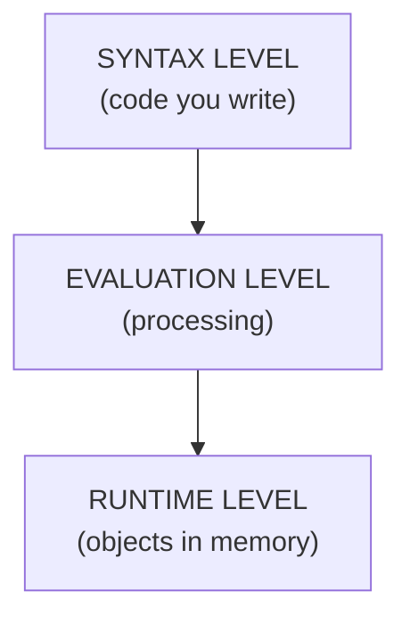
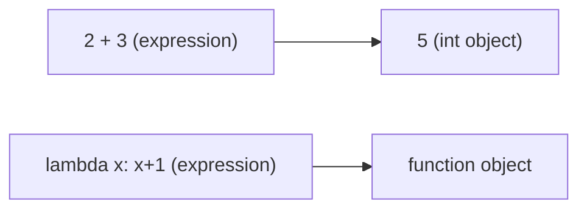
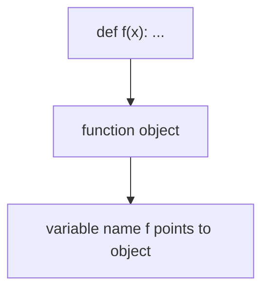
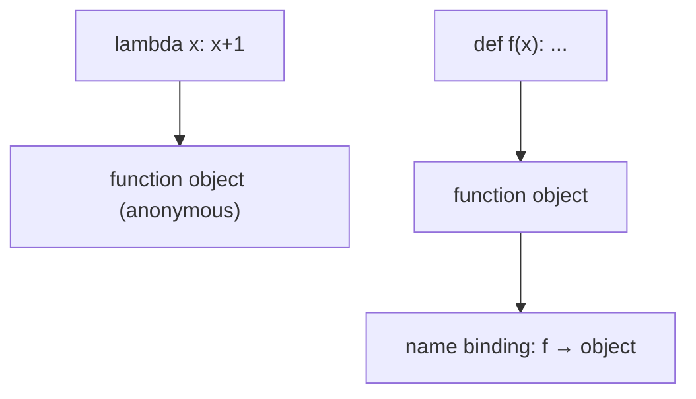
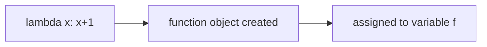
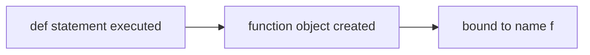
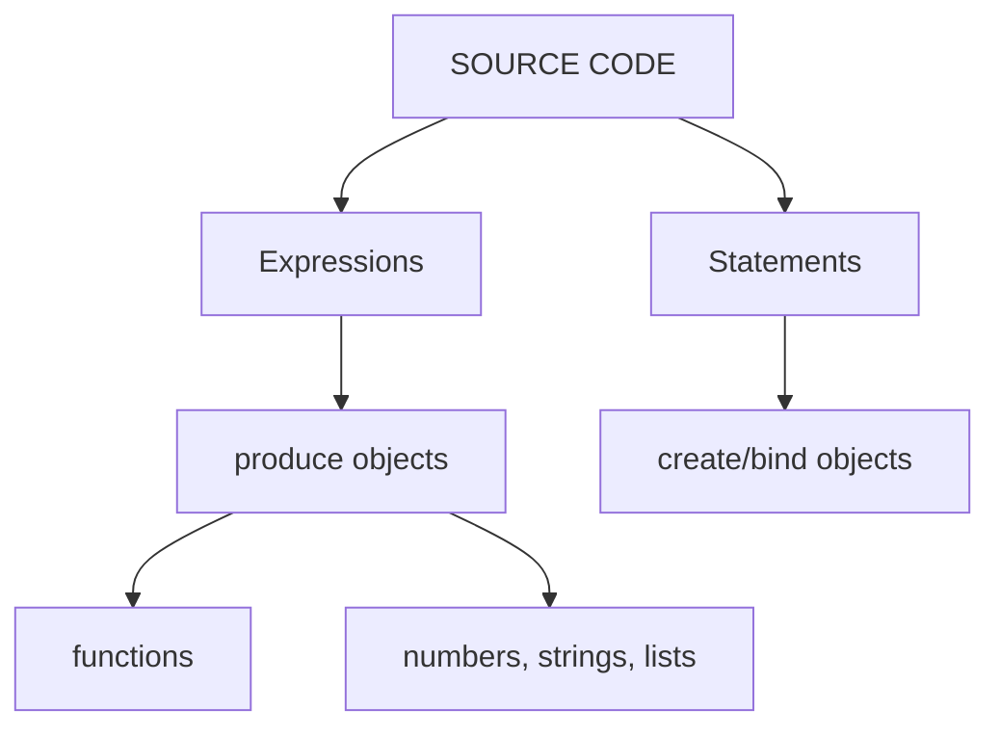

<!--
* espressione vs statement
* lambda vs def
* funzione vs oggetto
* cosa viene creato e quando
-->

# Python — Expressions, Functions, and Lambdas · Conceptual Model

## `python_expressions_functions_lambda.md`

> **Course:** Computer Science for Mathematics Students
> **Level:** First year university
> **Prerequisites:** basic Python syntax, functions, variables

---

## Table of contents

1. [Core idea — three different levels](#1-core-idea--three-different-levels)
2. [Expressions vs objects](#2-expressions-vs-objects)
3. [Functions as objects](#3-functions-as-objects)
4. [Lambda vs def](#4-lambda-vs-def)
5. [Evaluation model (what Python actually does)](#5-evaluation-model-what-python-actually-does)
6. [Summary mental model](#6-summary-mental-model)

---

## 1. Core idea — three different levels

In Python you must separate **three different concepts**:



| Level      | What it contains        |
| :--------- | :---------------------- |
| Syntax     | expressions, statements |
| Evaluation | rules to compute values |
| Runtime    | objects (values)        |

---

## 2. Expressions vs objects

### Key idea

> An **expression is NOT an object**
> It is a **piece of syntax that produces an object**

---

### Examples

```python
2 + 3
```

* expression ✔
* evaluates to → `5` (object)

```python
lambda x: x + 1
```

* expression ✔
* evaluates to → function object

---

### Visual model



---

## 3. Functions as objects

### Key idea

> In Python, **functions are objects**

They are values stored in memory.

---

### Example with `def`

```python
def f(x):
    return x + 1
```

After execution:

```python
f
```

→ is an object of type `function`

---

### Model



---

## 4. Lambda vs def

### 4.1 Lambda

```python
lambda x: x + 1
```

* **expression**
* produces a function object
* anonymous (no name created automatically)

---

### 4.2 Def

```python
def f(x):
    return x + 1
```

* **statement**
* creates function object
* binds it to name `f`

---

## 4.3 Key difference



---

## 4.4 Critical insight

| Feature          | lambda          | def             |
| :--------------- | :-------------- | :-------------- |
| Type             | expression      | statement       |
| Result           | function object | function object |
| Name created     | ❌ no            | ✔ yes           |
| Can be inline    | ✔ yes           | ❌ no            |
| Multi-line logic | ❌ no            | ✔ yes           |

---

## 5. Evaluation model (what Python actually does)

### Step-by-step execution

### Example 1

```python
f = lambda x: x + 1
```



---

### Example 2

```python
def f(x):
    return x + 1
```



---

## 6. Summary mental model

### Final unifying picture



---

## ✔ One-line mental rule

> **Expressions produce objects.
> Statements create structure and bindings around objects.**

---

## ✔ Lambda vs Function (core truth)

```text
lambda = expression that PRODUCES a function object
def    = statement that CREATES and BINDS a function object
```
<!--
---

Se vuoi, il prossimo step naturale (molto importante per capire bene Python) è:

👉 **closure + scope (LEGB rule) con lambda dentro loop**

che è il punto dove il 90% degli studenti si confonde.-->
