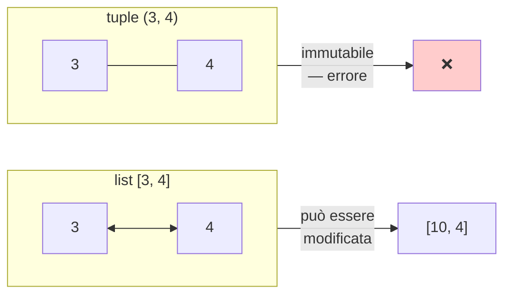
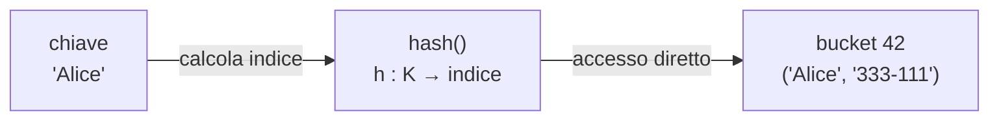
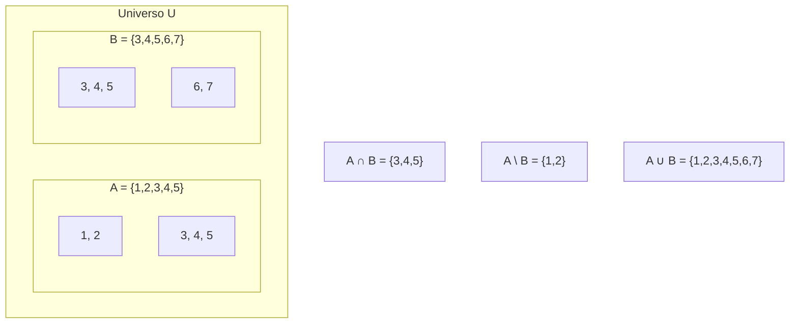
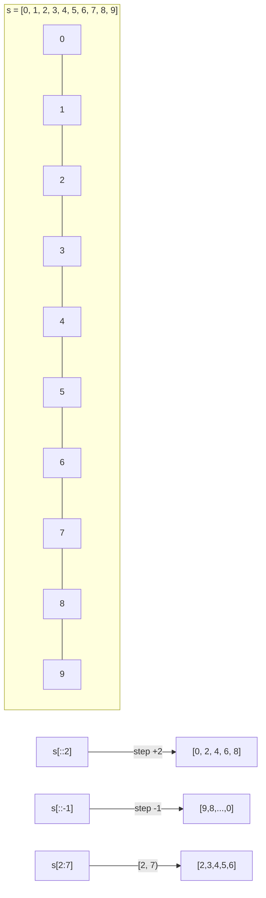
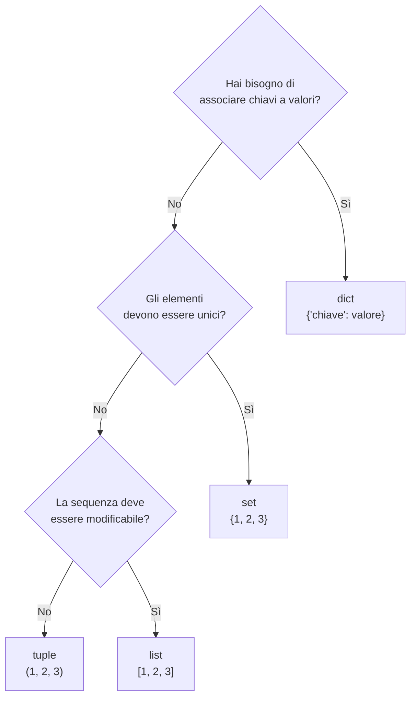
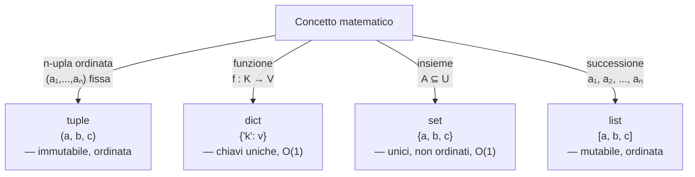

# Python — Native Data Structures · Theory
## `python_native_data_structures_theory.md`

> **Course:** Computer Science for Mathematics Students
> **Level:** First year university
> **Prerequisites:** `python_lambda_listcomp_theory.md` · `for` loops · `if/else` · functions

---

## Table of Contents

1. [Introduzione: perché esistono strutture dati diverse?](#1-introduzione-perché-esistono-strutture-dati-diverse)
2. [Tuple — sequenze immutabili](#2-tuple--sequenze-immutabili)
3. [Dizionari — funzioni come struttura dati](#3-dizionari--funzioni-come-struttura-dati)
4. [Set — la teoria degli insiemi in Python](#4-set--la-teoria-degli-insiemi-in-python)
5. [Slicing avanzato — sottosequenze e proiezioni](#5-slicing-avanzato--sottosequenze-e-proiezioni)
6. [Confronto e scelta della struttura corretta](#6-confronto-e-scelta-della-struttura-corretta)
7. [Summary](#7-summary)

---

Ecco la sezione formattata in **GitHub Flavored Markdown**, pronta per essere inserita nel tuo documento teorico. Ho integrato le tue riflessioni con il rigore formale richiesto, utilizzando gli admonition block per evidenziare i passaggi chiave.

---

## 1. Cosa è una struttura dati?

In informatica, i dati non esistono nel vuoto. Un insieme di bit in memoria è solo una sequenza amorfa di zeri e uni finché non decidiamo come interpretarli e, soprattutto, come organizzarli.

### 1.1 La Triplice Natura di una Struttura Dati
Possiamo definire una struttura dati come un'entità che svolge tre funzioni fondamentali simultaneamente:

1.  **Attribuzione di Semantica:** Trasforma bit anonimi in entità concettuali (es. un "Punto" nel piano, un "Insieme" di utenti, un "Dizionario" di traduzioni).
2.  **Definizione del Dominio Operativo:** Stabilisce quali operazioni sono lecite e quali no. Ad esempio, su un *Set* (Insieme) ha senso operare un'unione o un'intersezione; su una *Lista*, ha senso aggiungere un elemento in coda o accedere tramite un indice numerico.
3.  **Determinazione dell'Efficienza (Complessità):** La struttura scelta imposta i limiti fisici della velocità di esecuzione. La stessa operazione di ricerca può costare <span class="math">O(1)</span> in una Hash Table o <span class="math">O(n)</span> in una Lista.

> [!IMPORTANT]
> **Il Principio Cardine**
> La struttura dati è all'informatica ciò che la struttura algebrica è alla matematica: una forma imposta su oggetti grezzi per rendere possibile il ragionamento e l'elaborazione.

### 1.2 Il Parallelo Matematico: Strutture Algebriche
Per comprendere a fondo questo concetto, è utile guardare a come la matematica tratta i propri oggetti. Consideriamo un insieme di elementi $S$:

* Se non imponiamo alcuna regola, $S$ è solo una collezione di oggetti.
* Se definiamo un'operazione binaria e degli assiomi (come associatività, elemento neutro e inverso), trasformiamo quell'insieme in un **Gruppo**.
* Se aggiungiamo ulteriori regole, otteniamo un **Anello** o uno **Spazio Vettoriale**.

Nell'informatica accade lo stesso: la "struttura" (le operazioni e i loro vincoli) determina cosa puoi "dimostrare" (ovvero calcolare) e come puoi ragionare sul problema.

> [!TIP]
> **Analoga Mentale**
> Immaginate la memoria RAM come un magazzino vuoto.
> - I **Dati** sono gli oggetti sparsi sul pavimento.
> - La **Struttura Dati** è lo scaffale, l'archivio o il nastro trasportatore che utilizzate per organizzarli. 
> Senza lo scaffale, trovare un oggetto richiede di controllare ogni singolo centimetro del pavimento (Ricerca Lineare <span class="math">O(n)</span>). Con lo scaffale giusto, sapete esattamente dove guardare (Accesso Diretto <span class="math">O(1)</span>).

### 1.3 Rappresentazione Formale
In termini informatici, spesso separiamo il concetto logico dalla sua implementazione fisica:

* **ADT (Abstract Data Type):** La definizione matematica/logica (es. "Voglio un contenitore che non ammetta duplicati"). Corrisponde alla definizione di una struttura algebrica.
* **Data Structure:** L'implementazione concreta in memoria (es. "Uso un Array ordinato per simulare quel contenitore"). Corrisponde all'applicazione di quella struttura a un insieme numerico specifico (es. gli interi $\mathbb{Z}$).

> [!NOTE]
> Ricorda: Non esiste la "struttura migliore" in assoluto. Esiste solo la struttura più adatta al tipo di operazione che dovrai compiere più frequentemente.

## 1. Introduzione: perché esistono strutture dati diverse?

### Il problema fondamentale

Un computer ha una memoria fisicamente **lineare e uniforme**: una lunga sequenza di celle, ognuna identificata da un indirizzo numerico. Eppure la realtà che vogliamo modellare è molto più ricca: abbiamo insiemi senza ordine, mappe da chiavi a valori, sequenze che non devono essere modificate.

Le **strutture dati** sono astrazioni che organizzano la memoria grezza in forme utili al ragionamento. La scelta della struttura giusta ha conseguenze dirette su:

- **Correttezza semantica** — la struttura deve rispecchiare il significato del dato
- **Complessità computazionale** — alcune operazioni costano $O(1)$, altre $O(n)$, a seconda della struttura
- **Leggibilità** — il codice deve comunicare l'intenzione del programmatore

### Le quattro strutture di questo modulo

| Struttura | Analogia matematica | Ordinata? | Mutabile? | Duplicati? |
|:---|:---|:---:|:---:|:---:|
| `list` | Successione $a_1, a_2, \ldots, a_n$ | ✅ | ✅ | ✅ |
| `tuple` | Vettore / $n$-upla ordinata | ✅ | ❌ | ✅ |
| `dict` | Funzione $f : K \to V$ | ✅ (ins. order) | ✅ | ❌ (per chiave) |
| `set` | Insieme $A \subseteq U$ | ❌ | ✅ | ❌ |

> [!NOTE]
> La lista (`list`) è già stata introdotta nei moduli precedenti. Questo documento la usa come riferimento di confronto, non la tratta ex-novo.

---

## 2. Tuple — sequenze immutabili

### 2.1 Il corrispettivo matematico: la $n$-upla ordinata

In matematica, una **$n$-upla ordinata** è una sequenza di $n$ elementi in cui l'ordine è significativo e il contenuto è fisso:

$$P = (x, y) \in \mathbb{R}^2, \qquad Q = (a, b, c) \in \mathbb{R}^3$$

La $n$-upla $(1, 2)$ e la $n$-upla $(2, 1)$ sono **diverse**, e non possiamo modificare le coordinate di un punto dopo averlo definito senza creare un punto nuovo.

Una `tuple` Python è esattamente questa struttura.

### 2.2 Sintassi e costruzione

```python
# Creazione
punto   = (3, 4)
colore  = (255, 128, 0)          # RGB
vuota   = ()
singola = (42,)                  # NOTA: la virgola è obbligatoria

# Accesso per indice — identico alle liste
print(punto[0])     # 3
print(punto[1])     # 4
print(punto[-1])    # 4  (indice negativo: dall'ultimo)

# Unpacking — assegnazione parallela
x, y = punto
print(x, y)         # 3 4

a, b, c = colore
print(a, b, c)      # 255 128 0
```

> [!IMPORTANT]
> **La virgola fa la tuple, non le parentesi.**
> `(42)` è semplicemente il numero `42` tra parentesi. `(42,)` è una tuple con un solo elemento. Questo è uno degli errori più comuni tra i principianti.

### 2.3 Immutabilità: la proprietà chiave

Una tupla, una volta creata, **non può essere modificata**. Qualsiasi tentativo di farlo genera un `TypeError`:

```python
punto = (3, 4)
punto[0] = 10   # ❌ TypeError: 'tuple' object does not support item assignment
```

Questo non è un limite, ma una **garanzia semantica**: se passiamo una tupla a una funzione, sappiamo con certezza che la funzione non la modificherà. È un contratto esplicito nel codice.



### 2.4 Perché l'immutabilità è utile: tuple come chiavi dei dizionari

L'immutabilità ha una conseguenza tecnica fondamentale: le tuple sono **hashable**, ovvero è possibile calcolarne un hash (un valore numerico derivato dal contenuto), mentre le liste non lo sono.

Questo rende le tuple utilizzabili come **chiavi dei dizionari** (vedi sezione successiva):

```python
# Dizionario con coordinate come chiavi
griglia = {
    (0, 0): "origine",
    (1, 0): "destra",
    (0, 1): "su",
    (1, 1): "diagonale"
}

print(griglia[(0, 0)])   # origine
print(griglia[(1, 1)])   # diagonale

# Le liste NON possono essere chiavi
# griglia[[0, 0]] = "errore"  # ❌ TypeError: unhashable type: 'list'
```

> [!TIP]
> Usa le tuple ogni volta che vuoi rappresentare un **dato composto che non deve cambiare**: coordinate, date, coppie (nome, cognome), record di database. Usa le liste quando hai bisogno di aggiungere o rimuovere elementi.

### 2.5 Complessità computazionale

| Operazione | Complessità | Note |
|:---|:---:|:---|
| Accesso per indice `t[i]` | $O(1)$ | Accesso diretto in memoria |
| Lunghezza `len(t)` | $O(1)$ | Memorizzata internamente |
| Ricerca `x in t` | $O(n)$ | Scansione lineare |
| Hashing `hash(t)` | $O(n)$ | Dipende dal contenuto |

---

## 3. Dizionari — funzioni come struttura dati

### 3.1 Il corrispettivo matematico: la funzione

In matematica, una **funzione** $f : A \to B$ è una relazione che associa ad ogni elemento del dominio $A$ **esattamente un** elemento del codominio $B$:

$$f : \text{nome} \mapsto \text{numero di telefono}$$

$$f : \text{parola} \mapsto \text{frequenza nel testo}$$

Un dizionario Python (`dict`) è precisamente questa struttura: una mappa da **chiavi** (dominio) a **valori** (codominio), con la garanzia che ogni chiave appare al più una volta.

$$\text{dict} \;\longleftrightarrow\; f : K \to V \quad \text{con } K = \text{chiavi},\; V = \text{valori}$$

> [!NOTE]
> Come in matematica $f(x)$ è definita solo per $x \in \text{dom}(f)$, accedere a una chiave inesistente in un dizionario genera un `KeyError`.

### 3.2 Sintassi e costruzione

```python
# Creazione con letterale
studente = {
    "nome":    "Alice",
    "età":     22,
    "matricola": 12345
}

# Accesso per chiave
print(studente["nome"])       # Alice
print(studente["età"])        # 22

# Aggiunta e modifica
studente["corso"] = "Matematica"   # aggiunge una coppia
studente["età"]   = 23             # sovrascrive il valore esistente

# Dizionario vuoto
vuoto = {}
```

### 3.3 Metodi fondamentali

I tre metodi più importanti per l'iterazione riflettono la struttura matematica della funzione:

```python
rubrica = {
    "Alice": "333-111",
    "Bob":   "333-222",
    "Carlo": "333-333"
}

# .keys()   → il dominio della funzione
print(list(rubrica.keys()))
# ['Alice', 'Bob', 'Carlo']

# .values() → l'immagine della funzione
print(list(rubrica.values()))
# ['333-111', '333-222', '333-333']

# .items()  → l'insieme dei grafici { (x, f(x)) | x ∈ dom(f) }
print(list(rubrica.items()))
# [('Alice', '333-111'), ('Bob', '333-222'), ('Carlo', '333-333')]

# Iterazione
for nome, numero in rubrica.items():
    print(f"{nome}: {numero}")
```

> [!IMPORTANT]
> `.items()` restituisce coppie di tipo **tuple**. Questo spiega perché abbiamo presentato le tuple prima: ogni coppia `(chiave, valore)` è un'$n$-upla ordinata e immutabile, esattamente come un punto nel piano.

### 3.4 Accesso sicuro con `.get()`

Il problema della funzione parziale: cosa succede se chiediamo $f(x)$ per un $x$ fuori dal dominio?

```python
# ❌ Accesso diretto — genera KeyError se la chiave non esiste
# print(rubrica["Diana"])   # KeyError: 'Diana'

# ✅ Accesso sicuro con .get(chiave, valore_di_default)
print(rubrica.get("Diana", "numero non trovato"))
# numero non trovato

print(rubrica.get("Alice", "numero non trovato"))
# 333-111
```

`.get()` rende la funzione **totale** fornendo un valore di default per le chiavi assenti — analogo a estendere il dominio con un elemento speciale.

### 3.5 La struttura interna: Hash Table

Un dizionario non è implementato come una lista di coppie (che richiederebbe $O(n)$ per ogni ricerca). Usa una **tabella hash**:

$$h : K \to \{0, 1, \ldots, m-1\}$$

La funzione $h$ mappa ogni chiave a un indice numerico (il suo *hash*), che determina dove la coppia è salvata in memoria. Questo permette l'accesso in tempo **costante**:



> [!IMPORTANT]
> Questa è la ragione per cui solo oggetti **immutabili** (e quindi hashable) possono essere chiavi di un dizionario. Le liste non hanno un hash stabile perché possono cambiare: una lista `[1, 2]` modificata in `[1, 2, 3]` avrebbe un hash diverso, rendendo impossibile ritrovare la coppia.
> Le tuple, essendo immutabili, hanno un hash stabile e sono quindi valide come chiavi.

### 3.6 Complessità computazionale

| Operazione | Complessità media | Complessità peggiore |
|:---|:---:|:---:|
| Accesso `d[k]` | $O(1)$ | $O(n)$ |
| Inserimento `d[k] = v` | $O(1)$ | $O(n)$ |
| Cancellazione `del d[k]` | $O(1)$ | $O(n)$ |
| Ricerca `k in d` | $O(1)$ | $O(n)$ |

> [!NOTE]
> Il caso peggiore $O(n)$ si verifica in caso di **collisioni di hash** (chiavi diverse mappate allo stesso indice). Python usa tecniche avanzate per minimizzare questo scenario; in pratica, il costo medio è $O(1)$.

---

## 4. Set — la teoria degli insiemi in Python

### 4.1 Il corrispettivo matematico: l'insieme

La teoria degli insiemi è uno dei fondamenti della matematica moderna. Un **insieme** $A$ è una collezione di elementi distinti, senza ordine:

$$A = \{1, 2, 3, 4, 5\}$$

Le proprietà fondamentali sono:

1. **Distinzione**: ogni elemento appare al più una volta — $\{1, 2, 2, 3\} = \{1, 2, 3\}$
2. **Assenza di ordine**: $\{1, 2, 3\} = \{3, 1, 2\}$
3. **Appartenenza**: $x \in A$ è la domanda fondamentale, con risposta booleana

Un `set` Python implementa esattamente questo concetto:

$$\text{set}(A) \;\longleftrightarrow\; A \subseteq U \quad \text{(insieme finito dell'universo } U\text{)}$$

### 4.2 Sintassi e costruzione

```python
# Creazione con letterale
vocali  = {'a', 'e', 'i', 'o', 'u'}
pari    = {2, 4, 6, 8, 10}
misto   = {1, "ciao", 3.14, True}   # elementi di tipo diverso

# Da una lista — rimozione automatica dei duplicati
lista_con_duplicati = [1, 2, 2, 3, 3, 3, 4]
senza_duplicati = set(lista_con_duplicati)
print(senza_duplicati)    # {1, 2, 3, 4}

# Set vuoto — ATTENZIONE: {} crea un dizionario, non un set!
vuoto_set  = set()    # ✅
vuoto_dict = {}       # Questo è un dict, non un set
```

> [!IMPORTANT]
> `{}` in Python crea un **dizionario vuoto**, non un set. Per creare un set vuoto si deve usare `set()`. Questo è un errore frequente che può causare bug difficili da individuare.

### 4.3 L'assenza di ordine — una proprietà, non un difetto

```python
numeri = {3, 1, 4, 1, 5, 9, 2, 6}
print(numeri)   # {1, 2, 3, 4, 5, 6, 9}  — ordine non garantito, duplicati rimossi
```

L'assenza di ordine non è una mancanza: è la **fedeltà alla definizione matematica**. Se hai bisogno di ordine, vuoi una lista, non un insieme.

In cambio, ottieni qualcosa di prezioso: la verifica di appartenenza in tempo $O(1)$, esattamente come la ricerca in un dizionario (la struttura interna è analoga — una hash table).

```python
grandi = {x for x in range(1_000_000)}   # un milione di elementi

# O(1) — indipendente dalla dimensione del set
print(999_999 in grandi)    # True
print(1_000_000 in grandi)  # False

# O(n) per le liste — deve scandire tutto
lista = list(range(1_000_000))
print(999_999 in lista)     # True — ma molto più lento
```

### 4.4 Operazioni insiemistiche

Tutte le operazioni classiche della teoria degli insiemi sono disponibili come metodi o operatori:

$$A \cup B, \quad A \cap B, \quad A \setminus B, \quad A \triangle B, \quad A \subseteq B$$

```python
A = {1, 2, 3, 4, 5}
B = {3, 4, 5, 6, 7}

# Unione: A ∪ B = {x | x ∈ A  o  x ∈ B}
print(A | B)            # {1, 2, 3, 4, 5, 6, 7}
print(A.union(B))       # equivalente

# Intersezione: A ∩ B = {x | x ∈ A  e  x ∈ B}
print(A & B)            # {3, 4, 5}
print(A.intersection(B))

# Differenza: A \ B = {x | x ∈ A  e  x ∉ B}
print(A - B)            # {1, 2}
print(A.difference(B))

# Differenza simmetrica: A △ B = (A \ B) ∪ (B \ A)
print(A ^ B)                        # {1, 2, 6, 7}
print(A.symmetric_difference(B))

# Sottoinsieme: A ⊆ B
C = {3, 4}
print(C.issubset(A))    # True  — C ⊆ A
print(C <= A)           # equivalente

# Disgiunti: A ∩ B = ∅
print(A.isdisjoint({8, 9, 10}))   # True
```



### 4.5 Modifica di un set

A differenza delle tuple, i set sono **mutabili**:

```python
numeri = {1, 2, 3}

numeri.add(4)         # aggiunge un elemento
numeri.remove(2)      # rimuove — KeyError se assente
numeri.discard(99)    # rimuove — nessun errore se assente

print(numeri)         # {1, 3, 4}
```

> [!TIP]
> Usa `.discard()` invece di `.remove()` quando non sei certo che l'elemento sia presente. `.remove()` è appropriato quando l'assenza sarebbe un bug — il `KeyError` ti segnala il problema.

### 4.6 Complessità computazionale

| Operazione | Complessità |
|:---|:---:|
| Appartenenza `x in s` | $O(1)$ |
| Aggiunta `s.add(x)` | $O(1)$ |
| Rimozione `s.remove(x)` | $O(1)$ |
| Unione $A \cup B$ | $O(\lvert A \rvert + \lvert B \rvert)$ |
| Intersezione $A \cap B$ | $O(\min(\lvert A \rvert, \lvert B \rvert))$ |
| Differenza $A \setminus B$ | $O(\lvert A \rvert)$ |

---

## 5. Slicing avanzato — sottosequenze e proiezioni

### 5.1 Il corrispettivo matematico: restrizione di una successione

In matematica, data una successione $a_1, a_2, \ldots, a_n$, possiamo considerare la **sottosuccessione** degli elementi con indici in un insieme $I \subseteq \{1, \ldots, n\}$.

Lo **slicing** in Python è l'operazione che estrae una sottosequenza da una lista, stringa o tupla, specificando un intervallo di indici.

### 5.2 Sintassi base

```python
sequenza[start : stop : step]
```

| Parametro | Significato | Default |
|:---|:---|:---:|
| `start` | indice iniziale (incluso) | `0` |
| `stop` | indice finale (**escluso**) | `len(s)` |
| `step` | passo tra un indice e il successivo | `1` |

Formalmente, lo slice `[start:stop:step]` seleziona gli indici:

$$I = \{start + k \cdot step \mid k \in \mathbb{N}_0,\; start + k \cdot step < stop\}$$

```python
s = [0, 1, 2, 3, 4, 5, 6, 7, 8, 9]
#    0  1  2  3  4  5  6  7  8  9   ← indici positivi
#  -10 -9 -8 -7 -6 -5 -4 -3 -2 -1  ← indici negativi

print(s[2:7])      # [2, 3, 4, 5, 6]   — da indice 2 a 6 (7 escluso)
print(s[0:5])      # [0, 1, 2, 3, 4]
print(s[:5])       # [0, 1, 2, 3, 4]   — start omesso = 0
print(s[5:])       # [5, 6, 7, 8, 9]   — stop omesso = fine
print(s[:])        # copia completa
```

> [!IMPORTANT]
> L'indice `stop` è **sempre escluso**. `s[2:7]` include l'elemento all'indice 2 ma non quello all'indice 7. Questo è coerente con la convenzione matematica degli intervalli semiaperti $[start, stop)$ e semplifica il calcolo: `len(s[start:stop]) == stop - start`.

### 5.3 Il parametro `step`

```python
s = [0, 1, 2, 3, 4, 5, 6, 7, 8, 9]

# Ogni secondo elemento
print(s[::2])        # [0, 2, 4, 6, 8]

# Ogni terzo elemento, partendo da 1
print(s[1::3])       # [1, 4, 7]

# La lista invertita: step negativo
print(s[::-1])       # [9, 8, 7, 6, 5, 4, 3, 2, 1, 0]

# Ogni secondo elemento, al contrario
print(s[8:2:-2])     # [8, 6, 4]  — da 8 a 3 (escluso), step -2
```

Con step negativo, la direzione si inverte: `start` deve essere **maggiore** di `stop`.



### 5.4 Indici negativi

Gli indici negativi contano dalla fine della sequenza:

$$\text{indice negativo } -k \;\equiv\; \text{indice positivo } n - k \quad (\text{dove } n = \text{len}(s))$$

```python
s = ['a', 'b', 'c', 'd', 'e']
#     0    1    2    3    4    ← positivi
#    -5   -4   -3   -2   -1   ← negativi

print(s[-1])      # 'e'   — ultimo elemento
print(s[-2])      # 'd'   — penultimo
print(s[-3:])     # ['c', 'd', 'e']   — ultimi 3
print(s[:-2])     # ['a', 'b', 'c']  — tutti tranne gli ultimi 2
```

### 5.5 Slicing su stringhe e tuple

Lo slicing funziona su qualsiasi **sequenza** — il tipo restituito è lo stesso del tipo di partenza:

```python
# Stringa
testo = "Hello, World!"
print(testo[7:12])     # World
print(testo[:5])       # Hello
print(testo[::-1])     # !dlroW ,olleH

# Tuple
t = (10, 20, 30, 40, 50)
print(t[1:4])          # (20, 30, 40)
print(t[::-1])         # (50, 40, 30, 20, 10)
```

> [!TIP]
> Lo slicing crea sempre una **copia** della sottosequenza, non una vista. Modificare `s[2:5]` non modifica `s`. Questo è diverso da NumPy, dove gli slice sono viste (si tratterà nel corso avanzato).

---

## 6. Confronto e scelta della struttura corretta

### 6.1 Tabella decisionale



### 6.2 Esempio: scegliere la struttura giusta

**Problema:** rappresentare i dati di uno studente (nome, voto, corso), un insieme di studenti iscritti, e una mappatura da numero di matricola a studente.

```python
# Dati di uno studente → tuple (record fisso, non cambia)
studente = ("Alice", 28, "Analisi I")

# Insieme degli iscritti → set (ci interessa sapere se qualcuno è iscritto, no l'ordine)
iscritti = {"Alice", "Bob", "Carlo", "Diana"}

print("Alice" in iscritti)   # True  — O(1)
print("Eva" in iscritti)     # False — O(1)

# Mappatura matricola → nome → dict (è una funzione!)
matricole = {
    12345: "Alice",
    12346: "Bob",
    12347: "Carlo"
}

print(matricole[12345])                  # Alice
print(matricole.get(99999, "sconosciuto"))  # sconosciuto
```

### 6.3 Complessità a confronto: ricerca di un elemento

| Struttura | `x in s` | Motivo |
|:---|:---:|:---|
| `list` | $O(n)$ | Scansione lineare |
| `tuple` | $O(n)$ | Scansione lineare |
| `set` | $O(1)$ | Hash table |
| `dict` (chiavi) | $O(1)$ | Hash table |

> [!IMPORTANT]
> Se hai una lista di elementi e hai bisogno di **controllare frequentemente l'appartenenza**, convertila in un set. Il costo di conversione è $O(n)$, ma ogni ricerca successiva costerà $O(1)$ invece di $O(n)$. Per $k$ ricerche:
> - Lista: $O(k \cdot n)$
> - Set: $O(n) + O(k) = O(n + k)$
>
> Con $k$ grande e $n$ grande, il risparmio è enorme.

---

## 7. Summary

### Le quattro strutture — visione d'insieme



### Tabella riassuntiva completa

| Struttura | Sintassi | Ordine | Mutabile | Duplicati | Accesso | Uso tipico |
|:---|:---:|:---:|:---:|:---:|:---:|:---|
| `tuple` | `(a, b)` | ✅ | ❌ | ✅ | `t[i]` $O(1)$ | Record fissi, chiavi dict, coordinate |
| `dict` | `{'k': v}` | ✅ | ✅ | ❌ (chiavi) | `d[k]` $O(1)$ | Mappature, conteggi, lookup |
| `set` | `{a, b}` | ❌ | ✅ | ❌ | `in` $O(1)$ | Appartenenza, operazioni insiemistiche |
| `list` | `[a, b]` | ✅ | ✅ | ✅ | `l[i]` $O(1)$ | Sequenze generali, stack, code |

### Riferimento matematico completo

| Notazione matematica | Python |
|:---|:---|
| $n$-upla $(a_1, \ldots, a_n)$ | `(a_1, ..., a_n)` — tuple |
| Funzione $f : K \to V$ | `{k: v for k, v in ...}` — dict |
| Dominio $\text{dom}(f)$ | `d.keys()` |
| Immagine $\text{im}(f)$ | `d.values()` |
| Grafico $\{(x, f(x))\}$ | `d.items()` |
| Insieme $A$ | `{a, b, c}` — set |
| Appartenenza $x \in A$ | `x in s` |
| Unione $A \cup B$ | `A \| B` |
| Intersezione $A \cap B$ | `A & B` |
| Differenza $A \setminus B$ | `A - B` |
| Diff. simmetrica $A \triangle B$ | `A ^ B` |
| Sottoinsieme $A \subseteq B$ | `A <= B` |
| Sottosuccessione $a_{i}, a_{i+s}, \ldots$ | `seq[start:stop:step]` |
| Intervallo semiaperto $[i, j)$ | `seq[i:j]` |

---

> **Prossimo documento:** `python_native_data_structures_exercises.md`
> Esercizi con difficoltà crescente — dalla manipolazione base alle applicazioni combinatoriali con dizionari e set, fino alla costruzione di strutture dati composite.
