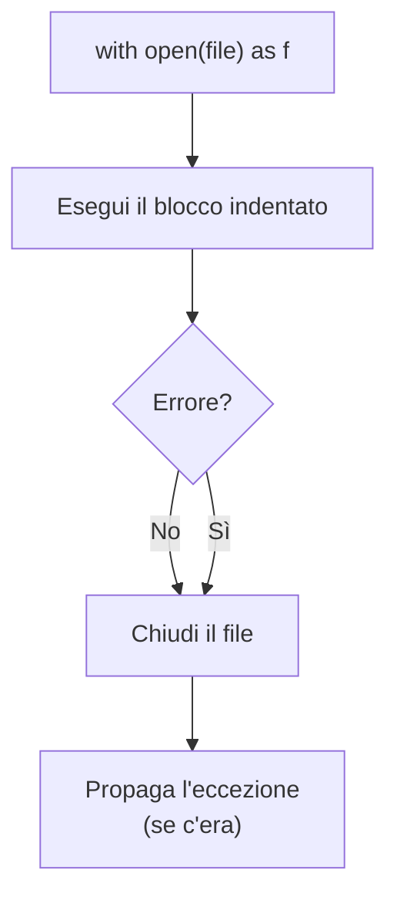
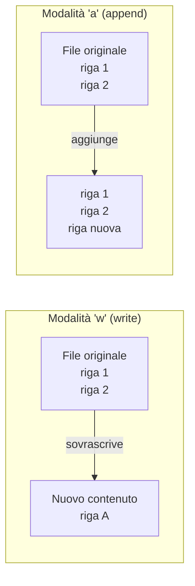
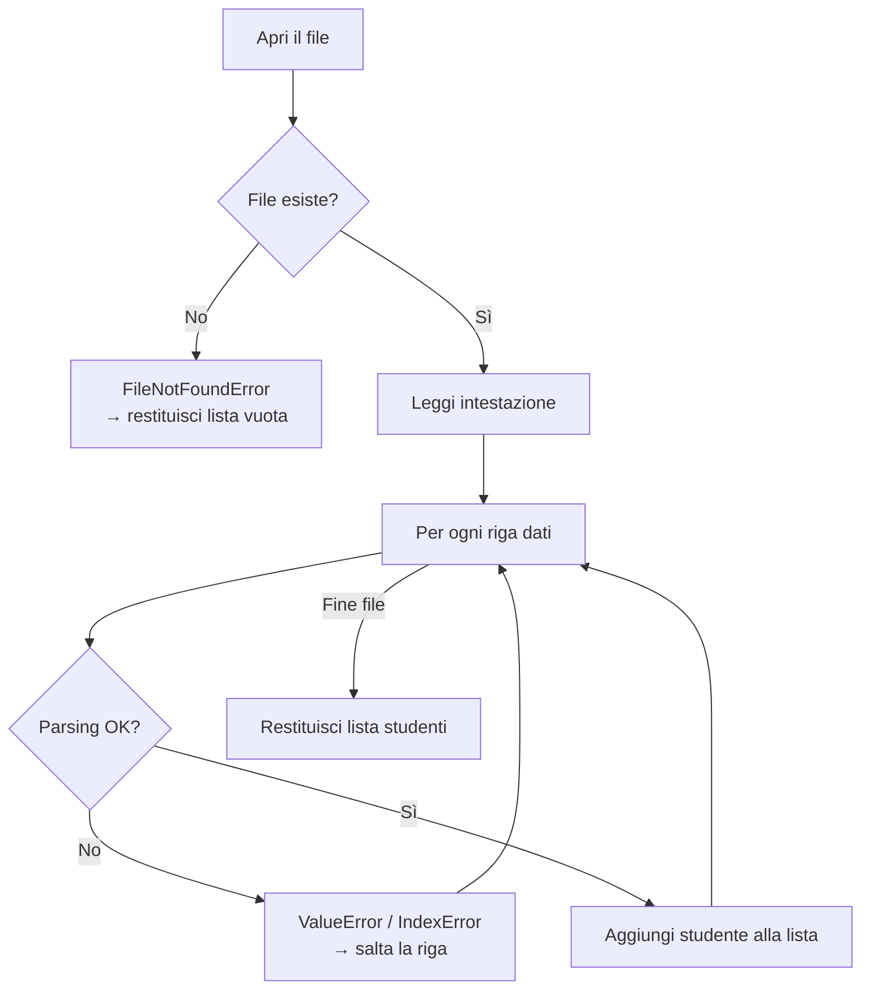
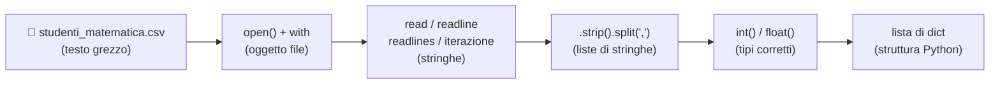

# Python — File I/O · Theory
## `python_file_io_theory.md`

> **Course:** Computer Science for Mathematics Students
> **Level:** First year university
> **Prerequisites:** `python_native_data_structures_theory.md` · `for` loops · `if/else` · functions · list comprehensions

---

## Table of Contents

1. [Introduzione: perché leggere file?](#1-introduzione-perché-leggere-file)
2. [La funzione `open()` e il costrutto `with`](#2-la-funzione-open-e-il-costrutto-with)
3. [Modalità di apertura](#3-modalità-di-apertura)
4. [Leggere un file: `read`, `readline`, `readlines`](#4-leggere-un-file-read-readline-readlines)
5. [Scrivere e appendere dati](#5-scrivere-e-appendere-dati)
6. [Parsing manuale di un CSV](#6-parsing-manuale-di-un-csv)
7. [Gestione delle eccezioni](#7-gestione-delle-eccezioni)
8. [Summary](#8-summary)

---

## 1. Introduzione: perché leggere file?

Fino ad ora i dati che abbiamo usato nei nostri programmi erano **scritti direttamente nel codice** — ad esempio una lista di numeri o un dizionario definito manualmente. Questo approccio ha un limite evidente: non scala.

In matematica applicata, statistica e data science i dati arrivano da **fonti esterne**: esperimenti, database, sensori, fogli di calcolo. Il formato più semplice e universale è il **file di testo**, e in particolare il **CSV** (*Comma-Separated Values*).

### Il dataset di questo modulo

Per tutta la lezione useremo il file `studenti_matematica.csv`, che contiene i voti di 10 studenti in tre esami:

```
matricola,nome,cognome,analisi,algebra,geometria
101,Alice,Rossi,28,30,27
102,Bruno,Verdi,22,18,24
...
```

Questo formato è:
- **Testuale** — leggibile da qualunque editor
- **Strutturato** — ogni riga è un record, ogni campo è separato da virgola
- **Universale** — esportabile da Excel, Google Sheets, database

> [!NOTE]
> In questa lezione leggeremo e scriveremo CSV **senza librerie esterne**, usando solo Python puro. Questo ci permetterà di capire esattamente cosa fanno librerie come `pandas` quando le useremo in seguito.

---

## 2. La funzione `open()` e il costrutto `with`

### 2.1 `open()`: aprire un file

La funzione built-in `open()` restituisce un **oggetto file** — un canale di comunicazione tra il programma e il file sul disco.

```python
# Apertura manuale
f = open("studenti_matematica.csv", "r")
contenuto = f.read()
f.close()   # ⚠️ obbligatorio: chiudere sempre il file
```

Il problema di questo approccio: se il codice tra `open()` e `close()` genera un errore, il file rimane **aperto**, occupando risorse di sistema.

### 2.2 Il costrutto `with` — il modo corretto

Python fornisce il costrutto `with` (detto *context manager*) che garantisce la chiusura automatica del file, anche in caso di errore:

```python
with open("studenti_matematica.csv", "r") as f:
    contenuto = f.read()
# Qui il file è già chiuso automaticamente
```

Il flusso di esecuzione è:



> [!IMPORTANT]
> Usa **sempre** il costrutto `with` per aprire file. Non usare mai `open()` senza il corrispettivo `close()` manuale. Il `with` è la forma idiomatica e sicura in Python.

### 2.3 Encoding

I file di testo possono usare codifiche diverse. Per evitare problemi con caratteri accentati (comune in italiano), specifica sempre l'encoding:

```python
with open("studenti_matematica.csv", "r", encoding="utf-8") as f:
    contenuto = f.read()
```

---

## 3. Modalità di apertura

La funzione `open()` accetta un secondo argomento — la **modalità** — che determina cosa si può fare con il file:

| Modalità | Simbolo | Descrizione | File esistente | File assente |
|:---|:---:|:---|:---:|:---:|
| Read | `"r"` | Solo lettura | Apre | `FileNotFoundError` |
| Write | `"w"` | Solo scrittura (sovrascrive) | Svuota e apre | Crea |
| Append | `"a"` | Aggiunge in coda | Apre in coda | Crea |
| Read+Write | `"r+"` | Lettura e scrittura | Apre | `FileNotFoundError` |

```python
# Lettura
with open("studenti_matematica.csv", "r", encoding="utf-8") as f:
    ...

# Scrittura (attenzione: sovrascrive il contenuto esistente!)
with open("output.csv", "w", encoding="utf-8") as f:
    ...

# Append (aggiunge senza distruggere il contenuto)
with open("log.txt", "a", encoding="utf-8") as f:
    ...
```

> [!IMPORTANT]
> La modalità `"w"` **distrugge il contenuto esistente** nel file senza preavviso. Se vuoi aggiungere dati senza cancellare quelli precedenti, usa `"a"`.

---

## 4. Leggere un file: `read`, `readline`, `readlines`

Python offre tre metodi distinti per leggere il contenuto di un file, ognuno adatto a uno scenario diverso.

### 4.1 `read()` — tutto in una stringa

```python
with open("studenti_matematica.csv", "r", encoding="utf-8") as f:
    testo = f.read()

print(type(testo))   # <class 'str'>
print(testo[:80])    # Mostra i primi 80 caratteri
```

`read()` carica **tutto il file in memoria** come un'unica stringa. È semplice, ma da evitare per file molto grandi (gigabyte).

### 4.2 `readline()` — una riga alla volta

```python
with open("studenti_matematica.csv", "r", encoding="utf-8") as f:
    prima_riga  = f.readline()   # "matricola,nome,cognome,analisi,algebra,geometria\n"
    seconda_riga = f.readline()  # "101,Alice,Rossi,28,30,27\n"

print(prima_riga.strip())   # .strip() rimuove il \n finale
```

`readline()` legge una sola riga per chiamata, avanzando il **cursore** interno del file. Utile quando si vuole processare l'intestazione separatamente dal resto.

### 4.3 `readlines()` — lista di righe

```python
with open("studenti_matematica.csv", "r", encoding="utf-8") as f:
    righe = f.readlines()

print(type(righe))     # <class 'list'>
print(len(righe))      # 11 (1 intestazione + 10 studenti)
print(righe[0])        # 'matricola,nome,cognome,analisi,algebra,geometria\n'
```

`readlines()` restituisce una **lista di stringhe**, una per riga. Il carattere `\n` è incluso alla fine di ogni stringa.

### 4.4 Iterazione diretta — il modo più efficiente

La forma più comune e idiomatica è iterare **direttamente sull'oggetto file**, senza caricare tutto in memoria:

```python
with open("studenti_matematica.csv", "r", encoding="utf-8") as f:
    for riga in f:
        print(riga.strip())
```

Questa forma è preferibile per file grandi perché legge **una riga alla volta** dal disco.

### 4.5 Confronto dei metodi

| Metodo | Tipo restituito | Carica tutto in memoria | Uso tipico |
|:---|:---:|:---:|:---|
| `read()` | `str` | ✅ | File piccoli, testo generico |
| `readline()` | `str` | ❌ | Lettura riga per riga con controllo |
| `readlines()` | `list[str]` | ✅ | Quando serve accesso casuale alle righe |
| Iterazione `for riga in f` | — | ❌ | File grandi, elaborazione sequenziale |

> [!TIP]
> Per il nostro CSV usa l'**iterazione diretta**: è la forma più efficiente e leggibile. `readlines()` è comoda quando hai bisogno di accedere a righe specifiche tramite indice (es. `righe[5]`).

---

## 5. Scrivere e appendere dati

### 5.1 Scrivere con `write()`

```python
# Creiamo un file con i risultati della nostra analisi
with open("risultati.txt", "w", encoding="utf-8") as f:
    f.write("Analisi voti studenti\n")
    f.write("="*30 + "\n")
    f.write("Numero studenti: 10\n")
```

> [!IMPORTANT]
> `write()` **non aggiunge automaticamente** il carattere di a capo `\n`. Se non lo includi, tutto il testo finirà su una riga sola.

### 5.2 Scrivere righe con `writelines()`

```python
righe = [
    "matricola,nome,media\n",
    "101,Alice,28.33\n",
    "102,Bruno,21.33\n"
]

with open("medie.csv", "w", encoding="utf-8") as f:
    f.writelines(righe)
```

`writelines()` accetta una lista di stringhe e le scrive in sequenza — anche qui, il `\n` va incluso manualmente.

### 5.3 Appendere con `"a"`

```python
# Aggiunge una riga a un file di log senza distruggere il contenuto
with open("log.txt", "a", encoding="utf-8") as f:
    f.write("Elaborazione completata: 10 studenti processati\n")
```



---

## 6. Parsing manuale di un CSV

Leggere un file è solo il primo passo. Per lavorare con i dati dobbiamo **interpretarli** — trasformare stringhe grezze in strutture Python utili.

### 6.1 La struttura di un CSV

Un file CSV ha questa struttura:
- **Prima riga**: intestazione con i nomi delle colonne
- **Righe successive**: dati, con campi separati da virgola

```
matricola,nome,cognome,analisi,algebra,geometria   ← intestazione
101,Alice,Rossi,28,30,27                           ← record 1
102,Bruno,Verdi,22,18,24                           ← record 2
```

### 6.2 Parsing riga per riga con `split()`

Il metodo `split(",")` divide una stringa in corrispondenza delle virgole, restituendo una lista:

```python
riga = "101,Alice,Rossi,28,30,27\n"
campi = riga.strip().split(",")
print(campi)
# ['101', 'Alice', 'Rossi', '28', '30', '27']
```

> [!NOTE]
> Tutti i valori sono stringhe (`str`). Per fare calcoli numerici dobbiamo convertirli esplicitamente con `int()` o `float()`.

### 6.3 Caricare il CSV in una lista di dizionari

La struttura più utile è una **lista di dizionari**: ogni elemento della lista rappresenta uno studente, e ogni dizionario mappa i nomi delle colonne ai valori corrispondenti.

```python
def carica_csv(nome_file):
    """
    Legge un CSV e restituisce una lista di dizionari.
    La prima riga è usata come intestazione (chiavi del dizionario).
    """
    studenti = []
    
    with open(nome_file, "r", encoding="utf-8") as f:
        # Leggiamo l'intestazione separatamente
        intestazione = f.readline().strip().split(",")
        
        # Leggiamo le righe dati
        for riga in f:
            campi = riga.strip().split(",")
            studente = {
                intestazione[i]: campi[i]
                for i in range(len(intestazione))
            }
            studenti.append(studente)
    
    return studenti


studenti = carica_csv("studenti_matematica.csv")
print(studenti[0])
# {'matricola': '101', 'nome': 'Alice', 'cognome': 'Rossi',
#  'analisi': '28', 'algebra': '30', 'geometria': '27'}
```

### 6.4 Conversione dei tipi

I voti sono stringhe — convertiamoli in interi per poter fare calcoli:

```python
def carica_csv_tipizzato(nome_file):
    """
    Come carica_csv, ma converte i voti in interi e la matricola in intero.
    """
    studenti = []
    colonne_numeriche = {"matricola", "analisi", "algebra", "geometria"}
    
    with open(nome_file, "r", encoding="utf-8") as f:
        intestazione = f.readline().strip().split(",")
        
        for riga in f:
            campi = riga.strip().split(",")
            studente = {}
            for i, chiave in enumerate(intestazione):
                valore = campi[i]
                if chiave in colonne_numeriche:
                    studente[chiave] = int(valore)
                else:
                    studente[chiave] = valore
            studenti.append(studente)
    
    return studenti


studenti = carica_csv_tipizzato("studenti_matematica.csv")

# Ora possiamo fare calcoli
alice = studenti[0]
media_alice = (alice["analisi"] + alice["algebra"] + alice["geometria"]) / 3
print(f"Media di {alice['nome']}: {media_alice:.2f}")
# Media di Alice: 28.33
```

### 6.5 Calcolo della media per ogni studente

```python
studenti = carica_csv_tipizzato("studenti_matematica.csv")

for s in studenti:
    media = (s["analisi"] + s["algebra"] + s["geometria"]) / 3
    print(f"{s['nome']:10} {s['cognome']:10}  media: {media:.2f}")
```

Output:
```
Alice      Rossi       media: 28.33
Bruno      Verdi       media: 21.33
Carla      Bianchi     media: 29.67
...
```

> [!TIP]
> Nella prossima lezione sostituiremo questi calcoli manuali con **NumPy**, che permette di calcolare medie, deviazioni standard e molto altro in una sola riga — e in modo molto più efficiente su dataset grandi.

---

## 7. Gestione delle eccezioni

Cosa succede se il file non esiste, o se un valore non è convertibile in intero? Senza gestione degli errori, il programma si blocca con un messaggio criptico.

### 7.1 `FileNotFoundError`

```python
# ❌ Senza gestione errori
with open("file_inesistente.csv", "r") as f:   # FileNotFoundError!
    ...

# ✅ Con gestione errori
try:
    with open("studenti_matematica.csv", "r", encoding="utf-8") as f:
        righe = f.readlines()
except FileNotFoundError:
    print("Errore: il file non è stato trovato.")
    print("Verifica che il percorso sia corretto.")
```

### 7.2 `ValueError` nella conversione

```python
def converti_voto(valore_stringa):
    """Converte una stringa in intero, gestendo valori non validi."""
    try:
        return int(valore_stringa)
    except ValueError:
        print(f"Attenzione: '{valore_stringa}' non è un voto valido. Uso 0.")
        return 0
```

### 7.3 Schema completo con eccezioni

```python
def carica_csv_sicuro(nome_file):
    """
    Versione robusta di carica_csv con gestione degli errori.
    """
    try:
        studenti = []
        colonne_numeriche = {"matricola", "analisi", "algebra", "geometria"}
        
        with open(nome_file, "r", encoding="utf-8") as f:
            intestazione = f.readline().strip().split(",")
            
            for numero_riga, riga in enumerate(f, start=2):
                try:
                    campi = riga.strip().split(",")
                    studente = {}
                    for i, chiave in enumerate(intestazione):
                        valore = campi[i]
                        if chiave in colonne_numeriche:
                            studente[chiave] = int(valore)
                        else:
                            studente[chiave] = valore
                    studenti.append(studente)
                except (ValueError, IndexError) as e:
                    print(f"Riga {numero_riga} ignorata per errore: {e}")
        
        return studenti
    
    except FileNotFoundError:
        print(f"Errore: '{nome_file}' non trovato.")
        return []
```



---

## 8. Summary

### Flusso completo: dal file al dato



### Tabella riassuntiva — funzioni e metodi

| Funzione / Metodo | Scopo | Nota |
|:---|:---|:---|
| `open(file, mode, encoding)` | Apre un file | Usa sempre `with` |
| `f.read()` | Legge tutto il file | Restituisce `str` |
| `f.readline()` | Legge una riga | Restituisce `str` con `\n` |
| `f.readlines()` | Legge tutte le righe | Restituisce `list[str]` |
| `for riga in f` | Iterazione efficiente | Preferibile per file grandi |
| `f.write(s)` | Scrive una stringa | `\n` non automatico |
| `f.writelines(lista)` | Scrive una lista di stringhe | `\n` non automatico |
| `s.strip()` | Rimuove `\n` e spazi | Usare su ogni riga letta |
| `s.split(",")` | Divide per separatore | Restituisce `list[str]` |

### Tabella riassuntiva — modalità di apertura

| Modalità | Legge | Scrive | Crea se assente | Svuota se esiste |
|:---:|:---:|:---:|:---:|:---:|
| `"r"` | ✅ | ❌ | ❌ | ❌ |
| `"w"` | ❌ | ✅ | ✅ | ✅ |
| `"a"` | ❌ | ✅ | ✅ | ❌ |
| `"r+"` | ✅ | ✅ | ❌ | ❌ |

### Checklist — leggere un CSV correttamente

1. ✅ Usa `with open(...)` — mai `open()` senza `close()`
2. ✅ Specifica `encoding="utf-8"` — evita problemi con caratteri accentati
3. ✅ Chiama `.strip()` su ogni riga — rimuove `\n` e spazi superflui
4. ✅ Converti i numeri con `int()` o `float()` — non restano stringhe
5. ✅ Gestisci `FileNotFoundError` — il file potrebbe non esistere
6. ✅ Salta l'intestazione — non è un record dati

---

> **Prossimo documento:** `python_file_io_exercises.md`
> Esercizi pratici sul dataset `studenti_matematica.csv` — dalla lettura base al calcolo di statistiche, fino alla scrittura di nuovi file CSV con i risultati dell'analisi.
